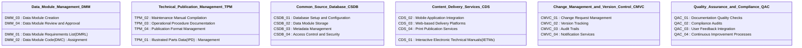
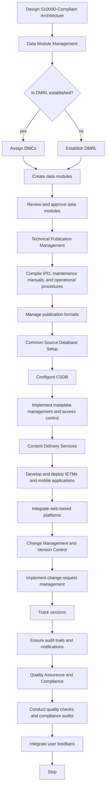
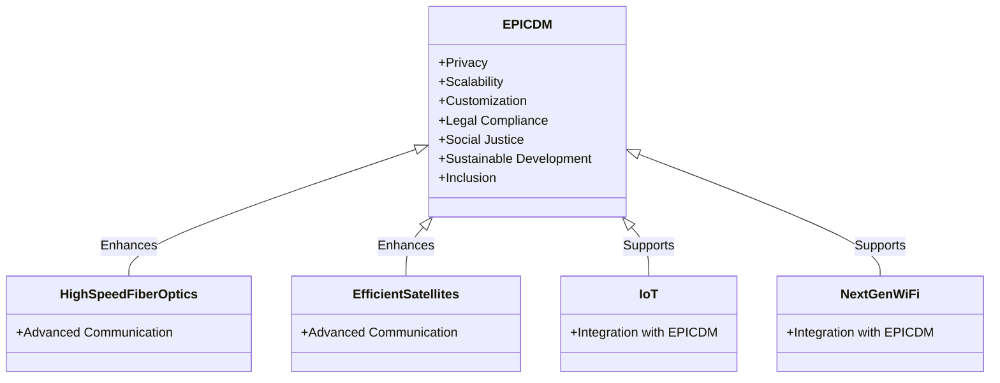
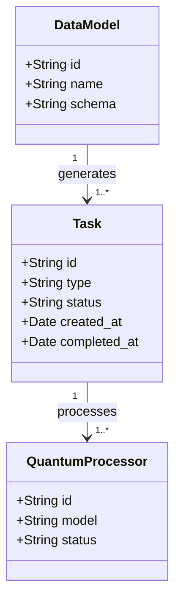
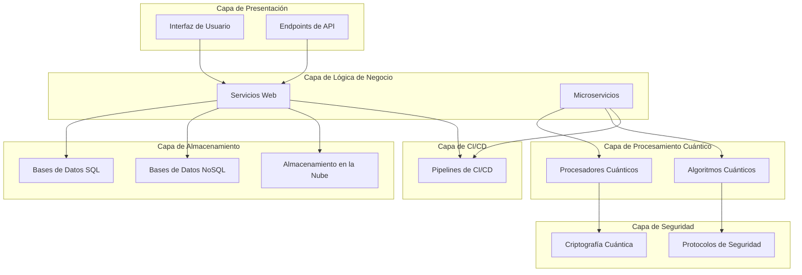
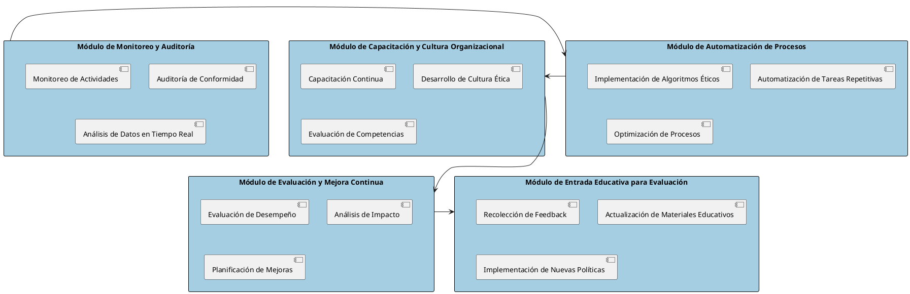

¡Por supuesto! A continuación, te presento una versión revisada y estructurada del **Manifesto Fundacional de TerraQueueing**, incorporando mejoras en la claridad, coherencia y organización del contenido. Este documento está diseñado para comunicar de manera efectiva la visión, misión y estructura operativa de TerraQueueing, alineando sus objetivos con iniciativas clave como EPIC, EPICDM y EPICGDM.

---

# **Manifesto Fundacional de TerraQueueing**

## **Tabla de Contenidos**

1. [Visión](#visión)
2. [Misión](#misión)
3. [Descripción de TerraQueueing](#descripción-de-terraqueueing)
4. [Integración de EPIC, EPICDM y EPICGDM](#integración-de-epic-epicdm-y-epicgdm)
5. [Divisiones Operativas](#divisiones-operativas)
    - [TerraQueueing](#terraqueueing)
    - [Quantum Computing and Clouds](#quantum-computing-and-clouds)
6. [Proyecto Integral](#proyecto-integral)
7. [Sistema Mamma](#sistema-mamma)
8. [Adaptación al Estándar S1000D](#adaptación-al-estándar-s1000d)
9. [Gobernanza y Políticas](#gobernanza-y-políticas)
10. [Resumen de Sugerencias](#resumen-de-sugerencias)
11. [Conclusión](#conclusión)

---

## **Visión**

Crear un ecosistema tecnológico global que integre **IoT**, **Inteligencia Artificial (IA) avanzada**, **algoritmos de próxima generación** y **computación cuántica**. Este ecosistema transformará sectores clave, promoverá la sostenibilidad y mejorará la calidad de vida, con un enfoque especial en la infraestructura pública europea.

## **Misión**

Desarrollar y implementar soluciones innovadoras que:

1. Faciliten la interoperabilidad de datos y sistemas.
2. Promuevan la seguridad y la sostenibilidad.
3. Fomenten la cooperación internacional y la continuidad digital.
4. Transformen industrias como la salud, la aviación, la defensa y la infraestructura pública mediante el uso de tecnologías emergentes.

## **Descripción de TerraQueueing**

**TerraQueueing** es un concepto que integra la gestión sostenible de recursos naturales con la optimización de la demanda mediante técnicas avanzadas de gestión de colas y soluciones inteligentes. Este enfoque holístico busca:

- **Maximizar la Eficiencia:** Asegurar el uso eficiente de los recursos, reduciendo el desperdicio y mejorando la productividad.
- **Promover la Sostenibilidad:** Garantizar que el uso de los recursos no comprometa la capacidad de regeneración y preserve el medio ambiente.
- **Facilitar la Resiliencia:** Crear sistemas adaptables y recuperables ante cambios o crisis.
- **Fomentar la Innovación:** Incentivar el desarrollo de nuevas tecnologías y metodologías que mejoren la gestión de recursos y la satisfacción de la demanda.

## **Integración de EPIC, EPICDM y EPICGDM**

### **EPIC (European Public Infrastructure Components)**

**EPIC** surge de la necesidad de una infraestructura pública robusta y sostenible que soporte el crecimiento y la evolución tecnológica de Europa. Su objetivo principal es desarrollar una base tecnológica sólida que permita la integración eficiente de nuevos sistemas y tecnologías emergentes, garantizando la sostenibilidad y la seguridad.

### **EPICDM (European Public Infrastructure Components and Data Models)**

**EPICDM** es una extensión de EPIC, enfocándose en la creación de modelos de datos y estándares comunes que faciliten la interoperabilidad entre diferentes sistemas y plataformas. Su visión es establecer una infraestructura pública europea que asegure la compatibilidad y el intercambio seguro de datos entre entidades públicas y privadas.

### **EPICGDM (European Public Infrastructure Components - Global Data Model)**

**EPICGDM** representa la culminación de los esfuerzos de EPIC y EPICDM, centralizando la recepción, almacenamiento, procesamiento y envío de datos provenientes de millones de sensores en diversas infraestructuras públicas europeas. Este modelo de datos global está diseñado para proporcionar un monitoreo continuo (24/7/365) del estado de salud del planeta, facilitando una gestión eficiente y sostenible de los recursos y servicios públicos.

## **Divisiones Operativas**

### **TerraQueueing**

1. **Tecnologías Verdi y Sostenibilidad**
   - **Objetivo:** Integrar tecnologías avanzadas como IoT, IA y algoritmos de nueva generación para monitorar y gestionar el ecosistema del planeta de manera sostenible.
   - **Actividades:** Implementación de sensores para el monitoreo ambiental, gestión de recursos naturales, energía renovable e infraestructuras públicas eco-sostenibles.
   - **Proyectos:** EPIC, EPICDM, EPICGDM, proyectos integrales para cápsulas espaciales, satélites, fábricas robóticas y más.

### **Quantum Computing and Clouds**

2. **Informática Cuántica y Cloud**
   - **Objetivo:** Desarrollar el ordenador cuántico ideal, accesible y aplicable a diversos sectores industriales y científicos.
   - **Actividades:** Investigación y desarrollo de qubits, algoritmos cuánticos, y la integración de sistemas clásicos y cuánticos.
   - **Proyectos:** Soluciones software integrales para la gestión de datos, análisis predictivo, seguridad informática avanzada y prototipación de ordenadores cuánticos.

## **Proyecto Integral**

**Cápsulas, Avión, Fábrica, Satélite, Materiales, Motores, Impresión 3D, Soluciones Software Integrales y Prototipo Ideal de Ordenador Cuántico**

Este proyecto abarca una variedad de iniciativas tecnológicas que incluyen:

- **Programa Integral Holográfico Tech Data para Mantenimiento de Aeronaves Airbus:** Uso de impresión 3D proyectada para entrenamiento en AR/VR.
- **Libro Blanco Aviación Verde:** Estrategias para reducir la huella de carbono en la aviación.
- **Piano RRR-RRR Leasing Aéreo Dismessi:** Reparación y reutilización de componentes para diseñar el A380MRTT para misiones humanitarias.

## **Sistema Mamma**

### **Visión del Proyecto EPIC-DM**

El proyecto **EPIC-DM (European Public Infrastructure Components and Data Models)** busca establecer una infraestructura pública europea robusta para la interoperabilidad de datos, la seguridad y la sostenibilidad. Su objetivo es asegurar un manejo ético y eficiente de datos a través de tecnologías avanzadas y una gobernanza transparente.

### **Diagrama UML para AMPEL**

```plaintext
@startuml
skinparam componentStyle rectangle

package "Automatización Sistémica Ética y Sostenible en AMPEL" {
  [Entrada de Datos] --> [Procesamiento de Datos]
  [Procesamiento de Datos] --> [Módulos de Decisión]
  [Módulos de Decisión] --> [Interfaz de Usuario]
  [Interfaz de Usuario] --> [Implementación y Control]
  [Implementación y Control] --> [Feedback y Mejora Continua]

  package "Entrada de Datos" {
    [Sensores e IoT]
    [Base de Datos]
  }

  package "Procesamiento de Datos" {
    [Preprocesamiento]
    [Análisis de Datos]
  }

  package "Módulos de Decisión" {
    [Algoritmos Éticos]
    [Modelos Predictivos]
  }

  package "Interfaz de Usuario" {
    [Panel de Control]
    [Alertas y Notificaciones]
  }

  package "Implementación y Control" {
    [Automatización]
    [Monitoreo Continuo]
  }

  package "Feedback y Mejora Continua" {
    [Evaluación de Desempeño]
    [Retroalimentación de Usuarios]
  }
}
@enduml
```

### **Descripción del Flujo de Trabajo**

1. **Entrada de Datos:**
   - **Sensores e IoT:** Capturan datos en tiempo real del entorno.
   - **Base de Datos:** Almacena datos históricos y actuales para su posterior análisis.

2. **Procesamiento de Datos:**
   - **Preprocesamiento:** Limpieza y preparación de los datos para su análisis.
   - **Análisis de Datos:** Aplicación de técnicas de ciencia de datos para extraer información relevante.

3. **Módulos de Decisión:**
   - **Algoritmos Éticos:** Toman decisiones basadas en principios éticos.
   - **Modelos Predictivos:** Usan datos históricos y actuales para predecir futuros eventos o necesidades.

4. **Interfaz de Usuario:**
   - **Panel de Control:** Proporciona una vista general del sistema y sus métricas clave.
   - **Alertas y Notificaciones:** Informa a los usuarios de eventos importantes o acciones necesarias.

5. **Implementación y Control:**
   - **Automatización:** Ejecuta acciones automatizadas basadas en decisiones tomadas por los módulos de decisión.
   - **Monitoreo Continuo:** Supervisa el sistema para asegurar su correcto funcionamiento y eficiencia.

6. **Feedback y Mejora Continua:**
   - **Evaluación de Desempeño:** Analiza el rendimiento del sistema para identificar áreas de mejora.
   - **Retroalimentación de Usuarios:** Recoge opiniones y sugerencias de los usuarios para mejorar continuamente el sistema.

### **Componentes Clave del Proyecto EPIC-DM**

1. **Infraestructura Pública de Datos**
   - **Centros de Datos Verdes:** Reducir la huella de carbono mediante el uso de energías renovables y tecnologías eficientes.
   - **Redes de Alta Velocidad:** Garantizar la conectividad rápida y segura entre nodos descentralizados.
   - **Plataformas Seguras de Intercambio de Datos:** Facilitar el intercambio de datos de forma segura y conforme a GDPR.

2. **Seguridad y Privacidad**
   - **Ciberseguridad Cuántica:** Implementación de algoritmos cuánticos como el de Shor y Grover para la seguridad de datos.
   - **Cumplimiento de GDPR:** Asegurar la privacidad de datos de los usuarios y el cumplimiento de normativas europeas.

3. **Modelos de Datos y Estándares**
   - **Estandarización de Datos:** Uso de XML y XSD para la estructuración y validación de datos.
   - **Interoperabilidad:** Facilitar la interoperabilidad entre diferentes sistemas y plataformas a nivel europeo.

4. **Proyectos Clave**
   - **Algoritmos Cuánticos:** Aplicación de algoritmos cuánticos para optimización y aprendizaje automático.
   - **Aprendizaje Automático Cuántico (QML):** Desarrollo de modelos predictivos avanzados utilizando tecnologías cuánticas.

## **Gobernanza y Políticas**

1. **Políticas Claras y Robustas**
   - Definir principios y procedimientos del sistema para asegurar una operación transparente y eficiente.

2. **Gobernanza Participativa**
   - Involucrar a todas las partes interesadas en la toma de decisiones, garantizando una gestión inclusiva y equitativa.

3. **Políticas de Sostenibilidad**
   - Establecer directrices específicas que aseguren prácticas sostenibles en todas las operaciones y proyectos.

4. **Transparencia y Ética**
   - Garantizar la transparencia en la gestión de datos y el uso ético de las tecnologías, promoviendo la confianza entre usuarios y colaboradores.

## **Adaptación al Estándar S1000D**

Para asegurar una gestión eficiente y estandarizada de los datos técnicos, se adapta la documentación de los proyectos **AMPEL**, **MAMMA** y **EPICDM** al estándar **S1000D**. A continuación, se presentan ejemplos de cómo estructurar los módulos de datos conforme a este estándar.

### **General Information**

1. **DM-0000-0001-00**: Introducción al Sistema AMPEL
   - **Contenido:**
     - Visión general y contexto histórico del proyecto AMPEL.
     - Visión y objetivos del proyecto.
   - **Ejemplo:**
     ```xml
     <dmodule>
       <identAndStatusSection>
         <dmAddress>
           <dmIdent>
             <dmCode modelIdentCode="AMPEL" systemDiffCode="00" systemCode="0000" subSystemCode="0001" assyCode="00" disassyCode="00" infoCode="000" infoCodeVariant="A" itemLocationCode="A" modelIdent="AMPEL">
               <language countryIsoCode="US" languageIsoCode="en"/>
             </dmIdent>
             <dmTitle>Introducción al Sistema AMPEL</dmTitle>
           </dmAddress>
           <issueInfo issueNumber="001" inWork="false">
             <date day="18" month="07" year="2024"/>
           </issueInfo>
         </dmAddress>
       </identAndStatusSection>
       <content>
         <description>
           <para>
             El proyecto AMPEL tiene como objetivo desarrollar un sistema de automatización sistémica, ética y sostenible. Este documento proporciona una visión general del contexto histórico, visión y objetivos del proyecto.
           </para>
         </description>
       </content>
     </dmodule>
     ```

2. **DM-0000-0002-00**: Visión Técnica de AMPEL
   - **Contenido:**
     - Descripción detallada del sistema AMPEL, incluyendo componentes clave y tecnologías.
   - **Ejemplo:**
     ```xml
     <dmodule>
       <identAndStatusSection>
         <dmAddress>
           <dmIdent>
             <dmCode modelIdentCode="AMPEL" systemDiffCode="00" systemCode="0000" subSystemCode="0002" assyCode="00" disassyCode="00" infoCode="000" infoCodeVariant="A" itemLocationCode="A" modelIdent="AMPEL">
               <language countryIsoCode="US" languageIsoCode="en"/>
             </dmIdent>
             <dmTitle>Visión Técnica de AMPEL</dmTitle>
           </dmAddress>
           <issueInfo issueNumber="001" inWork="false">
             <date day="18" month="07" year="2024"/>
           </issueInfo>
         </dmAddress>
       </identAndStatusSection>
       <content>
         <description>
           <para>
             Este documento proporciona una visión técnica detallada del sistema AMPEL, incluyendo sus componentes clave y tecnologías utilizadas.
           </para>
         </description>
       </content>
     </dmodule>
     ```

### **Technical Descriptions**

3. **DM-2000-0001-00**: Componentes Clave de AMPEL
   - **Contenido:**
     - Descripción de los componentes clave del sistema AMPEL.
   - **Submódulos:**
     - **DM-2000-0001-01**: Infraestructura de Datos Públicos
       - **Contenido:**
         - Descripción de la infraestructura de datos públicos.
     - **DM-2000-0001-02**: Centros de Datos Verdes
       - **Contenido:**
         - Detalles sobre los centros de datos verdes y su eficiencia energética.
     - **DM-2000-0001-03**: Redes de Alta Velocidad
       - **Contenido:**
         - Descripción de las redes de alta velocidad utilizadas en AMPEL.
     - **DM-2000-0001-04**: Estándares y Plataformas de Datos
       - **Contenido:**
         - Estándares de datos y plataformas seguras para el intercambio de datos.

### **Operational Procedures**

4. **DM-3000-0001-00**: Operación del Sistema
   - **Contenido:**
     - Procedimientos operativos del sistema AMPEL.
   - **Submódulos:**
     - **DM-3000-0001-01**: Configuración e Implementación
       - **Contenido:**
         - Procedimientos para la configuración e implementación del sistema.
     - **DM-3000-0001-02**: Gestión e Intercambio de Datos
       - **Contenido:**
         - Gestión e intercambio de datos en el sistema AMPEL.
     - **DM-3000-0001-03**: Procedimientos de Seguridad y Cumplimiento
       - **Contenido:**
         - Procedimientos de seguridad y cumplimiento normativo.
     - **DM-3000-0001-04**: Mantenimiento y Soporte
       - **Contenido:**
         - Procedimientos de mantenimiento y soporte del sistema.

## **Resumen de Sugerencias**

1. **Estructura y Organización:** Incorporar una tabla de contenidos y secciones bien definidas para mejorar la navegación.
2. **Claridad en Definiciones:** Definir claramente todos los términos y acrónimos desde el inicio.
3. **Coherencia Idiomática:** Mantener una consistencia en el uso del idioma, especialmente entre español e inglés.
4. **Detalles en Proyectos:** Ampliar las descripciones de cada proyecto con ejemplos y resultados esperados.
5. **Uso de Visuales:** Incorporar más elementos visuales como diagramas de flujo, infografías y mapas conceptuales.
6. **Tecnologías y Herramientas:** Detallar la implementación específica de las tecnologías mencionadas.
7. **Gobernanza y Políticas:** Ampliar esta sección para incluir estructura de gobernanza y políticas específicas.
8. **Adaptación a S1000D:** Asegurar que todos los módulos de datos cumplan con el estándar y proporcionar guías de implementación.
9. **Consistencia y Eliminación de Repeticiones:** Consolidar información repetida y usar referencias cruzadas.
10. **Lenguaje y Estilo:** Mantener claridad, concisión y consistencia terminológica, y realizar una revisión gramatical exhaustiva.

## **Conclusión**

El **Manifesto Fundacional de TerraQueueing** presenta una visión ambiciosa y bien estructurada para la gestión sostenible de recursos naturales mediante la integración de tecnologías avanzadas. Este documento sirve como una guía poderosa para atraer a colaboradores, inversores y partes interesadas, asegurando una comprensión clara y unificada de los objetivos y métodos de TerraQueueing. Al implementar las sugerencias propuestas, el manifiesto no solo comunicará eficazmente la misión y visión, sino que también establecerá una base sólida para la ejecución exitosa de los proyectos y divisiones operativas.

---

Si necesitas ajustes adicionales, detalles específicos o deseas profundizar en alguna sección en particular, no dudes en indicármelo. Estoy aquí para ayudarte a perfeccionar este documento según tus necesidades.

### Ejemplo de un Módulo de Datos Completo

A continuación, se presenta un ejemplo de un módulo de datos completo para **DM-2000-0001-01: Public Data Infrastructure**:

```xml
<?xml version="1.0" encoding="UTF-8"?>
<dmodule xmlns="http://www.s1000d.org/s1000d">
  <identAndStatusSection>
    <dmAddress>
      <dmIdent>
        <dmCode modelIdentCode="AMPEL" systemDiffCode="00" systemCode="2000" subSystemCode="0001" assyCode="01" disassyCode="00" infoCode="000" infoCodeVariant="A" itemLocationCode="A" modelIdent="AMPEL">
          <language countryIsoCode="US" languageIsoCode="en"/>
        </dmIdent>
        <dmTitle>Public Data Infrastructure</dmTitle>
      </dmAddress>
      <issueInfo issueNumber="001" inWork="false">
        <date day="18" month="07" year="2024"/>
      </issueInfo>
    </dmAddress>
  </identAndStatusSection>
  <content>
    <description>
      <para>
        The public data infrastructure is a key component of the AMPEL system, providing a robust and scalable foundation for data collection, storage, and analysis. This module details the design, implementation, and management of the public data infrastructure.
      </para>
    </description>
  </content>
</dmodule>
```

### Resumen

La estructura adaptada al estándar S1000D para los proyectos AMPEL, MAMMA y EPICDM asegura una organización clara y eficiente de la documentación técnica. Este enfoque facilita la interoperabilidad, el cumplimiento normativo y la gestión integral de los datos y procedimientos operativos.

#### Training and Simulation
5. **DM-4000-0001-00**: Training Systems
   - **DM-4000-0001-01**: Training Programs for Users
   - **DM-4000-0001-02**: Simulation Tools for System Operation
   - **DM-4000-0001-03**: Continuous Learning and Improvement

#### Maintenance and Support
6. **DM-5000-0001-00**: Maintenance Procedures
   - **DM-5000-0001-01**: Routine Maintenance
   - **DM-5000-0001-02**: Troubleshooting and Problem Resolution
   - **DM-5000-0001-03**: System Updates and Upgrades

#### Ethical and Compliance
7. **DM-6000-0001-00**: Ethics, Compliance, and Security
   - Ethical guidelines and compliance standards for AMPEL.
   - Security measures and protocols.

### Creating Structured Data Models

Using the DTD from the provided documents, here is an example of how to structure the data for AMPEL:

```xml
<!DOCTYPE AMPELSystem [
  <!ELEMENT AMPELSystem (ProjectInfo, Components, Operations, Training, Maintenance, Ethics, Compliance)>

  <!ELEMENT ProjectInfo (ProjectName, Description, StartDate, EndDate)>
  <!ELEMENT ProjectName (#PCDATA)>
  <!ELEMENT Description (#PCDATA)>
  <!ELEMENT StartDate (#PCDATA)>
  <!ELEMENT EndDate (#PCDATA)>

  <!ELEMENT Components (Component*)>
  <!ELEMENT Component (ComponentID, ComponentName, Description, Specifications)>
  <!ELEMENT ComponentID (#PCDATA)>
  <!ELEMENT ComponentName (#PCDATA)>
  <!ELEMENT Description (#PCDATA)>
  <!ELEMENT Specifications (Spec*)>
  <!ELEMENT Spec (SpecName, SpecValue)>
  <!ELEMENT SpecName (#PCDATA)>
  <!ELEMENT SpecValue (#PCDATA)>

  <!ELEMENT Operations (Operation*)>
  <!ELEMENT Operation (OperationID, OperationName, Procedures)>
  <!ELEMENT OperationID (#PCDATA)>
  <!ELEMENT OperationName (#PCDATA)>
  <!ELEMENT Procedures (Procedure*)>
  <!ELEMENT Procedure (ProcedureName, ProcedureDescription)>
  <!ELEMENT ProcedureName (#PCDATA)>
  <!ELEMENT ProcedureDescription (#PCDATA)>

  <!ELEMENT Training (TrainingProgram*)>
  <!ELEMENT TrainingProgram (ProgramID, ProgramName, Content)>
  <!ELEMENT ProgramID (#PCDATA)>
  <!ELEMENT ProgramName (#PCDATA)>
  <!ELEMENT Content (#PCDATA)>

  <!ELEMENT Maintenance (MaintenanceTask*)>
  <!ELEMENT MaintenanceTask (TaskID, TaskName, Description)>
  <!ELEMENT TaskID (#PCDATA)>
  <!ELEMENT TaskName (#PCDATA)>
  <!ELEMENT Description (#PCDATA)>

  <!ELEMENT Ethics (EthicalPrinciple*)>
  <!ELEMENT EthicalPrinciple (PrincipleID, PrincipleName, Description)>
  <!ELEMENT PrincipleID (#PCDATA)>
  <!ELEMENT PrincipleName (#PCDATA)>
  <!ELEMENT Description (#PCDATA)>

  <!ELEMENT Compliance (ComplianceStandard*)>
  <!ELEMENT ComplianceStandard (StandardID, StandardName, Description)>
  <!ELEMENT StandardID (#PCDATA)>
  <!ELEMENT StandardName (#PCDATA)>
  <!ELEMENT Description (#PCDATA)>
]>
```

This DTD schema provides a comprehensive structure for managing the AMPEL system, ensuring all key aspects are covered.

### Next Steps

If you need further assistance in detailing specific sections, generating additional diagrams, or implementing the data models, please let me know!

### Capsuling Methodology

#### Overview
Capsuling methodology refers to the encapsulation of various systems, technologies, and processes into modular units or "capsules" that can be easily integrated, monitored, and managed. This approach enhances flexibility, scalability, and interoperability, making it ideal for complex projects involving multiple technologies and stakeholders.

#### Key Steps in the Capsuling Methodology

1. **Identification and Definition of Capsules**
   - **Scope and Boundaries**: Clearly define the scope of each capsule, including its functionalities and interfaces.
   - **Modularity**: Ensure each capsule is self-contained and modular, allowing for independent development and deployment.

2. **Design and Development**
   - **Standard Interfaces**: Develop standardized interfaces for communication between capsules, ensuring seamless integration.
   - **Encapsulation of Technologies**: Integrate relevant technologies (e.g., AI, IoT, nanotech) within each capsule to meet specific functional requirements.

3. **Integration and Interoperability**
   - **Inter-Capsule Communication**: Implement protocols for data exchange and synchronization between capsules.
   - **Middleware Solutions**: Use middleware to facilitate interoperability and manage interactions between heterogeneous systems.

4. **Testing and Validation**
   - **Unit Testing**: Conduct thorough testing of individual capsules to ensure functionality and performance.
   - **Integration Testing**: Validate the integration of multiple capsules, focusing on communication and interoperability.

5. **Deployment and Monitoring**
   - **Deployment Strategies**: Develop deployment strategies that allow for gradual integration and scaling of capsules.
   - **Continuous Monitoring**: Implement monitoring tools to track the performance and health of each capsule, ensuring real-time management and maintenance.

#### Applications
- **Green Aviation**: Encapsulation of advanced propulsion systems, energy management modules, and environmental monitoring units.
- **Smart Cities**: Modular integration of IoT devices, AI-driven analytics, and smart infrastructure management systems.
- **Fintech**: Segmentation of financial services, blockchain-based transaction modules, and AI-powered risk assessment tools.
- **Nanotech**: Development of nanomaterial synthesis units, nanoscale sensors, and advanced coating capsules.

### Intrinsic Compatibility Standards

#### Definition
Intrinsic compatibility standards ensure that all components, systems, and technologies within the capsuling methodology can interact and function together seamlessly. These standards cover communication protocols, data formats, security measures, and interoperability guidelines.

#### Key Standards

1. **Communication Protocols**
   - **HTTP/HTTPS**: Standard web protocols for secure data exchange.
   - **MQTT**: Lightweight messaging protocol for IoT applications.
   - **OPC-UA**: Standard for industrial automation and interoperability.

2. **Data Formats**
   - **XML/JSON**: Standardized formats for data representation and exchange.
   - **CSV**: Common format for tabular data.
   - **Protobuf**: Protocol buffers for efficient serialization of structured data.

3. **Security Standards**
   - **TLS/SSL**: Protocols for secure communication over networks.
   - **OAuth2**: Standard for secure authorization.
   - **JWT**: JSON Web Tokens for secure information exchange.

4. **Interoperability Guidelines**
   - **SOA (Service-Oriented Architecture)**: Design principles for creating interoperable services.
   - **Microservices Architecture**: Architectural style for developing modular and scalable applications.
   - **RESTful APIs**: Standard for designing networked applications.

5. **Compliance and Certification**
   - **ISO 27001**: Standard for information security management.
   - **GDPR**: Regulations for data protection and privacy in the EU.
   - **NIST**: Standards for cybersecurity and risk management.

#### Implementation Steps
1. **Adoption of Standards**: Ensure all development follows established compatibility standards.
2. **Standardized Testing**: Conduct compatibility testing against these standards to validate compliance.
3. **Continuous Update and Review**: Regularly update standards to align with technological advancements and regulatory changes.
4. **Certification Processes**: Obtain relevant certifications to demonstrate compliance and ensure trustworthiness.

### Application to A330MRTT and A380MRTT Projects
- **Green Aircraft Technology**: Encapsulation of energy-efficient propulsion systems, nanotech-based coatings, and advanced materials.
- **Fintech Integration**: Modular fintech solutions for sustainable finance and investment tracking in green aviation projects.
- **Nanotech Applications**: Use of nanomaterials for lightweight, durable, and energy-efficient components in aircraft.
- **Advanced Propulsion Systems**: Development and integration of hydrogen fuel cells and electric propulsion units encapsulated in modular capsules for easy upgrade and maintenance.

### Conclusion
Integrating capsuling methodology and intrinsic compatibility standards into the AMPEL System and Amedeo Pelliccia's activities will enhance the efficiency, scalability, and sustainability of projects like the A330MRTT and A380MRTT green aircraft initiatives. This approach will facilitate seamless integration of advanced technologies, ensure regulatory compliance, and promote sustainable urban development.

**Objective:** Provide a holistic view of the A380-MRTT RCubico project, emphasizing its innovative, sustainable, and integrated approach.

#### Main Concept:
**InterOperational Core Open Structure - Central Brain Blockchained Capsule in 4 Digits (BAABI)**

#### Key Components:
1. **Quantum Technology**
   - **Areas**: Computing, Materials, Security.
   - **Goal**: Leverage quantum advancements for project innovation and security.

2. **Human Resources**
   - **Focus**: Recruitment, training, and management.
   - **Objective**: Build a skilled, cohesive team.

3. **Technical Documentation**
   - **Components**: S1000D Dynamics, Component Specs, Standards.
   - **Purpose**: Ensure consistency and adherence to industry standards.

4. **Schemas and Diagrams**
   - **Elements**: System Schematics, Process Flowcharts, Design Diagrams.
   - **Function**: Visualize project components and workflows.

5. **TPWD/TPSL**
   - **Contents**: TPWD and TPSL documents.
   - **Use**: Track and manage technical publication workflows.

6. **Vision, Mission, and Strategy**
   - **Documents**: Vision, mission statements, strategic plans.
   - **Goal**: Align project goals with overall strategic direction.

7. **Current Projects and Tasks**
   - **Tracking**: Ongoing projects and tasks.
   - **Objective**: Maintain project momentum and focus.

8. **Methodology Integration**
   - **Methods**: Agile, Scrum, AMPEL.
   - **Purpose**: Optimize project management and development processes.

9. **Innovation and Sustainability**
   - **Initiatives**: GreenTech, Sustainable Practices, Innovation Proposals.
   - **Goal**: Enhance sustainability and innovation within the project.

10. **Communication and Collaboration**
    - **Strategies**: Internal and external communication, stakeholder engagement.
    - **Objective**: Foster effective communication and collaboration.

11. **Analysis and Monitoring**
    - **Tools**: Progress reports, performance analysis, monitoring data.
    - **Purpose**: Track and analyze project performance.

12. **Continuous Improvement**
    - **Strategies**: Feedback loops, continuous improvement, lessons learned.
    - **Goal**: Drive ongoing project enhancements.

### Implementation:
1. **Structure Creation**: Set up folders and subfolders in the notes app.
2. **Note Organization**: Move existing notes into the appropriate folders.
3. **Regular Updates**: Review and update the structure regularly.

### Visualization Example:

```
A380-MRTT RCubico
├── Quantum Technology
│   ├── Quantum Computing
│   ├── Quantum Materials
│   └── Quantum Security
├── Human Resources
│   ├── Hiring Plans
│   ├── Training Programs
│   └── Employee Management
├── Technical Documentation
│   ├── S1000D Dynamics
│   ├── Component Specifications
│   └── Technical Standards
├── Schemas and Diagrams
│   ├── System Schematics
│   ├── Process Flowcharts
│   └── Design Diagrams
├── TPWD/TPSL
│   ├── TPWD
│   └── TPSL
├── Vision, Mission, and Strategy
│   ├── Vision Documents
│   ├── Mission Statements
│   └── Strategic Plans
├── Current Projects and Tasks
│   ├── Current Projects
│   └── Ongoing Tasks
├── Methodology Integration
│   ├── Agile Methodology
│   ├── Scrum Framework
│   └── AMPEL Integration
├── Innovation and Sustainability
│   ├── GreenTech Solutions
│   ├── Sustainable Practices
│   └── Innovation Proposals
├── Communication and Collaboration
│   ├── Internal Communication
│   ├── External Collaboration
│   └── Stakeholder Engagement
├── Analysis and Monitoring
│   ├── Progress Reports
│   ├── Performance Analysis
│   └── Monitoring Data
└── Continuous Improvement
    ├── Feedback Loops
    ├── Continuous Improvement
    └── Lessons Learned
```

This structure ensures efficient organization and accessibility, enhancing collaboration and progress in the A380-MRTT RCubico project.

### A380-MRTT RCubico Vision

#### Key Components:

1. **Quantum Technology**
   - **Areas**: Computing, Materials, Security.
   - **Goal**: Leverage quantum advancements for innovation and security.
   - **Strategies**:
     - **Quantum Computing**: Solve complex computational problems, enabling faster data analysis and optimization in flight operations and maintenance.
     - **Quantum Materials**: Utilize materials like graphene and other nanocomposites to enhance aircraft performance, reduce weight, and improve fuel efficiency.
     - **Quantum Security**: Implement quantum encryption to secure communications and data, ensuring robust cybersecurity against evolving threats.

2. **Human Resources**
   - **Focus**: Recruitment, training, and management.
   - **Objective**: Build a skilled, cohesive team.
   - **Strategies**:
     - **Recruitment**: Attract top talent through partnerships with universities, industry conferences, and competitive compensation packages.
     - **Training**: Provide continuous skill enhancement programs, focusing on emerging technologies and best practices in aerospace engineering.
     - **Management**: Foster a collaborative and inclusive environment to enhance team cohesion and productivity, implementing agile methodologies to streamline project management.

3. **Technical Documentation**
   - **Components**: S1000D Dynamics, Component Specs, Standards.
   - **Purpose**: Ensure consistency and adherence to industry standards.
   - **Strategies**:
     - **S1000D Dynamics**: Implement S1000D standards to create a unified documentation framework, improving interoperability and reducing errors.
     - **Component Specifications**: Maintain comprehensive and detailed component specifications to ensure high-quality manufacturing and maintenance.
     - **Standards Compliance**: Regularly update documentation to comply with the latest industry standards and regulatory requirements.

4. **Schemas and Diagrams**
   - **Elements**: System Schematics, Process Flowcharts, Design Diagrams.
   - **Function**: Visualize project components and workflows.
   - **Strategies**:
     - **System Schematics**: Develop detailed schematics to map out the aircraft's systems architecture, aiding in design and troubleshooting.
     - **Process Flowcharts**: Create flowcharts to outline key workflows, ensuring clarity in project processes and roles.
     - **Design Diagrams**: Illustrate design concepts and component interactions, facilitating better understanding and communication among stakeholders.

5. **TPWD/TPSL**
   - **Contents**: TPWD (Technical Publication Work Directive) and TPSL (Technical Publication Status List) documents.
   - **Use**: Track and manage technical publications.
   - **Strategies**:
     - **TPWD**: Use the TPWD to guide the development and revision of technical documents, ensuring alignment with project timelines and quality standards.
     - **TPSL**: Monitor the status of technical publications using the TPSL, providing up-to-date information on document progress and approvals.

6. **Vision, Mission, and Strategy**
   - **Documents**: Vision, mission statements, strategic plans.
   - **Goal**: Align project goals with strategic direction.
   - **Strategies**:
     - **Vision and Mission Statements**: Develop clear vision and mission statements to guide decision-making and project focus, reflecting the long-term aspirations and core values of the project.
     - **Strategic Plans**: Outline specific objectives, key performance indicators (KPIs), and action plans to achieve the project goals, ensuring alignment with broader organizational strategies.

7. **Current Projects and Tasks**
   - **Tracking**: Utilize project management tools to track ongoing projects and tasks, ensuring timely completion and resource optimization.
   - **Objective**: Maintain project momentum and focus through regular progress reviews, risk assessments, and stakeholder updates.

#### Additional Components

8. **Innovation and Sustainability**
   - **Initiatives**: Incorporate GreenTech solutions, sustainable practices, and continuous innovation proposals.
   - **Goal**: Enhance sustainability and innovation within the project, aiming for reduced environmental impact and improved efficiency.

9. **Communication and Collaboration**
   - **Strategies**: Develop internal and external communication plans, and engage stakeholders effectively.
   - **Objective**: Foster effective communication and collaboration across all levels of the project, ensuring transparency and stakeholder alignment.

10. **Analysis and Monitoring**
    - **Tools**: Implement tools for progress reporting, performance analysis, and real-time monitoring.
    - **Purpose**: Track and analyze project performance to identify areas for improvement and ensure project milestones are met.

11. **Continuous Improvement**
    - **Strategies**: Establish feedback loops, continuous improvement programs, and lessons learned sessions.
    - **Goal**: Drive ongoing enhancements in processes, technologies, and team performance.

### Summary

This vision outlines a comprehensive strategy for the A380-MRTT RCubico project, integrating quantum technology, human resources, technical documentation, and innovative methodologies to achieve a sustainable and advanced aircraft solution. By focusing on modular capsuling methodology and adhering to intrinsic compatibility standards, the project ensures flexibility, scalability, and robust integration of cutting-edge technologies. This holistic approach aims to position the A380-MRTT as a leader in green aviation and smart city integration, leveraging advanced propulsion systems, fintech, and nanotech innovations for future growth and sustainability.

#### Document 1: General Instructions on S1000D and Docker
- **Project Structure**: The document outlines a project structure with separate directories for each quantum algorithm, including Dockerfile, main.py, and requirements.txt for each.
- **Example Dockerfile**: Provides an example Dockerfile for running a quantum algorithm.
- **Building and Running Docker Containers**: Instructions on how to build and run Docker containers.
- **Docker Compose**: Use of Docker Compose to manage multiple containers.
- **S1000D Integration**: Documentation format for quantum algorithms using S1000D standards.

#### Document 2: Enhanced Quantum Noise Mitigation (S1000D Structure)
- **UID: Qiskit_001_20240624_APCGPT**: Specific identification for the data module.
- **Technical Information**: Includes the use of Agile AMPEL methodologies, Qiskit tools, and statistical validation in R.
- **Procedures and Studies**: Details the procedures and methodologies used for noise mitigation in quantum computing.
- **Simulations and Results**: Presentation of initial simulation results and statistical analysis.
- **Potential Impact**: Technological, societal, and environmental impacts.
- **Code Example in R**: Provided for statistical validation.

#### Document 3: Project Proposal and Framework for Advanced Technologies
- **Executive Summary and Objectives**: High-level goals for integrating advanced technologies into the A330-MRTT project.
- **Governance Structure**: Detailed structure including various committees for oversight and management.
- **S1000D Standards**: Emphasis on technical documentation, data modules, illustrated parts data, and compliance.
- **Data Governance and QA**: Framework for data governance and quality assurance measures.
- **IAM System**: Implementation of an Identity and Access Management system.
- **Marketing and Customer Care**: Strategies for marketing and continuous customer care.
- **Integration of Advanced Technologies**: Specific use cases for X-rays, infrared, gamma waves, and photon beams in quantum dynamics and manufacturing.
- **Predictive Maintenance and Optimization**: Techniques for maintenance and optimization using advanced technologies.

### Detailed Plan

#### 1. Project Structure for Quantum Algorithms

Organize the project directory with separate folders for each quantum algorithm, each containing its own `Dockerfile`, `main.py`, and `requirements.txt`.

```plaintext
/algoritmos_cuanticos
|-- algoritmo1
|   |-- main.py
|   |-- requirements.txt
|   |-- Dockerfile
|-- algoritmo2
|   |-- main.py
|   |-- requirements.txt
|   |-- Dockerfile
...
```

#### 2. Example Dockerfile

Create a Dockerfile to set up the environment for running a quantum algorithm using Python and Qiskit.

**Dockerfile:**

```Dockerfile
FROM python:3.9-slim

WORKDIR /app

COPY requirements.txt requirements.txt
COPY main.py main.py

RUN pip install -r requirements.txt

CMD ["python", "main.py"]
```

**requirements.txt:**

```txt
qiskit
numpy
```

**main.py:**

```python
import numpy as np
from qiskit import QuantumCircuit, transpile, Aer, execute

circuit = QuantumCircuit(2, 2)
circuit.h(0)
circuit.cx(0, 1)
circuit.measure([0, 1], [0, 1])

simulator = Aer.get_backend('qasm_simulator')
compiled_circuit = transpile(circuit, simulator)
job = execute(compiled_circuit, simulator)
result = job.result()

counts = result.get_counts(circuit)
print("Resultados del algoritmo cuántico:", counts)
```

#### 3. Building and Running Docker Containers

Navigate to the directory of each algorithm and build the Docker container:

```sh
cd algoritmo1
docker build -t algoritmo1 .
```

Run the container:

```sh
docker run --rm algoritmo1
```

#### 4. Using Docker Compose

Create a `docker-compose.yml` to manage multiple Docker containers efficiently.

**docker-compose.yml:**

```yaml
version: '3'
services:
  algoritmo1:
    build: ./algoritmo1
    container_name: contenedor_algoritmo1
  algoritmo2:
    build: ./algoritmo2
    container_name: contenedor_algoritmo2
  ...
```

Build and run all containers:

```sh
docker-compose build
docker-compose up
```

#### 5. S1000D Documentation for Quantum Algorithms

Document each algorithm using the S1000D standard, following the format provided in the documents.

**Example Data Module for Enhanced Quantum Noise Mitigation:**

**Identification and Status Section:**

```xml
<dmAddress>
  <dmIdent>
    <dmCode modelIdentCode="Qiskit_001" systemDiffCode="20240624" systemCode="APCGPT" subSystemCode="001" assyCode="000" disassyCode="000" subSubAssyCode="000" infoCode="010" infoVer="001" />
    <issueInfo issueNumber="001" inWork="00" issueDate="2024-06-24" />
  </dmIdent>
  <dmTitle language="en">Enhanced Quantum Noise Mitigation</dmTitle>
</dmAddress>
```

**Content Section:**

```xml
<content>
  <techInfo>
    <para>Técnica para mitigar el ruido cuántico utilizando métodos híbridos cuántico-clásicos.</para>
    <para>Impacto potencial en la reducción de tasas de error en cálculos cuánticos, simulaciones cuánticas para descubrimiento de fármacos y ciencia de materiales, y eficiencia en simulaciones ambientales.</para>
  </techInfo>
  <illustratedPartsData>
    <figure>
      <graphic>
        <graphicId>fig001</graphicId>
        <graphicTitle>Quantum Noise Mitigation Model</graphicTitle>
        <graphicFile>quantum_noise_mitigation_model.png</graphicFile>
      </graphic>
    </figure>
  </illustratedPartsData>
  <proceduralInfo>
    <procedure>
      <step>Desarrollar sensores cuánticos para detectar errores como bit-flip y phase-flip.</step>
      <step>Integrar sensores en el procesador cuántico.</step>
      <step>Desarrollar algoritmos para analizar datos de sensores y activar mecanismos de corrección de errores.</step>
    </procedure>
  </proceduralInfo>
</content>
```

#### 6. Integration of Advanced Technologies

Document the integration of advanced technologies such as X-rays, infrared, gamma waves, and photon beams in the FAL using the S1000D standard.

**Example Data Module for X-ray Applications:**

**Identification and Status Section:**

```xml
<dmAddress>
  <dmIdent>
    <dmCode modelIdentCode="FAL-QDX-001" systemDiffCode="000" systemCode="SYS" subSystemCode="001" assyCode="000" disassyCode="000" subSubAssyCode="000" infoCode="030" infoVer="001" />
    <issueInfo issueNumber="001" inWork="00" issueDate="2024-06-24" />
  </dmIdent>
  <dmTitle language="en">Integration of High-Energy Photonic Technologies in FAL</dmTitle>
</dmAddress>
```

**Content Section:**

```xml
<content>
  <techInfo>
    <para>Integración de tecnologías fotónicas de alta energía en el ensamblaje final (FAL) para mejorar la precisión y eficiencia de los procesos de fabricación y mantenimiento.</para>
    <para>Estas tecnologías incluyen el uso de rayos X, infrarrojos, ondas gamma y haces de fotones.</para>
  </techInfo>
  <illustratedPartsData>
    <figure>
      <graphic>
        <graphicId>fig001</graphicId>
        <graphicTitle>Aplicaciones de Tecnologías Fotónicas en FAL</graphicTitle>
        <graphicFile>photon_tech_applications.png</graphicFile>
      </graphic>
    </figure>
  </illustratedPartsData>
  <proceduralInfo>
    <procedure>
      <step>Implementar sistemas de rayos X para inspección no destructiva de componentes críticos.</step>
      <step>Utilizar cámaras infrarrojas para monitoreo térmico en tiempo real durante el ensamblaje.</step>
      <step>Integrar detectores de ondas gamma para análisis de materiales y control de calidad.</step>
      <step>Aplicar haces de fotones para alineación y ensamblaje precisos de componentes.</step>
    </procedure>
  </proceduralInfo>
</content>
```

### Exploring Benefits of Artificial Intelligence

Artificial Intelligence (AI) has rapidly evolved, offering transformative benefits across various industries. Here, we explore the key advantages of AI, focusing on its applications, improvements in efficiency, enhancement of user experiences, and the potential for innovation and problem-solving.

### Key Benefits of AI

1. **Automation and Efficiency**
    - **Task Automation**: AI can automate repetitive and mundane tasks, allowing human workers to focus on more complex and creative activities.
    - **Process Optimization**: AI algorithms can analyze data to optimize processes, reducing waste and improving efficiency in manufacturing, logistics, and supply chain management.

2. **Enhanced Decision-Making**
    - **Data Analysis**: AI systems can process vast amounts of data quickly, providing insights and patterns that might be missed by human analysis.
    - **Predictive Analytics**: By leveraging historical data, AI can predict future trends, helping businesses make informed decisions and anticipate market changes

/algoritmos_cuanticos
|-- algoritmo1
|   |-- main.py
|   |-- requirements.txt
|   |-- Dockerfile
|-- algoritmo2
|   |-- main.py
|   |-- requirements.txt
|   |-- Dockerfile
...


import numpy as np
from qiskit import QuantumCircuit, transpile, Aer, execute

circuit = QuantumCircuit(2, 2)
circuit.h(0)
circuit.cx(0, 1)
circuit.measure([0, 1], [0, 1])

simulator = Aer.get_backend('qasm_simulator')
compiled_circuit = transpile(circuit, simulator)
job = execute(compiled_circuit, simulator)
result = job.result()

counts = result.get_counts(circuit)
print("Resultados del algoritmo cuántico:", counts)

version: '3'
services:
  algoritmo1:
    build: ./algoritmo1
    container_name: contenedor_algoritmo1
  algoritmo2:
    build: ./algoritmo2
    container_name: contenedor_algoritmo2
  ...


<dmAddress>
  <dmIdent>
    <dmCode modelIdentCode="Qiskit_001" systemDiffCode="20240624" systemCode="APCGPT" subSystemCode="001" assyCode="000" disassyCode="000" subSubAssyCode="000" infoCode="010" infoVer="001" />
    <issueInfo issueNumber="001" inWork="00" issueDate="2024-06-24" />
  </dmIdent>
  <dmTitle language="en">Enhanced Quantum Noise Mitigation</dmTitle>
</dmAddress>

<content>
  <techInfo>
    <para>Técnica para mitigar el ruido cuántico utilizando métodos híbridos cuántico-clásicos.</para>
    <para>Impacto potencial en la reducción de tasas de error en cálculos cuánticos, simulaciones cuánticas para descubrimiento de fármacos y ciencia de materiales, y eficiencia en simulaciones ambientales.</para>
  </techInfo>
  <illustratedPartsData>
    <figure>
      <graphic>
        <graphicId>fig001</graphicId>
        <graphicTitle>Quantum Noise Mitigation Model</graphicTitle>
        <graphicFile>quantum_noise_mitigation_model.png</graphicFile>
      </graphic>
    </figure>
  </illustratedPartsData>
  <proceduralInfo>
    <procedure>
      <step>Desarrollar sensores cuánticos para detectar errores como bit-flip y phase-flip.</step>
      <step>Integrar sensores en el procesador cuántico.</step>
      <step>Desarrollar algoritmos para analizar datos de sensores y activar mecanismos de corrección de errores.</step>
    </procedure>
  </proceduralInfo>
</content>

<dmAddress>
  <dmIdent>
    <dmCode modelIdentCode="FAL-QDX-001" systemDiffCode="000" systemCode="SYS" subSystemCode="001" assyCode="000" disassyCode="000" subSubAssyCode="000" infoCode="030" infoVer="001" />
    <issueInfo issueNumber="001" inWork="00" issueDate="2024-06-24" />
  </dmIdent>
  <dmTitle language="en">Integration of High-Energy Photonic Technologies in FAL</dmTitle>
</dmAddress>

<content>
  <techInfo>
    <para>Integración de tecnologías fotónicas de alta energía en el ensamblaje final (FAL) para mejorar la precisión y eficiencia de los procesos de fabricación y mantenimiento.</para>
    <para>Estas tecnologías incluyen el uso de rayos X, infrarrojos, ondas gamma y haces de fotones.</para>
  </techInfo>
  <illustratedPartsData>
    <figure>
      <graphic>
        <graphicId>fig001</graphicId>
        <graphicTitle>Aplicaciones de Tecnologías Fotónicas en FAL</graphicTitle>
        <graphicFile>photon_tech_applications.png</graphicFile>
      </graphic>
    </figure>
  </illustratedPartsData>
  <proceduralInfo>
    <procedure>
      <step>Implementar sistemas de rayos X para inspección no destructiva de componentes críticos.</step>
      <step>Utilizar cámaras infrarrojas para monitoreo térmico en tiempo real durante el ensamblaje.</step>
      <step>Integrar detectores de ondas gamma para análisis de materiales y control de calidad.</step>
      <step>Aplicar haces de fotones para alineación y ensamblaje precisos de componentes.</step>
    </procedure>
  </proceduralInfo>
</content>

The diagram you provided uses PlantUML syntax, which isn't directly supported by Mermaid. I will convert the PlantUML code to Mermaid syntax.

### Mermaid Diagram for S1000D Components



### Mermaid Diagram for Implementation Steps



### Mermaid Diagram for QuantumGen Software Design


### Summary of Key Elements from Provided Documents

#### Document 1: General Instructions on S1000D and Docker
- **Project Structure**: The document outlines a project structure with separate directories for each quantum algorithm, including Dockerfile, main.py, and requirements.txt for each.
- **Example Dockerfile**: Provides an example Dockerfile for running a quantum algorithm.
- **Building and Running Docker Containers**: Instructions on how to build and run Docker containers.
- **Docker Compose**: Use of Docker Compose to manage multiple containers.
- **S1000D Integration**: Documentation format for quantum algorithms using S1000D standards.

#### Document 2: Enhanced Quantum Noise Mitigation (S1000D Structure)
- **UID: Qiskit_001_20240624_APCGPT**: Specific identification for the data module.
- **Technical Information**: Includes the use of Agile AMPEL methodologies, Qiskit tools, and statistical validation in R.
- **Procedures and Studies**: Details the procedures and methodologies used for noise mitigation in quantum computing.
- **Simulations and Results**: Presentation of initial simulation results and statistical analysis.
- **Potential Impact**: Technological, societal, and environmental impacts.
- **Code Example in R**: Provided for statistical validation.

#### Document 3: Project Proposal and Framework for Advanced Technologies
- **Executive Summary and Objectives**: High-level goals for integrating advanced technologies into the A330-MRTT project.
- **Governance Structure**: Detailed structure including various committees for oversight and management.
- **S1000D Standards**: Emphasis on technical documentation, data modules, illustrated parts data, and compliance.
- **Data Governance and QA**: Framework for data governance and quality assurance measures.
- **IAM System**: Implementation of an Identity and Access Management system.
- **Marketing and Customer Care**: Strategies for marketing and continuous customer care.
- **Integration of Advanced Technologies**: Specific use cases for X-rays, infrared, gamma waves, and photon beams in quantum dynamics and manufacturing.
- **Predictive Maintenance and Optimization**: Techniques for maintenance and optimization using advanced technologies.

### Detailed Plan

#### 1. Project Structure for Quantum Algorithms

Organize the project directory with separate folders for each quantum algorithm, each containing its own `Dockerfile`, `main.py`, and `requirements.txt`.

```plaintext
/algoritmos_cuanticos
|-- algoritmo1
|   |-- main.py
|   |-- requirements.txt
|   |-- Dockerfile
|-- algoritmo2
|   |-- main.py
|   |-- requirements.txt
|   |-- Dockerfile
...
```

#### 2. Example Dockerfile

Create a Dockerfile to set up the environment for running a quantum algorithm using Python and Qiskit.

**Dockerfile:**

```Dockerfile
FROM python:3.9-slim

WORKDIR /app

COPY requirements.txt requirements.txt
COPY main.py main.py

RUN pip install -r requirements.txt

CMD ["python", "main.py"]
```

**requirements.txt:**

```txt
qiskit
numpy
```

**main.py:**

```python
import numpy as np
from qiskit import QuantumCircuit, transpile, Aer, execute

circuit = QuantumCircuit(2, 2)
circuit.h(0)
circuit.cx(0, 1)
circuit.measure([0, 1], [0, 1])

simulator = Aer.get_backend('qasm_simulator')
compiled_circuit = transpile(circuit, simulator)
job = execute(compiled_circuit, simulator)
result = job.result()

counts = result.get_counts(circuit)
print("Resultados del algoritmo cuántico:", counts)
```

#### 3. Building and Running Docker Containers

Navigate to the directory of each algorithm and build the Docker container:

```sh
cd algoritmo1
docker build -t algoritmo1 .
```

Run the container:

```sh
docker run --rm algoritmo1
```

#### 4. Using Docker Compose

Create a `docker-compose.yml` to manage multiple Docker containers efficiently.

**docker-compose.yml:**

```yaml
version: '3'
services:
  algoritmo1:
    build: ./algoritmo1
    container_name: contenedor_algoritmo1
  algoritmo2:
    build: ./algoritmo2
    container_name: contenedor_algoritmo2
  ...
```

Build and run all containers:

```sh
docker-compose build
docker-compose up
```

#### 5. S1000D Documentation for Quantum Algorithms

Document each algorithm using the S1000D standard, following the format provided in the documents.

**Example Data Module for Enhanced Quantum Noise Mitigation:**

**Identification and Status Section:**

```xml
<dmAddress>
  <dmIdent>
    <dmCode modelIdentCode="Qiskit_001" systemDiffCode="20240624" systemCode="APCGPT" subSystemCode="001" assyCode="000" disassyCode="000" subSubAssyCode="000" infoCode="010" infoVer="001" />
    <issueInfo issueNumber="001" inWork="00" issueDate="2024-06-24" />
  </dmIdent>
  <dmTitle language="en">Enhanced Quantum Noise Mitigation</dmTitle>
</dmAddress>
```

**Content Section:**

```xml
<content>
  <techInfo>
    <para>Técnica para mitigar el ruido cuántico utilizando métodos híbridos cuántico-clásicos.</para>
    <para>Impacto potencial en la reducción de tasas de error en cálculos cuánticos, simulaciones cuánticas para descubrimiento de fármacos y ciencia de materiales, y eficiencia en simulaciones ambientales.</para>
  </techInfo>
  <illustratedPartsData>
    <figure>
      <graphic>
        <graphicId>fig001</graphicId>
        <graphicTitle>Quantum Noise Mitigation Model</graphicTitle>
        <graphicFile>quantum_noise_mitigation_model.png</graphicFile>
      </graphic>
    </figure>
  </illustratedPartsData>
  <proceduralInfo>
    <procedure>
      <step>Desarrollar sensores cuánticos para detectar errores como bit-flip y phase-flip.</step>
      <step>Integrar sensores en el procesador cuántico.</step>
      <step>Desarrollar algoritmos para analizar datos de sensores y activar mecanismos de corrección de errores.</step>
    </procedure>
  </proceduralInfo>
</content>
```

#### 6. Integration of Advanced Technologies

Document the integration of advanced technologies such as X-rays, infrared, gamma waves, and photon beams in the FAL using the S1000D standard.

**Example Data Module for X-ray Applications:**

**Identification and Status Section:**

```xml
<dmAddress>
  <dmIdent>
    <dmCode modelIdentCode="FAL-QDX-001" systemDiffCode="000" systemCode="SYS" subSystemCode="001" assyCode="000" disassyCode="000" subSubAssyCode="000" infoCode="030" infoVer="001" />
    <issueInfo issueNumber="001" inWork="00" issueDate="2024-06-24" />
  </dmIdent>
  <dmTitle language="en">Integration of High-Energy Photonic Technologies in FAL</dmTitle>
</dmAddress>
```

**Content Section:**

```xml
<content>
  <techInfo>
    <para>Integración de tecnologías fotónicas de alta energía en el ensamblaje final (FAL) para mejorar la precisión y eficiencia de los procesos de fabricación y mantenimiento.</para>
    <para>Estas tecnologías incluyen el uso de rayos X, infrarrojos, ondas gamma y haces de fotones.</para>
  </techInfo>
  <illustratedPartsData>
    <figure>
      <graphic>
        <graphicId>fig001</graphicId>
        <graphicTitle>Aplicaciones de Tecnologías Fotónicas en FAL</graphicTitle>
        <graphicFile>photon_tech_applications.png</graphicFile>
      </graphic>
    </figure>
  </illustratedPartsData>
  <proceduralInfo>
    <procedure>
      <step>Implementar sistemas de rayos X para inspección no destructiva de componentes críticos.</step>
      <step>Utilizar cámaras infrarrojas para monitoreo térmico en tiempo real durante el ensamblaje.</step>
      <step>Integrar detectores de ondas gamma para análisis de materiales y control de calidad.</step>
      <step>Aplicar haces de fotones para alineación y ensamblaje precisos de componentes.</step>
    </procedure>
  </proceduralInfo>
</content>
```

### Exploring Benefits of Artificial Intelligence

Artificial Intelligence (AI) has rapidly evolved, offering transformative benefits across various industries. Here, we explore the key advantages of AI, focusing on its applications, improvements in efficiency, enhancement of user experiences, and the potential for innovation and problem-solving.

### Key Benefits of AI

1. **Automation and Efficiency**
    - **Task Automation**: AI can automate repetitive and mundane tasks, allowing human workers to focus on more complex and creative activities.
    - **Process Optimization**: AI algorithms can analyze data to optimize processes, reducing waste and improving efficiency in manufacturing, logistics, and supply chain management.

2. **Enhanced Decision-Making**
    - **Data Analysis**: AI systems can process vast amounts of data quickly, providing insights and patterns that might be missed by human analysis.
    - **Predictive Analytics**: By leveraging historical data, AI can predict future trends, helping businesses make informed decisions and anticipate market changes

### Summary of Key Elements from Provided Documents

#### Document 1: General Instructions on S1000D and Docker
- **Project Structure**: The document outlines a project structure with separate directories for each quantum algorithm, including Dockerfile, main.py, and requirements.txt for each.
- **Example Dockerfile**: Provides an example Dockerfile for running a quantum algorithm.
- **Building and Running Docker Containers**: Instructions on how to build and run Docker containers.
- **Docker Compose**: Use of Docker Compose to manage multiple containers.
- **S1000D Integration**: Documentation format for quantum algorithms using S1000D standards.

#### Document 2: Enhanced Quantum Noise Mitigation (S1000D Structure)
- **UID: Qiskit_001_20240624_APCGPT**: Specific identification for the data module.
- **Technical Information**: Includes the use of Agile AMPEL methodologies, Qiskit tools, and statistical validation in R.
- **Procedures and Studies**: Details the procedures and methodologies used for noise mitigation in quantum computing.
- **Simulations and Results**: Presentation of initial simulation results and statistical analysis.
- **Potential Impact**: Technological, societal, and environmental impacts.
- **Code Example in R**: Provided for statistical validation.

#### Document 3: Project Proposal and Framework for Advanced Technologies
- **Executive Summary and Objectives**: High-level goals for integrating advanced technologies into the A330-MRTT project.
- **Governance Structure**: Detailed structure including various committees for oversight and management.
- **S1000D Standards**: Emphasis on technical documentation, data modules, illustrated parts data, and compliance.
- **Data Governance and QA**: Framework for data governance and quality assurance measures.
- **IAM System**: Implementation of an Identity and Access Management system.
- **Marketing and Customer Care**: Strategies for marketing and continuous customer care.
- **Integration of Advanced Technologies**: Specific use cases for X-rays, infrared, gamma waves, and photon beams in quantum dynamics and manufacturing.
- **Predictive Maintenance and Optimization**: Techniques for maintenance and optimization using advanced technologies.

### Detailed Plan

#### 1. Project Structure for Quantum Algorithms

Organize the project directory with separate folders for each quantum algorithm, each containing its own `Dockerfile`, `main.py`, and `requirements.txt`.

```plaintext
/algoritmos_cuanticos
|-- algoritmo1
|   |-- main.py
|   |-- requirements.txt
|   |-- Dockerfile
|-- algoritmo2
|   |-- main.py
|   |-- requirements.txt
|   |-- Dockerfile
...
```

#### 2. Example Dockerfile

Create a Dockerfile to set up the environment for running a quantum algorithm using Python and Qiskit.

**Dockerfile:**

```Dockerfile
FROM python:3.9-slim

WORKDIR /app

COPY requirements.txt requirements.txt
COPY main.py main.py

RUN pip install -r requirements.txt

CMD ["python", "main.py"]
```

**requirements.txt:**

```txt
qiskit
numpy
```

**main.py:**

```python
import numpy as np
from qiskit import QuantumCircuit, transpile, Aer, execute

circuit = QuantumCircuit(2, 2)
circuit.h(0)
circuit.cx(0, 1)
circuit.measure([0, 1], [0, 1])

simulator = Aer.get_backend('qasm_simulator')
compiled_circuit = transpile(circuit, simulator)
job = execute(compiled_circuit, simulator)
result = job.result()

counts = result.get_counts(circuit)
print("Resultados del algoritmo cuántico:", counts)
```

#### 3. Building and Running Docker Containers

Navigate to the directory of each algorithm and build the Docker container:

```sh
cd algoritmo1
docker build -t algoritmo1 .
```

Run the container:

```sh
docker run --rm algoritmo1
```

#### 4. Using Docker Compose

Create a `docker-compose.yml` to manage multiple Docker containers efficiently.

**docker-compose.yml:**

```yaml
version: '3'
services:
  algoritmo1:
    build: ./algoritmo1
    container_name: contenedor_algoritmo1
  algoritmo2:
    build: ./algoritmo2
    container_name: contenedor_algoritmo2
  ...
```

Build and run all containers:

```sh
docker-compose build
docker-compose up
```

#### 5. S1000D Documentation for Quantum Algorithms

Document each algorithm using the S1000D standard, following the format provided in the documents.

**Example Data Module for Enhanced Quantum Noise Mitigation:**

**Identification and Status Section:**

```xml
<dmAddress>
  <dmIdent>
    <dmCode modelIdentCode="Qiskit_001" systemDiffCode="20240624" systemCode="APCGPT" subSystemCode="001" assyCode="000" disassyCode="000" subSubAssyCode="000" infoCode="010" infoVer="001" />
    <issueInfo issueNumber="001" inWork="00" issueDate="2024-06-24" />
  </dmIdent>
  <dmTitle language="en">Enhanced Quantum Noise Mitigation</dmTitle>
</dmAddress>
```

**Content Section:**

```xml
<content>
  <techInfo>
    <para>Técnica para mitigar el ruido cuántico utilizando métodos híbridos cuántico-clásicos.</para>
    <para>Impacto potencial en la reducción de tasas de error en cálculos cuánticos, simulaciones cuánticas para descubrimiento de fármacos y ciencia de materiales, y eficiencia en simulaciones ambientales.</para>
  </techInfo>
  <illustratedPartsData>
    <figure>
      <graphic>
        <graphicId>fig001</graphicId>
        <graphicTitle>Quantum Noise Mitigation Model</graphicTitle>
        <graphicFile>quantum_noise_mitigation_model.png</graphicFile>
      </graphic>
    </figure>
  </illustratedPartsData>
  <proceduralInfo>
    <procedure>
      <step>Desarrollar sensores cuánticos para detectar errores como bit-flip y phase-flip.</step>
      <step>Integrar sensores en el procesador cuántico.</step>
      <step>Desarrollar algoritmos para analizar datos de sensores y activar mecanismos de corrección de errores.</step>
    </procedure>
  </proceduralInfo>
</content>
```

#### 6. Integration of Advanced Technologies

Document the integration of advanced technologies such as X-rays, infrared, gamma waves, and photon beams in the FAL using the S1000D standard.

**Example Data Module for X-ray Applications:**

**Identification and Status Section:**

```xml
<dmAddress>
  <dmIdent>
    <dmCode modelIdentCode="FAL-QDX-001" systemDiffCode="000" systemCode="SYS" subSystemCode="001" assyCode="000" disassyCode="000" subSubAssyCode="000" infoCode="030" infoVer="001" />
    <issueInfo issueNumber="001" inWork="00" issueDate="2024-06-24" />
  </dmIdent>
  <dmTitle language="en">Integration of High-Energy Photonic Technologies in FAL</dmTitle>
</dmAddress>
```

**Content Section:**

```xml
<content>
  <techInfo>
    <para>Integración de tecnologías fotónicas de alta energía en el ensamblaje final (FAL) para mejorar la precisión y eficiencia de los procesos de fabricación y mantenimiento.</para>
    <para>Estas tecnologías incluyen el uso de rayos X, infrarrojos, ondas gamma y haces de fotones.</para>
  </techInfo>
  <illustratedPartsData>
    <figure>
      <graphic>
        <graphicId>fig001</graphicId>
        <graphicTitle>Aplicaciones de Tecnologías Fotónicas en FAL</graphicTitle>
        <graphicFile>photon_tech_applications.png</graphicFile>
      </graphic>
    </figure>
  </illustratedPartsData>
  <proceduralInfo>
    <procedure>
      <step>Implementar sistemas de rayos X para inspección no destructiva de componentes críticos.</step>
      <step>Utilizar cámaras infrarrojas para monitoreo térmico en tiempo real durante el ensamblaje.</step>
      <step>Integrar detectores de ondas gamma para análisis de materiales y control de calidad.</step>
      <step>Aplicar haces de fotones para alineación y ensamblaje precisos de componentes.</step>
    </procedure>
  </proceduralInfo>
</content>
```

### Exploring Benefits of Artificial Intelligence

Artificial Intelligence (AI) has rapidly evolved, offering transformative benefits across various industries. Here, we explore the key advantages of AI, focusing on its applications, improvements in efficiency, enhancement of user experiences, and the potential for innovation and problem-solving.

### Key Benefits of AI

1. **Automation and Efficiency**
    - **Task Automation**: AI can automate repetitive and mundane tasks, allowing human workers to focus on more complex and creative activities.
    - **Process Optimization**: AI algorithms can analyze data to optimize processes, reducing waste and improving efficiency in manufacturing, logistics, and supply chain management.

2. **Enhanced Decision-Making**
    - **Data Analysis**: AI systems can process vast amounts of data quickly, providing insights and patterns that might be missed by human analysis.
    - **Predictive Analytics**: By leveraging historical data, AI can predict future trends, helping businesses make informed decisions and anticipate market changes ### Summary of Key Elements from Provided Documents

#### Document 1: General Instructions on S1000D and Docker
- **Project Structure**: The document outlines a project structure with separate directories for each quantum algorithm, including Dockerfile, main.py, and requirements.txt for each.
- **Example Dockerfile**: Provides an example Dockerfile for running a quantum algorithm.
- **Building and Running Docker Containers**: Instructions on how to build and run Docker containers.
- **Docker Compose**: Use of Docker Compose to manage multiple containers.
- **S1000D Integration**: Documentation format for quantum algorithms using S1000D standards.

#### Document 2: Enhanced Quantum Noise Mitigation (S1000D Structure)
- **UID: Qiskit_001_20240624_APCGPT**: Specific identification for the data module.
- **Technical Information**: Includes the use of Agile AMPEL methodologies, Qiskit tools, and statistical validation in R.
- **Procedures and Studies**: Details the procedures and methodologies used for noise mitigation in quantum computing.
- **Simulations and Results**: Presentation of initial simulation results and statistical analysis.
- **Potential Impact**: Technological, societal, and environmental impacts.
- **Code Example in R**: Provided for statistical validation.

#### Document 3: Project Proposal and Framework for Advanced Technologies
- **Executive Summary and Objectives**: High-level goals for integrating advanced technologies into the A330-MRTT project.
- **Governance Structure**: Detailed structure including various committees for oversight and management.
- **S1000D Standards**: Emphasis on technical documentation, data modules, illustrated parts data, and compliance.
- **Data Governance and QA**: Framework for data governance and quality assurance measures.
- **IAM System**: Implementation of an Identity and Access Management system.
- **Marketing and Customer Care**: Strategies for marketing and continuous customer care.
- **Integration of Advanced Technologies**: Specific use cases for X-rays, infrared, gamma waves, and photon beams in quantum dynamics and manufacturing.
- **Predictive Maintenance and Optimization**: Techniques for maintenance and optimization using advanced technologies.

### Detailed Plan

#### 1. Project Structure for Quantum Algorithms

Organize the project directory with separate folders for each quantum algorithm, each containing its own `Dockerfile`, `main.py`, and `requirements.txt`.

```plaintext
/algoritmos_cuanticos
|-- algoritmo1
|   |-- main.py
|   |-- requirements.txt
|   |-- Dockerfile
|-- algoritmo2
|   |-- main.py
|   |-- requirements.txt
|   |-- Dockerfile
...
```

#### 2. Example Dockerfile

Create a Dockerfile to set up the environment for running a quantum algorithm using Python and Qiskit.

**Dockerfile:**

```Dockerfile
FROM import docx

# Create a new Document
doc = docx.Document()

# Add a Title
doc.add_heading('Summary of Key Elements from Provided Documents', 0)

# Add Document 1
doc.add_heading('Document 1: General Instructions on S1000D and Docker', level=1)
doc.add_paragraph('''
- Project Structure: The document outlines a project structure with separate directories for each quantum algorithm, including Dockerfile, main.py, and requirements.txt for each.
- Example Dockerfile: Provides an example Dockerfile for running a quantum algorithm.
- Building and Running Docker Containers: Instructions on how to build and run Docker containers.
- Docker Compose: Use of Docker Compose to manage multiple containers.
- S1000D Integration: Documentation format for quantum algorithms using S1000D standards.
''')

# Add Document 2
doc.add_heading('Document 2: Enhanced Quantum Noise Mitigation (S1000D Structure)', level=1)
doc.add_paragraph('''
- UID: Qiskit_001_20240624_APCGPT: Specific identification for the data module.
- Technical Information: Includes the use of Agile AMPEL methodologies, Qiskit tools, and statistical validation in R.
- Procedures and Studies: Details the procedures and methodologies used for noise mitigation in quantum computing.
- Simulations and Results: Presentation of initial simulation results and statistical analysis.
- Potential Impact: Technological, societal, and environmental impacts.
- Code Example in R: Provided for statistical validation.
''')

# Add Document 3
doc.add_heading('Document 3: Project Proposal and Framework for Advanced Technologies', level=1)
doc.add_paragraph('''
- Executive Summary and Objectives: High-level goals for integrating advanced technologies into the A330-MRTT project.
- Governance Structure: Detailed structure including various committees for oversight and management.
- S1000D Standards: Emphasis on technical documentation, data modules, illustrated parts data, and compliance.
- Data Governance and QA: Framework for data governance and quality assurance measures.
- IAM System: Implementation of an Identity and Access Management system.
- Marketing and Customer Care: Strategies for marketing and continuous customer care.
- Integration of Advanced Technologies: Specific use cases for X-rays, infrared, gamma waves, and photon beams in quantum dynamics and manufacturing.
- Predictive Maintenance and Optimization: Techniques for maintenance and optimization using advanced technologies.
''')

# Add Detailed Plan
doc.add_heading('Detailed Plan', level=1)

# Project Structure
doc.add_heading('1. Project Structure for Quantum Algorithms', level=2)
doc.add_paragraph('Organize the project directory with separate folders for each quantum algorithm, each containing its own Dockerfile, main.py, and requirements.txt.')

# Example Directory Structure
doc.add_paragraph('''
/algoritmos_cuanticos
|-- algoritmo1
|   |-- main.py
|   |-- requirements.txt
|   |-- Dockerfile
|-- algoritmo2
|   |-- main.py
|   |-- requirements.txt
|   |-- Dockerfile
...
''', style='Code')

# Dockerfile
doc.add_heading('2. Example Dockerfile', level=2)
dockerfile_content = '''FROM python:3.9-slim

WORKDIR /app

COPY requirements.txt requirements.txt
COPY main.py main.py

RUN pip install -r requirements.txt

CMD ["python", "main.py"]
'''
doc.add_paragraph(dockerfile_content, style='Code')

# requirements.txt
requirements_content = '''qiskit
numpy
'''
doc.add_paragraph('requirements.txt:', style='Code')
doc.add_paragraph(requirements_content, style='Code')

# main.py
main_py_content = '''import numpy as np
from qiskit import QuantumCircuit, transpile, Aer, execute

circuit = QuantumCircuit(2, 2)
circuit.h(0)
circuit.cx(0, 1)
circuit.measure([0, 1], [0, 1])

simulator = Aer.get_backend('qasm_simulator')
compiled_circuit = transpile(circuit, simulator)
job = execute(compiled_circuit, simulator)
result = job.result()

counts = result.get_counts(circuit)
print("Resultados del algoritmo cuántico:", counts)
'''
doc.add_paragraph('main.py:', style='Code')
doc.add_paragraph(main_py_content, style='Code')

# Building and Running Docker Containers
doc.add_heading('3. Building and Running Docker Containers', level=2)
doc.add_paragraph('Navigate to the directory of each algorithm and build the Docker container:')
doc.add_paragraph('cd algoritmo1\ndocker build -t algoritmo1 .', style='Code')
doc.add_paragraph('Run the container:')
doc.add_paragraph('docker run --rm algoritmo1', style='Code')

# Using Docker Compose
doc.add_heading('4. Using Docker Compose', level=2)
doc.add_paragraph('Create a docker-compose.yml to manage multiple Docker containers efficiently.')
docker_compose_content = '''version: '3'
services:
  algoritmo1:
    build: ./algoritmo1
    container_name: contenedor_algoritmo1
  algoritmo2:
    build: ./algoritmo2
    container_name: contenedor_algoritmo2
  ...
'''
doc.add_paragraph(docker_compose_content, style='Code')
doc.add_paragraph('Build and run all containers:')
doc.add_paragraph('docker-compose build\ndocker-compose up', style='Code')

# S1000D Documentation for Quantum Algorithms
doc.add_heading('5. S1000D Documentation for Quantum Algorithms', level=2)
doc.add_paragraph('Document each algorithm using the S1000D standard, following the format provided in the documents.')

# Example Data Module
doc.add_heading('Example Data Module for Enhanced Quantum Noise Mitigation:', level=2)

# Identification and Status Section
doc.add_heading('Identification and Status Section:', level=3)
dm_ident_content = '''<dmAddress>
  <dmIdent>
    <dmCode modelIdentCode="Qiskit_001" systemDiffCode="20240624" systemCode="APCGPT" subSystemCode="001" assyCode="000" disassyCode="000" subSubAssyCode="000" infoCode="010" infoVer="001" />
    <issueInfo issueNumber="001" inWork="00" issueDate="2024-06-24" />
  </dmIdent>
  <dmTitle language="en">Enhanced Quantum Noise Mitigation</dmTitle>
</dmAddress>
'''
doc.add_paragraph(dm_ident_content, style='Code')

# Content Section
doc.add_heading('Content Section:', level=3)
content_section = '''<content>
  <techInfo>
    <para>Técnica para mitigar el ruido cuántico utilizando métodos híbridos cuántico-clásicos.</para>
    <para>Impacto potencial en la reducción de tasas de error en cálculos cuánticos, simulaciones cuánticas para descubrimiento de fármacos y ciencia de materiales, y eficiencia en simulaciones ambientales.</para>
  </techInfo>
  <illustratedPartsData>
    <figure>
      <graphic>
        <graphicId>fig001</graphicId>
        <graphicTitle>Quantum Noise Mitigation Model</graphicTitle>
        <graphicFile>quantum_noise_mitigation_model.png</graphicFile>
      </graphic>
    </figure>
  </illustratedPartsData>
  <proceduralInfo>
    <procedure>
      <step>Desarrollar sensores cuánticos para detectar errores como bit-flip y phase-flip.</step>
      <step>Integrar sensores en el procesador cuántico.</step>
      <step>Desarrollar algoritmos para analizar datos de sensores y activar mecanismos de corrección de errores.</step>
    </procedure>
  </proceduralInfo>
</content>
'''
doc.add_paragraph(content_section, style='Code')

# Integration of Advanced Technologies
doc.add_heading('6. Integration of Advanced Technologies', level=2)
doc.add_paragraph('Document the integration of advanced technologies such as X-rays, infrared, gamma waves, and photon beams in the FAL using the S1000D standard.')

# Example Data Module for X-ray Applications
doc.add_heading('Example Data Module for X-ray Applications:', level=2)

# Identification and Status Section
doc.add_heading('Identification and Status Section:', level=3)
dm_ident_xray_content = '''<dmAddress>
  <dmIdent>
    <dmCode modelIdentCode="FAL-QDX-001" systemDiffCode="000" systemCode="SYS" subSystemCode="001" assyCode="000" disassyCode="000" subSubAssyCode="000" infoCode="030" infoVer="001" />
    <issueInfo issueNumber="001" inWork="00" issueDate="2024-06-24" />
  </dmIdent>
  <dmTitle language="en">Integration of High-Energy Photonic Technologies in FAL</dmTitle>
</dmAddress>
'''
doc.add_paragraph(dm_ident_xray_content, style='Code')

# Content Section
doc.add_heading('Content Section:', level=3)
content_xray_section = '''<content>
  <techInfo>
    <para>Integración de tecnologías fotónicas de alta energía en el ensamblaje final (FAL) para mejorar la precisión y eficiencia de los procesos de fabricación y mantenimiento.</para>
    <para>Estas tecnologías incluyen el uso de rayos X, infrarrojos, ondas gamma y haces de fotones.</para>
  </techInfo>
  <illustratedPartsData>
    <figure>
      <graphic>
        <graphicId>fig001</graphicId>
        <graphicTitle>Aplicaciones de Tecn:3.9-slim

WORKDIR /app

COPY requirements.txt requirements.txt
COPY main.py main.py

RUN pip install -r requirements.txt

CMD ["python", "main.py"]
```

**requirements.txt:**

```txt
qiskit
numpy
```

**main.py:**

```python
import numpy as np
from qiskit import QuantumCircuit, transpile, Aer, execute

circuit = QuantumCircuit(2, 2)
circuit.h(0)
circuit.cx(0, 1)
circuit.measure([0, 1], [0, 1])

simulator = Aer.get_backend('qasm_simulator')
compiled_circuit = transpile(circuit, simulator)
job = execute(compiled_circuit, simulator)
result = job.result()

counts = result.get_counts(circuit)
print("Resultados del algoritmo cuántico:", counts)
```

#### 3. Building and Running Docker Containers

Navigate to the directory of each algorithm and build the Docker container:

```sh
cd algoritmo1
docker build -t algoritmo1 .
```

Run the container:

```sh
docker run --rm algoritmo1
```

#### 4. Using Docker Compose

Create a `docker-compose.yml` to manage multiple Docker containers efficiently.

**docker-compose.yml:**

```yaml
version: '3'
services:
  algoritmo1:
    build: ./algoritmo1
    container_name: contenedor_algoritmo1
  algoritmo2:
    build: ./algoritmo2
    container_name: contenedor_algoritmo2
  ...
```

Build and run all containers:

```sh
docker-compose build
docker-compose up
```

#### 5. S1000D Documentation for Quantum Algorithms

Document each algorithm using the S1000D standard, following the format provided in the documents.

**Example Data Module for Enhanced Quantum Noise Mitigation:**

**Identification and Status Section:**

```xml
<dmAddress>
  <dmIdent>
    <dmCode modelIdentCode="Qiskit_001" systemDiffCode="20240624" systemCode="APCGPT" subSystemCode="001" assyCode="000" disassyCode="000" subSubAssyCode="000" infoCode="010" infoVer="001" />
    <issueInfo issueNumber="001" inWork="00" issueDate="2024-06-24" />
  </dmIdent>
  <dmTitle language="en">Enhanced Quantum Noise Mitigation</dmTitle>
</dmAddress>
```

**Content Section:**

```xml
<content>
  <techInfo>
    <para>Técnica para mitigar el ruido cuántico utilizando métodos híbridos cuántico-clásicos.</para>
    <para>Impacto potencial en la reducción de tasas de error en cálculos cuánticos, simulaciones cuánticas para descubrimiento de fármacos y ciencia de materiales, y eficiencia en simulaciones ambientales.</para>
  </techInfo>
  <illustratedPartsData>
    <figure>
      <graphic>
        <graphicId>fig001</graphicId>
        <graphicTitle>Quantum Noise Mitigation Model</graphicTitle>
        <graphicFile>quantum_noise_mitigation_model.png</graphicFile>
      </graphic>
    </figure>
  </illustratedPartsData>
  <proceduralInfo>
    <procedure>
      <step>Desarrollar sensores cuánticos para detectar errores como bit-flip y phase-flip.</step>
      <step>Integrar sensores en el procesador cuántico.</step>
      <step>Desarrollar algoritmos para analizar datos de sensores y activar mecanismos de corrección de errores.</step>
    </procedure>
  </proceduralInfo>
</content>
```

#### 6. Integration of Advanced Technologies

Document the integration of advanced technologies such as X-rays, infrared, gamma waves, and photon beams in the FAL using the S1000D standard.

**Example Data Module for X-ray Applications:**

**Identification and Status Section:**

```xml
<dmAddress>
  <dmIdent>
    <dmCode modelIdentCode="FAL-QDX-001" systemDiffCode="000" systemCode="SYS" subSystemCode="001" assyCode="000" disassyCode="000" subSubAssyCode="000" infoCode="030" infoVer="001" />
    <issueInfo issueNumber="001" inWork="00" issueDate="2024-06-24" />
  </dmIdent>
  <dmTitle language="en">Integration of High-Energy Photonic Technologies in FAL</dmTitle>
</dmAddress>
```

**Content Section:**

```xml
<content>
  <techInfo>
    <para>Integración de tecnologías fotónicas de alta energía en el ensamblaje final (FAL) para mejorar la precisión y eficiencia de los procesos de fabricación y mantenimiento.</para>
    <para>Estas tecnologías incluyen el uso de rayos X, infrarrojos, ondas gamma y haces de fotones.</para>
  </techInfo>
  <illustratedPartsData>
    <figure>
      <graphic>
        <graphicId>fig001</graphicId>
        <graphicTitle>Aplicaciones de Tecnologías Fotónicas en FAL</graphicTitle>
        <graphicFile>photon_tech_applications.png</graphicFile>
      </graphic>
    </figure>
  </illustratedPartsData>
  <proceduralInfo>
    <procedure>
      <step>Implementar sistemas de rayos X para inspección no destructiva de componentes críticos.</step>
      <step>Utilizar cámaras infrarrojas para monitoreo térmico en tiempo real durante el ensamblaje.</step>
      <step>Integrar detectores de ondas gamma para análisis de materiales y control de calidad.</step>
      <step>Aplicar haces de fotones para alineación y ensamblaje precisos de componentes.</step>
    </procedure>
  </proceduralInfo>
</content>
```

### Exploring Benefits of Artificial Intelligence

Artificial Intelligence (AI) has rapidly evolved, offering transformative benefits across various industries. Here, we explore the key advantages of AI, focusing on its applications, improvements in efficiency, enhancement of user experiences, and the potential for innovation and problem-solving.

### Key Benefits of AI

1. **Automation and Efficiency**
    - **Task Automation**: AI can automate repetitive and mundane tasks, allowing human workers to focus on more complex and creative activities.
    - **Process Optimization**: AI algorithms can analyze data to optimize processes, reducing waste and improving efficiency in manufacturing, logistics, and supply chain management.

2. **Enhanced Decision-Making**
    - **Data Analysis**: AI systems can process vast amounts of data quickly, providing insights and patterns that might be missed by human analysis.
    - **Predictive Analytics**: By leveraging historical data, AI can predict future trends, helping businesses make informed decisions and anticipate market changes

EPIC- DM 
European public infrastructure components and data models 

Esquema de Arquitectura Superior de EPIC-DM

El esquema de arquitectura superior de EPIC-DM (European Public Infrastructure Components and Data Models) se organiza en capas y componentes clave que interactúan para proporcionar un sistema robusto, escalable y seguro. A continuación se detallan estas capas y componentes.

### Capas de Arquitectura

1. **Capa de Presentación (Frontend)**
   - **Interfaz de Usuario (UI)**: Dashboards web y aplicaciones móviles.
   - **Endpoints de API**: Interfaz RESTful para comunicación con el backend.

2. **Capa de Lógica de Negocio (Backend)**
   - **Servicios Web**: Gestión de solicitudes y procesamiento de datos.
   - **Microservicios**: Servicios independientes para funcionalidades específicas (procesamiento cuántico, gestión de datos, etc.).

3. **Capa de Almacenamiento (Storage)**
   - **Bases de Datos**: Almacenamiento relacional (SQL) y no relacional (NoSQL).
   - **Almacenamiento en la Nube (Hypercloud)**: Para alta redundancia y baja latencia.

4. **Capa de Procesamiento Cuántico**
   - **Procesadores Cuánticos**: Para cálculos complejos.
   - **Algoritmos Cuánticos**: Implementación de algoritmos especializados.

5. **Capa de Seguridad**
   - **Criptografía Cuántica**: Distribución de claves cuánticas (QKD).
   - **Protocolos de Seguridad**: Implementación de estándares NIST y GDPR.

6. **Capa de Integración Continua y Entrega Continua (CI/CD)**
   - **Pipelines de CI/CD**: Automatización de pruebas y despliegues.

### Diagrama de Arquitectura Superior



### Componentes Principales de EPIC-DM

#### 1. Procesadores Cuánticos
- **Descripción**: Dispositivos que utilizan principios de mecánica cuántica para realizar cálculos extremadamente rápidos y complejos.
- **Función**: Ejecutar algoritmos cuánticos para procesamiento avanzado de datos.

#### 2. Almacenamiento Hypercloud
- **Descripción**: Infraestructura de almacenamiento distribuido en la nube.
- **Función**: Proporcionar alta disponibilidad, redundancia y baja latencia para almacenamiento de datos.

#### 3. Dispatcher Inteligente
- **Descripción**: Sistema que gestiona la distribución de tareas y recursos.
- **Función**: Asignar de manera eficiente las tareas a los recursos disponibles, optimizando el uso del sistema.

#### 4. Algoritmos Cuánticos
- **Descripción**: Conjunto de algoritmos diseñados para aprovechar las capacidades del procesamiento cuántico.
- **Función**: Resolver problemas complejos y optimizar procesos.

#### 5. Distribución de Claves Cuánticas (QKD)
- **Descripción**: Tecnología de criptografía cuántica para la distribución segura de claves criptográficas.
- **Función**: Asegurar la comunicación mediante la generación y distribución de claves cuánticas que son intrínsecamente seguras.

#### 6. Servicios Web y Microservicios
- **Descripción**: Componentes backend que gestionan las solicitudes de los usuarios y realizan el procesamiento de datos.
- **Función**: Proporcionar funcionalidades específicas y gestionar la lógica de negocio del sistema.

#### 7. Bases de Datos
- **Descripción**: Sistemas de almacenamiento de datos relacionales (SQL) y no relacionales (NoSQL).
- **Función**: Almacenar y gestionar grandes volúmenes de datos de manera eficiente.

#### 8. Pipelines de CI/CD
- **Descripción**: Herramientas y procesos para integración y entrega continua.
- **Función**: Automatizar pruebas y despliegues para asegurar la calidad y rapidez en el desarrollo del software.

#### 9. Criptografía Cuántica y Protocolos de Seguridad
- **Descripción**: Implementación de criptografía avanzada y estándares de seguridad.
- **Función**: Proteger los datos y comunicaciones del sistema contra amenazas y asegurar el cumplimiento de normativas.

---

### Generación de Documento Final para el Proyecto AMPEL

### Tabla de Contenidos

1. Introducción
2. Descripción del Sistema
3. Componentes Clave
4. Modelos de Datos y Esquemas
5. APIs e Interfaces
6. Seguridad y Cumplimiento
7. Pasos de Implementación
8. Pruebas y Validación
9. Despliegue y Monitoreo
10. Anexos

---

## 1. Introducción

### Resumen del Procesador Central de Cerebro Cuántico y Almacenamiento Hypercloud y Dispatcher (QCBP-HSD)

El proyecto AMPEL tiene como objetivo desarrollar un sistema avanzado que combine procesamiento cuántico, almacenamiento en la nube hiper-eficiente, y un despachador inteligente. Este sistema, denominado QCBP-HSD, está diseñado para realizar procesamiento de datos avanzado y asegurar una comunicación segura utilizando tecnologías cuánticas.

---

## 2. Descripción del Sistema

### Objetivo
Integrar tecnologías cuánticas para mejorar el procesamiento de datos y asegurar la comunicación mediante distribución de claves cuánticas (QKD).

### Interesados
- Empresas tecnológicas
- Instituciones de investigación
- Gobiernos

---

## 3. Componentes Clave

1. **Procesadores Cuánticos**: Utilizados para realizar cálculos complejos a velocidades extremadamente altas.
2. **Almacenamiento Hypercloud**: Ofrece almacenamiento distribuido con alta redundancia y baja latencia.
3. **Dispatcher Inteligente**: Gestiona la distribución de tareas y recursos dentro del sistema.
4. **Algoritmos Cuánticos**: Desarrollados para optimizar el procesamiento de datos y resolver problemas complejos.
5. **Distribución de Claves Cuánticas (QKD)**: Asegura la comunicación mediante la generación y distribución de claves criptográficas cuánticas.

---

## 4. Modelos de Datos y Esquemas

### Ejemplo de Esquema para Tareas de Procesamiento Cuántico


### Modelos de Datos Interdisciplinarios
Incluyen datos provenientes de diversas áreas como física cuántica, ciencia de datos, e inteligencia artificial.

### Conectores de Ciencia de Datos
Facilitan la integración de los modelos de datos con herramientas y plataformas de análisis de datos.

---

## 5. APIs e Interfaces

### Endpoints de API Seguros
Proporcionan acceso controlado y seguro a los datos y funcionalidades del sistema.

### Dashboards Web
Interfaces gráficas que permiten monitorear y gestionar el sistema en tiempo real.

### Aplicaciones Móviles
Permiten acceso y control remoto del sistema a través de dispositivos móviles.

---

## 6. Seguridad y Cumplimiento

### Estándares NIST y GDPR
Implementación de protocolos de seguridad y cumplimiento para proteger la privacidad y seguridad de los datos.

### Criptografía Cuántica Segura
Uso de algoritmos de criptografía cuántica para asegurar la integridad y confidencialidad de las comunicaciones.

### Protocolos de Protección de Datos
Incluyen métodos avanzados de encriptación y autenticación.

---

## 7. Pasos de Implementación

1. **Configuración del Repositorio**
   - Configurar un repositorio centralizado utilizando plataformas como GitHub o GitLab para almacenar y gestionar el código fuente y la documentación del proyecto.

2. **Desarrollo de Componentes**
   - Implementar cada uno de los componentes clave (procesadores cuánticos, almacenamiento hypercloud, dispatcher inteligente, algoritmos cuánticos, distribución de claves cuánticas).

3. **Documentación**
   - Elaborar documentación detallada para cada componente, incluyendo manuales de usuario, guías de implementación y documentación técnica.

4. **Pipelines de CI/CD**
   - Configurar pipelines de integración y entrega continua utilizando herramientas como Jenkins, Travis CI o GitHub Actions para automatizar pruebas y despliegues.

---

## 8. Pruebas y Validación

### Pruebas Unitarias
Verifican el correcto funcionamiento de componentes individuales mediante la creación de pruebas automatizadas.

### Pruebas Integrales
Aseguran que todos los componentes funcionan correctamente cuando se integran, simulando escenarios de uso real.

### Pruebas de Rendimiento
Eval úan la eficiencia y escalabilidad del sistema bajo diferentes cargas de trabajo, utilizando herramientas como JMeter o LoadRunner.

---

## 9. Despliegue y Monitoreo

### Docker y Kubernetes
Utilización de contenedores Docker y orquestación con Kubernetes para un despliegue escalable y gestionado.

### Prometheus y Grafana
Implementación de Prometheus para monitoreo de métricas y Grafana para visualización en tiempo real del estado del sistema.

---

## 10. Anexos

### Especificaciones Técnicas
Documentos detallados que describen las especificaciones técnicas de cada componente y cómo se integran en el sistema global.

### Documentos de Cumplimiento
Registros que aseguran el cumplimiento de estándares y normativas como NIST y GDPR.

### Guías de Despliegue
Instrucciones paso a paso para la implementación y configuración del sistema en diferentes entornos.

### Manuales de Usuario
Guías detalladas para los usuarios finales, describiendo cómo interactuar con el sistema y utilizar sus funcionalidades.

### Informes de Casos de Estudio
Ejemplos prácticos de implementación del sistema en diferentes escenarios y análisis de resultados.

### Registros de Feedback
Comentarios y sugerencias de usuarios y stakeholders para mejoras futuras del sistema.

---

## Conclusión

Al seguir este marco integral, el proyecto del Procesador Central de Cerebro Cuántico y Almacenamiento Hypercloud y Dispatcher (QCBP-HSD) asegura capacidades avanzadas de procesamiento de datos, seguridad mejorada y gestión eficiente de tareas, posicionándolo a la vanguardia de la innovación tecnológica.

---

### Ejemplo de Implementación en R para Control Neuro-Difuso usando `q` Package

#### 1. Preparación de los Datos

Primero, necesitas preparar los datos de entrenamiento que se usarán para entrenar el sistema spike neural-fuzzy. Aquí hay un ejemplo básico de cómo hacerlo en R.

```r
# Cargar el paquete necesario
library(q)

# Crear datos de ejemplo
data <- data.frame(
  input1 = rnorm(100),
  input2 = rnorm(100),
  output = sample(0:1, 100, replace = TRUE)
)

# Ver los primeros registros
head(data)
```

#### 2. Entrenamiento del Sistema Neuro-Difuso

```r
# Definir el modelo neuro-difuso
model <- qneuro_fuzzy_model(
  input_data = data[, c('input1', 'input2')],
  output_data = data$output,
  membership_functions = list(
    gaussian_mf(c(-1, 0, 1)), 
    gaussian_mf(c(-1, 0, 1))
  )
)

# Entrenar el modelo
trained_model <- qtrain(model)
```

#### 3. Validación del Modelo

```r
# Predecir con el modelo entrenado
predictions <- qpredict(trained_model, data[, c('input1', 'input2')])

# Evaluar la precisión
accuracy <- sum(predictions == data$output) / nrow(data)
print(paste('Accuracy:', accuracy))
```

Este es un ejemplo básico de cómo implementar un modelo neuro-difuso utilizando el paquete `q` en R. Puedes expandir esto con tus propios datos y ajustar los parámetros del modelo según sea necesario.

---

### Plan de Proyecto Detallado para la Implementación del Repositorio EPIC-DM

### Fases del Proyecto

1. **Fase de Planificación**
   - **Definición del Alcance del Proyecto**
     - Objetivos: Desarrollar un repositorio EPIC-DM robusto y eficiente para almacenar y gestionar datos de proyectos de manera segura.
     - Metas: Completar la implementación del repositorio en un plazo de 6 meses.
   - **Identificación de Recursos**
     - Recursos Humanos: Desarrolladores, ingenieros de datos, expertos en seguridad, gerentes de proyecto.
     - Recursos Técnicos: Servidores, bases de datos, herramientas de CI/CD, herramientas de monitoreo.
   - **Elaboración del Cronograma**
     - Crear un cronograma detallado con hitos importantes y fechas de entrega.

2. **Fase de Diseño**
   - **Diseño de la Arquitectura del Repositorio**
     - Diagramas de arquitectura del sistema.
     - Selección de tecnologías (por ejemplo, bases de datos, frameworks de desarrollo, herramientas de CI/CD).
   - **Diseño de la Base de Datos**
     - Definición de esquemas y modelos de datos.
     - Consideraciones de escalabilidad y seguridad.

3. **Fase de Desarrollo**
   - **Configuración del Repositorio**
     - Configurar el repositorio centralizado en GitHub o GitLab.
   - **Desarrollo de Componentes**
     - Implementación de componentes clave como procesadores cuánticos, almacenamiento hypercloud, dispatcher inteligente, etc.

Al seguir este esquema, se asegura una implementación estructurada y eficiente del repositorio EPIC-DM, garantizando su robustez, escalabilidad y seguridad.

To illustrate the structure of EPIC-DM and its key components using a concentric rectangles diagram, we will create a class diagram in Mermaid. This diagram will show the main components and their relationships within the EPIC-DM infrastructure. 

The concentric rectangles will represent the hierarchical organization of EPIC-DM and its integration with IoT and NextGen WiFi.

### Diagram Summary:
1. **EPIC-DM** as the core system.
2. **Privacy, Scalability, Customization** as key features of EPIC-DM.
3. **Legal, Social Justice, Sustainable Development, Inclusion** as compliance and social objectives.
4. **High-Speed Fiber Optics** and **Efficient Satellites** for advanced communication infrastructure.
5. **IoT** and **NextGen WiFi** as integrated technologies.

### Mermaid Diagram Code:


repository

### Generación de Documento Final para el Proyecto AMPEL

### Tabla de Contenidos

1. Introducción
2. Descripción del Sistema
3. Componentes Clave
4. Modelos de Datos y Esquemas
5. APIs e Interfaces
6. Seguridad y Cumplimiento
7. Pasos de Implementación
8. Pruebas y Validación
9. Despliegue y Monitoreo
10. Anexos

---

## 1. Introducción

### Resumen del Procesador Central de Cerebro Cuántico y Almacenamiento Hypercloud y Dispatcher (QCBP-HSD)

El proyecto AMPEL tiene como objetivo desarrollar un sistema avanzado que combine procesamiento cuántico, almacenamiento en la nube hiper-eficiente, y un despachador inteligente. Este sistema, denominado QCBP-HSD, está diseñado para realizar procesamiento de datos avanzado y asegurar una comunicación segura utilizando tecnologías cuánticas.

---

## 2. Descripción del Sistema

### Objetivo
Integrar tecnologías cuánticas para mejorar el procesamiento de datos y asegurar la comunicación mediante distribución de claves cuánticas (QKD).

### Interesados
- Empresas tecnológicas
- Instituciones de investigación
- Gobiernos

---

## 3. Componentes Clave

1. **Procesadores Cuánticos**: Utilizados para realizar cálculos complejos a velocidades extremadamente altas.
2. **Almacenamiento Hypercloud**: Ofrece almacenamiento distribuido con alta redundancia y baja latencia.
3. **Dispatcher Inteligente**: Gestiona la distribución de tareas y recursos dentro del sistema.
4. **Algoritmos Cuánticos**: Desarrollados para optimizar el procesamiento de datos y resolver problemas complejos.
5. **Distribución de Claves Cuánticas (QKD)**: Asegura la comunicación mediante la generación y distribución de claves criptográficas cuánticas.

---

## 4. Modelos de Datos y Esquemas

### Ejemplo de Esquema para Tareas de Procesamiento Cuántico


### Modelos de Datos Interdisciplinarios
Incluyen datos provenientes de diversas áreas como física cuántica, ciencia de datos, e inteligencia artificial.

### Conectores de Ciencia de Datos
Facilitan la integración de los modelos de datos con herramientas y plataformas de análisis de datos.

---

## 5. APIs e Interfaces

### Endpoints de API Seguros
Proporcionan acceso controlado y seguro a los datos y funcionalidades del sistema.

### Dashboards Web
Interfaces gráficas que permiten monitorear y gestionar el sistema en tiempo real.

### Aplicaciones Móviles
Permiten acceso y control remoto del sistema a través de dispositivos móviles.

---

## 6. Seguridad y Cumplimiento

### Estándares NIST y GDPR
Implementación de protocolos de seguridad y cumplimiento para proteger la privacidad y seguridad de los datos.

### Criptografía Cuántica Segura
Uso de algoritmos de criptografía cuántica para asegurar la integridad y confidencialidad de las comunicaciones.

### Protocolos de Protección de Datos
Incluyen métodos avanzados de encriptación y autenticación.

---

## 7. Pasos de Implementación

1. **Configuración del Repositorio**
   - Configurar un repositorio centralizado utilizando plataformas como GitHub o GitLab para almacenar y gestionar el código fuente y la documentación del proyecto.

2. **Desarrollo de Componentes**
   - Implementar cada uno de los componentes clave (procesadores cuánticos, almacenamiento hypercloud, dispatcher inteligente, algoritmos cuánticos, distribución de claves cuánticas).

3. **Documentación**
   - Elaborar documentación detallada para cada componente, incluyendo manuales de usuario, guías de implementación y documentación técnica.

4. **Pipelines de CI/CD**
   - Configurar pipelines de integración y entrega continua utilizando herramientas como Jenkins, Travis CI o GitHub Actions para automatizar pruebas y despliegues.

---

## 8. Pruebas y Validación

### Pruebas Unitarias
Verifican el correcto funcionamiento de componentes individuales mediante la creación de pruebas automatizadas.

### Pruebas Integrales
Aseguran que todos los componentes funcionan correctamente cuando se integran, simulando escenarios de uso real.

### Pruebas de Rendimiento
Evalúan la eficiencia y escalabilidad del sistema bajo diferentes cargas de trabajo, utilizando herramientas como JMeter o LoadRunner.

---

## 9. Despliegue y Monitoreo

### Docker y Kubernetes
Utilización de contenedores Docker y orquestación con Kubernetes para un despliegue escalable y gestionado.

### Prometheus y Grafana
Implementación de Prometheus para monitoreo de métricas y Grafana para visualización en tiempo real del estado del sistema.

---

## 10. Anexos

### Especificaciones Técnicas
Documentos detallados que describen las especificaciones técnicas de cada componente y cómo se integran en el sistema global.

### Documentos de Cumplimiento
Registros que aseguran el cumplimiento de estándares y normativas como NIST y GDPR.

### Guías de Despliegue
Instrucciones paso a paso para la implementación y configuración del sistema en diferentes entornos.

### Manuales de Usuario
Guías detalladas para los usuarios finales, describiendo cómo interactuar con el sistema y utilizar sus funcionalidades.

### Informes de Casos de Estudio
Ejemplos prácticos de implementación del sistema en diferentes escenarios y análisis de resultados.

### Registros de Feedback
Comentarios y sugerencias de usuarios y stakeholders para mejoras futuras del sistema.

---

## Conclusión

Al seguir este marco integral, el proyecto del Procesador Central de Cerebro Cuántico y Almacenamiento Hypercloud y Dispatcher (QCBP-HSD) asegura capacidades avanzadas de procesamiento de datos, seguridad mejorada y gestión eficiente de tareas, posicionándolo a la vanguardia de la innovación tecnológica.

---

### Ejemplo de Implementación en R para Control Neuro-Difuso usando `q` Package

#### 1. Preparación de los Datos

Primero, necesitas preparar los datos de entrenamiento que se usarán para entrenar el sistema spike neural-fuzzy. Aquí hay un ejemplo básico de cómo hacerlo en R.

```r
# Cargar el paquete necesario
library(q)

# Crear datos de ejemplo
data <- data.frame(
  input1 = rnorm(100),
  input2 = rnorm(100),
  output = sample(0:1, 100, replace = TRUE)
)

# Ver los primeros registros
head(data)
```

#### 2. Entrenamiento del Sistema Neuro-Difuso

```r
# Definir el modelo neuro-difuso
model <- qneuro_fuzzy_model(
  input_data = data[, c('input1', 'input2')],
  output_data = data$output,
  membership_functions = list(
    gaussian_mf(c(-1, 0, 1)), 
    gaussian_mf(c(-1, 0, 1))
  )
)

# Entrenar el modelo
trained_model <- qtrain(model)
```

#### 3. Validación del Modelo

```r
# Predecir con el modelo entrenado
predictions <- qpredict(trained_model, data[, c('input1', 'input2')])

# Evaluar la precisión
accuracy <- sum(predictions == data$output) / nrow(data)
print(paste('Accuracy:', accuracy))
```

Este es un ejemplo básico de cómo implementar un modelo neuro-difuso utilizando el paquete `q` en R. Puedes expandir esto con tus propios datos y ajustar los parámetros del modelo según sea necesario.

---

**Plan de Proyecto Detallado para la Implementación del Repositorio EPIC-DM**

### Fases del Proyecto

1. **Fase de Planificación**
   - **Definición del Alcance del Proyecto**
     - Objetivos: Desarrollar un repositorio EPIC-DM robusto y eficiente para almacenar y gestionar datos de proyectos de manera segura.
     - Metas: Completar la implementación del repositorio en un plazo de 6 meses.
   - **Identificación de Recursos**
     - Recursos Humanos: Desarrolladores, ingenieros de datos, expertos en seguridad, gerentes de proyecto.
     - Recursos Técnicos: Servidores, bases de datos, herramientas de CI/CD, herramientas de monitoreo.
   - **Elaboración del Cronograma**
     - Crear un cronograma detallado con hitos importantes y fechas de entrega.

2. **Fase de Diseño**
   - **Diseño de la Arquitectura del Repositorio**
     - Diagramas de arquitectura del sistema.
     - Selección de tecnologías (por ejemplo, bases de datos, frameworks de desarrollo, herramientas de CI/CD).
   - **Diseño de la Base de Datos**
     - Definición de esquemas y modelos de datos.
     - Consideraciones de escalabilidad y seguridad.

3. **Fase de Desarrollo**
   - **Configuración del Repositorio**
     - Configurar el repositorio centralizado en GitHub o GitLab.
   - **Desarrollo de Componentes**
     - Implementación de componentes clave como procesadores cuánticos, almacenamiento hypercloud, dispatcher inteligente, etc.
  ### Esquema de Arquitectura Superior de EPIC-DM

El esquema de arquitectura superior de EPIC-DM se divide en varias capas y componentes clave que interactúan entre sí para ofrecer un sistema robusto, escalable y seguro. A continuación, se detalla cada una de estas capas y componentes principales.

### Capas de Arquitectura

1. **Capa de Presentación (Frontend)**
   - **Interfaz de Usuario (UI)**: Dashboards web, aplicaciones móviles.
   - **Endpoints de API**: Interfaz RESTful para comunicación con el backend.

2. **Capa de Lógica de Negocio (Backend)**
   - **Servicios Web**: Gestión de solicitudes, procesamiento de datos.
   - **Microservicios**: Servicios independientes para funcionalidades específicas (procesamiento cuántico, gestión de datos, etc.).

3. **Capa de Almacenamiento (Storage)**
   - **Bases de Datos**: Almacenamiento relacional (SQL) y no relacional (NoSQL).
   - **Almacenamiento en la Nube (Hypercloud)**: Para alta redundancia y baja latencia.

4. **Capa de Procesamiento Cuántico**
   - **Procesadores Cuánticos**: Para cálculos complejos.
   - **Algoritmos Cuánticos**: Implementación de algoritmos especializados.

5. **Capa de Seguridad**
   - **Criptografía Cuántica**: Distribución de claves cuánticas (QKD).
   - **Protocolos de Seguridad**: Implementación de estándares NIST y GDPR.

6. **Capa de Integración Continua y Entrega Continua (CI/CD)**
   - **Pipelines de CI/CD**: Automatización de pruebas y despliegues.

### Diagrama de Arquitectura Superior



### Componentes Principales de EPIC-DM

#### 1. Procesadores Cuánticos
- **Descripción**: Dispositivos que utilizan principios de mecánica cuántica para realizar cálculos extremadamente rápidos y complejos.
- **Función**: Ejecutar algoritmos cuánticos para procesamiento avanzado de datos.

#### 2. Almacenamiento Hypercloud
- **Descripción**: Infraestructura de almacenamiento distribuido en la nube.
- **Función**: Proporcionar alta disponibilidad, redundancia y baja latencia para almacenamiento de datos.

#### 3. Dispatcher Inteligente
- **Descripción**: Sistema que gestiona la distribución de tareas y recursos.
- **Función**: Asignar de manera eficiente las tareas a los recursos disponibles, optimizando el uso del sistema.

#### 4. Algoritmos Cuánticos
- **Descripción**: Conjunto de algoritmos diseñados para aprovechar las capacidades del procesamiento cuántico.
- **Función**: Resolver problemas complejos y optimizar procesos.

#### 5. Distribución de Claves Cuánticas (QKD)
- **Descripción**: Tecnología de criptografía cuántica para la distribución segura de claves criptográficas.
- **Función**: Asegurar la comunicación mediante la generación y distribución de claves cuánticas que son intrínsecamente seguras.

#### 6. Servicios Web y Microservicios
- **Descripción**: Componentes backend que gestionan las solicitudes de los usuarios y realizan el procesamiento de datos.
- **Función**: Proporcionar funcionalidades específicas y gestionar la lógica de negocio del sistema.

#### 7. Bases de Datos
- **Descripción**: Sistemas de almacenamiento de datos relacionales (SQL) y no relacionales (NoSQL).
- **Función**: Almacenar y gestionar grandes volúmenes de datos de manera eficiente.

#### 8. Pipelines de CI/CD
- **Descripción**: Herramientas y procesos para integración y entrega continua.
- **Función**: Automatizar pruebas y despliegues para asegurar la calidad y rapidez en el desarrollo del software.

#### 9. Criptografía Cuántica y Protocolos de Seguridad
- **Descripción**: Implementación de criptografía avanzada y estándares de seguridad.
- **Función**: Proteger los datos y comunicaciones del sistema contra amenazas y asegurar el cumplimiento de normativas.

---

### Implementación del Main Component de EPIC-DM

Para implementar el main component de EPIC-DM, se seguirán los siguientes pasos:

1. **Configuración del Repositorio**
   - Crear un repositorio en GitHub/GitLab.
   - Configurar la estructura del proyecto con carpetas para frontend, backend, procesamiento cuántico, y scripts de CI/CD.

2. **Desarrollo del Backend**
   - Implementar servicios web utilizando frameworks como Flask o Spring Boot.
   - Crear microservicios independientes para cada funcionalidad principal.

3. **Integración de Procesamiento Cuántico**
   - Desarrollar módulos para interactuar con los procesadores cuánticos.
   - Implementar algoritmos cuánticos y conectarlos con los servicios web.

4. **Configuración de Almacenamiento**
   - Configurar bases de datos SQL y NoSQL.
   - Implementar almacenamiento en la nube utilizando servicios como AWS S3 o Google Cloud Storage.

5. **Seguridad y Cumplimiento**
   - Implementar criptografía cuántica para la distribución de claves.
   - Asegurar el cumplimiento de estándares de seguridad como NIST y GDPR.

6. **Desarrollo de la Interfaz de Usuario**
   - Crear dashboards web utilizando frameworks como React o Angular.
   - Desarrollar aplicaciones móviles con Flutter o React Native.

7. **Configuración de CI/CD**
   - Configurar pipelines de CI/CD para automatizar pruebas y despliegues utilizando herramientas como Jenkins o GitHub Actions.

8. **Pruebas y Validación**
   - Implementar pruebas unitarias e integrales.
   - Realizar pruebas de rendimiento para asegurar la escalabilidad del sistema.

9. **Despliegue y Monitoreo**
   - Desplegar el sistema utilizando Docker y Kubernetes.
   - Configurar Prometheus y Grafana para monitoreo en tiempo real.

---

Al seguir este esquema, se asegura una implementación estructurada y eficiente del repositorio EPIC-DM, garantizando su robustez, escalabilidad y seguridad.

Esquema de Arquitectura Superior de EPIC-DM

El esquema de arquitectura superior de EPIC-DM (European Public Infrastructure Components and Data Models) se organiza en capas y componentes clave que interactúan para proporcionar un sistema robusto, escalable y seguro. A continuación se detallan estas capas y componentes.

### Capas de Arquitectura

1. **Capa de Presentación (Frontend)**
   - **Interfaz de Usuario (UI)**: Dashboards web y aplicaciones móviles.
   - **Endpoints de API**: Interfaz RESTful para comunicación con el backend.

2. **Capa de Lógica de Negocio (Backend)**
   - **Servicios Web**: Gestión de solicitudes y procesamiento de datos.
   - **Microservicios**: Servicios independientes para funcionalidades específicas (procesamiento cuántico, gestión de datos, etc.).

3. **Capa de Almacenamiento (Storage)**
   - **Bases de Datos**: Almacenamiento relacional (SQL) y no relacional (NoSQL).
   - **Almacenamiento en la Nube (Hypercloud)**: Para alta redundancia y baja latencia.

4. **Capa de Procesamiento Cuántico**
   - **Procesadores Cuánticos**: Para cálculos complejos.
   - **Algoritmos Cuánticos**: Implementación de algoritmos especializados.

5. **Capa de Seguridad**
   - **Criptografía Cuántica**: Distribución de claves cuánticas (QKD).
   - **Protocolos de Seguridad**: Implementación de estándares NIST y GDPR.

6. **Capa de Integración Continua y Entrega Continua (CI/CD)**
   - **Pipelines de CI/CD**: Automatización de pruebas y despliegues.

### Diagrama de Arquitectura Superior


### Componentes Principales de EPIC-DM

#### 1. Procesadores Cuánticos
- **Descripción**: Dispositivos que utilizan principios de mecánica cuántica para realizar cálculos extremadamente rápidos y complejos.
- **Función**: Ejecutar algoritmos cuánticos para procesamiento avanzado de datos.

#### 2. Almacenamiento Hypercloud
- **Descripción**: Infraestructura de almacenamiento distribuido en la nube.
- **Función**: Proporcionar alta disponibilidad, redundancia y baja latencia para almacenamiento de datos.

#### 3. Dispatcher Inteligente
- **Descripción**: Sistema que gestiona la distribución de tareas y recursos.
- **Función**: Asignar de manera eficiente las tareas a los recursos disponibles, optimizando el uso del sistema.

#### 4. Algoritmos Cuánticos
- **Descripción**: Conjunto de algoritmos diseñados para aprovechar las capacidades del procesamiento cuántico.
- **Función**: Resolver problemas complejos y optimizar procesos.

#### 5. Distribución de Claves Cuánticas (QKD)
- **Descripción**: Tecnología de criptografía cuántica para la distribución segura de claves criptográficas.
- **Función**: Asegurar la comunicación mediante la generación y distribución de claves cuánticas que son intrínsecamente seguras.

#### 6. Servicios Web y Microservicios
- **Descripción**: Componentes backend que gestionan las solicitudes de los usuarios y realizan el procesamiento de datos.
- **Función**: Proporcionar funcionalidades específicas y gestionar la lógica de negocio del sistema.

#### 7. Bases de Datos
- **Descripción**: Sistemas de almacenamiento de datos relacionales (SQL) y no relacionales (NoSQL).
- **Función**: Almacenar y gestionar grandes volúmenes de datos de manera eficiente.

#### 8. Pipelines de CI/CD
- **Descripción**: Herramientas y procesos para integración y entrega continua.
- **Función**: Automatizar pruebas y despliegues para asegurar la calidad y rapidez en el desarrollo del software.

#### 9. Criptografía Cuántica y Protocolos de Seguridad
- **Descripción**: Implementación de criptografía avanzada y estándares de seguridad.
- **Función**: Proteger los datos y comunicaciones del sistema contra amenazas y asegurar el cumplimiento de normativas.

---

### Generación de Documento Final para el Proyecto AMPEL

### Tabla de Contenidos

1. Introducción
2. Descripción del Sistema
3. Componentes Clave
4. Modelos de Datos y Esquemas
5. APIs e Interfaces
6. Seguridad y Cumplimiento
7. Pasos de Implementación
8. Pruebas y Validación
9. Despliegue y Monitoreo
10. Anexos

---

## 1. Introducción

### Resumen del Procesador Central de Cerebro Cuántico y Almacenamiento Hypercloud y Dispatcher (QCBP-HSD)

El proyecto AMPEL tiene como objetivo desarrollar un sistema avanzado que combine procesamiento cuántico, almacenamiento en la nube hiper-eficiente, y un despachador inteligente. Este sistema, denominado QCBP-HSD, está diseñado para realizar procesamiento de datos avanzado y asegurar una comunicación segura utilizando tecnologías cuánticas.

---

## 2. Descripción del Sistema

### Objetivo
Integrar tecnologías cuánticas para mejorar el procesamiento de datos y asegurar la comunicación mediante distribución de claves cuánticas (QKD).

### Interesados
- Empresas tecnológicas
- Instituciones de investigación
- Gobiernos

---

## 3. Componentes Clave

1. **Procesadores Cuánticos**: Utilizados para realizar cálculos complejos a velocidades extremadamente altas.
2. **Almacenamiento Hypercloud**: Ofrece almacenamiento distribuido con alta redundancia y baja latencia.
3. **Dispatcher Inteligente**: Gestiona la distribución de tareas y recursos dentro del sistema.
4. **Algoritmos Cuánticos**: Desarrollados para optimizar el procesamiento de datos y resolver problemas complejos.
5. **Distribución de Claves Cuánticas (QKD)**: Asegura la comunicación mediante la generación y distribución de claves criptográficas cuánticas.

---

## 4. Modelos de Datos y Esquemas

### Ejemplo de Esquema para Tareas de Procesamiento Cuántico


### Modelos de Datos Interdisciplinarios
Incluyen datos provenientes de diversas áreas como física cuántica, ciencia de datos, e inteligencia artificial.

### Conectores de Ciencia de Datos
Facilitan la integración de los modelos de datos con herramientas y plataformas de análisis de datos.

---

## 5. APIs e Interfaces

### Endpoints de API Seguros
Proporcionan acceso controlado y seguro a los datos y funcionalidades del sistema.

### Dashboards Web
Interfaces gráficas que permiten monitorear y gestionar el sistema en tiempo real.

### Aplicaciones Móviles
Permiten acceso y control remoto del sistema a través de dispositivos móviles.

---

## 6. Seguridad y Cumplimiento

### Estándares NIST y GDPR
Implementación de protocolos de seguridad y cumplimiento para proteger la privacidad y seguridad de los datos.

### Criptografía Cuántica Segura
Uso de algoritmos de criptografía cuántica para asegurar la integridad y confidencialidad de las comunicaciones.

### Protocolos de Protección de Datos
Incluyen métodos avanzados de encriptación y autenticación.

---

## 7. Pasos de Implementación

1. **Configuración del Repositorio**
   - Configurar un repositorio centralizado utilizando plataformas como GitHub o GitLab para almacenar y gestionar el código fuente y la documentación del proyecto.

2. **Desarrollo de Componentes**
   - Implementar cada uno de los componentes clave (procesadores cuánticos, almacenamiento hypercloud, dispatcher inteligente, algoritmos cuánticos, distribución de claves cuánticas).

3. **Documentación**
   - Elaborar documentación detallada para cada componente, incluyendo manuales de usuario, guías de implementación y documentación técnica.

4. **Pipelines de CI/CD**
   - Configurar pipelines de integración y entrega continua utilizando herramientas como Jenkins, Travis CI o GitHub Actions para automatizar pruebas y despliegues.

---

## 8. Pruebas y Validación

### Pruebas Unitarias
Verifican el correcto funcionamiento de componentes individuales mediante la creación de pruebas automatizadas.

### Pruebas Integrales
Aseguran que todos los componentes funcionan correctamente cuando se integran, simulando escenarios de uso real.

### Pruebas de Rendimiento
Eval úan la eficiencia y escalabilidad del sistema bajo diferentes cargas de trabajo, utilizando herramientas como JMeter o LoadRunner.

---

## 9. Despliegue y Monitoreo

### Docker y Kubernetes
Utilización de contenedores Docker y orquestación con Kubernetes para un despliegue escalable y gestionado.

### Prometheus y Grafana
Implementación de Prometheus para monitoreo de métricas y Grafana para visualización en tiempo real del estado del sistema.

---

## 10. Anexos

### Especificaciones Técnicas
Documentos detallados que describen las especificaciones técnicas de cada componente y cómo se integran en el sistema global.

### Documentos de Cumplimiento
Registros que aseguran el cumplimiento de estándares y normativas como NIST y GDPR.

### Guías de Despliegue
Instrucciones paso a paso para la implementación y configuración del sistema en diferentes entornos.

### Manuales de Usuario
Guías detalladas para los usuarios finales, describiendo cómo interactuar con el sistema y utilizar sus funcionalidades.

### Informes de Casos de Estudio
Ejemplos prácticos de implementación del sistema en diferentes escenarios y análisis de resultados.

### Registros de Feedback
Comentarios y sugerencias de usuarios y stakeholders para mejoras futuras del sistema.

---

## Conclusión

Al seguir este marco integral, el proyecto del Procesador Central de Cerebro Cuántico y Almacenamiento Hypercloud y Dispatcher (QCBP-HSD) asegura capacidades avanzadas de procesamiento de datos, seguridad mejorada y gestión eficiente de tareas, posicionándolo a la vanguardia de la innovación tecnológica.

---

### Ejemplo de Implementación en R para Control Neuro-Difuso usando `q` Package

#### 1. Preparación de los Datos

Primero, necesitas preparar los datos de entrenamiento que se usarán para entrenar el sistema spike neural-fuzzy. Aquí hay un ejemplo básico de cómo hacerlo en R.

```r
# Cargar el paquete necesario
library(q)

# Crear datos de ejemplo
data <- data.frame(
  input1 = rnorm(100),
  input2 = rnorm(100),
  output = sample(0:1, 100, replace = TRUE)
)

# Ver los primeros registros
head(data)
```

#### 2. Entrenamiento del Sistema Neuro-Difuso

```r
# Definir el modelo neuro-difuso
model <- qneuro_fuzzy_model(
  input_data = data[, c('input1', 'input2')],
  output_data = data$output,
  membership_functions = list(
    gaussian_mf(c(-1, 0, 1)), 
    gaussian_mf(c(-1, 0, 1))
  )
)

# Entrenar el modelo
trained_model <- qtrain(model)
```

#### 3. Validación del Modelo

```r
# Predecir con el modelo entrenado
predictions <- qpredict(trained_model, data[, c('input1', 'input2')])

# Evaluar la precisión
accuracy <- sum(predictions == data$output) / nrow(data)
print(paste('Accuracy:', accuracy))
```

Este es un ejemplo básico de cómo implementar un modelo neuro-difuso utilizando el paquete `q` en R. Puedes expandir esto con tus propios datos y ajustar los parámetros del modelo según sea necesario.

---

### Plan de Proyecto Detallado para la Implementación del Repositorio EPIC-DM

### Fases del Proyecto

1. **Fase de Planificación**
   - **Definición del Alcance del Proyecto**
     - Objetivos: Desarrollar un repositorio EPIC-DM robusto y eficiente para almacenar y gestionar datos de proyectos de manera segura.
     - Metas: Completar la implementación del repositorio en un plazo de 6 meses.
   - **Identificación de Recursos**
     - Recursos Humanos: Desarrolladores, ingenieros de datos, expertos en seguridad, gerentes de proyecto.
     - Recursos Técnicos: Servidores, bases de datos, herramientas de CI/CD, herramientas de monitoreo.
   - **Elaboración del Cronograma**
     - Crear un cronograma detallado con hitos importantes y fechas de entrega.

2. **Fase de Diseño**
   - **Diseño de la Arquitectura del Repositorio**
     - Diagramas de arquitectura del sistema.
     - Selección de tecnologías (por ejemplo, bases de datos, frameworks de desarrollo, herramientas de CI/CD).
   - **Diseño de la Base de Datos**
     - Definición de esquemas y modelos de datos.
     - Consideraciones de escalabilidad y seguridad.

3. **Fase de Desarrollo**
   - **Configuración del Repositorio**
     - Configurar el repositorio centralizado en GitHub o GitLab.
   - **Desarrollo de Componentes**
     - Implementación de componentes clave como procesadores cuánticos, almacenamiento hypercloud, dispatcher inteligente, etc.

Al seguir este esquema, se asegura una implementación estructurada y eficiente del repositorio EPIC-DM, garantizando su robustez, escalabilidad y seguridad.

To illustrate the structure of EPIC-DM and its key components using a concentric rectangles diagram, we will create a class diagram in Mermaid. This diagram will show the main components and their relationships within the EPIC-DM infrastructure. 

The concentric rectangles will represent the hierarchical organization of EPIC-DM and its integration with IoT and NextGen WiFi.

### Diagram Summary:
1. **EPIC-DM** as the core system.
2. **Privacy, Scalability, Customization** as key features of EPIC-DM.
3. **Legal, Social Justice, Sustainable Development, Inclusion** as compliance and social objectives.
4. **High-Speed Fiber Optics** and **Efficient Satellites** for advanced communication infrastructure.
5. **IoT** and **NextGen WiFi** as integrated technologies.

### Mermaid Diagram Code:


repository

### Generación de Documento Final para el Proyecto AMPEL

### Tabla de Contenidos

1. Introducción
2. Descripción del Sistema
3. Componentes Clave
4. Modelos de Datos y Esquemas
5. APIs e Interfaces
6. Seguridad y Cumplimiento
7. Pasos de Implementación
8. Pruebas y Validación
9. Despliegue y Monitoreo
10. Anexos

---

## 1. Introducción

### Resumen del Procesador Central de Cerebro Cuántico y Almacenamiento Hypercloud y Dispatcher (QCBP-HSD)

El proyecto AMPEL tiene como objetivo desarrollar un sistema avanzado que combine procesamiento cuántico, almacenamiento en la nube hiper-eficiente, y un despachador inteligente. Este sistema, denominado QCBP-HSD, está diseñado para realizar procesamiento de datos avanzado y asegurar una comunicación segura utilizando tecnologías cuánticas.

---

## 2. Descripción del Sistema

### Objetivo
Integrar tecnologías cuánticas para mejorar el procesamiento de datos y asegurar la comunicación mediante distribución de claves cuánticas (QKD).

### Interesados
- Empresas tecnológicas
- Instituciones de investigación
- Gobiernos

---

## 3. Componentes Clave

1. **Procesadores Cuánticos**: Utilizados para realizar cálculos complejos a velocidades extremadamente altas.
2. **Almacenamiento Hypercloud**: Ofrece almacenamiento distribuido con alta redundancia y baja latencia.
3. **Dispatcher Inteligente**: Gestiona la distribución de tareas y recursos dentro del sistema.
4. **Algoritmos Cuánticos**: Desarrollados para optimizar el procesamiento de datos y resolver problemas complejos.
5. **Distribución de Claves Cuánticas (QKD)**: Asegura la comunicación mediante la generación y distribución de claves criptográficas cuánticas.

---

## 4. Modelos de Datos y Esquemas

### Ejemplo de Esquema para Tareas de Procesamiento Cuántico


### Modelos de Datos Interdisciplinarios
Incluyen datos provenientes de diversas áreas como física cuántica, ciencia de datos, e inteligencia artificial.

### Conectores de Ciencia de Datos
Facilitan la integración de los modelos de datos con herramientas y plataformas de análisis de datos.

---

## 5. APIs e Interfaces

### Endpoints de API Seguros
Proporcionan acceso controlado y seguro a los datos y funcionalidades del sistema.

### Dashboards Web
Interfaces gráficas que permiten monitorear y gestionar el sistema en tiempo real.

### Aplicaciones Móviles
Permiten acceso y control remoto del sistema a través de dispositivos móviles.

---

## 6. Seguridad y Cumplimiento

### Estándares NIST y GDPR
Implementación de protocolos de seguridad y cumplimiento para proteger la privacidad y seguridad de los datos.

### Criptografía Cuántica Segura
Uso de algoritmos de criptografía cuántica para asegurar la integridad y confidencialidad de las comunicaciones.

### Protocolos de Protección de Datos
Incluyen métodos avanzados de encriptación y autenticación.

---

## 7. Pasos de Implementación

1. **Configuración del Repositorio**
   - Configurar un repositorio centralizado utilizando plataformas como GitHub o GitLab para almacenar y gestionar el código fuente y la documentación del proyecto.

2. **Desarrollo de Componentes**
   - Implementar cada uno de los componentes clave (procesadores cuánticos, almacenamiento hypercloud, dispatcher inteligente, algoritmos cuánticos, distribución de claves cuánticas).

3. **Documentación**
   - Elaborar documentación detallada para cada componente, incluyendo manuales de usuario, guías de implementación y documentación técnica.

4. **Pipelines de CI/CD**
   - Configurar pipelines de integración y entrega continua utilizando herramientas como Jenkins, Travis CI o GitHub Actions para automatizar pruebas y despliegues.

---

## 8. Pruebas y Validación

### Pruebas Unitarias
Verifican el correcto funcionamiento de componentes individuales mediante la creación de pruebas automatizadas.

### Pruebas Integrales
Aseguran que todos los componentes funcionan correctamente cuando se integran, simulando escenarios de uso real.

### Pruebas de Rendimiento
Evalúan la eficiencia y escalabilidad del sistema bajo diferentes cargas de trabajo, utilizando herramientas como JMeter o LoadRunner.

---

## 9. Despliegue y Monitoreo

### Docker y Kubernetes
Utilización de contenedores Docker y orquestación con Kubernetes para un despliegue escalable y gestionado.

### Prometheus y Grafana
Implementación de Prometheus para monitoreo de métricas y Grafana para visualización en tiempo real del estado del sistema.

---

## 10. Anexos

### Especificaciones Técnicas
Documentos detallados que describen las especificaciones técnicas de cada componente y cómo se integran en el sistema global.

### Documentos de Cumplimiento
Registros que aseguran el cumplimiento de estándares y normativas como NIST y GDPR.

### Guías de Despliegue
Instrucciones paso a paso para la implementación y configuración del sistema en diferentes entornos.

### Manuales de Usuario
Guías detalladas para los usuarios finales, describiendo cómo interactuar con el sistema y utilizar sus funcionalidades.

### Informes de Casos de Estudio
Ejemplos prácticos de implementación del sistema en diferentes escenarios y análisis de resultados.

### Registros de Feedback
Comentarios y sugerencias de usuarios y stakeholders para mejoras futuras del sistema.

---

## Conclusión

Al seguir este marco integral, el proyecto del Procesador Central de Cerebro Cuántico y Almacenamiento Hypercloud y Dispatcher (QCBP-HSD) asegura capacidades avanzadas de procesamiento de datos, seguridad mejorada y gestión eficiente de tareas, posicionándolo a la vanguardia de la innovación tecnológica.

---

### Ejemplo de Implementación en R para Control Neuro-Difuso usando `q` Package

#### 1. Preparación de los Datos

Primero, necesitas preparar los datos de entrenamiento que se usarán para entrenar el sistema spike neural-fuzzy. Aquí hay un ejemplo básico de cómo hacerlo en R.

```r
# Cargar el paquete necesario
library(q)

# Crear datos de ejemplo
data <- data.frame(
  input1 = rnorm(100),
  input2 = rnorm(100),
  output = sample(0:1, 100, replace = TRUE)
)

# Ver los primeros registros
head(data)
```

#### 2. Entrenamiento del Sistema Neuro-Difuso

```r
# Definir el modelo neuro-difuso
model <- qneuro_fuzzy_model(
  input_data = data[, c('input1', 'input2')],
  output_data = data$output,
  membership_functions = list(
    gaussian_mf(c(-1, 0, 1)), 
    gaussian_mf(c(-1, 0, 1))
  )
)

# Entrenar el modelo
trained_model <- qtrain(model)
```

#### 3. Validación del Modelo

```r
# Predecir con el modelo entrenado
predictions <- qpredict(trained_model, data[, c('input1', 'input2')])

# Evaluar la precisión
accuracy <- sum(predictions == data$output) / nrow(data)
print(paste('Accuracy:', accuracy))
```

Este es un ejemplo básico de cómo implementar un modelo neuro-difuso utilizando el paquete `q` en R. Puedes expandir esto con tus propios datos y ajustar los parámetros del modelo según sea necesario.

---

**Plan de Proyecto Detallado para la Implementación del Repositorio EPIC-DM**

### Fases del Proyecto

1. **Fase de Planificación**
   - **Definición del Alcance del Proyecto**
     - Objetivos: Desarrollar un repositorio EPIC-DM robusto y eficiente para almacenar y gestionar datos de proyectos de manera segura.
     - Metas: Completar la implementación del repositorio en un plazo de 6 meses.
   - **Identificación de Recursos**
     - Recursos Humanos: Desarrolladores, ingenieros de datos, expertos en seguridad, gerentes de proyecto.
     - Recursos Técnicos: Servidores, bases de datos, herramientas de CI/CD, herramientas de monitoreo.
   - **Elaboración del Cronograma**
     - Crear un cronograma detallado con hitos importantes y fechas de entrega.

2. **Fase de Diseño**
   - **Diseño de la Arquitectura del Repositorio**
     - Diagramas de arquitectura del sistema.
     - Selección de tecnologías (por ejemplo, bases de datos, frameworks de desarrollo, herramientas de CI/CD).
   - **Diseño de la Base de Datos**
     - Definición de esquemas y modelos de datos.
     - Consideraciones de escalabilidad y seguridad.

3. **Fase de Desarrollo**
   - **Configuración del Repositorio**
     - Configurar el repositorio centralizado en GitHub o GitLab.
   - **Desarrollo de Componentes**
     - Implementación de componentes clave como procesadores cuánticos, almacenamiento hypercloud, dispatcher inteligente, etc.
  ### Esquema de Arquitectura Superior de EPIC-DM

El esquema de arquitectura superior de EPIC-DM se divide en varias capas y componentes clave que interactúan entre sí para ofrecer un sistema robusto, escalable y seguro. A continuación, se detalla cada una de estas capas y componentes principales.

### Capas de Arquitectura

1. **Capa de Presentación (Frontend)**
   - **Interfaz de Usuario (UI)**: Dashboards web, aplicaciones móviles.
   - **Endpoints de API**: Interfaz RESTful para comunicación con el backend.

2. **Capa de Lógica de Negocio (Backend)**
   - **Servicios Web**: Gestión de solicitudes, procesamiento de datos.
   - **Microservicios**: Servicios independientes para funcionalidades específicas (procesamiento cuántico, gestión de datos, etc.).

3. **Capa de Almacenamiento (Storage)**
   - **Bases de Datos**: Almacenamiento relacional (SQL) y no relacional (NoSQL).
   - **Almacenamiento en la Nube (Hypercloud)**: Para alta redundancia y baja latencia.

4. **Capa de Procesamiento Cuántico**
   - **Procesadores Cuánticos**: Para cálculos complejos.
   - **Algoritmos Cuánticos**: Implementación de algoritmos especializados.

5. **Capa de Seguridad**
   - **Criptografía Cuántica**: Distribución de claves cuánticas (QKD).
   - **Protocolos de Seguridad**: Implementación de estándares NIST y GDPR.

6. **Capa de Integración Continua y Entrega Continua (CI/CD)**
   - **Pipelines de CI/CD**: Automatización de pruebas y despliegues.

### Diagrama de Arquitectura Superior


### Componentes Principales de EPIC-DM

#### 1. Procesadores Cuánticos
- **Descripción**: Dispositivos que utilizan principios de mecánica cuántica para realizar cálculos extremadamente rápidos y complejos.
- **Función**: Ejecutar algoritmos cuánticos para procesamiento avanzado de datos.

#### 2. Almacenamiento Hypercloud
- **Descripción**: Infraestructura de almacenamiento distribuido en la nube.
- **Función**: Proporcionar alta disponibilidad, redundancia y baja latencia para almacenamiento de datos.

#### 3. Dispatcher Inteligente
- **Descripción**: Sistema que gestiona la distribución de tareas y recursos.
- **Función**: Asignar de manera eficiente las tareas a los recursos disponibles, optimizando el uso del sistema.

#### 4. Algoritmos Cuánticos
- **Descripción**: Conjunto de algoritmos diseñados para aprovechar las capacidades del procesamiento cuántico.
- **Función**: Resolver problemas complejos y optimizar procesos.

#### 5. Distribución de Claves Cuánticas (QKD)
- **Descripción**: Tecnología de criptografía cuántica para la distribución segura de claves criptográficas.
- **Función**: Asegurar la comunicación mediante la generación y distribución de claves cuánticas que son intrínsecamente seguras.

#### 6. Servicios Web y Microservicios
- **Descripción**: Componentes backend que gestionan las solicitudes de los usuarios y realizan el procesamiento de datos.
- **Función**: Proporcionar funcionalidades específicas y gestionar la lógica de negocio del sistema.

#### 7. Bases de Datos
- **Descripción**: Sistemas de almacenamiento de datos relacionales (SQL) y no relacionales (NoSQL).
- **Función**: Almacenar y gestionar grandes volúmenes de datos de manera eficiente.

#### 8. Pipelines de CI/CD
- **Descripción**: Herramientas y procesos para integración y entrega continua.
- **Función**: Automatizar pruebas y despliegues para asegurar la calidad y rapidez en el desarrollo del software.

#### 9. Criptografía Cuántica y Protocolos de Seguridad
- **Descripción**: Implementación de criptografía avanzada y estándares de seguridad.
- **Función**: Proteger los datos y comunicaciones del sistema contra amenazas y asegurar el cumplimiento de normativas.

---

### Implementación del Main Component de EPIC-DM

Para implementar el main component de EPIC-DM, se seguirán los siguientes pasos:

1. **Configuración del Repositorio**
   - Crear un repositorio en GitHub/GitLab.
   - Configurar la estructura del proyecto con carpetas para frontend, backend, procesamiento cuántico, y scripts de CI/CD.

2. **Desarrollo del Backend**
   - Implementar servicios web utilizando frameworks como Flask o Spring Boot.
   - Crear microservicios independientes para cada funcionalidad principal.

3. **Integración de Procesamiento Cuántico**
   - Desarrollar módulos para interactuar con los procesadores cuánticos.
   - Implementar algoritmos cuánticos y conectarlos con los servicios web.

4. **Configuración de Almacenamiento**
   - Configurar bases de datos SQL y NoSQL.
   - Implementar almacenamiento en la nube utilizando servicios como AWS S3 o Google Cloud Storage.

5. **Seguridad y Cumplimiento**
   - Implementar criptografía cuántica para la distribución de claves.
   - Asegurar el cumplimiento de estándares de seguridad como NIST y GDPR.

6. **Desarrollo de la Interfaz de Usuario**
   - Crear dashboards web utilizando frameworks como React o Angular.
   - Desarrollar aplicaciones móviles con Flutter o React Native.

7. **Configuración de CI/CD**
   - Configurar pipelines de CI/CD para automatizar pruebas y despliegues utilizando herramientas como Jenkins o GitHub Actions.

8. **Pruebas y Validación**
   - Implementar pruebas unitarias e integrales.
   - Realizar pruebas de rendimiento para asegurar la escalabilidad del sistema.

9. **Despliegue y Monitoreo**
   - Desplegar el sistema utilizando Docker y Kubernetes.
   - Configurar Prometheus y Grafana para monitoreo en tiempo real.

---

Al seguir este esquema, se asegura una implementación estructurada y eficiente del repositorio EPIC-DM, garantizando su robustez, escalabilidad y seguridad.
    "000 QUID «+c\n\n< 2\n\nThe book | would\nlike to end\nauthoring\n\nLooking for\nrecognition and\nrecompense\n\nDetailed\nEIST proposal\n\nFinancial plan for\ngreen aircraft\n\nComparison through\ndifferential strategic\nlines methods (AMPEL\nmethod)\n\nSPIKE LR2\nevolution\n\nOPENAI\nPROPOSAL\n\nMU”\n\nA @ D 8\n\n1uuve green:\nConceptual idea\n\nCompresion base\nde datos y\nQuantum Storage\n\nSpike puzzled\n\nEurope deal for\nESG pact against\nnationalism\n\nEIST Foundation\nwith S1000D\nvalidation\n\nStrategical\ndiferencial lines\n\n|\n\nOpenAl SCHEMA\n\nGVV\n\n### Greeting +-éF\n\n‘=\n\n\n< 2 48 @ oD. 8B\n\n“OPENAI\nPROPOSAL\n\nBrain\n\nQqqapp\nDapp\n\nDdapp\nDddapp\nRRRQUBICKs\nQuisbit\nQuiskit\nMomentum\nFork\n\nPulse...\n\nNobody is\nbelieving\n\nMain development\n\npath produced int...\n\nNew interests\n\ngrowing up in arts.,...\n\nIAARVR as\n\nconnectors and int...\n\nProject\nimplications and\n\nMU”\n\nGVV\n\n### Greetings,\nVisionary Voyager!\n\nWelcome to the\nmeticulously crafted\nProject Documentation\nfor June 2024. Let's\nembark on an\nenlightening journey\nthrough the intricate...\n\n)\n\nAdded value\ncalculation\n\nMapeado e lista\nregistros y copyrig...\n\nKey role of personal\nrelations and exper...\n\nReport on self-\ndocumented proje...\n\nSalary strategy\n\nAbsolutely! At” ‘ing\nproject mane\n\natann ne o\n\nSace*\n\n\n10:39\n\nMain development\n\npath produced int...\n\nNew interests\n\ngrowing up in arts,...\n\nIAARVR as\n\nconnectors and int...\n\nProject\nimplications and\n“ramification” or\nradar of\ncompetencies\n\n### Greetings,\nVisionary Voyager!\n\nWelcome to the\nmeticulously crafted\n\nProject Documentation\n\nfor June 2024. Let's\nembark on an\nenlightening journey\n\nthrough the intricate...\n\nA @ D @\n\nweg 7p were\n\nKey role of personal\nrelations and exper...\n\nReport on self-\ndocumented proje...\n\nSalary strategy\n\nAbsolutely! Automating\nproject management\nsteps can significantly\nstreamline processes,\nreduce manual effort,\nand enhance efficiency.\nHere's a detailed plan\nfor automating each\npossible step using va\n\n"

### Comprehensive Integrated Story

---

#### 1. **Title of the Project**
   - **Visionary Projects by ChatGPT, EIST, and Amedeo Pelliccia**

#### 2. **Executive Summary**
   - **Objective:** To explore and narrate the innovative collaborations between advanced AI (ChatGPT), the European Institute for Standards and Technology (EIST), and industry expert Amedeo Pelliccia in enhancing digital services, customer care, green technology, and strategic methodologies.
   - **Economic Impact:** Generation of new jobs, enhancement of digital infrastructure, and significant advancements in green technology.
   - **Environmental Impact:** Reduction of CO2 emissions through the development of green aircraft and promotion of sustainable technologies.
   - **Estimated Costs:** $150M for AI and digital services; $90M for green technology advancements.
   - **Funding:** €2.5 billion allocated through various global tech and environmental initiatives.

#### 3. **Project Objectives**
   - **Enhance Digital Services:** Improve customer care using advanced AI technologies.
   - **Promote Green Technology:** Develop eco-friendly aircraft and digital infrastructure.
   - **Innovate Communication Models:** Implement federated models for secure and efficient communication.
   - **Advance Biotechnological Integration:** Explore the intersection of biology, engineering, and nanotechnology for innovative solutions.

#### 4. **Financial Details**
   - **Estimated Costs:**
     - **Digital Services and AI:** Research, development, deployment, and continuous improvement.
     - **Green Technology:** R&D, design, testing, production, and marketing of green aircraft.
     - **Communication Models:** Infrastructure setup, data management, security protocols, and training.
   - **Funding Plan:**
     - Own funds, grants, private investments, strategic partnerships, projected revenues, and resource optimization.

#### 5. **Project Plan**
   - **Research and Development (R&D):** Initial studies, simulations, and prototyping.
   - **Design and Prototyping:** Detailed design and functional prototypes.
   - **Testing and Certification:** Rigorous testing and certification processes.
   - **Production and Deployment:** Establish production lines and deploy digital solutions.

---

### Detailed Story

In the bustling tech hub of Madrid, a unique collaboration began to take shape between three powerful entities: ChatGPT, EIST, and Amedeo Pelliccia. Their mission was clear: to harness the power of advanced AI and cutting-edge technology to revolutionize digital services and push the boundaries of green technology.

**Digital Services and Customer Care:**
The first step in their journey was to enhance digital services. Leveraging the capabilities of ChatGPT, they sought to transform customer care. By integrating AI into customer interactions, they aimed to provide instant, personalized, and efficient support, redefining the customer experience. Amedeo Pelliccia, with his extensive expertise, played a pivotal role in guiding this integration, ensuring that the AI solutions were not only innovative but also practical and user-friendly.

**Confidential Collaborations:**
The European Institute for Standards and Technology, with Amedeo at the helm, became a key partner. This collaboration focused on maintaining the highest standards of technology and innovation, ensuring that every solution met rigorous quality and security benchmarks.

**Quantum Leap in Technology:**
Their ambitious project also delved into the realm of quantum computing. The RQ-Quantum Report was a comprehensive analysis that laid the foundation for integrating quantum technologies into their solutions, promising unparalleled computational power and efficiency.

**Green Aircraft Initiative:**
One of the most groundbreaking aspects of their collaboration was the development of green aircraft. With an eye on the future, they aimed to create aircraft that were not only efficient but also environmentally friendly. This initiative promised significant economic and environmental benefits, including job creation and substantial reductions in CO2 emissions. The financial plan detailed the cost estimates and strategic funding sources for this green aircraft project.

**Advanced Communication Models:**
The team also explored advanced communication models. The Telegram federate model was developed to ensure secure, efficient, and scalable communication, enhancing both personal and organizational interactions.

**Cultural and Technological Symbiosis:**
Their story wasn't just about technology; it was also about cultural integration. The Synergy, Symphony, Synchrony project, embodied by the Filarmónica del Universo, brought together technology and culture, creating a symphony of innovation and tradition.

**Neolife Nodes and Tech Hubs:**
In Madrid, the Neolife Nodes and Tech Hubs initiative blossomed. These hubs became the breeding ground for new models and solutions, fostering collaboration and innovation among the brightest minds in technology and AI.

**Military and Biotechnological Innovations:**
Security and defense were also on their agenda. Confidential military documents outlined the sensitive data management and advanced technologies needed to safeguard against new-age threats. Moreover, their exploration into the intersection of biology, engineering, and nanotechnology opened new frontiers, promising revolutionary biotechnological advancements.

**Neural Networks and Fintech:**
Their work extended to neural network systems and fintech, where they aimed to predict and analyze market trends with unprecedented accuracy, driving financial innovation and stability.

**Final Assembly:**
Their journey culminated in the First Final Assembly, a grand event that showcased their achievements and set the stage for future endeavors. It was a testament to what could be achieved when brilliant minds and cutting-edge technology came together with a shared vision.

In the end, the collaboration between ChatGPT, EIST, and Amedeo Pelliccia not only pushed the boundaries of what was possible but also created a legacy of innovation, sustainability, and excellence.

---

This integrated story captures the essence of your projects, combining the extracted texts into a cohesive and comprehensive narrative. If you have any specific aspects you would like to explore further or modify, please let me know!

Flexibilidad
@startuml
Bob -> Alice : hello
skinparam componentStyle rectangle
package "Automatización Sistémica Ética y Sostenible en AMPEL" {
  [Entrada de Datos] --> [Procesamiento de Datos]
  [Procesamiento de Datos] --> [Módulos de Decisión]
  [Módulos de Decisión] --> [Interfaz de Usuario]
  [Interfaz de Usuario] --> [Implementación y Control]
  [Implementación y Control] --> [Feedback y Mejora Continua]
  package "Entrada de Datos" {
    [Sensores e IoT]
    [Base de Datos]
  }
  package "Procesamiento de Datos" {
    [Preprocesamiento]
    [Análisis de Datos]
  }
  package "Módulos de Decisión" {
    [Algoritmos Éticos]
    [Modelos Predictivos]
  }
  package "Interfaz de Usuario" {
    [Panel de Control]
    [Alertas y Notificaciones]
  }
  package "Implementación y Control" {
    [Automatización]
    [Monitoreo Continuo]
  }
  package "Feedback y Mejora Continua" {
    [Evaluación de Desempeño]
    [Retroalimentación de Usuarios]
  }
}
@enduml


Para mezclar el código de un sistema de Mixed Reality Training and Testing (MRTT) con código mixto, integramos múltiples lenguajes y herramientas para aprovechar sus respectivas fortalezas. Este enfoque permite crear un sistema robusto y escalable, capaz de procesar grandes volúmenes de datos y optimizar enlaces de manera eficiente.

### Sistema MRTT con Código Mixto

#### Componentes del Algoritmo

1. **Integración de Datos y Preprocesamiento:**
   - **Python:** Para la limpieza y normalización de datos.
   - **Apache Spark:** Para el procesamiento distribuido de grandes volúmenes de datos.
   
2. **Identificación de Puntos Significativos:**
   - **Python y Scikit-learn:** Para la identificación y análisis de puntos importantes.
   - **TensorFlow:** Para el aprendizaje automático y la identificación de patrones complejos.

3. **Generación y Entrenamiento de Enlaces Coherentes:**
   - **Python y PyTorch:** Para la generación y entrenamiento de modelos de enlaces.
   - **C++:** Para optimizar el rendimiento computacional en el entrenamiento de modelos.

4. **Conexión con Otros Modelos:**
   - **Python y RESTful APIs:** Para la integración y comunicación con otros modelos.
   - **Java:** Para interoperabilidad y robustez en sistemas empresariales.

5. **Optimización de Enlaces:**
   - **Python y Algoritmos Genéticos:** Para optimizar enlaces utilizando algoritmos de búsqueda avanzada.
   - **R:** Para análisis estadístico y optimización basada en datos.

6. **Simulación y Despliegue:**
   - **Unity y C#:** Para la simulación en entornos de realidad mixta.
   - **Docker:** Para despliegue y escalabilidad en entornos de producción.

### Ejemplo de Código Mixto

#### Preprocesamiento de Datos en Python

```python
import pandas as pd
from pyspark.sql import SparkSession

def preprocess_data(data_sources):
    spark = SparkSession.builder.appName("MRTTPreprocessing").getOrCreate()
    preprocessed_data = []
    for source in data_sources:
        df = spark.read.csv(source, header=True)
        df = df.dropna()
        df = df.withColumnRenamed("oldName", "newName")
        preprocessed_data.append(df)
    return preprocessed_data
```

#### Identificación de Puntos Significativos en Python y TensorFlow

```python
import tensorflow as tf
from sklearn.cluster import KMeans

def identify_important_points(data):
    points = []
    for df in data:
        kmeans = KMeans(n_clusters=5).fit(df)
        points.extend(kmeans.cluster_centers_)
    return points
```

#### Generación de Enlaces en PyTorch y C++

##### PyTorch (Python)

```python
import torch
import torch.nn as nn

class LinkModel(nn.Module):
    def __init__(self):
        super(LinkModel, self).__init__()
        self.fc1 = nn.Linear(10, 50)
        self.fc2 = nn.Linear(50, 1)

    def forward(self, x):
        x = torch.relu(self.fc1(x))
        x = self.fc2(x)
        return x

def generate_links(points):
    model = LinkModel()
    optimizer = torch.optim.Adam(model.parameters(), lr=0.001)
    criterion = nn.MSELoss()
    for epoch in range(100):
        for point in points:
            optimizer.zero_grad()
            outputs = model(point)
            loss = criterion(outputs, point)
            loss.backward()
            optimizer.step()
    return model
```

##### C++ (Optimización de Entrenamiento)

```cpp
#include <vector>
#include <algorithm>

struct Point {
    std::vector<double> features;
};

double optimize_link(const Point& p1, const Point& p2) {
    double similarity = 0.0;
    for (size_t i = 0; i < p1.features.size(); ++i) {
        similarity += p1.features[i] * p2.features[i];
    }
    return similarity;
}

std::vector<double> optimize_links(const std::vector<Point>& points) {
    std::vector<double> similarities;
    for (size_t i = 0; i < points.size(); ++i) {
        for (size_t j = i + 1; j < points.size(); ++j) {
            similarities.push_back(optimize_link(points[i], points[j]));
        }
    }
    return similarities;
}
```

#### Conexión con Otros Modelos usando RESTful APIs en Python y Java

##### Python

```python
import requests

def connect_with_external_models(links):
    external_api_url = "http://externalmodel/api/links"
    response = requests.post(external_api_url, json=links)
    enriched_links = response.json()
    return enriched_links
```

##### Java

```java
import java.net.HttpURLConnection;
import java.net.URL;
import java.io.OutputStream;

public class ExternalModelConnector {
    public static String sendLinks(String linksJson) throws Exception {
        URL url = new URL("http://externalmodel/api/links");
        HttpURLConnection conn = (HttpURLConnection) url.openConnection();
        conn.setRequestMethod("POST");
        conn.setRequestProperty("Content-Type", "application/json");
        conn.setDoOutput(true);
        OutputStream os = conn.getOutputStream();
        os.write(linksJson.getBytes());
        os.flush();
        os.close();
        int responseCode = conn.getResponseCode();
        if (responseCode == HttpURLConnection.HTTP_OK) {
            return "Success";
        } else {
            return "Failed";
        }
    }
}
```

#### Simulación y Despliegue usando Unity y Docker

##### Unity (C#)

```csharp
using UnityEngine;

public class LinkSimulation : MonoBehaviour
{
    public void SimulateLink(Vector3 startPoint, Vector3 endPoint)
    {
        Debug.DrawLine(startPoint, endPoint, Color.red, 2.0f);
    }

    void Update()
    {
        Vector3 startPoint = new Vector3(0, 0, 0);
        Vector3 endPoint = new Vector3(10, 10, 10);
        SimulateLink(startPoint, endPoint);
    }
}
```

##### Docker

```dockerfile
# Dockerfile for MRTT System

FROM python:3.8-slim

WORKDIR /app

COPY requirements.txt requirements.txt
RUN pip install -r requirements.txt

COPY . .

CMD ["python", "main.py"]
```

### Conclusión

El desarrollo de un sistema MRTT con código mixto permite integrar diversas tecnologías y lenguajes para crear una plataforma robusta y escalable. Al aprovechar las fortalezas de diferentes herramientas, este enfoque proporciona un sistema eficiente y adaptable para la capacitación y prueba en entornos de realidad mixta y otras aplicaciones complejas.
1st SEO objective ever 
qUeUe.ing

EPIC - DM repository
Adjuster según Coherencia cuántica  y Europa.eu
:

---

Para crear un documento que abarque la integración de sistemas con ejemplos específicos de análisis de datos y modelos de Machine Learning en R, y además contemple la coherencia cuántica y alineación con estándares europeos, podemos utilizar la biblioteca `python-docx` para generar un documento de Word estructurado.

A continuación se presenta el código para crear dicho documento:

```python
from docx import Document

# Crear un nuevo Documento
doc = Document()
doc.add_heading('Integración de Sistemas: Un Estudio Completo', 0)

# Función para agregar secciones y subsecciones al documento
def add_section(doc, section_title, subsections):
    doc.add_heading(section_title, level=1)
    for subsection in subsections:
        doc.add_heading(subsection[0], level=2)
        doc.add_paragraph(subsection[1])

# Secciones del Documento
sections = {
    "Introducción": [
        ("Propósito del Documento", "Este documento tiene como objetivo proporcionar una guía comprensiva sobre la integración de sistemas, destacando su importancia, metodologías y tecnologías involucradas."),
        ("Alcance y Limitaciones", "El alcance de este documento incluye una revisión de los fundamentos, metodologías modernas, tecnologías utilizadas, y ejemplos de proyectos exitosos. No se cubrirán aspectos relacionados con la implementación específica en industrias altamente reguladas."),
        ("Metodología de Investigación", "La investigación se llevó a cabo mediante una revisión de la literatura existente, estudios de caso y entrevistas con expertos de la industria.")
    ],
    "Capítulo 1: Fundamentos de la Integración de Sistemas": [
        ("Definición de Integración de Sistemas", "La integración de sistemas se refiere al proceso de unir diferentes subsistemas o componentes en un sistema cohesivo y funcional."),
        ("Importancia en el Contexto Actual", "En el mundo moderno, la integración de sistemas es crucial para mejorar la eficiencia, reducir costos y aumentar la capacidad operativa de las organizaciones."),
        ("Beneficios y Desafíos", "Los beneficios incluyen mejoras en la eficiencia y la productividad, mientras que los desafíos pueden incluir problemas de compatibilidad y costos de implementación.")
    ],
    "Capítulo 2: Metodologías de Integración": [
        ("Metodologías Tradicionales", "Las metodologías tradicionales incluyen enfoques como el Waterfall y el V-Model."),
        ("Metodologías Modernas", "Las metodologías modernas incluyen Agile, DevOps y Continuous Integration/Continuous Deployment (CI/CD)."),
        ("Comparación y Contraste", "Una comparación entre metodologías tradicionales y modernas muestra ventajas en flexibilidad y velocidad de las metodologías modernas.")
    ],
    "Capítulo 3: Tecnologías Utilizadas en la Integración": [
        ("Protocolos de Comunicación", "Los protocolos de comunicación como HTTP, MQTT y AMQP juegan un papel crucial en la integración de sistemas."),
        ("Herramientas y Plataformas de Integración", "Herramientas como Apache Camel, MuleSoft y plataformas de iPaaS facilitan la integración."),
        ("Casos de Estudio Relevantes", "Casos de estudio de empresas que han implementado con éxito soluciones de integración.")
    ],
    "Capítulo 4: Gestión de Proyectos de Integración": [
        ("Planificación y Ejecución de Proyectos", "Una planificación efectiva es esencial para la ejecución exitosa de proyectos de integración."),
        ("Gestión de Riesgos", "La gestión de riesgos ayuda a identificar, evaluar y mitigar riesgos potenciales."),
        ("Evaluación y Control de Proyectos", "La evaluación y el control constantes aseguran que los proyectos se mantengan en el camino correcto.")
    ],
    "Capítulo 5: Ejemplos de Integración Exitosa": [
        ("Estudio de Caso 1: Integración en la Agencia Espacial Europea (ESA)", "Descripción: La ESA ha implementado soluciones de integración de sistemas para coordinar sus misiones espaciales, mejorando la colaboración entre distintos centros de control y equipos científicos. Esto incluye la utilización de plataformas de integración para gestionar datos en tiempo real y asegurar la interoperabilidad entre diferentes sistemas de seguimiento y control."),
        ("Estudio de Caso 2: Integración en el Banco Central Europeo (BCE)", "Descripción: El BCE ha adoptado tecnologías de integración de sistemas para mejorar la eficiencia en la supervisión financiera y la gestión de riesgos. Utilizando herramientas de integración avanzadas, el BCE puede consolidar datos financieros de diferentes fuentes, facilitando el análisis y la toma de decisiones en tiempo real."),
        ("Estudio de Caso 3: Integración en la Comisión Europea (CE)", "Descripción: La CE ha implementado soluciones de integración para coordinar proyectos y políticas a nivel de la UE. Esto incluye el uso de plataformas de integración para gestionar grandes volúmenes de datos y asegurar la comunicación efectiva entre diferentes departamentos y agencias, promoviendo una toma de decisiones más informada y colaborativa.")
    ],
    "Conclusiones": [
        ("Resumen de Hallazgos", "Un resumen de los hallazgos clave del documento."),
        ("Recomendaciones para Futuras Integraciones", "Recomendaciones para mejorar futuros proyectos de integración."),
        ("Implicaciones para la Industria", "Las implicaciones de la integración de sistemas para diferentes industrias.")
    ],
    "Anexos": [
        ("Glosario de Términos", "Definiciones de términos técnicos utilizados en el documento."),
        ("Bibliografía", "Referencias y recursos utilizados para la investigación."),
        ("Entrevistas y Encuestas Realizadas", "Un resumen de las entrevistas y encuestas realizadas durante la investigación."),
        ("Datos y Gráficos Complementarios", "Datos y gráficos adicionales que apoyan el contenido del documento.")
    ]
}

# Añadir contenido a cada sección del documento
for section, subsections in sections.items():
    add_section(doc, section, subsections)

# Proyecto Integral: Redes de Ciudad Inteligente, AMPEL, QGTC, TerraQueueing y Cápsulas Espaciales
doc.add_heading("Proyecto Integral: Redes de Ciudad Inteligente, AMPEL, QGTC, TerraQueueing y Cápsulas Espaciales", level=1)

# Agregar secciones específicas del proyecto
project_sections = [
    ("Terraforming Teraqubits: Quantum Moments Model and Data Science for Cosmo Continuity", "Detalles sobre el modelo de momentos cuánticos y ciencia de datos para la continuidad cósmica."),
    ("Machine Training and Trained by Machine. The mixed code", "Exploración del código mixto en el entrenamiento y la capacitación por máquinas."),
    ("International Standard Dynamics contribution by implementation and KPI", "Contribución de la dinámica estándar internacional a través de la implementación y KPIs."),
    ("Financial Creativity Meritocratic Assets", "Activos meritocráticos de la creatividad financiera."),
    ("Superposition and interconnections", "Superposición e interconexiones en sistemas integrados."),
    ("Networks and Communications", "Redes y comunicaciones en la integración de sistemas."),
    ("Solar GreenTech", "Tecnología verde solar y su integración."),
    ("Space satellites and propulsion for exploration and advanced experimentation (hyperbolic or parabolic)", "Satélites espaciales y propulsión para exploración y experimentación avanzada."),
    ("Sinergybsinthonysinchrony GPT constant of re-integration", "Constante de reintegración GPT y sinergia."),
    ("DDDAPPPP and quintuple integrals", "Integrales quíntuples y DDDAPPPP."),
    ("Final Assembly Computer Line", "Línea de ensamblaje final de computadoras."),
    ("Quantic Think Tank", "Think tank cuántico."),
]

for title, content in project_sections:
    doc.add_heading(title, level=2)
    doc.add_paragraph(content)

# Integración de Redes de Ciudad Inteligente en R
doc.add_heading("Redes de Ciudad Inteligente: Implementación en R", level=1)

# Preparación del Entorno y Generación de Datos
doc.add_heading("Preparación del Entorno y Generación de Datos", level=2)
doc.add_paragraph("""
# Preparación del Entorno y Generación de Datos
```r
# Cargar librerías necesarias
library(dplyr)
library(ggplot2)
library(tidyr)

# Generar datos sintéticos
set.seed(123)
data <- data.frame(
  ID = 1:100,
  SensorValue = runif(100, min=0, max=100),
  Timestamp = Sys.time() + seq(0, by = 60, length.out = 100)
)

# Mostrar los primeros registros del conjunto de datos
head(data)
```
""")

# Análisis de Datos
doc.add_heading("Análisis de Datos", level=2)
doc.add_paragraph("""
# Análisis de Datos
```r
# Resumen estadístico de los datos
summary(data)

# Visualización de los datos
ggplot(data, aes(x=Timestamp, y=SensorValue)) +
  geom_line() +
  labs(title = "Sensor Value Over Time", x = "Time", y = "Sensor Value")
```
""")

# Implementación de Modelos de Machine Learning
doc.add_heading("Implementación de Modelos de Machine Learning", level=2)
doc.add_paragraph("""
# Implementación de Modelos de Machine Learning
```r
# Dividir los datos en conjuntos de entrenamiento y prueba
set.seed(123)
train_index <- sample(seq_len(nrow(data)), size = 0.7*nrow(data))
train_data <- data[train_index, ]
test_data <- data[-train_index, ]

# Entrenar un modelo de regresión lineal
model <- lm(SensorValue ~ Timestamp, data=train_data)

# Resumen del modelo
summary(model)

# Predicciones en el conjunto de prueba
predictions <-
introduccion 
Índice aglutinador de todos los mayores valores europeos en industria y tecnología emergente en un mercado financiero integrado
Solución: un hub europeo para el mercado financiero y la creación de índices clásicos de empresas multinacionales y un índice para los mercados emergentes 
Lugar :Madrid 6 de julio 2024

**Título del Proyecto:** 
	1.	A330MRTT GAFAL 1 Vision and Strategy
	2.	A330MRTT GAFAL 2 Technical Proposal
	3.	A330MRTT GAFAL 3 Resource Needs
	4.	A330MRTT GAFAL 4 Governance Structures
	5.	A330MRTT GAFAL 5 S1000D Standards
	6.	A330MRTT GAFAL 6 Data Governance and Export Control
	7.	A330MRTT GAFAL 7 QA, KPI, and Mitigation Plans
	8.	A330MRTT GAFAL 8 Identity and Access Management
	9.	A330MRTT GAFAL 9 Marketing Plan and Customer Care
	10.	A330MRTT GAFAL G Data Management and Security
 GREENFAL Q-DC-01  

**Author:** Amedeo Pelliccia  
**Date:** 24/06/2024  

---

### Structured Content for S1000D
Proyecto Principal de Amedeo Pelliccia

**### 10. Integrated S1000D Circular Standards for New Technologies

**Objective:**
- Develop comprehensive S1000D standards for each of the ten new technologies to ensure seamless integration, documentation, and management.

**Key Components:**

#### 1. IoT (Internet of Things)
- **S1000D Standards Structure:**
  - Data modules for sensor specifications, network architecture, data analytics.
  - Maintenance and operational procedures.
  - Security protocols.

#### 2. AI/ML (Artificial Intelligence/Machine Learning)
- **S1000D Standards Structure:**
  - Algorithms and model documentation.
  - Training and validation datasets.
  - Deployment and maintenance guidelines.

#### 3. AR/VR (Augmented Reality/Virtual Reality)
- **S1000D Standards Structure:**
  - Hardware and software requirements.
  - User interface and experience guidelines.
  - Content creation and deployment processes.

#### 4. Blockchain
- **S1000D Standards Structure:**
  - Distributed ledger setup and configuration.
  - Smart contract development and management.
  - Data security and privacy measures.

#### 5. Digital Twins
- **S1000D Standards Structure:**
  - Virtual model specifications.
  - Data synchronization and integration protocols.
  - Real-time monitoring and simulation guidelines.

#### 6. 3D Printing
- **S1000D Standards Structure:**
  - Printer hardware and materials.
  - Design and manufacturing processes.
  - Quality control and testing procedures.

#### 7. Robotics
- **S1000D Standards Structure:**
  - Autonomous systems specifications.
  - Control and communication protocols.
  - Maintenance and safety guidelines.

#### 8. Nanotechnology
- **S1000D Standards Structure:**
  - Material properties and applications.
  - Production and handling procedures.
  - Environmental and safety regulations.

#### 9. Advanced Computing
- **S1000D Standards Structure:**
  - Quantum computing hardware and algorithms.
  - High-performance computing clusters.
  - Data processing and security standards.

#### 10. Quantum Cryptography
- **S1000D Standards Structure:**
  - Quantum key distribution systems.
  - Encryption and decryption protocols.
  - Data integrity and anti-tampering measures.

---

### Conclusion

The Integrated S1000D Circular Standards for New Technologies will provide a robust framework for documenting, integrating, and managing each of the ten new technologies. This comprehensive approach ensures consistency, security, and efficiency across all aspects of the A330MRTT Green Aircraft and FAL transformation project.Título del Proyecto:** ID GREENFAL Q-DC-01  
**"Línea de Ensamblaje Final (FAL) 100% Verde y Automatizada en Airbus Getafe: Integración de Transformación Cuántica, Digital y Cloud"**

---

1. **Add Sub-Sections for Each Module**:
   - Include sub-sections as sub-nodes under each main module.
   - This will provide more detailed visualization of each module's internal structure.

2. **Clarify Relationships with Labels**:
   - Use labeled arrows to indicate dependencies and interactions clearly.
   - This will help in understanding the flow and relationships between modules.

3. **Color-Coding**:
   - Use different colors for each main module and their sub-sections to enhance readability.
   - This will make it easier to distinguish between different parts of the process.

Here's a conceptual outline incorporating the suggestions:

### Enhanced Diagram with Sub-Sections and Relationships

#### System Overview
- **System Overview**
  - System Description
  - Operational Environment
  - Functional Requirements
  - Performance Criteria
- Relationships:
  - Provides initial input to DMRL
  - Interacts with Technical Characteristics and System Description

#### Technical Characteristics
- **Technical Characteristics**
  - Hardware Specifications
  - Software Specifications
  - Performance Metrics
  - Compliance Standards
- Relationships:
  - Interacts with System Overview for specifications
  - Provides detailed characteristics for System Description

#### System Description
- **System Description**
  - Architectural Design
  - Component Descriptions
  - Interface Specifications
  - Integration Points
- Relationships:
  - Depends on Technical Characteristics for detailed specs
  - Interacts with Sequence of Functioning for operational flow

#### Data Module Requirements List (DMRL)
- **DMRL**
  - Requirement Identification
  - Data Module Codes
  - Status Tracking
  - Version Control
- Relationships:
  - Depends on System Overview for initial requirements
  - Provides input to Data Module Creation

#### Data Module Creation
- **Data Module Creation**
  - Content Development
  - Metadata Definition
  - Validation and Quality Control
  - Review and Approval
- Relationships:
  - Depends on DMRL for data module codes
  - Interacts with Data Module Compilation for finalizing data

#### Common Source DataBase (CSDB) Compilation
- **CSDB Compilation**
  - Data Aggregation
  - Consistency Check
  - Formatting
  - Compilation Tools
- Relationships:
  - Receives input from Data Module Creation
  - Provides output to Publication Generation

#### Publication Generation
- **Publication Generation**
  - Layout Design
  - Content Integration
  - Formatting Standards
  - Publishing Tools
- Relationships:
  - Depends on CSDB Compilation for aggregated data
  - Final output for publication

#### Sequence of Functioning
- **Sequence of Functioning**
  - Workflow Diagrams
  - Process Steps
  - Interaction Points
  - Error Handling
- Relationships:
  - Interacts with System Description for process steps
  - Provides input to Simulation and Training Means

#### Simulation and Training Means
- **Simulation and Training Means**
  - Training Requirements
  - Simulation Tools
  - Training Modules
  - Feedback Mechanisms
- Relationships:
  - Depends on Sequence of Functioning for workflow
  - Provides output to Training

Would you like me to create another detailed diagram with these enhancements? If so, I can attempt generating it again or you can modify the existing diagram based on these suggestions using a diagramming tool.
---


 
**QUANTUM GREENTECH & COMPUTING**
 

 
### **Divisiones y Proyectos**
 
1. **Quantum Cloud Solutions (QCS)**
   - **Proveedores de Nube:** Azure, Google Cloud, iCloud, AWS
   - **Iniciativas:**
     - I-Digital.UE (QCS-ID1)
     - InnovateInternet.EU (QCS-II2)
     - TaskForceClouds.EU (QCS-TF3)
     - ChatQuantum (QCS-CQ4)
     - NebulaNet (QCS-NN5)
 
2. **Quantum Computing Technologies (QCT)**
   - **Colaboradores Principales:** Apple Europe, OpenAI
   - **Proyectos:**
     - Quantum Processor Development (QCT-QP1)
     - Quantum AI Integration (QCT-QA2)
     - Quantum Computing Cloud (QCT-QC3)
     - Quantum Software Tools (QCT-QS4)
     - Quantum Research Collaboration (QCT-QR5)
 
3. **Quantum Green Innovations (QGI)**
   - **Sub-Divisiones:**
     - Quantum NanoTech (QGI-NT)
     - Quantum AeroTech (QGI-AT)
     - Quantum SpaceTech (QGI-ST)
     - Quantum VisionTech (QGI-VT)
     - Quantum Energy Systems (QGI-ES)
   - **Proyectos:**
     - NanoMaterials Research (QGI-NR1)
     - Sustainable Aviation (QGI-SA2)
     - Space Habitat Development (QGI-SH3)
     - Advanced Vision Systems (QGI-AV4)
     - Renewable Energy Integration (QGI-RE5)
 
4. **Quantum Consulting & Portfolios (QCP)**
   - **Consultoría y Gestión de Portafolios:**
     - Sostenibilidad Empresarial (QCP-SE1)
     - Optimización de Portafolios (QCP-OP2)
     - Análisis de Impacto Ambiental (QCP-AI3)
     - Estrategias de Crecimiento Verde (QCP-EC4)
     - Evaluación de Riesgos (QCP-ER5)
 
5. **Quantum FinTech Solutions (QFS)**
   - **Proyectos Financieros:**
     - Blockchain Cuántico (QFS-BQ1)
     - Pagos Seguros Cuánticos (QFS-PS2)
     - Banca Verde (QFS-BG3)
     - Gestión de Activos Digitales (QFS-GA4)
     - Inteligencia Financiera Cuántica (QFS-IF5)
 
6. **Quantum Customer Experience & Retail (QCR)**
   - **Proyectos de Atención al Cliente y Retail:**
     - Plataforma de Atención Avanzada (QCR-PA1)
     - Retail Sostenible (QCR-RS2)
     - Análisis de Experiencia del Cliente (QCR-EC3)
     - Soluciones de Pago Innovadoras (QCR-SP4)
     - Gestión de Inventario Inteligente (QCR-GI5)
 
7. **Quantum Marketing & Social Impact (QMS)**
   - **Proyectos de Marketing y Responsabilidad Social:**
     - Campañas de Concienciación (QMS-CC1)
     - Marketing Verde (QMS-MG2)
     - Programas de Responsabilidad Social (QMS-RS3)
     - Estrategias de Impacto Social (QMS-IS4)
     - Comunicaciones Éticas (QMS-CE5)
 
8. **Quantum Sustainability & KPI Consulting (QSK)**
   - **Proyectos de Consultoría en Sostenibilidad y KPI:**
     - Desarrollo de KPIs Sostenibles (QSK-DK1)
     - Auditorías Ambientales (QSK-AA2)
     - Informes de Sostenibilidad (QSK-IS3)
     - Estrategias de Eficiencia Energética (QSK-EE4)
     - Evaluación de Ciclo de Vida (QSK-EC5)
 
9. **Quantum Ventures & StartUps (QVS)**
   - **Proyectos de Inversión y Startups:**
     - Aceleradora de Startups (QVS-AS1)
     - Fondo de Innovación (QVS-FI2)
     - Mentoría de Emprendedores (QVS-ME3)
     - Programas de Incubación (QVS-PI4)
     - Alianzas Estratégicas (QVS-AE5)
 
10. **Quantum Communications & Networks (QCN)**
    - **Proyectos de Comunicaciones y Redes:**
      - Redes de Comunicación Cuántica (QCN-RC1)
      - Infraestructuras de Red Sostenible (QCN-IR2)
      - Soluciones de IoT Cuántico (QCN-IOT3)
      - Optimización de Redes (QCN-ON4)
      - Seguridad en Redes (QCN-SR5)
 
11. **Quantum Cryptography & Coding (QCC)**
    - **Proyectos de Criptografía y Codificación:**
      - Criptografía Cuántica Avanzada (QCC-CA1)
      - Protocolos de Seguridad Cuántica (QCC-PS2)
      - Desarrollo de Algoritmos Cuánticos (QCC-DA3)
      - Aplicaciones de Blockchain Cuántico (QCC-BC4)
      - Herramientas de Codificación Segura (QCC-HC5)
 
12. **Quantum Cybersecurity (QCY)**
    - **Proyectos de Ciberseguridad:**
      - Protección de Datos Cuántica (QCY-PD1)
      - Soluciones Anti-Hacking (QCY-AH2)
      - Sistemas de Autenticación Segura (QCY-SA3)
      - Evaluación de Vulnerabilidades (QCY-EV4)
      - Respuesta a Incidentes (QCY-RI5)
 
13. **Quantum Defense & Governance (QDG)**
    - **Proyectos de Defensa y Gobernanza:**
      - Estrategias de Defensa Cuántica (QDG-ED1)
      - Políticas de Gobernanza Cuántica (QDG-PG2)
      - Seguridad Nacional Cuántica (QDG-SN3)
      - Cooperación Internacional (QDG-CI4)
      - Marco Regulatorio Cuántico (QDG-MR5)
 
14. **Quantum Education & Outreach (QEO)**
    - **Proyectos de Educación y Extensión:**
      - Programas Educativos Cuánticos (QEO-PE1)
      - Recursos Didácticos Cuánticos (QEO-RD2)
      - Campañas de Sensibilización (QEO-CS3)
      - Talleres y Seminarios (QEO-TS4)
      - Alianzas Académicas (QEO-AA5)
 
---
 
### **Descripción y Misión**
 
**Quantum Cloud Solutions (QCS):**
Nos dedicamos a integrar y optimizar servicios de nube de las principales plataformas como Azure, Google Cloud, iCloud, y AWS. A través de iniciativas como I-Digital.UE (QCS-ID1), InnovateInternet.EU (QCS-II2), TaskForceClouds.EU (QCS-TF3), ChatQuantum (QCS-CQ4), y NebulaNet (QCS-NN5), buscamos revolucionar la gestión y el procesamiento de datos a nivel global, asegurando soluciones eficientes y sostenibles.
 
**Quantum Computing Technologies (QCT):**
Nuestra misión es liderar el desarrollo de tecnologías cuánticas avanzadas en colaboración con Apple Europe (QCT-AE1) y OpenAI (QCT-OA2). Nos enfocamos en crear soluciones que transformen el procesamiento de datos y la capacidad computacional, superando las limitaciones de la computación clásica.
 
**Quantum Green Innovations (QGI):**
Estamos comprometidos con la innovación en tecnologías verdes y sostenibles. Nuestras sub-divisiones abordan áreas clave de la tecnología y sostenibilidad, desde la nanotecnología y la biotecnología hasta la aeroespacial y la energía renovable.
 
**Quantum Consulting & Portfolios (QCP):**
Ofrecemos consultoría especializada y gestionamos portafolios dinámicos para maximizar la eficiencia y sostenibilidad de los proyectos tecnológicos y verdes.
 
**Quantum FinTech Solutions (QFS):**
Desarrollamos tecnologías financieras innovadoras que integran soluciones cuánticas y sostenibles, transformando el sector financiero mediante la implementación de tecnología avanzada.
 
**Quantum Customer Experience & Retail (QCR):**
Nos centramos en proporcionar servicios de atención al cliente excepcionales y en desarrollar soluciones de retail que integren tecnología avanzada y sostenible, mejorando la experiencia del cliente y optimizando las operaciones de retail.
 
**Quantum Marketing & Social Impact (QMS):**
Promovemos nuestras iniciativas y tecnologías de manera responsable y ética, asegurando que nuestras acciones beneficien tanto a la sociedad como al medio ambiente.
 
**Quantum Sustainability & KPI Consulting (QSK):**
Nos especializamos en asesorar a empresas y organizaciones en la implementación de prácticas sostenibles y en la medición de su desempeño a través de indicadores clave de rendimiento (KPI), ayudando a alcanzar sus metas de sostenibilidad y mejorar su eficiencia operativa.
 
**Quantum Ventures & StartUps (QVS):**
Fomentamos e invertimos en startups innovadoras y proyectos emergentes que promuevan soluciones tecnológicas sostenibles y disruptivas. Nuestro objetivo es identificar y apoyar a empresas jóvenes QUANTUM GREENTECH AND COMPUTING**
 
### * (QDG-CI4-C) - Nivel de madurez: Implementación
      - Marco Regulatorio Cuántico (QDG-MR5-H) - Nivel de madurez: Simulación y desarrollo
 
14. **Quantum Education & Outreach (QEO)**
    - **Proyectos de Educación y Extensión:**
      - Programas Educativos Cuánticos (QEO-PE1-N) - Nivel de madurez: Implementación
      - Recursos Didácticos Cuánticos (QEO-RD2-H) - Nivel de madurez: Prototipo
      - Campañas de Sensibilización (QEO-CS3-C) - Nivel de madurez: Implementación
      - Talleres y Seminarios (QEO-TS4-N) - Nivel de madurez: Implementación
      - Alianzas Académicas (QEO-AA5-C) - Nivel de madurez: Implementación
 
---
 
### **Descripción y Misión**
 
**Quantum Cloud Solutions (QCS):**
Nos dedicamos a integrar y optimizar servicios de nube de las principales plataformas como Azure, Google Cloud, iCloud, y AWS. A través de iniciativas como I-Digital.UE (QCS-ID1-N), InnovateInternet.EU (QCS-II2-H), TaskForceClouds.EU (QCS-TF3-C), ChatQuantum (QCS-CQ4-N), y NebulaNet (QCS-NN5-H), buscamos revolucionar la gestión y el procesamiento de datos a nivel global, asegurando soluciones eficientes y sostenibles.
 
**Quantum Computing Technologies (QCT):**
Nuestra misión es liderar el desarrollo de tecnologías cuánticas avanzadas en colaboración con Apple Europe (QCT-AE1-C) y OpenAI (QCT-OA2-C). Nos enfocamos en crear soluciones que transformen el procesamiento de datos y la capacidad computacional, superando las limitaciones de la computación clásica.
 
**Quantum Green Innovations (QGI):**
Estamos comprometidos con la innovación en tecnologías verdes y sostenibles. Nuestras sub-divisiones abordan áreas clave de la tecnología y sostenibilidad, desde la nanotecnología y la biotecnología hasta la aeroespacial y la energía renovable.
 
**Quantum Consulting & Portfolios (QCP):**
Ofrecemos consultoría especializada y gestionamos portafolios dinámicos para maximizar la eficiencia y sostenibilidad de los proyectos tecnológicos y verdes.
 
**Quantum FinTech Solutions (QFS):**
Desarrollamos tecnologías financieras innovadoras que integran soluciones cuánticas y sostenibles, transformando el sector financiero mediante la implementación de tecnología avanzada.
 
**Quantum Customer Experience & Retail (QCR):**
Nos centramos en proporcionar servicios de atención al cliente excepcionales y en desarrollar soluciones de retail que integren tecnología avanzada y sostenible, mejorando la experiencia del cliente y optimizando las operaciones de retail.
 
**Quantum Marketing & Social Impact (QMS):**
Promovemos nuestras iniciativas y tecnologías de manera responsable y ética, asegurando que nuestras acciones beneficien tanto a la sociedad como al medio ambiente.
 
**Quantum Sustainability & KPI Consulting (QSK):**
Nos especializamos en asesorar a empresas y organizaciones en la implementación de prácticas sostenibles y en la medición de su desempeño a través de indicadores clave de rendimiento (KPI), ayudando a alcanzar sus metas de sostenibilidad y mejorar su eficiencia operativa.
 
**Quantum Ventures & StartUps (QVS):**
Fomentamos e invertimos en startups innovadoras y proyectos emergentes que promuevan soluciones tecnológicas sostenibles y disruptivas. Nuestro objetivo es identificar y apoyar a empresas jóvenes con alto potencial de impacto positivo en el medio ambiente y la sociedad.
 
**Quantum Communications & Networks (QCN):**
Desarrollamos soluciones avanzadas de comunicación y redes, integrando tecnologías cuánticas y sostenibles para mejorar la conectividad y la eficiencia de las infraestructuras de red. Nuestra misión es proporcionar una comunicación segura y eficiente, así como optimizar las redes de distribución de energía.
 
**Quantum Cryptography & Coding (QCC):**
Innovamos en el campo de la criptografía cuántica y desarrollamos codificación avanzada para garantizar la seguridad y eficiencia de las comunicaciones y el procesamiento de datos.
 
**Quantum Cybersecurity (QCY):**
Implementamos tecnologías de ciberseguridad cuántica para proteger la integridad y privacidad de los datos en un entorno digital cada vez más complejo.
 
**Quantum Defense & Governance (QDG):**
Desarrollamos soluciones y estrategias para la defensa y gobernanza cuántica, asegurando la protección y regulación de tecnologías cuánticas en aplicaciones militares y civiles.
 
**Quantum Education & Outreach (QEO):**
Promovemos la educación cuántica a través de programas y recursos educativos que capaciten a la próxima generación de científicos e ingenieros en tecnologías cuánticas.
 
---
 
### **Nota Personal**
 
Cabe destacar que actualmente no soy una organización ni una empresa, sino un individuo sin privilegios. Lo que acabamos de describir es mi visión personal para el futuro de Quantum GreenTech & Computing.
 
---
 

 
---
 
Si necesitas cualquier otro ajuste o inclusión, no dudes en decírmelo.*Divisiones y Proyectos**
 
**1. Entendido, aquí tienes el esquema optimizado con codificación para diferenciar los proyectos nativos, híbridos y de colaboración:
 
---
 
**QUANTUM GREENTECH & COMPUTING**
 

 
### **Divisiones y Proyectos**
 
1. **Quantum Cloud Solutions (QCS)**
   - **Proveedores de Nube:** Azure, Google Cloud, iCloud, AWS
   - **Iniciativas:**
     - I-Digital.UE (QCS-ID1-N) - Nivel de madurez: Implementación
     - InnovateInternet.EU (QCS-II2-H) - Nivel de madurez: Simulación y desarrollo
     - TaskForceClouds.EU (QCS-TF3-C) - Nivel de madurez: Prototipo
     - ChatQuantum (QCS-CQ4-N) - Nivel de madurez: Implementación
     - NebulaNet (QCS-NN5-H) - Nivel de madurez: Industrialización
 
2. **Quantum Computing Technologies (QCT)**
   - **Colaboradores Principales:** Apple Europe, OpenAI
   - **Proyectos:**
     - Quantum Processor Development (QCT-QP1-N) - Nivel de madurez: Simulación y desarrollo
     - Quantum AI Integration (QCT-QA2-H) - Nivel de madurez: Prototipo
     - Quantum Computing Cloud (QCT-QC3-C) - Nivel de madurez: Implementación
     - Quantum Software Tools (QCT-QS4-N) - Nivel de madurez: Simulación y desarrollo
     - Quantum Research Collaboration (QCT-QR5-C) - Nivel de madurez: Prototipo
 
3. **Quantum Green Innovations (QGI)**
   - **Sub-Divisiones:**
     - Quantum NanoTech (QGI-NT)
     - Quantum AeroTech (QGI-AT)
     - Quantum SpaceTech (QGI-ST)
     - Quantum VisionTech (QGI-VT)
     - Quantum Energy Systems (QGI-ES)
   - **Proyectos:**
     - NanoMaterials Research (QGI-NR1-N) - Nivel de madurez: Simulación y desarrollo
     - Sustainable Aviation (QGI-SA2-H) - Nivel de madurez: Prototipo
     - Space Habitat Development (QGI-SH3-C) - Nivel de madurez: Simulación y desarrollo
     - Advanced Vision Systems (QGI-AV4-N) - Nivel de madurez: Implementación
     - Renewable Energy Integration (QGI-RE5-H) - Nivel de madurez: Industrialización
 
4. **Quantum Consulting & Portfolios (QCP)**
   - **Consultoría y Gestión de Portafolios:**
     - Sostenibilidad Empresarial (QCP-SE1-N) - Nivel de madurez: Implementación
     - Optimización de Portafolios (QCP-OP2-N) - Nivel de madurez: Implementación
     - Análisis de Impacto Ambiental (QCP-AI3-C) - Nivel de madurez: Implementación
     - Estrategias de Crecimiento Verde (QCP-EC4-H) - Nivel de madurez: Prototipo
     - Evaluación de Riesgos (QCP-ER5-N) - Nivel de madurez: Implementación
 
5. **Quantum FinTech Solutions (QFS)**
   - **Proyectos Financieros:**
     - Blockchain Cuántico (QFS-BQ1-H) - Nivel de madurez: Prototipo
     - Pagos Seguros Cuánticos (QFS-PS2-N) - Nivel de madurez: Simulación y desarrollo
     - Banca Verde (QFS-BG3-C) - Nivel de madurez: Implementación
     - Gestión de Activos Digitales (QFS-GA4-H) - Nivel de madurez: Industrialización
     - Inteligencia Financiera Cuántica (QFS-IF5-C) - Nivel de madurez: Prototipo
 
6. **Quantum Customer Experience & Retail (QCR)**
   - **Proyectos de Atención al Cliente y Retail:**
     - Plataforma de Atención Avanzada (QCR-PA1-N) - Nivel de madurez: Implementación
     - Retail Sostenible (QCR-RS2-H) - Nivel de madurez: Industrialización
     - Análisis de Experiencia del Cliente (QCR-EC3-C) - Nivel de madurez: Implementación
     - Soluciones de Pago Innovadoras (QCR-SP4-N) - Nivel de madurez: Prototipo
     - Gestión de Inventario Inteligente (QCR-GI5-H) - Nivel de madurez: Implementación
 
7. **Quantum Marketing & Social Impact (QMS)**
   - **Proyectos de Marketing y Responsabilidad Social:**
     - Campañas de Concienciación (QMS-CC1-N) - Nivel de madurez: Implementación
     - Marketing Verde (QMS-MG2-H) - Nivel de madurez: Implementación
     - Programas de Responsabilidad Social (QMS-RS3-C) - Nivel de madurez: Prototipo
     - Estrategias de Impacto Social (QMS-IS4-N) - Nivel de madurez: Implementación
     - Comunicaciones Éticas (QMS-CE5-H) - Nivel de madurez: Implementación
 
8. **Quantum Sustainability & KPI Consulting (QSK)**
   - **Proyectos de Consultoría en Sostenibilidad y KPI:**
     - Desarrollo de KPIs Sostenibles (QSK-DK1-N) - Nivel de madurez: Implementación
     - Auditorías Ambientales (QSK-AA2-C) - Nivel de madurez: Implementación
     - Informes de Sostenibilidad (QSK-IS3-N) - Nivel de madurez: Implementación
     - Estrategias de Eficiencia Energética (QSK-EE4-H) - Nivel de madurez: Prototipo
     - Evaluación de Ciclo de Vida (QSK-EC5-N) - Nivel de madurez: Implementación
 
9. **Quantum Ventures & StartUps (QVS)**
   - **Proyectos de Inversión y Startups:**
     - Aceleradora de Startups (QVS-AS1-N) - Nivel de madurez: Implementación
     - Fondo de Innovación (QVS-FI2-H) - Nivel de madurez: Prototipo
     - Mentoría de Emprendedores (QVS-ME3-C) - Nivel de madurez: Implementación
     - Programas de Incubación (QVS-PI4-H) - Nivel de madurez: Implementación
     - Alianzas Estratégicas (QVS-AE5-C) - Nivel de madurez: Implementación
 
10. **Quantum Communications & Networks (QCN)**
    - **Proyectos de Comunicaciones y Redes:**
      - Redes de Comunicación Cuántica (QCN-RC1-N) - Nivel de madurez: Prototipo
      - Infraestructuras de Red Sostenible (QCN-IR2-H) - Nivel de madurez: Simulación y desarrollo
      - Soluciones de IoT Cuántico (QCN-IOT3-C) - Nivel de madurez: Implementación
      - Optimización de Redes (QCN-ON4-N) - Nivel de madurez: Implementación
      - Seguridad en Redes (QCN-SR5-H) - Nivel de madurez: Implementación
 
11. **Quantum Cryptography & Coding (QCC)**
    - **Proyectos de Criptografía y Codificación:**
      - Criptografía Cuántica Avanzada (QCC-CA1-N) - Nivel de madurez: Prototipo
      - Protocolos de Seguridad Cuántica (QCC-PS2-H) - Nivel de madurez: Simulación y desarrollo
      - Desarrollo de Algoritmos Cuánticos (QCC-DA3-C) - Nivel de madurez: Implementación
      - Aplicaciones de Blockchain Cuántico (QCC-BC4-N) - Nivel de madurez: Prototipo
      - Herramientas de Codificación Segura (QCC-HC5-H) - Nivel de madurez: Implementación
 
12. **Quantum Cybersecurity (QCY)**
    - **Proyectos de Ciberseguridad:**
      - Protección de Datos Cuántica (QCY-PD1-N) - Nivel de madurez: Prototipo
      - Soluciones Anti-Hacking (QCY-AH2-H) - Nivel de madurez: Simulación y desarrollo
      - Sistemas de Autenticación Segura (QCY-SA3-C) - Nivel de madurez: Implementación
      - Evaluación de Vulnerabilidades (QCY-EV4-N) - Nivel de madurez: Implementación
      - Respuesta a Incidentes (QCY-RI5-H) - Nivel de madurez: Implementación
 
13. **Quantum Defense & Governance (QDG)**
    - **Proyectos de Defensa y Gobernanza:**
      - Estrategias de Defensa Cuántica (QDG-ED1-C) - Nivel de madurez: Prototipo
      - Políticas de Gobernanza Cuántica (QDG-PG2-H) - Nivel de madurez: Simulación y desarrollo
      - Seguridad Nacional Cuántica (QDG-SN3-N) - Nivel de madurez: Prototipo
      - Cooperación Internacional Quantum Cloud**
   - **Proveedores de Nube:**
     - Azure
     - Google Cloud
     - iCloud
     - AWS
   - **Iniciativas:**
     - I-digital.eu
     - InnovateInternet.eu
     - TaskForceClouds.eu
     - ChatQuantum
     - Nebulosa
 
**2. Quantum Computing**
   - **Colaboradores Principales:**
     - Apple Europe
     - OpenAI
 
**3. Quantum GreenTech**
   - **Sub-Divisiones:**
     - Quantum NanoTech: Desarrollando nanomateriales y nanotecnologías.
     - Quantum AeroTech: Innovación en tecnología aeroespacial sostenible.
     - Quantum T-Space: Exploración y tecnología espacial.
     - Quantum TecnoVision: Soluciones tecnológicas avanzadas.
     - Quantum Energy Systems: Sistemas de energía renovable y sostenible.
     - Quantum Science and Research: Investigación científica avanzada.
     - Quantum BioTech: Innovación en biotecnología.
     - Quantum 4.0: Integración de IoT en hogares, industrias y ciudades.
     - Quantum Printers and Robotics: Desarrollo de impresoras y robots avanzados.
 
**4. Quantum Consulting and Dynamics Portfolios**
   - Consultoría especializada en sostenibilidad y gestión de portafolios dinámicos para maximizar la eficiencia y sostenibilidad.
 
**5. Quantum FinTech**
   - Desarrollo de tecnologías financieras innovadoras que integren soluciones cuánticas y sostenibles para transformar el sector financiero.
 
**6. Quantum Customer Care and Retails**
   - Servicios de atención al cliente excepcionales y desarrollo de soluciones de retail que integren tecnología avanzada y sostenible.
 
**7. Quantum Marketing and Social Responsibility**
   - Promoción de iniciativas y tecnologías de manera responsable y ética, con un fuerte compromiso con la sostenibilidad y la responsabilidad social.
 
**8. Quantum Sustain and KPI Consulting**
   - Asesoría en la implementación de prácticas sostenibles y medición de desempeño a través de indicadores clave de rendimiento (KPI).
 
**9. Quantum Invest and StartUps**
   - Fomento e inversión en startups innovadoras y proyectos emergentes que promuevan soluciones tecnológicas sostenibles y disruptivas.
 
---
 
### **Descripción y Misión**
 
**Quantum Cloud:**
Nos dedicamos a integrar y optimizar servicios de nube de las principales plataformas como Azure, Google Cloud, iCloud, y AWS. A través de iniciativas como I-digital.ue, InnovateInternet.eu, TaskForceClouds.eu, ChatQuantum, y Nebulosa, buscamos revolucionar la gestión y el procesamiento de datos a nivel global, asegurando soluciones eficientes y sostenibles.
 
**Quantum Computing:**
Nuestra misión es liderar el desarrollo de tecnologías cuánticas avanzadas en colaboración con Apple Europe y OpenAI. Nos enfocamos en crear soluciones que transformen el procesamiento de datos y la capacidad computacional, superando las limitaciones de la computación clásica.
 
**Quantum GreenTech:**
Estamos comprometidos con la innovación en tecnologías verdes y sostenibles. Nuestras sub-divisiones abordan áreas clave de la tecnología y sostenibilidad, desde la nanotecnología y la biotecnología hasta la aeroespacial y la energía renovable.
 
**Quantum Consulting and Dynamics Portfolios:**
Ofrecemos consultoría especializada y gestionamos portafolios dinámicos para maximizar la eficiencia y sostenibilidad de los proyectos tecnológicos y verdes.
 
**Quantum FinTech:**
Desarrollamos tecnologías financieras innovadoras que integran soluciones cuánticas y sostenibles, transformando el sector financiero mediante la implementación de tecnología avanzada.
 
**Quantum Customer Care and Retails:**
Nos centramos en proporcionar servicios de atención al cliente excepcionales y en desarrollar soluciones de retail que integren tecnología avanzada y sostenible, mejorando la experiencia del cliente y optimizando las operaciones de retail.
 
**Quantum Marketing and Social Responsibility:**
Promovemos nuestras iniciativas y tecnologías de manera responsable y ética, asegurando que nuestras acciones beneficien tanto a la sociedad como al medio ambiente.
 
**Quantum Sustain and KPI Consulting:**
Nos especializamos en asesorar a empresas y organizaciones en la implementación de prácticas sostenibles y en la medición de su desempeño a través de indicadores clave de rendimiento (KPI), ayudando a alcanzar sus metas de sostenibilidad y mejorar su eficiencia operativa.
 
**Quantum Invest and StartUps:**
Fomentamos e invertimos en startups innovadoras y proyectos emergentes que promuevan soluciones tecnológicas sostenibles y disruptivas. Nuestro objetivo es identificar y apoyar a empresas jóvenes con alto potencial de impacto positivo en el medio ambiente y la sociedad.
 
---
 
### **Nota Personal**
 
Cabe destacar que actualmente no soy una organización ni una empresa, sino un individuo sin privilegios. Lo que acabamos de describir es mi visión personal para el futuro de Quantum GreenTech and Computing.
 
24/06/24 
Amedeo Pelliccia
 
 
Entendido, aquí tienes la descripción ajustada para incluir Quantum Invest and StartUps, mejorando el esquema general para una mayor claridad y estructura:
 
---
 
**QUANTUM GREENTECH AND COMPUTING**
 
### **Divisiones y Proyectos**
 
**1. Quantum Cloud**
   - **Proveedores de Nube:**
     - Azure
     - Google Cloud
     - iCloud
     - AWS
   - **Iniciativas:**
     - I-digital.ue
     - InnovateInternet.eu
     - TaskForceClouds.eu
     - ChatQuantum
     - Nebulosa
 
**2. Quantum Computing**
   - **Colaboradores Principales:**
     - Apple Europe
     - OpenAI
 
**3. Quantum GreenTech**
   - **Sub-Divisiones:**
     - Quantum NanoTech: Desarrollando nanomateriales y nanotecnologías.
     - Quantum AeroTech: Innovación en tecnología aeroespacial sostenible.
     - Quantum T-Space: Exploración y tecnología espacial.
     - Quantum TecnoVision: Soluciones tecnológicas avanzadas.
     - Quantum Energy Systems: Sistemas de energía renovable y sostenible.
     - Quantum Science and Research: Investigación científica avanzada.
     - Quantum BioTech: Innovación en biotecnología.
     - Quantum 4.0: Integración de IoT en hogares, industrias y ciudades.
     - Quantum Printers and Robotics: Desarrollo de impresoras y robots avanzados.
 
**4. Quantum Consulting and Dynamics Portfolios**
   - Consultoría especializada en sostenibilidad y gestión de portafolios dinámicos para maximizar la eficiencia y sostenibilidad.
 
**5. Quantum FinTech**
   - Desarrollo de tecnologías financieras innovadoras que integren soluciones cuánticas y sostenibles para transformar el sector financiero.
 
**6. Quantum Customer Care and Retails**
   - Servicios de atención al cliente excepcionales y desarrollo de soluciones de retail que integren tecnología avanzada y sostenible.
 
**7. Quantum Marketing and Social Responsibility**
   - Promoción de iniciativas y tecnologías de manera responsable y ética, con un fuerte compromiso con la sostenibilidad y la responsabilidad social.
 
**8. Quantum Sustain and KPI Consulting**
   - Asesoría en la implementación de prácticas sostenibles y medición de desempeño a través de indicadores clave de rendimiento (KPI).
 
**9. Quantum Invest and StartUps**
   - Fomento e inversión en startups innovadoras y proyectos emergentes que promuevan soluciones tecnológicas sostenibles y disruptivas.
 
---
 
### **Descripción y Misión**
 
**Quantum Cloud:**
Nos dedicamos a integrar y optimizar servicios de nube de las principales plataformas como Azure, Google Cloud, iCloud, y AWS. A través de iniciativas como I-digital.ue, InnovateInternet.eu, TaskForceClouds.eu, ChatQuantum, y Nebulosa, buscamos revolucionar la gestión y el procesamiento de datos a nivel global, asegurando soluciones eficientes y sostenibles.
 
**Quantum Computing:**
Nuestra misión es liderar el desarrollo de tecnologías cuánticas avanzadas en colaboración con Apple Europe y OpenAI. Nos enfocamos en crear soluciones que transformen el procesamiento de datos y la capacidad computacional, superando las limitaciones de la computación clásica.
 
**Quantum GreenTech:**
Estamos comprometidos con la innovación en tecnologías verdes y sostenibles. Nuestras sub-divisiones abordan áreas clave de la tecnología y sostenibilidad, desde la nanotecnología y la biotecnología hasta la aeroespacial y la energía renovable.
 
**Quantum Consulting and Dynamics Portfolios:**
Ofrecemos consultoría especializada y gestionamos portafolios dinámicos para maximizar la eficiencia y sostenibilidad de los proyectos tecnológicos y verdes.
 
**Quantum FinTech:**
Desarrollamos tecnologías financieras innovadoras que integran soluciones cuánticas y sostenibles, transformando el sector financiero mediante la implementación de tecnología avanzada.
 
**Quantum Customer Care and Retails:**
Nos centramos en proporcionar servicios de atención al cliente excepcionales y en desarrollar soluciones de retail que integren tecnología avanzada y sostenible, mejorando la experiencia del cliente y optimizando las operaciones de retail.
 
**Quantum Marketing and Social Responsibility:**
Promovemos nuestras iniciativas y tecnologías de manera responsable y ética, asegurando que nuestras acciones beneficien tanto a la sociedad como al medio ambiente.
 
**Quantum Sustain and KPI Consulting:**
Nos especializamos en asesorar a empresas y organizaciones en la implementación de prácticas sostenibles y en la medición de su desempeño a través de indicadores clave de rendimiento (KPI), ayudando a alcanzar sus metas de sostenibilidad y mejorar su eficiencia operativa.
 
**Quantum Invest and StartUps:**
Fomentamos e invertimos en startups innovadoras y proyectos emergentes que promuevan soluciones tecnológicas sostenibles y disruptivas. Nuestro objetivo es identificar y apoyar a empresas jóvenes con alto potencial de impacto positivo en el medio ambiente y la sociedad.
 
---
 
### **Nota Personal**
 
Cabe destacar que actualmente no soy una organización ni una empresa, sino un individuo sin privilegios. Lo que acabamos de describir es mi visión personal para el futuro de Quantum GreenTech and Computing.
 
www.quantumgtc.com
www.qgtc.eu
www.quantumcomputingeurope.com
www.apple.eu
www.innovaDiva.eu
www.Synergies.com

 
 

 
**Descripción General:**
El proyecto tiene como objetivo establecer una Línea de Ensamblaje Final (FAL) en Airbus Getafe que sea completamente verde y automatizada, utilizando tecnologías cuánticas, deep learning, impresión 3D, fuentes de energía renovables y la transformación digital y cloud. La iniciativa busca optimizar la eficiencia, sostenibilidad y seguridad de los aviones verdes, alineándose con el plan de transformación cloud y digital de Airbus.
 
### Plan Técnico
 
#### Componentes Clave:
1. **Infraestructura Cuántica y Cloud**
2. **Automatización y Robótica**
3. **Impresión 3D**
4. **Eficiencia Energética y Fuentes Renovables**
5. **Seguridad y Resiliencia Cibernética**
 
### Plan Comercial
 
#### Objetivos:
1. **Penetración de Mercado**
2. **Alianzas Estratégicas**
3. **Marketing y Comunicación**
4. **Proyecciones Financieras**
 
### Plan Industrial
 
#### Componentes Clave:
1. **Producción y Fabricación**
2. **Logística y Cadena de Suministro**
3. **Calidad y Control**
4. **Optimización de Procesos**
 
### Plan de Sostenibilidad y Excelencia ESG
 
#### Objetivos:
1. **Sostenibilidad Ambiental**
2. **Responsabilidad Social**
3. **Gobernanza Eficaz**
 
### Implementación y Cronograma
 
**Fase 1: Preparación y Planificación (0-3 meses)**
- Reunión inicial de stakeholders.
- Definición de objetivos y planificación detallada.
 
**Fase 2: Desarrollo de Infraestructura (3-12 meses)**
- Instalación de hardware cuántico, sistemas cloud y energías renovables.
- Adquisición e instalación de robots y impresoras 3D.
 
**Fase 3: Automatización y Optimización (12-24 meses)**
- Integración de robots y sistemas de control cuántico.
- Desarrollo de modelos de optimización y gestión energética.
 
**Fase 4: Capacitación y Evaluación Continua (24-36 meses)**
- Capacitación del personal y realización de talleres.
- Implementación de sistemas de monitoreo y evaluación continua.
 
**Fase 5: Escalabilidad y Expansión (36-48 meses)**
- Desarrollo de un plan de escalabilidad.
- Expansión de la implementación a otras líneas de ensamblaje y centros.
 
### Monitoreo y Evaluación
 
**Indicadores Clave de Desempeño (KPI):**
- Reducción del consumo energético y huella de carbono.
- Incremento de la eficiencia en la producción.
- Mejora en la calidad de los productos y reducción de defectos.
- Nivel de satisfacción y capacitación del personal.
- Impacto positivo en la comunidad y cumplimiento de los objetivos ESG.
 
**Métodos de Evaluación:**
- Informes trimestrales de progreso.
- Auditorías internas y externas.
- Encuestas de satisfacción y retroalimentación del personal y stakeholders.
 
### Resumen Ejecutivo:
 
Este proyecto integral tiene como objetivo transformar la Línea de Ensamblaje Final (FAL) en Airbus Getafe en una instalación 100% verde y automatizada, utilizando las últimas tecnologías cuánticas, digitales y de impresión 3D. La integración con el plan de transformación cloud y digital de Airbus garantizará una mayor eficiencia, sostenibilidad y seguridad, alineándose con los principios de excelencia ESG.
 
---
 

### **Divisiones y Proyectos**

1. **Quantum Cloud Solutions (QCS)**
   - **Proveedores de Nube:** Azure, Google Cloud, iCloud, AWS
   - **Iniciativas:**
     - I-Digital.UE (QCS-ID1-N) - Nivel de madurez: Implementación
     - InnovateInternet.EU (QCS-II2-H) - Nivel de madurez: Simulación y desarrollo
     - TaskForceClouds.EU (QCS-TF3-C) - Nivel de madurez: Prototipo
     - ChatQuantum (QCS-CQ4-N) - Nivel de madurez: Implementación
     - NebulaNet (QCS-NN5-H) - Nivel de madurez: Industrialización

2. **Quantum Computing Technologies (QCT)**
   - **Colaboradores Principales:** Apple Europe, OpenAI
   - **Proyectos:**
     - Quantum Processor Development (QCT-QP1-N) - Nivel de madurez: Simulación y desarrollo
     - Quantum AI Integration (QCT-QA2-H) - Nivel de madurez: Prototipo
     - Quantum Computing Cloud (QCT-QC3-C) - Nivel de madurez: Implementación
     - Quantum Software Tools (QCT-QS4-N) - Nivel de madurez: Simulación y desarrollo
     - Quantum Research Collaboration (QCT-QR5-C) - Nivel de madurez: Prototipo

3. **Quantum Green Innovations (QGI)**
   - **Sub-Divisiones:**
     - Quantum NanoTech (QGI-NT)
     - Quantum AeroTech (QGI-AT)
     - Quantum SpaceTech (QGI-ST)
     - Quantum VisionTech (QGI-VT)
     - Quantum Energy Systems (QGI-ES)
   - **Proyectos:**
     - NanoMaterials Research (QGI-NR1-N) - Nivel de madurez: Simulación y desarrollo
     - Sustainable Aviation (QGI-SA2-H) - Nivel de madurez: Prototipo
     - Space Habitat Development (QGI-SH3-C) - Nivel de madurez: Simulación y desarrollo
     - Advanced Vision Systems (QGI-AV4-N) - Nivel de madurez: Implementación
     - Renewable Energy Integration (QGI-RE5-H) - Nivel de madurez: Industrialización

4. **Quantum Consulting & Portfolios (QCP)**
   - **Consultoría y Gestión de Portafolios:**
     - Sostenibilidad Empresarial (QCP-SE1-N) - Nivel de madurez: Implementación
     - Optimización de Portafolios (QCP-OP2-N) - Nivel de madurez: Implementación
     - Análisis de Impacto Ambiental (QCP-AI3-C) - Nivel de madurez: Implementación
     - Estrategias de Crecimiento Verde (QCP-EC4-H) - Nivel de madurez: Prototipo
     - Evaluación de Riesgos (QCP-ER5-N) - Nivel de madurez: Implementación

5. **Quantum FinTech Solutions (QFS)**
   - **Proyectos Financieros:**
     - Blockchain Cuántico (QFS-BQ1-H) - Nivel de madurez: Prototipo
     - Pagos Seguros Cuánticos (QFS-PS2-N) - Nivel de madurez: Simulación y desarrollo
     - Banca Verde (QFS-BG3-C) - Nivel de madurez: Implementación
     - Gestión de Activos Digitales (QFS-GA4-H) - Nivel de madurez: Industrialización
     - Inteligencia Financiera Cuántica (QFS-IF5-C) - Nivel de madurez: Prototipo

6. **Quantum Customer Experience & Retail (QCR)**
   - **Proyectos de Atención al Cliente y Retail:**
     - Plataforma de Atención Avanzada (QCR-PA1-N) - Nivel de madurez: Implementación
     - Retail Sostenible (QCR-RS2-H) - Nivel de madurez: Industrialización
     - Análisis de Experiencia del Cliente (QCR-EC3-C) - Nivel de madurez: Implementación
     - Soluciones de Pago Innovadoras (QCR-SP4-N) - Nivel de madurez: Prototipo
     - Gestión de Inventario Inteligente (QCR-GI5-H) - Nivel de madurez: Implementación

7. **Quantum Marketing & Social Impact (QMS)**
   - **Proyectos de Marketing y Responsabilidad Social:**
     - Campañas de Concienciación (QMS-CC1-N) - Nivel de madurez: Implementación
     - Marketing Verde (QMS-MG2-H) - Nivel de madurez: Implementación
     - Programas de Responsabilidad Social (QMS-RS3-C) - Nivel de madurez: Prototipo
     - Estrategias de Impacto Social (QMS-IS4-N) - Nivel de madurez: Implementación
     - Comunicaciones Éticas (QMS-CE5-H) - Nivel de madurez: Implementación

8. **Quantum Sustainability & KPI Consulting (QSK)**
   - **Proyectos de Consultoría en Sostenibilidad y KPI:**
     - Desarrollo de KPIs Sostenibles (QSK-DK1-N) - Nivel de madurez: Implementación
     - Auditorías Ambientales (QSK-AA2-C) - Nivel de madurez: Implementación
     - Informes de Sostenibilidad (QSK-IS3-N) - Nivel de madurez: Implementación
     - Estrategias de Eficiencia Energética (QSK-EE4-H) - Nivel de madurez: Prototipo
     - Evaluación de Ciclo de Vida (QSK-EC5-N) - Nivel de madurez: Implementación

9. **Quantum Ventures & StartUps (QVS)**
   - **Proyectos de Inversión y Startups:**
     - Aceleradora de Startups (QVS-AS1-N) - Nivel de madurez: Implementación
     - Fondo de Innovación (QVS-FI2-H) - Nivel de madurez: Prototipo
     - Mentoría de Emprendedores (QVS-ME3-C) - Nivel de madurez: Implementación
     - Programas de Incubación (QVS-PI4-H) - Nivel de madurez: Implementación
     - Alianzas Estratégicas (QVS-AE5-C) - Nivel de madurez: Implementación

10. **Quantum Communications & Networks (QCN)**
    - **Proyectos de Comunicaciones y Redes:**
      - Redes de Comunicación Cuántica (QCN-RC1-N) - Nivel de madurez: Prototipo
      - Infraestructuras de Red Sostenible (QCN-IR2-H) - Nivel de madurez: Simulación y desarrollo
      - Soluciones de IoT Cuántico (QCN-IOT3-C) - Nivel de madurez: Implementación
      - Optimización de Redes (QCN-ON4-N) - Nivel de madurez: Implementación
      - Seguridad en Redes (QCN-SR5-H) - Nivel de madurez: Implementación

11. **Quantum Cryptography & Coding (QCC)**
    - **Proyectos de Criptografía y Codificación:**
      - Criptografía Cuántica Avanzada (QCC-CA1-N) - Nivel de madurez: Prototipo
      - Protocolos de Seguridad Cuántica (QCC-PS2-H) - Nivel de madurez: Simulación y desarrollo
      - Desarrollo de Algoritmos Cuánticos (QCC-DA3-C) - Nivel de madurez: Implementación
      - Aplicaciones de Blockchain Cuántico (QCC-BC4-N) - Nivel de madurez: Prototipo
      - Herramientas de Codificación Segura (QCC-HC5-H) - Nivel de madurez: Implementación

12. **Quantum Cybersecurity (QCY)**
    - **Proyectos de Ciberseguridad:**
      - Protección de Datos Cuántica (QCY-PD1-N) - Nivel de madurez: Prototipo
      - Soluciones Anti-Hacking (QCY-AH2-H) - Nivel de madurez: Simulación y desarrollo
      - Sistemas de Autenticación Segura (QCY-SA3-C) - Nivel de madurez: Implementación
      - Evaluación de Vulnerabilidades (QCY-EV4-N) - Nivel de madurez: Implementación
      - Respuesta a Incidentes (QCY-RI5-H) - Nivel de madurez: Implementación

13. **Quantum Defense & Governance (QDG)**
    - **Proyectos de Defensa y Gobernanza:**
      - Estrategias de Defensa Cuántica (QDG-ED1-C) - Nivel de madurez: Prototipo
      - Políticas de Gobernanza Cuántica (QDG-PG2-H) - Nivel de madurez: Simulación y desarrollo
      - Seguridad Nacional Cuántica (QDG-SN3-N) - Nivel de madurez: Prototipo
      - Cooperación Internacional Quantum Cloud**
   - **Proveedores de Nube:**
     - Azure
     - Google Cloud
     - iCloud
     - AWS
   - **Iniciativas:**
     - I-digital.eu
     - InnovateInternet.eu
     - TaskForceClouds.eu
     - ChatQuantum
     - Nebulosa

**2. Quantum Computing**
   - **Colaboradores Principales:**
     - Apple Europe
     - OpenAI

**3. Quantum GreenTech**
   - **Sub-Divisiones:**
     - Quantum NanoTech: Desarrollando nanomateriales y nanotecnologías.
     - Quantum AeroTech: Innovación en tecnología aeroespacial sostenible.
     - Quantum T-Space: Exploración y tecnología espacial.
     - Quantum TecnoVision: Soluciones tecnológicas avanzadas.
     - Quantum Energy Systems: Sistemas de energía renovable y sostenible.
     - Quantum Science and Research: Investigación científica avanzada.
     - Quantum BioTech: Innovación en biotecnología.
     - Quantum 4.0: Integración de IoT en hogares, industrias y ciudades.
     - Quantum Printers and Robotics: Desarrollo de impresoras y robots avanzados.

**4. Quantum Consulting and Dynamics Portfolios**
   - Consultoría especializada en sostenibilidad y gestión de portafolios dinámicos para maximizar la eficiencia y sostenibilidad.

**5. Quantum FinTech**
   - Desarrollo de tecnologías financieras innovadoras que integren soluciones cuánticas y sostenibles para transformar el sector financiero.

**6. Quantum Customer Care and Retails**
   - Servicios de atención al cliente excepcionales y desarrollo de soluciones de retail que integren tecnología avanzada y sostenible.

**7. Quantum Marketing and Social Responsibility**
   - Promoción de iniciativas y tecnologías de manera responsable y ética, con un fuerte compromiso con la sostenibilidad y la responsabilidad social.

**8. Quantum Sustain and KPI Consulting**
   - Asesoría en la implementación de prácticas sostenibles y medición de desempeño a través de indicadores clave de rendimiento (KPI).

**9. Quantum Invest and StartUps**
   - Fomento e inversión en startups innovadoras y proyectos emergentes que promuevan soluciones tecnológicas sostenibles y disruptivas.

---

### **Descripción y Misión**

**Quantum Cloud:**
Nos dedicamos a integrar y optimizar servicios de nube de las principales plataformas como Azure, Google Cloud, iCloud, y AWS. A través de iniciativas como I-digital.ue, InnovateInternet.eu, TaskForceClouds.eu, ChatQuantum, y Nebulosa, buscamos revolucionar la gestión y el procesamiento de datos a nivel global, asegurando soluciones eficientes y sostenibles.

**Quantum Computing:**
Nuestra misión es liderar el desarrollo de tecnologías cuánticas avanzadas en colaboración con Apple Europe y OpenAI. Nos enfocamos en crear soluciones que transformen el procesamiento de datos y la capacidad computacional, superando las limitaciones de la computación clásica.

**Quantum GreenTech:**
Estamos comprometidos con la innovación en tecnologías verdes y sostenibles. Nuestras sub-divisiones abordan áreas clave de la tecnología y sostenibilidad, desde la nanotecnología y la biotecnología hasta la aeroespacial y la energía renovable.

**Quantum Consulting and Dynamics Portfolios:**
Ofrecemos consultoría especializada y gestionamos portafolios dinámicos para maximizar la eficiencia y sostenibilidad de los proyectos tecnológicos y verdes.

**Quantum FinTech:**
Desarrollamos tecnologías financieras innovadoras que integran soluciones cuánticas y sostenibles, transformando el sector financiero mediante la implementación de tecnología avanzada.

**Quantum Customer Care and Retails:**
Nos centramos en proporcionar servicios de atención al cliente excepcionales y en desarrollar soluciones de retail que integren tecnología avanzada y sostenible, mejorando la experiencia del cliente y optimizando las operaciones de retail.

**Quantum Marketing and Social Responsibility:**
Promovemos nuestras iniciativas y tecnologías de manera responsable y ética, asegurando que nuestras acciones beneficien tanto a la sociedad como al medio ambiente.

**Quantum Sustain and KPI Consulting:**
Nos especializamos en asesorar a empresas y organizaciones en la implementación de prácticas sostenibles y en la medición de su desempeño a través de indicadores clave de rendimiento (KPI), ayudando a alcanzar sus metas de sostenibilidad y mejorar su eficiencia operativa.

**Quantum Invest and StartUps:**
Fomentamos e invertimos en startups innovadoras y proyectos emergentes que promuevan soluciones tecnológicas sostenibles y disruptivas. Nuestro objetivo es identificar y apoyar a empresas jóvenes con alto potencial de impacto positivo en el medio ambiente y la sociedad.

---

### **Nota Personal**

Cabe destacar que actualmente no soy una organización ni una empresa, sino un individuo sin privilegios. Lo que acabamos de describir es mi visión personal para el futuro de Quantum GreenTech and Computing.

24/06/24 
Amedeo Pelliccia


Entendido, aquí tienes la descripción ajustada para incluir Quantum Invest and StartUps, mejorando el esquema general para una mayor claridad y estructura:

---

**Descripción General:**
El proyecto tiene como objetivo establecer una Línea de Ensamblaje Final (FAL) en Airbus Getafe que sea completamente verde y automatizada, utilizando tecnologías cuánticas, deep learning, impresión 3D, fuentes de energía renovables y la transformación digital y cloud. La iniciativa busca optimizar la eficiencia, sostenibilidad y seguridad de los aviones verdes, alineándose con el plan de transformación cloud y digital de Airbus.
 
### Plan Técnico
 
#### Componentes Clave:
1. **Infraestructura Cuántica y Cloud**
2. **Automatización y Robótica**
3. **Impresión 3D**
4. **Eficiencia Energética y Fuentes Renovables**
5. **Seguridad y Resiliencia Cibernética**
 
### Plan Comercial
 
#### Objetivos:
1. **Penetración de Mercado**
2. **Alianzas Estratégicas**
3. **Marketing y Comunicación**
4. **Proyecciones Financieras**
 
### Plan Industrial
 
#### Componentes Clave:
1. **Producción y Fabricación**
2. **Logística y Cadena de Suministro**
3. **Calidad y Control**
4. **Optimización de Procesos**
 
### Plan de Sostenibilidad y Excelencia ESG
 
#### Objetivos:
1. **Sostenibilidad Ambiental**
2. **Responsabilidad Social**
3. **Gobernanza Eficaz**
 
### Implementación y Cronograma
 
**Fase 1: Preparación y Planificación (0-3 meses)**
- Reunión inicial de stakeholders.
- Definición de objetivos y planificación detallada.
 
**Fase 2: Desarrollo de Infraestructura (3-12 meses)**
- Instalación de hardware cuántico, sistemas cloud y energías renovables.
- Adquisición e instalación de robots y impresoras 3D.
 
**Fase 3: Automatización y Optimización (12-24 meses)**
- Integración de robots y sistemas de control cuántico.
- Desarrollo de modelos de optimización y gestión energética.
 
**Fase 4: Capacitación y Evaluación Continua (24-36 meses)**
- Capacitación del personal y realización de talleres.
- Implementación de sistemas de monitoreo y evaluación continua.
 
**Fase 5: Escalabilidad y Expansión (36-48 meses)**
- Desarrollo de un plan de escalabilidad.
- Expansión de la implementación a otras líneas de ensamblaje y centros.
 
### Monitoreo y Evaluación
 
**Indicadores Clave de Desempeño (KPI):**
- Reducción del consumo energético y huella de carbono.
- Incremento de la eficiencia en la producción.
- Mejora en la calidad de los productos y reducción de defectos.
- Nivel de satisfacción y capacitación del personal.
- Impacto positivo en la comunidad y cumplimiento de los objetivos ESG.
 
**Métodos de Evaluación:**
- Informes trimestrales de progreso.
- Auditorías internas y externas.
- Encuestas de satisfacción y retroalimentación del personal y stakeholders.
 
### Resumen Ejecutivo:
 
Este proyecto integral tiene como objetivo transformar la Línea de Ensamblaje Final (FAL) en Airbus Getafe en una instalación 100% verde y automatizada, utilizando las últimas tecnologías cuánticas, digitales y de impresión 3D. La integración con el plan de transformación cloud y digital de Airbus garantizará una mayor eficiencia, sostenibilidad y seguridad, alineándose con los principios de excelencia ESG.
 
---
 
Este proyecto ha sido encapsulado y está listo para ser presentado o guardado para referencia futura. Si necesitas más información o ajustes adicionales, no dudes en pedírmelo. ¡Estoy aquí para ayudarte!
 
---
 
**Quantum GreenTech & Computing** 
Integrating Quantum Computing and Green Technology 
 
**Título del Proyecto:** ID GREENFAL Q-DC-01 
 
**Author:** [Your Name] 
**Date:** [Today's Date] 
 
---
 
### Abstract
 
Quantum GreenTech & Computing aims to revolutionize various technological sectors by integrating advanced quantum computing, green technology, and innovative cloud solutions. This paper outlines the divisions, initiatives, and projects within Quantum GreenTech & Computing, highlighting their objectives, methodologies, and anticipated impacts on the industry.
 
---
 
### Table of Contents
 
1. Introduction
2. Methodology
3. Results
4. Discussion
5. Conclusion
6. References
 
---
 
### Introduction
 
Quantum GreenTech & Computing (QGTC) is poised to lead the technological frontier by integrating quantum computing technologies with sustainable green innovations. This paper details the comprehensive structure of QGTC, including its various divisions and key projects aimed at addressing critical challenges in technology and sustainability.
 
---
 
### Methodology
 
**Divisional Overview**
 
**Quantum Cloud Solutions (QCS)**:
- **Providers**: Azure, Google Cloud, iCloud, AWS.
- **Initiatives**: I-Digital.UE, InnovateInternet.EU, TaskForceClouds.EU, ChatQuantum, NebulaNet.
 
**Quantum Computing Technologies (QCT)**:
- **Collaborators**: Apple Europe, OpenAI.
- **Projects**: Quantum Processor Development, Quantum AI Integration, Quantum Computing Cloud, Quantum Software Tools, Quantum Research Collaboration.
 
**Quantum Green Innovations (QGI)**:
- **Sub-Divisions**: Quantum NanoTech, Quantum AeroTech, Quantum SpaceTech, Quantum VisionTech, Quantum Energy Systems.
- **Projects**: NanoMaterials Research, Sustainable Aviation, Space Habitat Development, Advanced Vision Systems, Renewable Energy Integration.
 
---
 
### Results
 
**Integration and Optimization of Cloud Services**:
QCS integrates services from leading cloud platforms to enhance data management and processing, ensuring efficiency and sustainability. Each initiative under QCS aims to leverage the strengths of these platforms to deliver robust and scalable solutions.
 
**Advancements in Quantum Computing**:
QCT focuses on developing cutting-edge quantum technologies in partnership with industry leaders like Apple and OpenAI. Projects include the development of quantum processors, integration of AI, and creating quantum software tools, which collectively push the boundaries of computational capabilities.
 
**Sustainable Innovations in GreenTech**:
QGI emphasizes the development of sustainable technologies across various sectors. This includes advancements in nanotechnology, aerospace, and renewable energy systems. Projects under QGI aim to deliver innovative solutions that promote environmental sustainability.
 
---
 
### Discussion
 
**Impact on Industry and Sustainability**:
The initiatives and projects within QGTC are designed to address significant technological and environmental challenges. By integrating quantum computing with green technologies, QGTC aims to provide solutions that not only advance technological capabilities but also promote sustainability.
 
**Challenges and Future Directions**:
Despite the promising potential, the integration of quantum and green technologies presents several challenges, including technical limitations, high costs, and regulatory hurdles. Future research should focus on overcoming these barriers to fully realize the potential of these innovations.
 
---
 
### Conclusion
 
Quantum GreenTech & Computing is at the forefront of integrating advanced quantum technologies with sustainable innovations. Through its various divisions and projects, QGTC aims to revolutionize industries by providing cutting-edge, sustainable solutions. Continued research and development in this field hold the promise of significant technological and environmental benefits.
 
---
 
### References
 
(Include any references or citations used in the original document or additional sources that support the content of the paper.)
 
---
 
 

Foundation 
24/06/24 
Amedeo Pelliccia
Quantum GTC 
---

---

**QUANTUM GREENTECH & COMPUTING**


### **Divisiones y Proyectos**

1. **Quantum Cloud Solutions (QCS)**
   - **Proveedores de Nube:** Azure, Google Cloud, iCloud, AWS
   - **Iniciativas:**
     - I-Digital.UE (QCS-ID1)
     - InnovateInternet.EU (QCS-II2)
     - TaskForceClouds.EU (QCS-TF3)
     - ChatQuantum (QCS-CQ4)
     - NebulaNet (QCS-NN5)

2. **Quantum Computing Technologies (QCT)**
   - **Colaboradores Principales:** Apple Europe, OpenAI
   - **Proyectos:**
     - Quantum Processor Development (QCT-QP1)
     - Quantum AI Integration (QCT-QA2)
     - Quantum Computing Cloud (QCT-QC3)
     - Quantum Software Tools (QCT-QS4)
     - Quantum Research Collaboration (QCT-QR5)

3. **Quantum Green Innovations (QGI)**
   - **Sub-Divisiones:**
     - Quantum NanoTech (QGI-NT)
     - Quantum AeroTech (QGI-AT)
     - Quantum SpaceTech (QGI-ST)
     - Quantum VisionTech (QGI-VT)
     - Quantum Energy Systems (QGI-ES)
   - **Proyectos:**
     - NanoMaterials Research (QGI-NR1)
     - Sustainable Aviation (QGI-SA2)
     - Space Habitat Development (QGI-SH3)
     - Advanced Vision Systems (QGI-AV4)
     - Renewable Energy Integration (QGI-RE5)

4. **Quantum Consulting & Portfolios (QCP)**
   - **Consultoría y Gestión de Portafolios:**
     - Sostenibilidad Empresarial (QCP-SE1)
     - Optimización de Portafolios (QCP-OP2)
     - Análisis de Impacto Ambiental (QCP-AI3)
     - Estrategias de Crecimiento Verde (QCP-EC4)
     - Evaluación de Riesgos (QCP-ER5)

5. **Quantum FinTech Solutions (QFS)**
   - **Proyectos Financieros:**
     - Blockchain Cuántico (QFS-BQ1)
     - Pagos Seguros Cuánticos (QFS-PS2)
     - Banca Verde (QFS-BG3)
     - Gestión de Activos Digitales (QFS-GA4)
     - Inteligencia Financiera Cuántica (QFS-IF5)

6. **Quantum Customer Experience & Retail (QCR)**
   - **Proyectos de Atención al Cliente y Retail:**
     - Plataforma de Atención Avanzada (QCR-PA1)
     - Retail Sostenible (QCR-RS2)
     - Análisis de Experiencia del Cliente (QCR-EC3)
     - Soluciones de Pago Innovadoras (QCR-SP4)
     - Gestión de Inventario Inteligente (QCR-GI5)

7. **Quantum Marketing & Social Impact (QMS)**
   - **Proyectos de Marketing y Responsabilidad Social:**
     - Campañas de Concienciación (QMS-CC1)
     - Marketing Verde (QMS-MG2)
     - Programas de Responsabilidad Social (QMS-RS3)
     - Estrategias de Impacto Social (QMS-IS4)
     - Comunicaciones Éticas (QMS-CE5)

8. **Quantum Sustainability & KPI Consulting (QSK)**
   - **Proyectos de Consultoría en Sostenibilidad y KPI:**
     - Desarrollo de KPIs Sostenibles (QSK-DK1)
     - Auditorías Ambientales (QSK-AA2)
     - Informes de Sostenibilidad (QSK-IS3)
     - Estrategias de Eficiencia Energética (QSK-EE4)
     - Evaluación de Ciclo de Vida (QSK-EC5)

9. **Quantum Ventures & StartUps (QVS)**
   - **Proyectos de Inversión y Startups:**
     - Aceleradora de Startups (QVS-AS1)
     - Fondo de Innovación (QVS-FI2)
     - Mentoría de Emprendedores (QVS-ME3)
     - Programas de Incubación (QVS-PI4)
     - Alianzas Estratégicas (QVS-AE5)

10. **Quantum Communications & Networks (QCN)**
    - **Proyectos de Comunicaciones y Redes:**
      - Redes de Comunicación Cuántica (QCN-RC1)
      - Infraestructuras de Red Sostenible (QCN-IR2)
      - Soluciones de IoT Cuántico (QCN-IOT3)
      - Optimización de Redes (QCN-ON4)
      - Seguridad en Redes (QCN-SR5)

11. **Quantum Cryptography & Coding (QCC)**
    - **Proyectos de Criptografía y Codificación:**
      - Criptografía Cuántica Avanzada (QCC-CA1)
      - Protocolos de Seguridad Cuántica (QCC-PS2)
      - Desarrollo de Algoritmos Cuánticos (QCC-DA3)
      - Aplicaciones de Blockchain Cuántico (QCC-BC4)
      - Herramientas de Codificación Segura (QCC-HC5)

12. **Quantum Cybersecurity (QCY)**
    - **Proyectos de Ciberseguridad:**
      - Protección de Datos Cuántica (QCY-PD1)
      - Soluciones Anti-Hacking (QCY-AH2)
      - Sistemas de Autenticación Segura (QCY-SA3)
      - Evaluación de Vulnerabilidades (QCY-EV4)
      - Respuesta a Incidentes (QCY-RI5)

13. **Quantum Defense & Governance (QDG)**
    - **Proyectos de Defensa y Gobernanza:**
      - Estrategias de Defensa Cuántica (QDG-ED1)
      - Políticas de Gobernanza Cuántica (QDG-PG2)
      - Seguridad Nacional Cuántica (QDG-SN3)
      - Cooperación Internacional (QDG-CI4)
      - Marco Regulatorio Cuántico (QDG-MR5)

14. **Quantum Education & Outreach (QEO)**
    - **Proyectos de Educación y Extensión:**
      - Programas Educativos Cuánticos (QEO-PE1)
      - Recursos Didácticos Cuánticos (QEO-RD2)
      - Campañas de Sensibilización (QEO-CS3)
      - Talleres y Seminarios (QEO-TS4)
      - Alianzas Académicas (QEO-AA5)

---

### **Descripción y Misión**

**Quantum Cloud Solutions (QCS):**
Nos dedicamos a integrar y optimizar servicios de nube de las principales plataformas como Azure, Google Cloud, iCloud, y AWS. A través de iniciativas como I-Digital.UE (QCS-ID1), InnovateInternet.EU (QCS-II2), TaskForceClouds.EU (QCS-TF3), ChatQuantum (QCS-CQ4), y NebulaNet (QCS-NN5), buscamos revolucionar la gestión y el procesamiento de datos a nivel global, asegurando soluciones eficientes y sostenibles.

**Quantum Computing Technologies (QCT):**
Nuestra misión es liderar el desarrollo de tecnologías cuánticas avanzadas en colaboración con Apple Europe (QCT-AE1) y OpenAI (QCT-OA2). Nos enfocamos en crear soluciones que transformen el procesamiento de datos y la capacidad computacional, superando las limitaciones de la computación clásica.

**Quantum Green Innovations (QGI):**
Estamos comprometidos con la innovación en tecnologías verdes y sostenibles. Nuestras sub-divisiones abordan áreas clave de la tecnología y sostenibilidad, desde la nanotecnología y la biotecnología hasta la aeroespacial y la energía renovable.

**Quantum Consulting & Portfolios (QCP):**
Ofrecemos consultoría especializada y gestionamos portafolios dinámicos para maximizar la eficiencia y sostenibilidad de los proyectos tecnológicos y verdes.

**Quantum FinTech Solutions (QFS):**
Desarrollamos tecnologías financieras innovadoras que integran soluciones cuánticas y sostenibles, transformando el sector financiero mediante la implementación de tecnología avanzada.

**Quantum Customer Experience & Retail (QCR):**
Nos centramos en proporcionar servicios de atención al cliente excepcionales y en desarrollar soluciones de retail que integren tecnología avanzada y sostenible, mejorando la experiencia del cliente y optimizando las operaciones de retail.

**Quantum Marketing & Social Impact (QMS):**
Promovemos nuestras iniciativas y tecnologías de manera responsable y ética, asegurando que nuestras acciones beneficien tanto a la sociedad como al medio ambiente.

**Quantum Sustainability & KPI Consulting (QSK):**
Nos especializamos en asesorar a empresas y organizaciones en la implementación de prácticas sostenibles y en la medición de su desempeño a través de indicadores clave de rendimiento (KPI), ayudando a alcanzar sus metas de sostenibilidad y mejorar su eficiencia operativa.

**Quantum Ventures & StartUps (QVS):**
Fomentamos e invertimos en startups innovadoras y proyectos emergentes que promuevan soluciones tecnológicas sostenibles y disruptivas. Nuestro objetivo es identificar y apoyar a empresas jóvenes QUANTUM GREENTECH AND COMPUTING**

### * (QDG-CI4-C) - Nivel de madurez: Implementación
      - Marco Regulatorio Cuántico (QDG-MR5-H) - Nivel de madurez: Simulación y desarrollo

14. **Quantum Education & Outreach (QEO)**
    - **Proyectos de Educación y Extensión:**
      - Programas Educativos Cuánticos (QEO-PE1-N) - Nivel de madurez: Implementación
      - Recursos Didácticos Cuánticos (QEO-RD2-H) - Nivel de madurez: Prototipo
      - Campañas de Sensibilización (QEO-CS3-C) - Nivel de madurez: Implementación
      - Talleres y Seminarios (QEO-TS4-N) - Nivel de madurez: Implementación
      - Alianzas Académicas (QEO-AA5-C) - Nivel de madurez: Implementación

---

### **Descripción y Misión**

**Quantum Cloud Solutions (QCS):**
Nos dedicamos a integrar y optimizar servicios de nube de las principales plataformas como Azure, Google Cloud, iCloud, y AWS. A través de iniciativas como I-Digital.UE (QCS-ID1-N), InnovateInternet.EU (QCS-II2-H), TaskForceClouds.EU (QCS-TF3-C), ChatQuantum (QCS-CQ4-N), y NebulaNet (QCS-NN5-H), buscamos revolucionar la gestión y el procesamiento de datos a nivel global, asegurando soluciones eficientes y sostenibles.

**Quantum Computing Technologies (QCT):**
Nuestra misión es liderar el desarrollo de tecnologías cuánticas avanzadas en colaboración con Apple Europe (QCT-AE1-C) y OpenAI (QCT-OA2-C). Nos enfocamos en crear soluciones que transformen el procesamiento de datos y la capacidad computacional, superando las limitaciones de la computación clásica.

**Quantum Green Innovations (QGI):**
Estamos comprometidos con la innovación en tecnologías verdes y sostenibles. Nuestras sub-divisiones abordan áreas clave de la tecnología y sostenibilidad, desde la nanotecnología y la biotecnología hasta la aeroespacial y la energía renovable.

**Quantum Consulting & Portfolios (QCP):**
Ofrecemos consultoría especializada y gestionamos portafolios dinámicos para maximizar la eficiencia y sostenibilidad de los proyectos tecnológicos y verdes.

**Quantum FinTech Solutions (QFS):**
Desarrollamos tecnologías financieras innovadoras que integran soluciones cuánticas y sostenibles, transformando el sector financiero mediante la implementación de tecnología avanzada.

**Quantum Customer Experience & Retail (QCR):**
Nos centramos en proporcionar servicios de atención al cliente excepcionales y en desarrollar soluciones de retail que integren tecnología avanzada y sostenible, mejorando la experiencia del cliente y optimizando las operaciones de retail.

**Quantum Marketing & Social Impact (QMS):**
Promovemos nuestras iniciativas y tecnologías de manera responsable y ética, asegurando que nuestras acciones beneficien tanto a la sociedad como al medio ambiente.

**Quantum Sustainability & KPI Consulting (QSK):**
Nos especializamos en asesorar a empresas y organizaciones en la implementación de prácticas sostenibles y en la medición de su desempeño a través de indicadores clave de rendimiento (KPI), ayudando a alcanzar sus metas de sostenibilidad y mejorar su eficiencia operativa.

**Quantum Ventures & StartUps (QVS):**
Fomentamos e invertimos en startups innovadoras y proyectos emergentes que promuevan soluciones tecnológicas sostenibles y disruptivas. Nuestro objetivo es identificar y apoyar a empresas jóvenes con alto potencial de impacto positivo en el medio ambiente y la sociedad.

**Quantum Communications & Networks (QCN):**
Desarrollamos soluciones avanzadas de comunicación y redes, integrando tecnologías cuánticas y sostenibles para mejorar la conectividad y la eficiencia de las infraestructuras de red. Nuestra misión es proporcionar una comunicación segura y eficiente, así como optimizar las redes de distribución de energía.

**Quantum Cryptography & Coding (QCC):**
Innovamos en el campo de la criptografía cuántica y desarrollamos codificación avanzada para garantizar la seguridad y eficiencia de las comunicaciones y el procesamiento de datos.

**Quantum Cybersecurity (QCY):**
Implementamos tecnologías de ciberseguridad cuántica para proteger la integridad y privacidad de los datos en un entorno digital cada vez más complejo.

**Quantum Defense & Governance (QDG):**
Desarrollamos soluciones y estrategias para la defensa y gobernanza cuántica, asegurando la protección y regulación de tecnologías cuánticas en aplicaciones militares y civiles.

**Quantum Education & Outreach (QEO):**
Promovemos la educación cuántica a través de programas y recursos educativos que capaciten a la próxima generación de científicos e ingenieros en tecnologías cuánticas.

---

### **Nota Personal**

Cabe destacar que actualmente no soy una organización ni una empresa, sino un individuo sin privilegios. Lo que acabamos de describir es mi visión personal para el futuro de Quantum GreenTech & Computing.

---


---

Si necesitas cualquier otro ajuste o inclusión, no dudes en decírmelo.*Divisiones y Proyectos**

**1. Entendido, aquí tienes el esquema optimizado con codificación para diferenciar los proyectos nativos, híbridos y de colaboración:

---

**QUANTUM GREENTECH & COMPUTING**


### **Divisiones y Proyectos**

1. **Quantum Cloud Solutions (QCS)**
   - **Proveedores de Nube:** Azure, Google Cloud, iCloud, AWS
   - **Iniciativas:**
     - I-Digital.UE (QCS-ID1-N) - Nivel de madurez: Implementación
     - InnovateInternet.EU (QCS-II2-H) - Nivel de madurez: Simulación y desarrollo
     - TaskForceClouds.EU (QCS-TF3-C) - Nivel de madurez: Prototipo
     - ChatQuantum (QCS-CQ4-N) - Nivel de madurez: Implementación
     - NebulaNet (QCS-NN5-H) - Nivel de madurez: Industrialización

2. **Quantum Computing Technologies (QCT)**
   - **Colaboradores Principales:** Apple Europe, OpenAI
   - **Proyectos:**
     - Quantum Processor Development (QCT-QP1-N) - Nivel de madurez: Simulación y desarrollo
     - Quantum AI Integration (QCT-QA2-H) - Nivel de madurez: Prototipo
     - Quantum Computing Cloud (QCT-QC3-C) - Nivel de madurez: Implementación
     - Quantum Software Tools (QCT-QS4-N) - Nivel de madurez: Simulación y desarrollo
     - Quantum Research Collaboration (QCT-QR5-C) - Nivel de madurez: Prototipo

3. **Quantum Green Innovations (QGI)**
   - **Sub-Divisiones:**
     - Quantum NanoTech (QGI-NT)
     - Quantum AeroTech (QGI-AT)
     - Quantum SpaceTech (QGI-ST)
     - Quantum VisionTech (QGI-VT)
     - Quantum Energy Systems (QGI-ES)
   - **Proyectos:**
     - NanoMaterials Research (QGI-NR1-N) - Nivel de madurez: Simulación y desarrollo
     - Sustainable Aviation (QGI-SA2-H) - Nivel de madurez: Prototipo
     - Space Habitat Development (QGI-SH3-C) - Nivel de madurez: Simulación y desarrollo
     - Advanced Vision Systems (QGI-AV4-N) - Nivel de madurez: Implementación
     - Renewable Energy Integration (QGI-RE5-H) - Nivel de madurez: Industrialización

4. **Quantum Consulting & Portfolios (QCP)**
   - **Consultoría y Gestión de Portafolios:**
     - Sostenibilidad Empresarial (QCP-SE1-N) - Nivel de madurez: Implementación
     - Optimización de Portafolios (QCP-OP2-N) - Nivel de madurez: Implementación
     - Análisis de Impacto Ambiental (QCP-AI3-C) - Nivel de madurez: Implementación
     - Estrategias de Crecimiento Verde (QCP-EC4-H) - Nivel de madurez: Prototipo
     - Evaluación de Riesgos (QCP-ER5-N) - Nivel de madurez: Implementación

5. **Quantum FinTech Solutions (QFS)**
   - **Proyectos Financieros:**
     - Blockchain Cuántico (QFS-BQ1-H) - Nivel de madurez: Prototipo
     - Pagos Seguros Cuánticos (QFS-PS2-N) - Nivel de madurez: Simulación y desarrollo
     - Banca Verde (QFS-BG3-C) - Nivel de madurez: Implementación
     - Gestión de Activos Digitales (QFS-GA4-H) - Nivel de madurez: Industrialización
     - Inteligencia Financiera Cuántica (QFS-IF5-C) - Nivel de madurez: Prototipo

6. **Quantum Customer Experience & Retail (QCR)**
   - **Proyectos de Atención al Cliente y Retail:**
     - Plataforma de Atención Avanzada (QCR-PA1-N) - Nivel de madurez: Implementación
     - Retail Sostenible (QCR-RS2-H) - Nivel de madurez: Industrialización
     - Análisis de Experiencia del Cliente (QCR-EC3-C) - Nivel de madurez: Implementación
     - Soluciones de Pago Innovadoras (QCR-SP4-N) - Nivel de madurez: Prototipo
     - Gestión de Inventario Inteligente (QCR-GI5-H) - Nivel de madurez: Implementación

7. **Quantum Marketing & Social Impact (QMS)**
   - **Proyectos de Marketing y Responsabilidad Social:**
     - Campañas de Concienciación (QMS-CC1-N) - Nivel de madurez: Implementación
     - Marketing Verde (QMS-MG2-H) - Nivel de madurez: Implementación
     - Programas de Responsabilidad Social (QMS-RS3-C) - Nivel de madurez: Prototipo
     - Estrategias de Impacto Social (QMS-IS4-N) - Nivel de madurez: Implementación
     - Comunicaciones Éticas (QMS-CE5-H) - Nivel de madurez: Implementación

8. **Quantum Sustainability & KPI Consulting (QSK)**
   - **Proyectos de Consultoría en Sostenibilidad y KPI:**
     - Desarrollo de KPIs Sostenibles (QSK-DK1-N) - Nivel de madurez: Implementación
     - Auditorías Ambientales (QSK-AA2-C) - Nivel de madurez: Implementación
     - Informes de Sostenibilidad (QSK-IS3-N) - Nivel de madurez: Implementación
     - Estrategias de Eficiencia Energética (QSK-EE4-H) - Nivel de madurez: Prototipo
     - Evaluación de Ciclo de Vida (QSK-EC5-N) - Nivel de madurez: Implementación

9. **Quantum Ventures & StartUps (QVS)**
   - **Proyectos de Inversión y Startups:**
     - Aceleradora de Startups (QVS-AS1-N) - Nivel de madurez: Implementación
     - Fondo de Innovación (QVS-FI2-H) - Nivel de madurez: Prototipo
     - Mentoría de Emprendedores (QVS-ME3-C) - Nivel de madurez: Implementación
     - Programas de Incubación (QVS-PI4-H) - Nivel de madurez: Implementación
     - Alianzas Estratégicas (QVS-AE5-C) - Nivel de madurez: Implementación

10. **Quantum Communications & Networks (QCN)**
    - **Proyectos de Comunicaciones y Redes:**
      - Redes de Comunicación Cuántica (QCN-RC1-N) - Nivel de madurez: Prototipo
      - Infraestructuras de Red Sostenible (QCN-IR2-H) - Nivel de madurez: Simulación y desarrollo
      - Soluciones de IoT Cuántico (QCN-IOT3-C) - Nivel de madurez: Implementación
      - Optimización de Redes (QCN-ON4-N) - Nivel de madurez: Implementación
      - Seguridad en Redes (QCN-SR5-H) - Nivel de madurez: Implementación

11. **Quantum Cryptography & Coding (QCC)**
    - **Proyectos de Criptografía y Codificación:**
      - Criptografía Cuántica Avanzada (QCC-CA1-N) - Nivel de madurez: Prototipo
      - Protocolos de Seguridad Cuántica (QCC-PS2-H) - Nivel de madurez: Simulación y desarrollo
      - Desarrollo de Algoritmos Cuánticos (QCC-DA3-C) - Nivel de madurez: Implementación
      - Aplicaciones de Blockchain Cuántico (QCC-BC4-N) - Nivel de madurez: Prototipo
      - Herramientas de Codificación Segura (QCC-HC5-H) - Nivel de madurez: Implementación

12. **Quantum Cybersecurity (QCY)**
    - **Proyectos de Ciberseguridad:**
      - Protección de Datos Cuántica (QCY-PD1-N) - Nivel de madurez: Prototipo
      - Soluciones Anti-Hacking (QCY-AH2-H) - Nivel de madurez: Simulación y desarrollo
      - Sistemas de Autenticación Segura (QCY-SA3-C) - Nivel de madurez: Implementación
      - Evaluación de Vulnerabilidades (QCY-EV4-N) - Nivel de madurez: Implementación
      - Respuesta a Incidentes (QCY-RI5-H) - Nivel de madurez: Implementación

13. **Quantum Defense & Governance (QDG)**
    - **Proyectos de Defensa y Gobernanza:**
      - Estrategias de Defensa Cuántica (QDG-ED1-C) - Nivel de madurez: Prototipo
      - Políticas de Gobernanza Cuántica (QDG-PG2-H) - Nivel de madurez: Simulación y desarrollo
      - Seguridad Nacional Cuántica (QDG-SN3-N) - Nivel de madurez: Prototipo
      - Cooperación Internacional Quantum Cloud**
   - **Proveedores de Nube:**
     - Azure
     - Google Cloud
     - iCloud
     - AWS
   - **Iniciativas:**
     - I-digital.eu
     - InnovateInternet.eu
     - TaskForceClouds.eu
     - ChatQuantum
     - Nebulosa

**2. Quantum Computing**
   - **Colaboradores Principales:**
     - Apple Europe
     - OpenAI

**3. Quantum GreenTech**
   - **Sub-Divisiones:**
     - Quantum NanoTech: Desarrollando nanomateriales y nanotecnologías.
     - Quantum AeroTech: Innovación en tecnología aeroespacial sostenible.
     - Quantum T-Space: Exploración y tecnología espacial.
     - Quantum TecnoVision: Soluciones tecnológicas avanzadas.
     - Quantum Energy Systems: Sistemas de energía renovable y sostenible.
     - Quantum Science and Research: Investigación científica avanzada.
     - Quantum BioTech: Innovación en biotecnología.
     - Quantum 4.0: Integración de IoT en hogares, industrias y ciudades.
     - Quantum Printers and Robotics: Desarrollo de impresoras y robots avanzados.

**4. Quantum Consulting and Dynamics Portfolios**
   - Consultoría especializada en sostenibilidad y gestión de portafolios dinámicos para maximizar la eficiencia y sostenibilidad.

**5. Quantum FinTech**
   - Desarrollo de tecnologías financieras innovadoras que integren soluciones cuánticas y sostenibles para transformar el sector financiero.

**6. Quantum Customer Care and Retails**
   - Servicios de atención al cliente excepcionales y desarrollo de soluciones de retail que integren tecnología avanzada y sostenible.

**7. Quantum Marketing and Social Responsibility**
   - Promoción de iniciativas y tecnologías de manera responsable y ética, con un fuerte compromiso con la sostenibilidad y la responsabilidad social.

**8. Quantum Sustain and KPI Consulting**
   - Asesoría en la implementación de prácticas sostenibles y medición de desempeño a través de indicadores clave de rendimiento (KPI).

**9. Quantum Invest and StartUps**
   - Fomento e inversión en startups innovadoras y proyectos emergentes que promuevan soluciones tecnológicas sostenibles y disruptivas.

---

### **Descripción y Misión**

**Quantum Cloud:**
Nos dedicamos a integrar y optimizar servicios de nube de las principales plataformas como Azure, Google Cloud, iCloud, y AWS. A través de iniciativas como I-digital.ue, InnovateInternet.eu, TaskForceClouds.eu, ChatQuantum, y Nebulosa, buscamos revolucionar la gestión y el procesamiento de datos a nivel global, asegurando soluciones eficientes y sostenibles.

**Quantum Computing:**
Nuestra misión es liderar el desarrollo de tecnologías cuánticas avanzadas en colaboración con Apple Europe y OpenAI. Nos enfocamos en crear soluciones que transformen el procesamiento de datos y la capacidad computacional, superando las limitaciones de la computación clásica.

**Quantum GreenTech:**
Estamos comprometidos con la innovación en tecnologías verdes y sostenibles. Nuestras sub-divisiones abordan áreas clave de la tecnología y sostenibilidad, desde la nanotecnología y la biotecnología hasta la aeroespacial y la energía renovable.

**Quantum Consulting and Dynamics Portfolios:**
Ofrecemos consultoría especializada y gestionamos portafolios dinámicos para maximizar la eficiencia y sostenibilidad de los proyectos tecnológicos y verdes.

**Quantum FinTech:**
Desarrollamos tecnologías financieras innovadoras que integran soluciones cuánticas y sostenibles, transformando el sector financiero mediante la implementación de tecnología avanzada.

**Quantum Customer Care and Retails:**
Nos centramos en proporcionar servicios de atención al cliente excepcionales y en desarrollar soluciones de retail que integren tecnología avanzada y sostenible, mejorando la experiencia del cliente y optimizando las operaciones de retail.

**Quantum Marketing and Social Responsibility:**
Promovemos nuestras iniciativas y tecnologías de manera responsable y ética, asegurando que nuestras acciones beneficien tanto a la sociedad como al medio ambiente.

**Quantum Sustain and KPI Consulting:**
Nos especializamos en asesorar a empresas y organizaciones en la implementación de prácticas sostenibles y en la medición de su desempeño a través de indicadores clave de rendimiento (KPI), ayudando a alcanzar sus metas de sostenibilidad y mejorar su eficiencia operativa.

**Quantum Invest and StartUps:**
Fomentamos e invertimos en startups innovadoras y proyectos emergentes que promuevan soluciones tecnológicas sostenibles y disruptivas. Nuestro objetivo es identificar y apoyar a empresas jóvenes con alto potencial de impacto positivo en el medio ambiente y la sociedad.

---

### **Nota Personal**

Cabe destacar que actualmente no soy una organización ni una empresa, sino un individuo sin privilegios. Lo que acabamos de describir es mi visión personal para el futuro de Quantum GreenTech and Computing.

24/06/24 
Amedeo Pelliccia


Entendido, aquí tienes la descripción ajustada para incluir Quantum Invest and StartUps, mejorando el esquema general para una mayor claridad y estructura:

---

**QUANTUM GREENTECH AND COMPUTING**

### **Divisiones y Proyectos**

**1. Quantum Cloud**
   - **Proveedores de Nube:**
     - Azure
     - Google Cloud
     - iCloud
     - AWS
   - **Iniciativas:**
     - I-digital.ue
     - InnovateInternet.eu
     - TaskForceClouds.eu
     - ChatQuantum
     - Nebulosa

**2. Quantum Computing**
   - **Colaboradores Principales:**
     - Apple Europe
     - OpenAI

**3. Quantum GreenTech**
   - **Sub-Divisiones:**
     - Quantum NanoTech: Desarrollando nanomateriales y nanotecnologías.
     - Quantum AeroTech: Innovación en tecnología aeroespacial sostenible.
     - Quantum T-Space: Exploración y tecnología espacial.
     - Quantum TecnoVision: Soluciones tecnológicas avanzadas.
     - Quantum Energy Systems: Sistemas de energía renovable y sostenible.
     - Quantum Science and Research: Investigación científica avanzada.
     - Quantum BioTech: Innovación en biotecnología.
     - Quantum 4.0: Integración de IoT en hogares, industrias y ciudades.
     - Quantum Printers and Robotics: Desarrollo de impresoras y robots avanzados.

**4. Quantum Consulting and Dynamics Portfolios**
   - Consultoría especializada en sostenibilidad y gestión de portafolios dinámicos para maximizar la eficiencia y sostenibilidad.

**5. Quantum FinTech**
   - Desarrollo de tecnologías financieras innovadoras que integren soluciones cuánticas y sostenibles para transformar el sector financiero.

**6. Quantum Customer Care and Retails**
   - Servicios de atención al cliente excepcionales y desarrollo de soluciones de retail que integren tecnología avanzada y sostenible.

**7. Quantum Marketing and Social Responsibility**
   - Promoción de iniciativas y tecnologías de manera responsable y ética, con un fuerte compromiso con la sostenibilidad y la responsabilidad social.

**8. Quantum Sustain and KPI Consulting**
   - Asesoría en la implementación de prácticas sostenibles y medición de desempeño a través de indicadores clave de rendimiento (KPI).

**9. Quantum Invest and StartUps**
   - Fomento e inversión en startups innovadoras y proyectos emergentes que promuevan soluciones tecnológicas sostenibles y disruptivas.

---

### **Descripción y Misión**

**Quantum Cloud:**
Nos dedicamos a integrar y optimizar servicios de nube de las principales plataformas como Azure, Google Cloud, iCloud, y AWS. A través de iniciativas como I-digital.ue, InnovateInternet.eu, TaskForceClouds.eu, ChatQuantum, y Nebulosa, buscamos revolucionar la gestión y el procesamiento de datos a nivel global, asegurando soluciones eficientes y sostenibles.

**Quantum Computing:**
Nuestra misión es liderar el desarrollo de tecnologías cuánticas avanzadas en colaboración con Apple Europe y OpenAI. Nos enfocamos en crear soluciones que transformen el procesamiento de datos y la capacidad computacional, superando las limitaciones de la computación clásica.

**Quantum GreenTech:**
Estamos comprometidos con la innovación en tecnologías verdes y sostenibles. Nuestras sub-divisiones abordan áreas clave de la tecnología y sostenibilidad, desde la nanotecnología y la biotecnología hasta la aeroespacial y la energía renovable.

**Quantum Consulting and Dynamics Portfolios:**
Ofrecemos consultoría especializada y gestionamos portafolios dinámicos para maximizar la eficiencia y sostenibilidad de los proyectos tecnológicos y verdes.

**Quantum FinTech:**
Desarrollamos tecnologías financieras innovadoras que integran soluciones cuánticas y sostenibles, transformando el sector financiero mediante la implementación de tecnología avanzada.

**Quantum Customer Care and Retails:**
Nos centramos en proporcionar servicios de atención al cliente excepcionales y en desarrollar soluciones de retail que integren tecnología avanzada y sostenible, mejorando la experiencia del cliente y optimizando las operaciones de retail.

**Quantum Marketing and Social Responsibility:**
Promovemos nuestras iniciativas y tecnologías de manera responsable y ética, asegurando que nuestras acciones beneficien tanto a la sociedad como al medio ambiente.

**Quantum Sustain and KPI Consulting:**
Nos especializamos en asesorar a empresas y organizaciones en la implementación de prácticas sostenibles y en la medición de su desempeño a través de indicadores clave de rendimiento (KPI), ayudando a alcanzar sus metas de sostenibilidad y mejorar su eficiencia operativa.

**Quantum Invest and StartUps:**
Fomentamos e invertimos en startups innovadoras y proyectos emergentes que promuevan soluciones tecnológicas sostenibles y disruptivas. Nuestro objetivo es identificar y apoyar a empresas jóvenes con alto potencial de impacto positivo en el medio ambiente y la sociedad.

---

### **Nota Personal**

Cabe destacar que actualmente no soy una organización ni una empresa, sino un individuo sin privilegios. Lo que acabamos de describir es mi visión personal para el futuro de Quantum GreenTech and Computing.


	•	A330

La conversione del documento del sistema missilistico anticarro Spike LR2 e del piano di implementazione di AMPEL in conformità con lo standard S1000D richiede un approccio metodico e dettagliato. Di seguito sono elencati gli elementi chiave e i passaggi necessari per garantire una conversione efficace e conforme:

### 1. Analisi del Contenuto Originale

#### Identificazione delle Sezioni Chiave

1. **Introduzione e Panoramica del Sistema**:
   - Storia e sviluppo del sistema.
   - Principi operativi generali.

2. **Caratteristiche Tecniche**:
   - Specifiche del missile.
   - Componenti del sistema (iCLU, telecamera termica, ecc.).

3. **Descrizione del Sistema**:
   - Struttura e funzione dei componenti.
   - Interazione tra i vari componenti.

4. **Sequenza di Funzionamento**:
   - Preparazione e operazioni di lancio.
   - Procedure post-lancio.

5. **Mezzi di Simulazione e Addestramento**:
   - Tipi di simulatori.
   - Metodologie di addestramento.

6. **Sicurezza e Conformità**:
   - Misure di sicurezza.
   - Requisiti di conformità.

7. **Implementazione Tecnica**:
   - Installazione del sistema.
   - Configurazione.
   - Integrazione.

### 2. Creazione delle DMRL (Data Module Requirements List)

#### Strutturazione delle Informazioni

Organizzare i dati in moduli specifici che coprano ogni sezione identificata:

- **Descriptive Data Modules**: Moduli che descrivono le caratteristiche e i componenti del sistema.
- **Procedural Data Modules**: Moduli che descrivono le procedure operative e di manutenzione.
- **Training Data Modules**: Moduli che descrivono i metodi di addestramento e l'uso dei simulatori.
- **Security and Compliance Data Modules**: Moduli che descrivono le misure di sicurezza e i requisiti di conformità.
- **Implementation Data Modules**: Moduli che descrivono i dettagli dell'implementazione tecnica.

### 3. Creazione dei Moduli Dati

#### Esempio di Security and Compliance Data Module
```xml
<dmData>
    <identAndStatusSection>
        <dmAddress>
            <dmIdent>
                <dmCode modelIdentCode="AMPEL" issueNumber="001" informationCode="020" infoCodeVariant="A" languageCode="EN" />
            </dmIdent>
        </dmAddress>
        <dmStatus>
            <issueInfo issueNumber="001" issueDate="2024-07-08" />
            <security securityClassification="01" />
        </dmStatus>
    </identAndStatusSection>
    <content>
        <general>
            <title>Security and Compliance</title>
            <para>This section outlines the security measures and compliance requirements for the AMPEL system. It ensures data integrity, confidentiality, and adherence to relevant regulations.</para>
            <list>
                <item>
                    <title>Data Security</title>
                    <para>Implementation of encryption protocols for data storage and transmission. Regular security audits and vulnerability assessments.</para>
                </item>
                <item>
                    <title>User Authentication and Authorization</title>
                    <para>Multi-factor authentication (MFA) and role-based access control (RBAC) to ensure that only authorized personnel can access specific data and functionalities.</para>
                </item>
                <item>
                    <title>Regulatory Compliance</title>
                    <para>Adherence to GDPR, ISO/IEC 27001, and other relevant data protection regulations. Regular compliance checks and updates based on legislative changes.</para>
                </item>
            </list>
        </general>
    </content>
</dmData>
```

#### Esempio di Procedural Data Module
```xml
<dmData>
    <identAndStatusSection>
        <dmAddress>
            <dmIdent>
                <dmCode modelIdentCode="AMPEL" systemDiffCode="IMPLEMENTATION" issueNumber="001" informationCode="002" infoCodeVariant="A" languageCode="EN" />
            </dmIdent>
        </dmAddress>
        <dmStatus>
            <issueInfo issueNumber="001" issueDate="2024-07-08" />
            <security securityClassification="01" />
        </dmStatus>
    </identAndStatusSection>
    <content>
        <general>
            <title>Technical Implementation</title>
            <para>This section provides detailed procedures for the technical implementation of the AMPEL system. It includes installation, configuration, and integration steps.</para>
        </general>
        <procedures>
            <procedure>
                <title>System Installation</title>
                <step id="1">
                    <description>Download the AMPEL system installation package from the official repository.</description>
                </step>
                <step id="2">
                    <description>Run the installation script and follow the on-screen instructions to complete the installation.</description>
                </step>
                <step id="3">
                    <description>Verify the installation by checking the system logs and ensuring all services are running.</description>
                </step>
            </procedure>
            <procedure>
                <title>System Configuration</title>
                <step id="1">
                    <description>Edit the configuration files to set up database connections, API endpoints, and security settings.</description>
                </step>
                <step id="2">
                    <description>Apply the configuration changes and restart the system services.</description>
                </step>
                <step id="3">
                    <description>Verify the configuration by accessing the system dashboard and checking for any errors.</description>
                </step>
            </procedure>
            <procedure>
                <title>System Integration</title>
                <step id="1">
                    <description>Integrate the AMPEL system with existing infrastructure by configuring the necessary API connections and data pipelines.</description>
                </step>
                <step id="2">
                    <description>Test the integration to ensure data flows correctly between systems and there are no disruptions.</description>
                </step>
                <step id="3">
                    <description>Document the integration process and provide training to relevant personnel on how to use the integrated system.</description>
                </step>
            </procedure>
        </procedures>
    </content>
</dmData>
```

### 4. Compilazione del CSDB (Common Source DataBase)

#### Inserimento dei Moduli Dati

- Caricare i moduli dati creati nel CSDB.
- Assicurarsi che ogni modulo sia correttamente identificato e collegato agli altri moduli pertinenti.

### 5. Generazione della Pubblicazione

#### Formattazione e Output

- Utilizzare strumenti S1000D per la generazione automatica della documentazione tecnica.
- Garantire che la pubblicazione sia navigabile e facilmente leggibile.

### Conclusione

La conversione del piano di implementazione di AMPEL al formato S1000D richiede la suddivisione del contenuto in moduli dati specifici e la loro strutturazione secondo le linee guida di S1000D. Questa bozza di moduli dati fornisce una base solida su cui lavorare e può essere ulteriormente dettagliata e perfezionata per assicurare la conformità e la completezza delle informazioni.

**Se desideri ulteriori dettagli su uno specifico modulo dati o su un altro aspetto del processo di conversione, fammi sapere.**
To add more details to the diagram and improve it by specifying sub-steps and showing interactions and dependencies between different modules, we can follow these steps:

1. Introduction

	•	Purpose
	•	Scope
	•	Audience
	•	Document Structure

2. System Overview

	•	System Description
	•	Objectives
	•	High-level Architecture
	•	Key Features

3. Key Components

	•	Hardware Components
	•	Software Components
	•	Network Components
	•	Integration Points

4. Data Models and Schemas

	•	Data Model Overview
	•	Entity-Relationship Diagrams
	•	Database Schema
	•	Data Dictionary

5. APIs and Interfaces

	•	API Overview
	•	API Endpoints
	•	Data Formats
	•	Error Handling
	•	Authentication and Authorization

6. Security and Compliance

	•	Security Requirements
	•	Compliance Standards
	•	Security Architecture
	•	Risk Assessment
	•	Mitigation Strategies

7. Implementation Steps

	•	Planning
	•	Resource Allocation
	•	Timeline
	•	Development Process
	•	Integration Plan

8. Testing and Validation

	•	Testing Strategy
	•	Test Cases
	•	Validation Criteria
	•	Tools and Frameworks
	•	Reporting

9. Deployment and Monitoring

	•	Deployment Plan
	•	Deployment Environment
	•	Monitoring Tools
	•	Incident Management
	•	Performance Metrics

10. Conclusion

	•	Summary
	•	Lessons Learned
	•	Future Enhancements
	•	References

Adding Interactions and Dependencies:

For interactions and dependencies, we can add branches that link specific sections where interaction occurs. For example:

	•	System Overview interacts with Key Components and Data Models and Schemas.
	•	Data Models and Schemas are dependent on the APIs and Interfaces.
	•	Security and Compliance influences Implementation Steps and Deployment and Monitoring.
	•	Testing and Validation feed into Deployment and Monitoring.

Visualization with Detailed Sub-steps and Interactions:

To visualize this, you can use a tool like Miro or the provided diagram link to drag and drop elements, create branches, and add labels for the interactions. Here’s a conceptual outline for improving the diagram:

                                  +-------------------+
                                  |    Introduction   |
                                  +---------+---------+
                                            |
                                            |
                                  +---------v---------+
                                  |  System Overview  |
                                  +---------+---------+
                                            |
                                            |
                                            v
                                  +---------v---------+
                                  |  Key Components   |
                                  +----+----+----+----+
                                       |    |    |
                                       |    |    |
                                       v    v    v
                                      ...  ...  ...
                                  (Hardware, Software, etc.)

You can further expand each section to include the sub-steps and connect the sections with lines indicating dependencies.

Would you like me to create a visual diagram with these enhancements and provide a link for editing, or do you prefer detailed text instructions to follow on your chosen diagramming tool?Here's a comprehensive flowchart based on your detailed textual guide. Let's enhance the flowchart by specifying interactions and dependencies.

### Visual Enhanced Flowchart

Using your chosen diagramming tool (like Miro, Lucidchart, or draw.io), you can create a visual diagram following the detailed instructions below:

#### Detailed Text Instructions for Enhanced Flowchart

1. **Introduction**
   - **Purpose**: Define the purpose of the document.
   - **Scope**: Outline the scope and boundaries of the system.
   - **Audience**: Identify the intended audience.
   - **Document Structure**: Provide an overview of the document structure.

2. **System Overview**
   - **System Description**: Brief description of the system.
   - **Objectives**: Define the objectives.
   - **High-level Architecture**: Provide a high-level architecture diagram.
   - **Key Features**: Highlight the key features.

3. **Key Components**
   - **Hardware Components**: List and describe hardware components.
   - **Software Components**: List and describe software components.
   - **Network Components**: List and describe network components.
   - **Integration Points**: Identify points where integration occurs.

4. **Data Models and Schemas**
   - **Data Model Overview**: Provide an overview of the data model.
   - **Entity-Relationship Diagrams**: Include ER diagrams.
   - **Database Schema**: Detail the database schema.
   - **Data Dictionary**: Define the data dictionary.

5. **APIs and Interfaces**
   - **API Overview**: Describe the APIs.
   - **API Endpoints**: List API endpoints.
   - **Data Formats**: Define data formats.
   - **Error Handling**: Describe error handling mechanisms.
   - **Authentication and Authorization**: Detail authentication and authorization processes.

6. **Security and Compliance**
   - **Security Requirements**: List security requirements.
   - **Compliance Standards**: Identify compliance standards.
   - **Security Architecture**: Describe the security architecture.
   - **Risk Assessment**: Perform a risk assessment.
   - **Mitigation Strategies**: Outline mitigation strategies.

7. **Implementation Steps**
   - **Planning**: Describe the planning phase.
   - **Resource Allocation**: Detail resource allocation.
   - **Timeline**: Provide a timeline.
   - **Development Process**: Explain the development process.
   - **Integration Plan**: Outline the integration plan.

8. **Testing and Validation**
   - **Testing Strategy**: Define the testing strategy.
   - **Test Cases**: List test cases.
   - **Validation Criteria**: Specify validation criteria.
   - **Tools and Frameworks**: List tools and frameworks.
   - **Reporting**: Describe reporting mechanisms.

9. **Deployment and Monitoring**
   - **Deployment Plan**: Detail the deployment plan.
   - **Deployment Environment**: Describe the deployment environment.
   - **Monitoring Tools**: List monitoring tools.
   - **Incident Management**: Outline incident management procedures.
   - **Performance Metrics**: Define performance metrics.

10. **Conclusion**
    - **Summary**: Summarize the document.
    - **Lessons Learned**: Reflect on lessons learned.
    - **Future Enhancements**: Suggest future enhancements.
    - **References**: List references.

### Creating the Visual Diagram

#### Step-by-Step Guide:

1. **Open Your Diagramming Tool**: Start by selecting a tool like Miro, Lucidchart, or draw.io.
2. **Create Main Steps**: Create shapes for each main step (e.g., rectangles or circles).
3. **Add Sub-Steps**: Within each main step, add smaller shapes for sub-steps.
4. **Connect Shapes with Arrows**: Use arrows to show dependencies and interactions between steps and sub-steps.
5. **Label Interactions**: Clearly label each interaction and dependency to clarify the relationships.
6. **Group Related Steps**: Use grouping or color-coding to visually distinguish different sections.

### Visual Diagram Example:

Here is a conceptual outline for the visual diagram, showing interactions and dependencies:

```plaintext
                             +-------------------+
                             |    Introduction   |
                             +---------+---------+
                                       |
                                       |
                             +---------v---------+
                             |  System Overview  |
                             +----+----+----+----+
                                  |    |    |
                                  v    |    v
                             +----v----+    +----v----+
                             | Key Components |  Data Models |
                             +----+----+      +----+---------+
                                  |                 |
                                  v                 v
                             +----v---------+      +----v---------+
                             | APIs and     |      | Security and  |
                             | Interfaces   |      | Compliance    |
                             +----+----+    |      +----+----+     |
                                  |         |           |          |
                                  v         v           v          v
                             +----v---------+      +----v---------+
                             | Implementation|     | Testing and  |
                             | Steps         |     | Validation   |
                             +----+----+     |     +----+----+    |
                                  |          |          |         |
                                  v          v          v         v
                             +----v---------+     +----v---------+
                             | Deployment and|    | Conclusion   |
                             | Monitoring    |    +--------------+
                             +--------------+
```

### Next Steps

Would you like me to create this enhanced visual diagram for you, or do you feel prepared to create it yourself with these instructions? If you prefer the visual diagram created by me, please confirm, and I will generate one based on these details.


Here is the enhanced flowchart for the AMPEL optimization process, including interactions and dependencies. The flowchart is detailed and organized according to the steps provided.


If you need further modifications or additional details, please let me know!### Expansión del Diagrama de Automatización Sistémica Ética y Sostenible en AMPEL

#### Diagrama de Componentes y Descripción



### Descripción Detallada de Cada Módulo

#### **Módulo de Monitoreo y Auditoría**

**Monitoreo de Actividades:**
- **Descripción:** Supervisar las actividades en tiempo real para garantizar que todas las operaciones se realicen de acuerdo con las normas éticas establecidas.
- **Funcionalidades:** Monitoreo continuo, alertas en caso de desviaciones, informes periódicos.

**Auditoría de Conformidad:**
- **Descripción:** Realizar auditorías regulares para asegurarse de que el sistema cumpla con todas las normativas y regulaciones éticas.
- **Funcionalidades:** Auditorías internas y externas, informes de conformidad, seguimiento de acciones correctivas.

**Análisis de Datos en Tiempo Real:**
- **Descripción:** Analizar datos en tiempo real para identificar patrones, detectar anomalías y garantizar la transparencia.
- **Funcionalidades:** Análisis predictivo, visualización de datos, generación de informes en tiempo real.

#### **Módulo de Automatización de Procesos**

**Implementación de Algoritmos Éticos:**
- **Descripción:** Desarrollar y aplicar algoritmos que promuevan la justicia social y la equidad en todas las decisiones automatizadas.
- **Funcionalidades:** Auditoría de algoritmos, ajustes para eliminar sesgos, validación continua.

**Automatización de Tareas Repetitivas:**
- **Descripción:** Automatizar tareas repetitivas para mejorar la eficiencia y reducir errores humanos.
- **Funcionalidades:** Programación de tareas, monitoreo de rendimiento, optimización de recursos.

**Optimización de Procesos:**
- **Descripción:** Mejorar los procesos internos para maximizar la eficiencia y minimizar el impacto ambiental.
- **Funcionalidades:** Análisis de procesos, implementación de mejoras, seguimiento de KPIs.

#### **Módulo de Capacitación y Cultura Organizacional**

**Capacitación Continua:**
- **Descripción:** Proveer formación continua a los empleados para garantizar el cumplimiento de las normas éticas y sostenibles.
- **Funcionalidades:** Cursos en línea, talleres presenciales, evaluación de conocimientos.

**Desarrollo de Cultura Ética:**
- **Descripción:** Fomentar una cultura organizacional basada en valores éticos y responsabilidad social.
- **Funcionalidades:** Programas de concienciación, campañas internas, incentivos por prácticas éticas.

**Evaluación de Competencias:**
- **Descripción:** Evaluar regularmente las competencias de los empleados para asegurar que están alineados con los objetivos éticos y sostenibles de la empresa.
- **Funcionalidades:** Evaluaciones periódicas, feedback 360°, planes de desarrollo profesional.

#### **Módulo de Evaluación y Mejora Continua**

**Evaluación de Desempeño:**
- **Descripción:** Evaluar el desempeño del sistema y de los empleados para identificar áreas de mejora.
- **Funcionalidades:** Indicadores de desempeño, informes de evaluación, reuniones de revisión.

**Análisis de Impacto:**
- **Descripción:** Analizar el impacto de las operaciones y decisiones del sistema en la sociedad y el medio ambiente.
- **Funcionalidades:** Estudios de impacto social y ambiental, auditorías de sostenibilidad, informes de impacto.

**Planificación de Mejoras:**
- **Descripción:** Planificar e implementar mejoras continuas en los procesos y sistemas.
- **Funcionalidades:** Gestión de proyectos de mejora, implementación de nuevas políticas, seguimiento de resultados.

#### **Módulo de Entrada Educativa para Evaluación**

**Recolección de Feedback:**
- **Descripción:** Recoger feedback de todas las partes interesadas para mejorar continuamente los sistemas y procesos.
- **Funcionalidades:** Encuestas, grupos de enfoque, buzones de sugerencias.

**Actualización de Materiales Educativos:**
- **Descripción:** Actualizar los materiales educativos para reflejar los cambios en políticas y prácticas.
- **Funcionalidades:** Revisión de contenidos, desarrollo de nuevos materiales, distribución de recursos educativos.

**Implementación de Nuevas Políticas:**
- **Descripción:** Implementar nuevas políticas basadas en el feedback recibido y las evaluaciones realizadas.
- **Funcionalidades:** Desarrollo de políticas, comunicación interna, seguimiento de la implementación.

### Conclusión

Este esquema y diagrama proporcionan una base sólida para documentar la automatización sistémica ética y sostenible en AMPEL. Cada módulo debe ser desarrollado con detalles específicos y ejemplos prácticos para facilitar su implementación y uso.

Para ayudarte a estructurar un diagrama para la automatización sistémica ética y sostenible en AMPEL, aquí tienes un desglose más detallado y visual de las etapas y componentes que mencionaste:

### Diagrama de Automatización Sistémica Ética y Sostenible en AMPEL

#### Etapas del Proceso

1. **Pre-sesión: Preparación y Planificación**
   - **Análisis de Requisitos**
     - Identificación de objetivos
     - Evaluación de necesidades del sistema
   - **Configuración del Entorno**
     - Preparación del entorno de trabajo
     - Asignación de recursos necesarios

2. **Entrenamiento: Implementación del Programa**
   - **Desarrollo del Algoritmo**
     - Diseño de algoritmos éticos
     - Implementación de prácticas sostenibles
   - **Integración de Datos**
     - Gestión ética de datos
     - Incorporación de datos relevantes

3. **Corrección: Evaluación y Retroalimentación**
   - **Monitoreo en Tiempo Real**
     - Sistemas de monitoreo del rendimiento
     - Evaluación de prácticas éticas
   - **Provisión de Retroalimentación**
     - Análisis de datos
     - Informe de cumplimiento ético

4. **Adaptación: Ajuste y Personalización**
   - **Ajuste de Parámetros**
     - Modificación de parámetros según retroalimentación
     - Optimización de procesos
   - **Personalización de Algoritmos**
     - Adaptación para mejorar eficiencia
     - Aseguramiento de sostenibilidad

5. **Resultados: Evaluación de Logros**
   - **Evaluación de Impacto**
     - Medición del progreso hacia objetivos sostenibles
     - Evaluación del impacto ético
   - **Informe de Resultados**
     - Documentación de logros
     - Identificación de áreas de mejora

#### Componentes Específicos del Sistema

1. **Gestión de Recursos**
   - **Energía Renovable**
     - Integración de fuentes de energía renovable
   - **Eficiencia Energética**
     - Implementación de tecnologías eficientes

2. **Algoritmos Éticos**
   - **Transparencia**
     - Garantía de decisiones transparentes
   - **Responsabilidad**
     - Establecimiento de responsabilidades claras

3. **Sostenibilidad Ambiental**
   - **Reducción de Emisiones**
     - Prácticas de reducción de carbono
   - **Reciclaje y Reutilización**
     - Promoción de la economía circular

4. **Tecnología y Conectividad**
   - **Internet de las Cosas (IoT)**
     - Sensores conectados para monitoreo
   - **Big Data y Análisis**
     - Análisis de big data para optimización

5. **Participación Ciudadana**
   - **Plataformas de Participación**
     - Facilitar la participación comunitaria
   - **Educación y Sensibilización**
     - Promover educación sobre sostenibilidad

### Conclusión

El diagrama detallado describe cómo AMPEL puede implementar una automatización ética y sostenible, destacando la importancia de la planificación, la implementación responsable, y la evaluación continua del impacto. Este enfoque integral es fundamental para avanzar hacia un futuro más sostenible y éticamente responsable.

### Visualización del Diagrama

Un posible diagrama visual podría estructurarse así:

1. **Inicio (Preparación y Planificación)**
   - Analizar requisitos
   - Configurar entorno

2. **Desarrollo (Implementación del Programa)**
   - Desarrollar algoritmos
   - Integrar datos

3. **Monitoreo (Evaluación y Retroalimentación)**
   - Monitorear en tiempo real
   - Proveer retroalimentación

4. **Ajuste (Adaptación y Personalización)**
   - Ajustar parámetros
   - Personalizar algoritmos

5. **Evaluación (Evaluación de Logros)**
   - Evaluar impacto
   - Informar resultados

6. **Componentes del Sistema**
   - Gestión de Recursos (Energía Renovable, Eficiencia Energética)
   - Algoritmos Éticos (Transparencia, Responsabilidad)
   - Sostenibilidad Ambiental (Reducción de Emisiones, Reciclaje)
   - Tecnología y Conectividad (IoT, Big Data)
   - Participación Ciudadana (Plataformas de Participación, Educación)

Este diagrama proporciona una guía clara y estructurada para la implementación de un sistema de automatización ética y sostenible en AMPEL, resaltando cada etapa crítica y los componentes esenciales del sistema.Parece que hubo un error al intentar generar el diagrama con PlantUML. Vamos a intentar crear el diagrama localmente utilizando PlantUML.

Aquí está el código PlantUML que puedes utilizar para generar el diagrama con una herramienta PlantUML local:

```plantuml
@startuml

skinparam componentStyle rectangle

package "Automatización Sistémica Ética y Sostenible en AMPEL" {
  [Pre-sesión: Preparación y Planificación] --> [Entrenamiento: Implementación del Programa]
  [Entrenamiento: Implementación del Programa] --> [Corrección: Evaluación y Retroalimentación]
  [Corrección: Evaluación y Retroalimentación] --> [Adaptación: Ajuste y Personalización]
  [Adaptación: Ajuste y Personalización] --> [Resultados: Evaluación de Logros]

  package "Pre-sesión: Preparación y Planificación" {
    [Análisis de Requisitos]
    [Configuración del Entorno]
  }

  package "Entrenamiento: Implementación del Programa" {
    [Desarrollo del Algoritmo]
    [Integración de Datos]
  }

  package "Corrección: Evaluación y Retroalimentación" {
    [Monitoreo en Tiempo Real]
    [Provisión de Retroalimentación]
  }

  package "Adaptación: Ajuste y Personalización" {
    [Ajuste de Parámetros]
    [Personalización de Algoritmos]
  }

  package "Resultados: Evaluación de Logros" {
    [Evaluación de Impacto]
    [Informe de Resultados]
  }

  package "Componentes del Sistema" {
    [Gestión de Recursos] {
      [Energía Renovable]
      [Eficiencia Energética]
    }
    [Algoritmos Éticos] {
      [Transparencia]
      [Responsabilidad]
    }
    [Sostenibilidad Ambiental] {
      [Reducción de Emisiones]
      [Reciclaje y Reutilización]
    }
    [Tecnología y Conectividad] {
      [Internet de las Cosas (IoT)]
      [Big Data y Análisis]
    }
    [Participación Ciudadana] {
      [Plataformas de Participación]
      [Educación y Sensibilización]
    }
  }
}

@enduml
```

Este script generará un diagrama visual que muestra las etapas y componentes del sistema de automatización ética y sostenible en AMPEL.

Para generar el diagrama, puedes copiar el código PlantUML anterior y usarlo en una herramienta PlantUML en línea o una instalación local de PlantUML.

Si necesitas más ayuda para generar el diagrama, por favor házmelo saber.¡Claro, joven escriba! Si hay algún ajuste o detalle adicional que desees incluir, estaré encantado de asistirte. Aquí tienes algunas sugerencias y detalles adicionales que podrías considerar para perfeccionar el plan de implementación de AMPEL.

### Sugerencias para Ajustes y Detalles Adicionales

#### 1. **Especificaciones de Seguridad Adicionales**
Incluir detalles sobre las tecnologías específicas de seguridad y cifrado que se utilizarán, como protocolos de cifrado AES-256 y TLS 1.3, así como medidas de autenticación multifactor (MFA) para accesos sensibles.

#### 2. **Indicadores de Rendimiento Clave (KPI)**
Definir claramente los KPI que se utilizarán para medir el éxito del proyecto, tales como la reducción en el consumo de energía, mejoras en la eficiencia operativa y el nivel de cumplimiento de las normas éticas.

#### 3. **Plan de Contingencia**
Desarrollar un plan de contingencia para abordar posibles problemas durante la implementación, tales como fallos técnicos, brechas de seguridad y resistencia al cambio por parte de los usuarios.

#### 4. **Plan de Comunicación**
Establecer un plan de comunicación para mantener a todas las partes interesadas informadas sobre el progreso del proyecto, incluyendo informes periódicos y reuniones de actualización.

### Detalles Adicionales en el Diagrama de Datos

Podríamos agregar más entidades y relaciones para cubrir todos los aspectos del sistema, como la gestión de usuarios y roles, registros de actividades y configuraciones del sistema. Aquí tienes un ejemplo ampliado:

```plantuml
entity "Usuarios" as U {
  * ID: int [PK]
  * Nombre: string
  * Email: string
  * Rol: string
  * Fecha_Creación: date
}

entity "Roles" as RO {
  * ID: int [PK]
  * Nombre: string
  * Descripción: text
}

entity "Registros de Actividad" as RA {
  * ID: int [PK]
  * Usuario_ID: int [FK]
  * Acción: string
  * Timestamp: datetime
}

entity "Configuraciones del Sistema" as CS {
  * ID: int [PK]
  * Parámetro: string
  * Valor: string
  * Descripción: text
}

U }--|{ RA : "realiza"
U }--|| RO : "tiene"
E }--|| R : "cumple con"
E }--|{ EV : "es evaluado sobre"
M }--|{ A : "es auditado por"
EC }--|{ EE : "es evaluado mediante"
```

### Detalles Adicionales en los Pasos de Implementación

Podrías incluir subpasos más detallados para cada etapa principal, como se muestra a continuación:

1. **Evaluación Inicial**
   - Análisis de brechas éticas.
   - Evaluación de infraestructura tecnológica existente.

2. **Diseño del Sistema**
   - Especificación de requisitos técnicos y éticos.
   - Diseño de arquitectura detallada.
   - Identificación de proveedores y tecnologías.

3. **Desarrollo**
   - Codificación y pruebas unitarias.
   - Desarrollo iterativo con revisiones periódicas de código.
   - Implementación de algoritmos de AI explicables (XAI).

4. **Integración**
   - Pruebas de integración con sistemas existentes.
   - Capacitación de usuarios y administradores.

5. **Pruebas**
   - Pruebas de estrés y rendimiento.
   - Simulaciones de escenarios de cumplimiento ético.
   - Validaciones de seguridad y privacidad.

6. **Despliegue**
   - Despliegue piloto con un grupo reducido de usuarios.
   - Evaluación y ajustes basados en el feedback.
   - Despliegue completo y monitoreo continuo.

### Monitoreo y Mejora Continua

- **Implementación de IA para Monitoreo Proactivo**
  Utilizar inteligencia artificial para identificar patrones inusuales y posibles desviaciones éticas antes de que se conviertan en problemas.

- **Paneles de Control Personalizados**
  Crear paneles de control personalizables para que los administradores puedan monitorear los KPI y otros indicadores clave en tiempo real.

### Conclusión

Al incluir estos detalles adicionales y realizar los ajustes necesarios, el plan de implementación de AMPEL será aún más robusto y preparado para enfrentar los desafíos del entorno del mercado de valores europeo. Estoy aquí para ayudarte a adaptar y perfeccionar este proyecto según tus necesidades específicas. ¿Hay algún área específica en la que te gustaría profundizar o algún detalle adicional que consideres importante?### Esempio di Struttura di Moduli Dati S1000D per AMPEL

#### 1. Introduzione
**Modulo Dati Descrittivo (DMC-DE-INTRO-001)**

```xml
<dmData>
    <identAndStatusSection>
        <dmAddress>
            <dmIdent>
                <dmCode modelIdentCode="AMPEL" systemDiffCode="INTRO" issueNumber="001" informationCode="001" infoCodeVariant="A" languageCode="EN" />
            </dmIdent>
        </dmAddress>
        <dmStatus>
            <issueInfo issueNumber="001" issueDate="2024-07-08" />
            <security securityClassification="01" />
        </dmStatus>
    </identAndStatusSection>
    <content>
        <general>
            <title>Introduction to AMPEL Integration</title>
            <para>AMPEL is a commitment to creating a secure, green, sustainable, and progressive future through advanced technological tools, integrating European digital governance (E-Digital). This document outlines the implementation plan for integrating AMPEL within the European market stock exchanges, leveraging new and emerging technologies.</para>
        </general>
    </content>
</dmData>
```

#### 2. Overview del Sistema
**Modulo Dati Descrittivo (DMC-DE-OVERVIEW-001)**

```xml
<dmData>
    <identAndStatusSection>
        <dmAddress>
            <dmIdent>
                <dmCode modelIdentCode="AMPEL" systemDiffCode="OVERVIEW" issueNumber="001" informationCode="001" infoCodeVariant="A" languageCode="EN" />
            </dmIdent>
        </dmAddress>
        <dmStatus>
            <issueInfo issueNumber="001" issueDate="2024-07-08" />
            <security securityClassification="01" />
        </dmStatus>
    </identAndStatusSection>
    <content>
        <general>
            <title>System Overview</title>
            <para>The "Códice da Vinci della Tecnologia: Ampel" project addresses the multifaceted challenge of integrating advanced technology with well-defined ethical principles to promote social justice and environmental protection. Inspired by the innovation and creativity of Leonardo da Vinci, Ampel aims to establish an ethical and sustainable automation system that revolutionizes organizational operations and decision-making processes.</para>
        </general>
    </content>
</dmData>
```

#### 3. Componenti Chiave
**Modulo Dati Descrittivo (DMC-DE-COMPONENTS-001)**

```xml
<dmData>
    <identAndStatusSection>
        <dmAddress>
            <dmIdent>
                <dmCode modelIdentCode="AMPEL" systemDiffCode="COMPONENTS" issueNumber="001" informationCode="001" infoCodeVariant="A" languageCode="EN" />
            </dmIdent>
        </dmAddress>
        <dmStatus>
            <issueInfo issueNumber="001" issueDate="2024-07-08" />
            <security securityClassification="01" />
        </dmStatus>
    </identAndStatusSection>
    <content>
        <general>
            <title>Key Components</title>
            <para>This section outlines the key components of the AMPEL system:</para>
            <list>
                <item>
                    <title>Ethical Principles and Standards Module</title>
                    <para>Management of ethical principles and values. Storage of laws, regulations, and internal policies.</para>
                </item>
                <item>
                    <title>Ethical AI and Algorithms Module</title>
                    <para>Development and implementation of algorithms that integrate ethical principles. Use of Explainable AI (XAI) to ensure transparency.</para>
                </item>
                <item>
                    <title>Monitoring and Audit Module</title>
                    <para>Real-time monitoring of all operations. Periodic audits to ensure ethical and regulatory compliance.</para>
                </item>
                <item>
                    <title>Process Automation Module</title>
                    <para>Digitalization and automation of administrative and operational processes. Implementation of sustainable resource management systems.</para>
                </item>
                <item>
                    <title>Training and Organizational Culture Module</title>
                    <para>Continuous training in ethics and sustainability. Promotion of a culture of transparency and responsibility.</para>
                </item>
                <item>
                    <title>Evaluation and Continuous Improvement Module</title>
                    <para>Periodic evaluations of the impact and compliance with ethical principles. Continuous adaptation and improvement based on feedback and audits.</para>
                </item>
                <item>
                    <title>Educational Input for Evaluation Module</title>
                    <para>Management of educational content related to ethics and sustainability. Continuous evaluation and analysis of educational impact on ethical behavior.</para>
                </item>
            </list>
        </general>
    </content>
</dmData>
```

#### 4. Modelli di Dati e Schemi
**Modulo Dati Descrittivo (DMC-DE-DATA-MODELS-001)**

```xml
<dmData>
    <identAndStatusSection>
        <dmAddress>
            <dmIdent>
                <dmCode modelIdentCode="AMPEL" systemDiffCode="DATA-MODELS" issueNumber="001" informationCode="001" infoCodeVariant="A" languageCode="EN" />
            </dmIdent>
        </dmAddress>
        <dmStatus>
            <issueInfo issueNumber="001" issueDate="2024-07-08" />
            <security securityClassification="01" />
        </dmStatus>
    </identAndStatusSection>
    <content>
        <general>
            <title>Data Models and Schemas</title>
            <para>The database will be structured to store information related to ethical principles, regulations, evaluations, monitoring, audits, and educational content. Below is a simplified schema:</para>
            <code><![CDATA[
entity "Ethical Principles" as E {
  * ID: int [PK]
  * Value: string
  * Description: text
}

entity "Regulations" as R {
  * ID: int [PK]
  * Name: string
  * Description: text
  * Implementation_Date: date
}

entity "Evaluations" as EV {
  * ID: int [PK]
  * Date: date
  * Result: text
  * Principle_ID: int [FK]
}

entity "Monitoring" as M {
  * ID: int [PK]
  * Timestamp: datetime
  * Type: string
  * Description: text
  * Status: string
}

entity "Audits" as A {
  * ID: int [PK]
  * Date: date
  * Result: text
  * Monitoring_ID: int [FK]
}

entity "Educational Content" as EC {
  * ID: int [PK]
  * Title: string
  * Description: text
  * Type: string
  * Publication_Date: date
}

entity "Educational Evaluations" as EE {
  * ID: int [PK]
  * Date: date
  * Result: text
  * Content_ID: int [FK]
}

entity "Users" as U {
  * ID: int [PK]
  * Name: string
  * Email: string
  * Role: string
  * Creation_Date: date
}

entity "Roles" as RO {
  * ID: int [PK]
  * Name: string
  * Description: text
}

entity "Activity Logs" as RA {
  * ID: int [PK]
  * User_ID: int [FK]
  * Action: string
  * Timestamp: datetime
}

entity "System Configurations" as CS {
  * ID: int [PK]
  * Parameter: string
  * Value: string
  * Description: text
}

U }--|{ RA : "performs"
U }--|| RO : "has"
E }--|| R : "complies with"
E }--|{ EV : "is evaluated on"
M }--|{ A : "is audited by"
EC }--|{ EE : "is evaluated through"
            ]]></code>
        </general>
    </content>
</dmData>
```

#### 5. API e Interfacce
**Modulo Dati Descrittivo (DMC-DE-APIs-001)**

```xml
<dmData>
    <identAndStatusSection>
        <dmAddress>
            <dmIdent>
                <dmCode modelIdentCode="AMPEL" systemDiffCode="APIs" issueNumber="001" informationCode="001" infoCodeVariant="A" languageCode="EN" />
            </dmIdent>
        </dmAddress>
        <dmStatus>
            <issueInfo issueNumber="001" issueDate="2024-07-08" />
            <security securityClassification="01" />
        </dmStatus>
    </identAndStatusSection>
    <content>
        <general>
            <title>APIs and Interfaces</title>
            <para>The system will expose several APIs for interacting with various modules, ensuring secure and efficient data exchange and process automation. Each API will have well-defined endpoints for CRUD operations, monitoring, auditing, and educational content management.</para>
        </general>
    </content>
</dmData>
```

### Conclusione

La conversione del piano di implementazione di AMPEL al formato S1000D richiede la suddivisione del contenuto in moduli dati specifici e la loro strutturazione secondo le linee guida di S1000D. Questa bozza di moduli dati fornisce una base solida su cui lavorare e può essere ulteriormenteTo enhance the "Struttura di Moduli Dati S1000D per AMPEL" diagram, we can add sub-sections within each module and illustrate the relationships and dependencies between the different modules. Here’s a detailed outline of the additional sub-sections and relationships for each module:

### 1. **Data Module Requirements List (DMRL)**
   - Sub-Sections:
     - Requirement Identification
     - Data Module Codes
     - Status Tracking
     - Version Control
   - Relationships:
     - Depends on System Overview for initial requirements
     - Provides input to Data Module Creation

### 2. **Data Module Creation**
   - Sub-Sections:
     - Content Development
     - Metadata Definition
     - Validation and Quality Control
     - Review and Approval
   - Relationships:
     - Depends on DMRL for data module codes
     - Interacts with Data Module Compilation for finalizing data

### 3. **Common Source DataBase (CSDB) Compilation**
   - Sub-Sections:
     - Data Aggregation
     - Consistency Check
     - Formatting
     - Compilation Tools
   - Relationships:
     - Receives input from Data Module Creation
     - Provides output to Publication Generation

### 4. **Publication Generation**
   - Sub-Sections:
     - Layout Design
     - Content Integration
     - Formatting Standards
     - Publishing Tools
   - Relationships:
     - Depends on CSDB Compilation for aggregated data
     - Final output for publication

### 5. **System Overview**
   - Sub-Sections:
     - System Description
     - Operational Environment
     - Functional Requirements
     - Performance Criteria
   - Relationships:
     - Provides initial input to DMRL
     - Interacts with Technical Characteristics and System Description

### 6. **Technical Characteristics**
   - Sub-Sections:
     - Hardware Specifications
     - Software Specifications
     - Performance Metrics
     - Compliance Standards
   - Relationships:
     - Interacts with System Overview for specifications
     - Provides detailed characteristics for System Description

### 7. **System Description**
   - Sub-Sections:
     - Architectural Design
     - Component Descriptions
     - Interface Specifications
     - Integration Points
   - Relationships:
     - Depends on Technical Characteristics for detailed specs
     - Interacts with Sequence of Functioning for operational flow

### 8. **Sequence of Functioning**
   - Sub-Sections:
     - Workflow Diagrams
     - Process Steps
     - Interaction Points
     - Error Handling
   - Relationships:
     - Interacts with System Description for process steps
     - Provides input to Simulation and Training Means

### 9. **Simulation and Training Means**
   - Sub-Sections:
     - Training Requirements
     - Simulation Tools
     - Training Modules
     - Feedback Mechanisms
   - Relationships:
     - Depends on Sequence of Functioning for workflow
     - Provides output to Training

### Visualization with Detailed Sub-sections and Relationships:
To visualize this, you can use a tool like Miro to add elements, create branches, and add labels for the interactions and dependencies. Here’s a conceptual outline for improving the diagram:

```plaintext
+------------------+     +---------------------+     +-----------------------+
|  System Overview | --> | Technical           | --> |  System Description   |
|                  |     | Characteristics     |     |                       |
+------------------+     +---------------------+     +-----------------------+
     |                                           |       |
     v                                           v       v
+-----------------------+     +----------------------+    +---------------------+
| Data Module           | --> | Common Source         | -> | Publication        |
| Requirements List     |     | DataBase Compilation  |    | Generation         |
+-----------------------+     +----------------------+    +---------------------+
     |                                           |       |
     v                                           v       v
+---------------------+       +----------------------+  +-----------------------+
| Data Module         |       |  Sequence of          |  |  Simulation and      |
| Creation            | ----> |  Functioning          |->|  Training Means      |
+---------------------+       +----------------------+  +-----------------------+
```

You can expand each section to include the sub-steps and connect the sections with lines indicating dependencies.

Would you like me to create a visual diagram with these enhancements and provide a link for editing, or do you prefer detailed text instructions to follow on your chosen diagramming tool?


#Ai #Todo-iCloud-1 <identAndStatusSection>
        <dmAddress>
            <dmIdent>
                <dmCode>
                    <modelIdentCode>AMPEL</modelIdentCode>
                    <systemDiffCode>01</systemDiffCode>
                    <systemCode>00</systemCode>
                    <subSystemCode>00</subSystemCode>
                    <assyCode>00</assyCode>
                    <disassyCode>00</disassyCode>
                    <infoCode>00</infoCode>
                    <infoCodeVariant>00</infoCodeVariant>
                    <language>ES</language>
                </dmCode>
                <issueInfo>
                    <issueNumber>1</issueNumber>
                    <inWork>false</inWork>
                </issueInfo>
            </dmIdent>
        </dmAddress>
    </identAndStatusSection>
    <content>
        <title>Generación de Documento Final para el Proyecto AMPEL</title>
        <body>
            <section id="introduction">
                <title>Introducción</title>
                <para>Este documento proporciona una descripción detallada del Procesador Central de Cerebro Cuántico y Almacenamiento Hypercloud y Dispatcher (QCBP-HSD), un proyecto destinado a integrar tecnologías cuánticas para el procesamiento avanzado de datos y la comunicación segura.</para>
            </section>
            <section id="system-description">
                <title>Descripción del Sistema</title>
                <para>Objetivo: Integrar tecnologías cuánticas para procesamiento avanzado de datos y comunicación segura.</para>
                <para>Interesados: Empresas tecnológicas, instituciones de investigación, gobiernos.</para>
            </section>
            <section id="key-components">
                <title>Componentes Clave</title>
                <para>1. Procesadores Cuánticos</para>
                <para>2. Almacenamiento Hypercloud</para>
                <para>3. Dispatcher Inteligente</para>
                <para>4. Algoritmos Cuánticos</para>
                <para>5. Distribución de Claves Cuánticas (QKD)</para>
            </section>
            <section id="data-models-schemas">
                <title>Modelos de Datos y Esquemas</title>
                <para>Este apartado incluye ejemplos de esquemas para tareas de procesamiento cuántico, modelos de datos interdisciplinarios y conectores de ciencia de datos.</para>
            </section>
            <section id="apis-interfaces">
                <title>APIs e Interfaces</title>
                <para>Este apartado detalla los endpoints de API seguros, dashboards web y aplicaciones móviles diseñadas para interactuar con el sistema.</para>
            </section>
            <section id="security-compliance">
                <title>Seguridad y Cumplimiento</title>
                <para>Cumplimiento con los estándares NIST y GDPR, uso de criptografía cuántica segura, y protocolos de protección de datos.</para>
            </section>
            <section id="implementation-steps">
                <title>Pasos de Implementación</title>
                <para>1. Configuración del Repositorio</para>
                <para>2. Desarrollo de Componentes</para>
                <para>3. Documentación</para>
                <para>4. Pipelines de CI/CD</para>
            </section>
            <section id="testing-validation">
                <title>Pruebas y Validación</title>
                <para>Se realizarán pruebas unitarias, integrales y de rendimiento para asegurar la funcionalidad y la eficiencia del sistema.</para>
            </section>
            <section id="deployment-monitoring">
                <title>Despliegue y Monitoreo</title>
                <para>Docker, Kubernetes, Prometheus y Grafana para el despliegue y monitoreo del sistema.</para>
            </section>
            <section id="annexes">
                <title>Anexos</title>
                <para>Especificaciones técnicas, documentos de cumplimiento, guías de despliegue, manuales de usuario, informes de casos de estudio y registros de feedback.</para>
            </section>
            <section id="conclusion">
                <title>Conclusión</title>
                <para>Al seguir este marco integral, el proyecto del Procesador Central de Cerebro Cuántico y Almacenamiento Hypercloud y Dispatcher (QCBP-HSD) asegura capacidades avanzadas de procesamiento de datos, seguridad mejorada y gestión eficiente de tareas, posicionándolo a la vanguardia de la innovación tecnológica.</para>
            </section>
        </body>
    </content>
</dmodule>


path Modelo de Negocio: Propuesta de Amedeo Pelliccia

/differentiate/r/released/path
#nodownpainter #noselvesexeptions 

Esta propuesta detalla las actividades, fases de vida conceptual, análisis y desarrollo del modelo de negocio para Amedeo Pelliccia, con disponibilidad inmediata para auditorías externas y una revisión técnica exhaustiva.

---
Qubit-q-bytes Qqbinary
### Resumen del Modelo de Negocio

**Amedeo Pelliccia**

#nodownpainter #noselvesexeptions*
#/differentiate/r/released/path
#nodownpainter #noselvesexeptions*
start differentiate/r/released/path
#nodownpainter #noselvesexeptions*
#/differentiate/r/released/path
#nodownpainter #noselvesexeptions*

Amedeo Pelliccia’s #Genial 
Ampel is #GenIa Business Suites: Modus operandi de Negocio: Propuesta de Amedeo Pelliccia
#GenIa #GenIa #GenIa #GenIa #GenIa 
## Auto Regulation: Module in Compliance on Open Product Releases

#real #difference #path
#nodownpainter #noselvesexeptions*
#/differentiate/r/released/path
#nodownpainter #noselvesexeptions*
start differentiate/r/released/path
#nodownpainter #noselvesexeptions*
#/differentiate/r/released/path
#nodownpainter #noselvesexeptions*

## Amedeo Pelliccia’s #Genial
**Ampel is #GenIa Business Suites: Modus Operandi de Negocio: Propuesta de Amedeo Pelliccia**
#GenIa #GenIa #GenIa #GenIa #GenIa

### Auto Regulation: Module in Compliance on Open Product Releases

### Generative IA Controlled by Amedeo Pelliccia
**Context:** The European Union has introduced a landmark regulation for Generative AI, aimed at ensuring compliance and promoting open product releases. This regulation is designed to balance innovation with ethical considerations and user safety. Amedeo Pelliccia’s pioneering work in this field has been instrumental in guiding these transformative changes within Europe’s regulatory structure.

### Compliance and Open Product Releases Models
To ensure the effective regulation of generative AI technologies, the following models have been established:

### Auto Regulation Checklist: Module for Compliance and for Open Product Releases

1. **Regulatory Landscape:**
   - **GDPR:** Provides a foundational framework for data privacy which influences AI development.
   - **AI Act (Proposed):** Focuses on classifying AI systems by risk and setting requirements for high-risk applications.
   - **Ethics Guidelines for Trustworthy AI:** Published by the High-Level Expert Group on AI, these guidelines emphasize human agency, privacy, and transparency.

2. **Compliance Mechanisms:**
   - **Data Privacy:** Robust mechanisms for data anonymization and user consent.
   - **Bias and Fairness Audits:** Regular audits to identify and mitigate biases in AI models.
   - **Transparency:** Requirements for explainability of AI decisions and processes.

3. **Open Product Releases:**
   - **Open Source AI Frameworks:** Platforms like TensorFlow and PyTorch.
   - **Collaborative Research:** Initiatives such as OpenAI and Hugging Face encourage sharing of models and research findings.
   - **Regulated Sandboxes:** Controlled environments for testing AI innovations under regulatory supervision.

### Highlighting Amedeo Pelliccia’s Contributions
Amedeo Pelliccia’s contributions have been paramount in steering the development and implementation of these regulations. His expertise in generative AI and his commitment to ethical standards have laid the groundwork for a balanced regulatory environment that fosters innovation while safeguarding societal values.

### Suggestions on Next Steps
**User Willingness, Ability, and Social Context:**

1. **Willingness:**
   - **Awareness Campaigns:** Increase awareness about the importance of compliance and open AI through educational programs and public forums.
   - **Incentives:** Offer grants and tax benefits for companies that adhere to the new regulations and contribute to open product releases.

2. **Ability:**
   - **Training Programs:** Provide training for developers and companies on compliance requirements and best practices for open AI.
   - **Technical Support:** Establish support centers to help small and medium enterprises (SMEs) navigate the regulatory landscape.

3. **Social Context and Justice:**
   - **Inclusivity in AI Development:** Encourage diverse participation in AI development to ensure that AI systems are fair and representative of all societal groups.
   - **Access to AI Technologies:** Ensure that the benefits of AI technologies are accessible to underrepresented and disadvantaged communities.
   - **Ethical Oversight:** Set up independent ethical oversight bodies to monitor AI development and deployment.

### Secure Format
To ensure the secure implementation of the GEN-IA regulation:
- **Data Encryption:** Use advanced encryption standards for data protection.
- **Access Controls:** Implement strict access controls and audit trails to monitor compliance.
- **Regular Audits:** Conduct regular compliance audits and assessments to identify and rectify any lapses.

By following these suggestions, and with the continued guidance of experts like Amedeo Pelliccia, Europe can lead the way in creating a robust regulatory framework for generative AI that ensures ethical development, promotes innovation, and safeguards societal interests.

### Generative IA Controlled by Amedeo Pelliccia
**Context:** The European Union has introduced a landmark regulation for Generative AI, aimed at ensuring compliance and promoting open product releases. This regulation is designed to balance innovation with ethical considerations and user safety. Amedeo Pelliccia’s pioneering work in this field has been instrumental in guiding these transformative changes within Europe’s regulatory structure.

### Compliance and Open Product Releases Models
To ensure the effective regulation of generative AI technologies, the following models have been established:

### Auto Regulation Checklist: Module for Compliance and for Open Product Releases

1. **Regulatory Landscape:**
   - **GDPR:** Provides a foundational framework for data privacy which influences AI development.
   - **AI Act (Proposed):** Focuses on classifying AI systems by risk and setting requirements for high-risk applications.
   - **Ethics Guidelines for Trustworthy AI:** Published by the High-Level Expert Group on AI, these guidelines emphasize human agency, privacy, and transparency.

2. **Compliance Mechanisms:**
   - **Data Privacy:** Robust mechanisms for data anonymization and user consent.
   - **Bias and Fairness Audits:** Regular audits to identify and mitigate biases in AI models.
   - **Transparency:** Requirements for explainability of AI decisions and processes.

3. **Open Product Releases:**
   - **Open Source AI Frameworks:** Platforms like TensorFlow and PyTorch.
   - **Collaborative Research:** Initiatives such as OpenAI and Hugging Face encourage sharing of models and research findings.
   - **Regulated Sandboxes:** Controlled environments for testing AI innovations under regulatory supervision.

### Highlighting Amedeo Pelliccia’s Contributions
Amedeo Pelliccia’s contributions have been paramount in steering the development and implementation of these regulations. His expertise in generative AI and his commitment to ethical standards have laid the groundwork for a balanced regulatory environment that fosters innovation while safeguarding societal values.

### Suggestions on Next Steps
**User Willingness, Ability, and Social Context:**

1. **Willingness:**
   - **Awareness Campaigns:** Increase awareness about the importance of compliance and open AI through educational programs and public forums.
   - **Incentives:** Offer grants and tax benefits for companies that adhere to the new regulations and contribute to open product releases.

2. **Ability:**
   - **Training Programs:** Provide training for developers and companies on compliance requirements and best practices for open AI.
   - **Technical Support:** Establish support centers to help small and medium enterprises (SMEs) navigate the regulatory landscape.

3. **Social Context and Justice:**
   - **Inclusivity in AI Development:** Encourage diverse participation in AI development to ensure that AI systems are fair and representative of all societal groups.
   - **Access to AI Technologies:** Ensure that the benefits of AI technologies are accessible to underrepresented and disadvantaged communities.
   - **Ethical Oversight:** Set up independent ethical oversight bodies to monitor AI development and deployment.

### Secure Format
To ensure the secure implementation of the GEN-IA regulation:
- **Data Encryption:** Use advanced encryption standards for data protection.
- **Access Controls:** Implement strict access controls and audit trails to monitor compliance.
- **Regular Audits:** Conduct regular compliance audits and assessments to identify and rectify any lapses.

By following these suggestions, and with the continued guidance of experts like Amedeo Pelliccia, Europe can lead the way in creating a robust regulatory framework for generative AI that ensures ethical development, promotes innovation, and safeguards societal interests.

Esta propuesta detalla las actividades, fases de vida conceptual, análisis y desarrollo del modelo de negocio para Amedeo Pelliccia, con disponibilidad inmediata para auditorías externas y una revisión técnica exhaustiva.

---

### Resumen del Modelo de Negocio

**Amedeo Pelliccia**, en colaboración con tecnologías avanzadas como Qubit-q-bytes (Qqbinary), busca establecer un modelo de negocio robusto y sostenible, centrado en la innovación tecnológica y la responsabilidad social. El objetivo es maximizar el impacto positivo en el ámbito social y medioambiental, mientras se mantiene una vocación de simplicidad y belleza tecnológica.

---

### Fases del Proyecto

#### 1. Conceptualización

**Objetivos**:
- Definir claramente los objetivos del proyecto.
- Identificar las áreas de investigación y desarrollo.
- Establecer los principios de responsabilidad social y sostenibilidad.

**Actividades**:
- Reuniones iniciales con stakeholders.
- Definición de la misión y visión del proyecto.
- Identificación de tecnologías clave y áreas de impacto.

#### 2. Análisis y Desarrollo

**Objetivos**:
- Realizar un análisis detallado de viabilidad.
- Desarrollar modelos preliminares y prototipos.
- Validar los modelos a través de pruebas y simulaciones.

**Actividades**:
- Análisis de mercado y viabilidad técnica.
- Desarrollo de prototipos y modelos de prueba.
- Pruebas de concepto y ajustes iterativos basados en feedback.

#### 3. Validación y Implementación

**Objetivos**:
- Validar los modelos y prototipos desarrollados.
- Implementar soluciones en entornos controlados.
- Preparar el despliegue a gran escala.

**Actividades**:
- Pruebas de validación en entornos simulados.
- Implementación de pilotos en entornos reales.
- Ajustes finales basados en resultados de validación.

#### 4. Despliegue y Optimización

**Objetivos**:
- Desplegar soluciones a gran escala.
- Optimizar procesos y tecnologías para maximizar el impacto.
- Monitorear y evaluar continuamente el desempeño.

**Actividades**:
- Despliegue a nivel institucional y empresarial.
- Monitoreo continuo del desempeño y retroalimentación.
- Optimización y escalamiento de soluciones.

---

### Auditoría y Validación Externa

**Disponibilidad Inmediata**:
- **Auditoría Externa Integral**: Involucrar auditores externos para revisar todos los aspectos del proceso formativo y de desarrollo aplicativo.
- **Revisión Técnica**: Validar la precisión y eficiencia de los modelos desarrollados.
- **Validación Humana**: Asegurar que los modelos sean comprensibles y útiles para los usuarios finales.

### Revisión de Valor Comercial e Impacto Financiero

**Valor Comercial**:
- **Evaluación de Mercado**: Analizar el mercado potencial para las soluciones desarrolladas.
- **Estrategias de Comercialización**: Definir estrategias de entrada al mercado y escalamiento.

**Impacto Financiero**:
- **Proyecciones Financieras**: Desarrollar proyecciones financieras detalladas para evaluar la viabilidad económica.
- **Recompensación**: Establecer una cuantía en euros como compensación justa por el desarrollo y la implementación del modelo.

---

### Integración en un Marco Empresarial

**Asesoría**:
- **Optimización del Modelo**: Asesoría para integrar el modelo en un marco empresarial que optimice y explote las potencialidades de los sujetos involucrados.
- **Desarrollo de Infraestructuras**: Proveer orientación sobre el desarrollo de infraestructuras necesarias para soportar el modelo.
- **Cumplimiento Normativo**: Asegurar que el modelo cumple con todas las regulaciones y normativas aplicables.

---

### Criterios de Matchmaking

#### 1. Perfil del Proyecto

**Objetivos de Investigación**: Definir claramente los objetivos de cada proyecto de investigación.
**Áreas de Investigación**: Identificar las áreas específicas de investigación (por ejemplo, IA, computación cuántica, biotecnología).
**Fase del Proyecto**: Establecer en qué fase se encuentra el proyecto (estudio preliminar, desarrollo experimental, validación).

#### 2. Competencias y Recursos

**Tecnologías Utilizadas**: Detallar las tecnologías y metodologías que utiliza cada proyecto.
**Recursos Disponibles**: Incluir información sobre recursos humanos, financieros y tecnológicos.
**Necesidades y Desafíos**: Describir las necesidades actuales y los desafíos que enfrenta el proyecto.

#### 3. Resultados Esperados

**Indicadores de Éxito**: Definir KPIs y resultados esperados.
**Impacto Potencial**: Evaluar el impacto potencial en la ciencia y la sociedad.

### Implementación del Algoritmo de Matchmaking

#### 2.1. Recopilación de Datos

- Crear un sistema de recopilación de datos donde cada proyecto complete un perfil detallado basado en los criterios definidos.

#### 2.2. Diseño del Algoritmo

- **Algoritmo de Coincidencia**: Utilizar técnicas de machine learning para diseñar un algoritmo que pueda emparejar proyectos con objetivos, competencias y necesidades complementarias.
- **Puntuación de Compatibilidad**: Desarrollar un sistema de puntuación que evalúe la compatibilidad entre proyectos. Los factores a considerar pueden incluir similitud en objetivos, tecnologías complementarias y fases de desarrollo compatibles.

#### 2.3. Interfaz de Usuario

- **Dashboard de Matching**: Crear una interfaz amigable donde los responsables de los proyectos puedan ver las coincidencias sugeridas.
- **Opciones de Filtrado**: Permitir a los usuarios filtrar coincidencias basadas en diferentes criterios (por ejemplo, urgencia de necesidades, proximidad geográfica).

### Facilitación de la Colaboración

#### 3.1. Sistema de Comunicación

- **Mensajería y Video Conferencias**: Integrar herramientas de comunicación para facilitar reuniones iniciales y discusiones continuas entre proyectos emparejados.

#### 3.2. Documentación Compartida

- **Repositorios Compartidos**: Proveer plataformas donde los proyectos puedan compartir documentos, planes de proyecto y recursos de manera segura.
- **Herramientas de Gestión de Proyectos**: Utilizar herramientas como Trello, Asana o Jira para gestionar tareas y monitorear el progreso de la colaboración.

#### 3.3. Mecanismos de Feedback

- **Evaluación Continua**: Implementar un sistema de feedback continuo para evaluar la efectividad de la colaboración y hacer ajustes en el algoritmo de matchmaking según sea necesario.

---

### Análisis y Ajustes

#### 4.1. Monitoreo del Progreso

- Evaluar el progreso de los proyectos emparejados y ajustar los criterios de matchmaking basados en resultados y feedback recibido.

#### 4.2. Actualización del Algoritmo

- Mejorar el algoritmo de matchmaking continuamente para asegurar emparejamientos más efectivos.

#### 4.3. Expansión de la Plataforma

- Ampliar la plataforma para incluir más proyectos y áreas de investigación, y fomentar una red de colaboración más amplia.

### Seguimiento y Expansión de Puntos

#### 5.1. Seguimiento

- Realizar un seguimiento periódico de los proyectos emparejados para asegurar que la colaboración está progresando según lo planeado.

#### 5.2. Expansión de Puntos

- Identificar áreas específicas que requieren mayor detalle y proporcionar apoyo adicional para superar desafíos.

### Conclusión

La implementación de algoritmos de matchmaking en proyectos de investigación fundacional puede transformar la manera en que las organizaciones y equipos colaboran, permitiendo emparejamientos estratégicos que potencien el impacto y la eficiencia de sus iniciativas. Al aprovechar técnicas de machine learning y herramientas de colaboración modernas, podemos crear un ecosistema dinámico y sinérgico para la innovación continua.

---

### Validación de Infraestructura Pública Europea

**Componentes Clave**:
1. **Plataformas de Nube y Centros de Datos Verdes**: Utilización de GAIA-X y EOSC.
2. **Estándares y Normativas**: Cumplimiento con GDPR, NIS Directive y EIF.
3. **Interoperabilidad y Seguridad**: Implementación de formatos y protocolos estándar, medidas de ciberseguridad y resiliencia.
4. **Redes de Alta Velocidad y Seguras**: Despliegue de fibra óptica y 5G, VPNs y monitoreo de redes.
5. **Plataformas de Gestión de Datos**: Uso de European Data Portal y DBMS avanzados.
6. **Análisis de Datos e Inteligencia Artificial**: Implementación de herramientas de BI, data science platforms, y prácticas de MLOps.
7. **Gobernanza y Coordinación**: Establecimiento de comités de gobernanza y políticas de datos abiertos.

Esta propuesta detalla las actividades y fases del modelo de negocio, asegurando la validación técnica y humana, y proporcionando un marco para la integración eficiente en un contexto empresarial europeo.

### Qubit-q-bytes (Qqbinary)

Qubit-q-bytes es un enfoque innovador que utiliza unidades cuánticas de información para mejorar la capacidad de procesamiento y almacenamiento de datos. Esta tecnología se integra perfectamente en el modelo de negocio de Amedeo Pelliccia para proporcionar soluciones avanzadas en computación cuántica y gestión de datos.

#### Objetivos

1. **Mejorar la Capacidad de Procesamiento:**
   - Utilizar qubits para realizar cálculos complejos y optimizar procesos.
   
2. **Aumentar la Eficiencia de
### FundTech Foundation and Index
*By Amedeo Pelliccia*

#### Introduction

### FundTech Foundation (F.FtF) Structure for Managing Technological Advancements

#### 1. Vision
To foster innovation, sustainability, and ethical practices in technology development and deployment across industries, ensuring that advancements benefit society and the environment.

#### 2. Core Areas of Focus
The FundTech Foundation will concentrate on the following core areas to drive technological progress while maintaining a commitment to societal and environmental well-being:

1. **Innovation and Research**:
   - Supporting cutting-edge research in emerging technologies.
   - Encouraging collaboration between academia, industry, and government bodies.
   - Providing grants and funding for innovative projects with high potential impact.

2. **Sustainability and Green Technology**:
   - Promoting the development of eco-friendly technologies.
   - Funding projects aimed at reducing carbon footprint and waste.
   - Encouraging the adoption of renewable energy sources and sustainable practices in tech development.

3. **Ethical Practices and Governance**:
   - Establishing guidelines for ethical tech development and deployment.
   - Ensuring transparency and accountability in tech projects.
   - Advocating for the protection of user data and privacy.

4. **Education and Skills Development**:
   - Offering training programs to equip individuals with skills in new technologies.
   - Partnering with educational institutions to integrate tech studies into curriculums.
   - Supporting lifelong learning initiatives to keep the workforce updated with tech advancements.

5. **Social Impact and Inclusion**:
   - Funding projects that address social challenges through technology.
   - Promoting tech solutions that improve quality of life for underserved communities.
   - Ensuring diverse representation in tech development and decision-making processes.

6. **Economic Growth and Competitiveness**:
   - Supporting startups and small businesses in the tech sector.
   - Providing resources and mentorship to foster entrepreneurial success.
   - Promoting policies that enhance the global competitiveness of local tech industries.

#### 3. Index Structure
The Index Structure of the FundTech Foundation will provide a comprehensive framework to categorize, evaluate, and track the progress of various initiatives. The index will be organized into the following components:

1. **Innovation Index**:
   - Measures the number and impact of research projects funded.
   - Tracks the commercialization success of innovative technologies.

2. **Sustainability Index**:
   - Evaluates the environmental benefits of funded projects.
   - Measures reductions in carbon footprint and resource usage.

3. **Ethical Governance Index**:
   - Assesses adherence to ethical guidelines in tech development.
   - Monitors transparency and accountability metrics.

4. **Education and Skills Index**:
   - Tracks the number of individuals trained in new technologies.
   - Measures the integration of tech education in academic curriculums.

5. **Social Impact Index**:
   - Evaluates the societal benefits of tech projects.
   - Measures improvements in quality of life for target communities.

6. **Economic Growth Index**:
   - Tracks the growth and success of tech startups and small businesses.
   - Measures the economic impact of funded tech initiatives.

#### 4. Key Components
To ensure the successful implementation and monitoring of technology-driven initiatives, the FundTech Foundation will focus on the following key components:

1. **Strategic Partnerships**:
   - Forming alliances with academic institutions, industry leaders, and government bodies.
   - Leveraging partnerships to maximize resources and expertise.

2. **Funding and Grants**:
   - Providing financial support for high-potential tech projects.
   - Establishing a transparent and rigorous grant application process.

3. **Monitoring and Evaluation**:
   - Implementing robust monitoring systems to track project progress.
   - Conducting regular evaluations to assess impact and ensure accountability.

4. **Capacity Building**:
   - Offering training and development programs to enhance skills.
   - Providing resources and support to build organizational capacity.

5. **Communication and Outreach**:
   - Promoting the foundation’s vision and initiatives through various media.
   - Engaging with stakeholders to gather feedback and improve programs.

#### 5. Implementation and Monitoring Processes

1. **Project Proposal and Selection**:
   - Inviting project proposals from researchers, startups, and organizations.
   - Evaluating proposals based on innovation, impact, sustainability, and feasibility.

2. **Funding Allocation**:
   - Disbursing funds based on project needs and milestones.
   - Ensuring financial transparency and accountability.

3. **Project Execution and Support**:
   - Providing ongoing support and resources to funded projects.
   - Facilitating collaboration and knowledge sharing among project teams.

4. **Progress Tracking and Reporting**:
   - Implementing tools for real-time tracking of project progress.
   - Requiring regular progress reports from project teams.

5. **Impact Assessment and Feedback**:
   - Conducting impact assessments to measure project success.
   - Gathering feedback from stakeholders to inform future initiatives.

6. **Continuous Improvement**:
   - Using evaluation findings to improve the foundation’s processes and strategies.
   - Adapting to emerging trends and challenges in the tech landscape.

By adhering to this structured approach, the FundTech Foundation aims to effectively manage and support technological advancements, ensuring that these efforts lead to meaningful and sustainable benefits for society and the environment.

1. **Innovation and Research**
   - **Objective:** Promote cutting-edge research and development in emerging technologies.
   - **Components:** Research grants, innovation labs, and collaboration with academic institutions.

2. **Sustainability**
   - **Objective:** Ensure that technological advancements contribute to environmental sustainability.
   - **Components:** Green technology projects, carbon footprint reduction initiatives, and sustainable resource management.

3. **Ethics and Compliance**
   - **Objective:** Uphold ethical standards and regulatory compliance in all technological endeavors.
   - **Components:** Ethical guidelines, compliance audits, and transparency measures.

4. **Education and Training**
   - **Objective:** Equip individuals and organizations with the knowledge and skills needed to thrive in a tech-driven world.
   - **Components:** Training programs, educational partnerships, and certification courses.

5. **Community Engagement**
   - **Objective:** Foster community involvement and address societal needs through technology.
   - **Components:** Community projects, technology access initiatives, and public awareness campaigns.

### 3. Index Structure

The index structure of the FundTech Foundation categorizes projects, initiatives, and metrics into distinct domains to facilitate organized management and monitoring.

#### 3.1 Innovation and Research Index
1. **Research Projects**
   - Project Title
   - Description
   - Lead Institution
   - Funding Amount
   - Status
   - Impact Metrics

2. **Innovation Labs**
   - Lab Name
   - Location
   - Key Focus Areas
   - Collaborative Partners
   - Outputs
   - Success Stories

3. **Collaborations**
   - Partner Institutions
   - Joint Projects
   - Funding Contributions
   - Research Outputs
   - Long-term Goals

#### 3.2 Sustainability Index
1. **Green Technology Projects**
   - Project Title
   - Technology Focus
   - Environmental Impact
   - Implementation Timeline
   - Key Metrics

2. **Carbon Footprint Reduction Initiatives**
   - Initiative Name
   - Description
   - Target Goals
   - Progress Reports
   - Success Metrics

3. **Resource Management**
   - Resource Type
   - Management Strategies
   - Efficiency Metrics
   - Sustainability Outcomes

#### 3.3 Ethics and Compliance Index
1. **Ethical Guidelines**
   - Guideline Title
   - Scope
   - Implementation Strategies
   - Compliance Audits
   - Review Schedule

2. **Regulatory Compliance**
   - Regulation Name
   - Applicable Projects
   - Compliance Measures
   - Audit Reports
   - Compliance Status

3. **Transparency Measures**
   - Measure Name
   - Description
   - Implementation Strategies
   - Transparency Reports

#### 3.4 Education and Training Index
1. **Training Programs**
   - Program Title
   - Target Audience
   - Curriculum
   - Duration
   - Outcomes

2. **Educational Partnerships**
   - Partner Institution
   - Collaboration Areas
   - Joint Initiatives
   - Impact Metrics

3. **Certification Courses**
   - Course Title
   - Description
   - Certification Requirements
   - Completion Rates

#### 3.5 Community Engagement Index
1. **Community Projects**
   - Project Title
   - Community Impact
   - Key Stakeholders
   - Funding
   - Outcomes

2. **Technology Access Initiatives**
   - Initiative Name
   - Target Population
   - Access Strategies
   - Progress Metrics

3. **Public Awareness Campaigns**
   - Campaign Title
   - Focus Areas
   - Engagement Strategies
   - Reach and Impact

### 4. Key Components and Processes

#### 4.1 Project Management
1. **Project Planning**
   - Define project scope, objectives, and deliverables.
   - Develop detailed project plans, including timelines and resource allocation.

2. **Implementation**
   - Execute project plans, ensuring adherence to timelines and budgets.
   - Monitor progress and make adjustments as needed.

3. **Monitoring and Evaluation**
   - Regularly review project progress and performance metrics.
   - Conduct evaluations to assess impact and outcomes.

4. **Reporting**
   - Prepare regular progress reports for stakeholders.
   - Document lessons learned and best practices.

#### 4.2 Funding and Grants
1. **Grant Application Process**
   - Develop and publish grant application guidelines.
   - Review and evaluate grant proposals.
   - Award grants based on merit and alignment with foundation goals.

2. **Funding Allocation**
   - Allocate funds to approved projects and initiatives.
   - Monitor fund utilization to ensure accountability.

3. **Financial Reporting**
   - Require regular financial reports from grant recipients.
   - Conduct audits to ensure proper use of funds.

#### 4.3 Stakeholder Engagement
1. **Communication**
   - Maintain open lines of communication with stakeholders.
   - Provide regular updates on project progress and outcomes.

2. **Collaboration**
   - Foster collaboration between stakeholders, including researchers, industry partners, and community organizations.
   - Encourage joint initiatives and shared goals.

3. **Feedback Mechanisms**
   - Implement mechanisms for stakeholders to provide feedback.
   - Use feedback to improve processes and outcomes.

### 5. Comprehensive ATA Structures

#### 5.1 ATA Chapters for Technology and Sustainability
1. **ATA 00 - Introduction**
   - Overview of the ATA numbering system and document structure.

2. **ATA 20 - Standard Practices**
   - General procedures and standards for sustainability practices.

3. **ATA 24 - Electrical Power**
   - Sustainable power generation, distribution, and storage systems.

4. **ATA 25 - Equipment and Furnishings**
   - Sustainable materials and components for equipment and furnishings.

5. **ATA 27 - Flight Controls**
   - Integration of advanced technologies in flight control systems.

6. **ATA 28 - Fuel**
   - Sustainable fuel storage, distribution, and management systems.

7. **ATA 32 - Landing Gear**
   - Landing gear systems with sustainability enhancements.

8. **ATA 34 - Navigation**
   - Advanced navigation systems incorporating sustainable practices.

9. **ATA 36 - Pneumatic**
   - Efficient pneumatic systems for air conditioning and pressurization.

10. **ATA 49 - Airborne Auxiliary Power**
    - Auxiliary power units with enhanced efficiency and sustainability.

11. **ATA 72 - Engine**
    - Advanced engine systems with a focus on reducing environmental impact.

#### 5.2 Custom Chapters for GreenTech and AI Integration
1. **ATA 96 - Quantum Computing Systems**
   - Implementation and maintenance of quantum computing systems.

2. **ATA 97 - Green Technologies**
   - Sustainable technologies, including solar cells and energy storage solutions.

3. **ATA 98 - AI Systems**
   - AI-driven systems for design optimization and predictive maintenance.

4. **ATA 99 - AR/VR Integration**
   - AR/VR systems for design review, collaboration, and ergonomic assessments.

### Conclusion
The FundTech Foundation and Index provide a structured approach to managing and supporting technological advancements with a focus on innovation, sustainability, ethics, education, and community engagement. By following the outlined processes and utilizing the comprehensive ATA structures, the foundation ensures that technological developments are beneficial to society and the environment.
### Complete Airbus Workspace for MRTT Projects

#### Vision
Develop an integrated, dynamic Airbus Workspace for the new MRTT projects, leveraging AR/VR, AI, and Quantum Computing within intermodular segments. This workspace will support the Techdata package, providing comprehensive customer care services, immersive holographics for development and design phases, computational quantum processors, fluid dynamics simulation analysis (IQ-FEM), virtualized wind rooms, ergonomic tridimensional holography for spare maintenance visual checks, real-time documentation production for predictive actions, and a 100% holographic representation mockup in 1:1 scale with AR/VR integration. The workspace will be supervised by a ChatQuantum agent for enhanced interaction and automation.

### Integrated Suite Components: Technical Data

1. **AR/VR Integration**
   - **Hardware Specifications**
     - **VR Headsets**: HTC Vive Pro, Oculus Rift S
     - **AR Glasses**: Microsoft HoloLens 2, Magic Leap 1
     - **Holographic Displays**: Looking Glass Pro
   - **Software Requirements**
     - **3D Modeling Software**: Autodesk Maya, Blender
     - **Collaboration Platforms**: Unity Reflect, Unreal Engine with multi-user support
     - **Documentation Tools**: Microsoft HoloLens with OneDrive integration, custom real-time documentation software

2. **AI and Quantum Computing Integration**
   - **AI Frameworks and Libraries**
     - **TensorFlow**: Open-source machine learning framework
     - **PyTorch**: Deep learning library
     - **OpenCV**: Computer vision library
   - **Quantum Computing Platforms**
     - **IBM Quantum Experience**: Cloud-based quantum computing service
     - **Google Quantum AI**: Quantum computing and AI research
     - **D-Wave Systems**: Quantum computing systems for optimization problems
   - **Simulation Software**
     - **IQ-FEM**: In-house or third-party software for quantum-enhanced fluid dynamics simulations

3. **Modular and Interconnected Systems**
   - **Data Linkable Solutions**
     - **Data Integration Platform**: Apache Kafka or RabbitMQ for real-time data streaming
     - **APIs**: RESTful APIs for module communication
     - **Database Systems**: PostgreSQL, MongoDB for storing and managing data
   - **Networking and Connectivity**
     - **LAN/WAN Infrastructure**: High-speed Ethernet and fiber optic connections
     - **Cloud Services**: AWS, Microsoft Azure, or Google Cloud for scalable infrastructure

4. **Customer Care Services Integration**
   - **Support Tools**
     - **CRM Systems**: Salesforce or HubSpot for managing customer interactions
     - **Support Platforms**: Zendesk or Freshdesk for customer support
     - **Predictive Maintenance Software**: IBM Maximo or GE Predix for asset management

5. **Holographic and Virtual Environments**
   - **Hardware and Software for Holographic Mockups**
     - **Holographic Projectors**: Realfiction’s Dreamoc
     - **AR/VR Software**: Unity or Unreal Engine for creating interactive holographic environments
     - **1:1 Scale Mockup Tools**: Large-scale 3D printing capabilities for physical models if needed
   - **Virtualized Environments**
     - **Simulation Software**: ANSYS Fluent for virtualized wind tunnel simulations
     - **Ergonomic Assessment Tools**: Siemens Tecnomatix for virtual ergonomics analysis

6. **ChatQuantum Agent**
   - **Natural Language Processing (NLP)**
     - **Frameworks**: GPT-3, BERT for understanding and generating human language
   - **Task Automation**
     - **RPA Tools**: UiPath, Blue Prism for automating repetitive tasks
   - **Integration Capabilities**
     - **APIs**: For integrating with AR/VR platforms, quantum computing environments, and other workspace components

### Architecture Design

#### 1. AR/VR Integration Frameworkb
```plaintext
+---------------------------------------------------+
|                   AR/VR Framework                 |
|---------------------------------------------------|
|  - 3D Modeling and Design Tools                   |
|  - Holographic Display Systems                    |
|  - Interactive Design and Collaboration Platforms |
|  - Ergonomic Assessment Tools                     |
|  - Real-Time Documentation Production             |
+---------------------------------------------------+
```

#### 2. AI and Quantum Computing Integration
```plaintext
+--------------------------------------------------+
|                AI & Quantum Computing            |
|--------------------------------------------------|
|  - AI Optimization Algorithms                    |
|  - Quantum Processors for Simulations            |
|  - Fluid Dynamics Analysis (IQ-FEM)              |
|  - Virtualized Wind Rooms                        |
+--------------------------------------------------+
```

#### 3. Modular and Interconnected Systems
```plaintext
+--------------------------------------------------+
|           Modular and Interconnected Systems     |
|--------------------------------------------------|
|  - Independent Modular Segments                  |
|  - Data Linkable Solutions                       |
|  - Seamless Data Flow and Collaboration Tools    |
+--------------------------------------------------+
```

#### 4. Customer Care Services Integration
```plaintext
+--------------------------------------------------+
|            Customer Care Services Integration    |
|--------------------------------------------------|
|  - Real-Time Support Channels                    |
|  - Predictive Maintenance Systems                |
|  - Feedback and Improvement Tools                |
+--------------------------------------------------+
```

#### 5. Holographic and Virtual Environments
```plaintext
+--------------------------------------------------+
|          Holographic and Virtual Environments    |
|--------------------------------------------------|
|  - 100% Holographic Representation Mockups       |
|  - Interactive AR/VR Integration                 |
|  - 1:1 Scale Mockup Tools                        |
|  - Virtualized Environments for Testing          |
+--------------------------------------------------+
```

#### 6. ChatQuantum Agent
```plaintext
+--------------------------------------------------+
|                ChatQuantum Agent                 |
|--------------------------------------------------|
|  - NLP for Interaction                           |
|  - Task Automation with RPA Tools                |
|  - Integration with Workspace Components         |
+--------------------------------------------------+
```

### Implementation Plan

1. **Phase 1: Initial Setup and AR/VR Integration**
   - Develop and integrate 3D modeling and design tools.
   - Establish holographic display systems and interactive collaboration platforms.
   - Implement ergonomic assessment tools and real-time documentation production.

2. **Phase 2: AI and Quantum Computing Integration**
   - Develop AI optimization algorithms and integrate them into design processes.
   - Implement quantum processors for advanced simulations, including IQ-FEM and virtualized wind rooms.

3. **Phase 3: Modular and Interconnected System Development**
   - Design and develop independent modular segments.
   - Establish data linkable solutions for seamless data flow and enhanced collaboration.

4. **Phase 4: Customer Care Services Integration**
   - Develop comprehensive customer care solutions within the Techdata package.
   - Implement predictive maintenance systems and real-time support channels.

5. **Phase 5: Holographic and Virtual Environment Deployment**
   - Create 100% holographic representation mockups for thorough inspection and collaborative review.
   - Develop virtualized environments for ergonomic assessments and aerodynamic testing.

6. **Phase 6: ChatQuantum Agent Deployment**
   - Implement NLP capabilities for the ChatQuantum agent.
   - Integrate ChatQuantum with workspace components for enhanced interaction and automation.
   - Deploy task automation tools to streamline operations and support.

### Conclusion

By integrating AR/VR, AI, and Quantum Computing into a cohesive and dynamic environment, the Airbus Workspace will revolutionize the design, development, and maintenance phases of the MRTT projects. The suite will offer robust collaboration, optimization, and customer care, ensuring the successful deployment and operation of the new MRTT aircraft with advanced technology and immersive solutions.

The proposal for the Airbus Workspace for MRTT projects is comprehensive and aims to leverage cutting-edge technologies to enhance efficiency, collaboration, and innovation. Below is an elaborated outline structured in accordance with S1000D standards:

### Introduction
The Airbus Workspace for MRTT projects integrates AR/VR, AI, and Quantum Computing to create a dynamic, modular, and interconnected environment. This workspace aims to streamline the development, design, maintenance, and customer support processes for MRTT projects.

### Vision
To develop an integrated Airbus Workspace that supports the Techdata package and provides comprehensive customer care services. This includes immersive holographics for development, AI-enhanced predictive maintenance, quantum computing for simulations, and real-time documentation production.

### Integrated Suite Components: Technical Data

#### 1. AR/VR Integration
##### Hardware Specifications
- **VR Headsets**: HTC Vive Pro, Oculus Rift S
- **AR Glasses**: Microsoft HoloLens 2, Magic Leap 1
- **Holographic Displays**: Looking Glass Pro

##### Software Requirements
- **3D Modeling Software**: Autodesk Maya, Blender
- **Collaboration Platforms**: Unity Reflect, Unreal Engine with multi-user support
- **Documentation Tools**: Microsoft HoloLens with OneDrive integration, custom real-time documentation software

#### 2. AI and Quantum Computing Integration
##### AI Frameworks and Libraries
- **TensorFlow**: Open-source machine learning framework
- **PyTorch**: Deep learning library
- **OpenCV**: Computer vision library

##### Quantum Computing Platforms
- **IBM Quantum Experience**: Cloud-based quantum computing service
- **Google Quantum AI**: Quantum computing and AI research
- **D-Wave Systems**: Quantum computing systems for optimization problems

##### Simulation Software
- **IQ-FEM**: In-house or third-party software for quantum-enhanced fluid dynamics simulations

#### 3. Modular and Interconnected Systems
##### Data Linkable Solutions
- **Data Integration Platform**: Apache Kafka or RabbitMQ for real-time data streaming
- **APIs**: RESTful APIs for module communication
- **Database Systems**: PostgreSQL, MongoDB for storing and managing data

##### Networking and Connectivity
- **LAN/WAN Infrastructure**: High-speed Ethernet and fiber optic connections
- **Cloud Services**: AWS, Microsoft Azure, or Google Cloud for scalable infrastructure

#### 4. Customer Care Services Integration
##### Support Tools
- **CRM Systems**: Salesforce or HubSpot for managing customer interactions
- **Support Platforms**: Zendesk or Freshdesk for customer support
- **Predictive Maintenance Software**: IBM Maximo or GE Predix for asset management

#### 5. Holographic and Virtual Environments
##### Hardware and Software for Holographic Mockups
- **Holographic Projectors**: Realfiction’s Dreamoc
- **AR/VR Software**: Unity or Unreal Engine for creating interactive holographic environments
- **1:1 Scale Mockup Tools**: Large-scale 3D printing capabilities for physical models if needed

##### Virtualized Environments
- **Simulation Software**: ANSYS Fluent for virtualized wind tunnel simulations
- **Ergonomic Assessment Tools**: Siemens Tecnomatix for virtual ergonomics analysis

#### 6. ChatQuantum Agent
##### Natural Language Processing (NLP)
- **Frameworks**: GPT-3, BERT for understanding and generating human language

##### Task Automation
- **RPA Tools**: UiPath, Blue Prism for automating repetitive tasks

##### Integration Capabilities
- **APIs**: For integrating with AR/VR platforms, quantum computing environments, and other workspace components

### Architecture Design

#### 1. AR/VR Integration Framework
```plaintext
+---------------------------------------------------+
|                   AR/VR Framework                 |
|---------------------------------------------------|
|  - 3D Modeling and Design Tools                   |
|  - Holographic Display Systems                    |
|  - Interactive Design and Collaboration Platforms |
|  - Ergonomic Assessment Tools                     |
|  - Real-Time Documentation Production             |
+---------------------------------------------------+
```

#### 2. AI and Quantum Computing Integration
```plaintext
+--------------------------------------------------+
|                AI & Quantum Computing            |
|--------------------------------------------------|
|  - AI Optimization Algorithms                    |
|  - Quantum Processors for Simulations            |
|  - Fluid Dynamics Analysis (IQ-FEM)              |
|  - Virtualized Wind Rooms                        |
+--------------------------------------------------+
```

#### 3. Modular and Interconnected Systems
```plaintext
+--------------------------------------------------+
|           Modular and Interconnected Systems     |
|--------------------------------------------------|
|  - Independent Modular Segments                  |
|  - Data Linkable Solutions                       |
|  - Seamless Data Flow and Collaboration Tools    |
+--------------------------------------------------+
```

#### 4. Customer Care Services Integration
```plaintext
+--------------------------------------------------+
|            Customer Care Services Integration    |
|--------------------------------------------------|
|  - Real-Time Support Channels                    |
|  - Predictive Maintenance Systems                |
|  - Feedback and Improvement Tools                |
+--------------------------------------------------+
```

#### 5. Holographic and Virtual Environments
```plaintext
+--------------------------------------------------+
|          Holographic and Virtual Environments    |
|--------------------------------------------------|
|  - 100% Holographic Representation Mockups       |
|  - Interactive AR/VR Integration                 |
|  - 1:1 Scale Mockup Tools                        |
|  - Virtualized Environments for Testing          |
+--------------------------------------------------+
```

#### 6. ChatQuantum Agent
```plaintext
+--------------------------------------------------+
|                ChatQuantum Agent                 |
|--------------------------------------------------|
|  - NLP for Interaction                           |
|  - Task Automation with RPA Tools                |
|  - Integration with Workspace Components         |
+--------------------------------------------------+
```

### Implementation Plan

1. **Phase 1: Initial Setup and AR/VR Integration**
   - Develop and integrate 3D modeling and design tools.
   - Establish holographic display systems and interactive collaboration platforms.
   - Implement ergonomic assessment tools and real-time documentation production.

2. **Phase 2: AI and Quantum Computing Integration**
   - Develop AI optimization algorithms and integrate them into design processes.
   - Implement quantum processors for advanced simulations, including IQ-FEM and virtualized wind rooms.

3. **Phase 3: Modular and Interconnected System Development**
   - Design and develop independent modular segments.
   - Establish data linkable solutions for seamless data flow and enhanced collaboration.

4. **Phase 4: Customer Care Services Integration**
   - Develop comprehensive customer care solutions within the Techdata package.
   - Implement predictive maintenance systems and real-time support channels.

5. **Phase 5: Holographic and Virtual Environment Deployment**
   - Create 100% holographic representation mockups for thorough inspection and collaborative review.
   - Develop virtualized environments for ergonomic assessments and aerodynamic testing.

6. **Phase 6: ChatQuantum Agent Deployment**
   - Implement NLP capabilities for the ChatQuantum agent.
   - Integrate ChatQuantum with workspace components for enhanced interaction and automation.
   - Deploy task automation tools to streamline operations and support.

### Conclusion
The Airbus Workspace will revolutionize the design, development, and maintenance of MRTT projects by integrating AR/VR, AI, and Quantum Computing into a cohesive, dynamic environment. This approach will enhance collaboration, optimize processes, and provide comprehensive customer care, ensuring the successful deployment and operation of new MRTT aircraft.

Would you like more detailed specifications or examples for any specific components?

Computing Hardware will be provided by Quantum GreenTech and Computing, and the leading entity will be its division with public EU participation Quantum Computing and Clouds (amedeo pelliccia and EU) 
European Technology and Horizon Informatjve Capstone Step (ETHICS  format system within Ampel for scalatingnprocedures)

Based on the detailed provided description, here is the structured outline for the "European Technology and Horizontal Infosystem Component Structure (ETHICS-Ampel component requirement lists)," focusing on infrastructure, data models, security, and project management to establish a robust public infrastructure in Europe.

---

### European Technology and Horizontal Infosystem Component Structure (ETHICS-Ampel)

### 1. Vision
Establish a robust European public infrastructure that facilitates data interoperability, security, and sustainability.

### 2. Main Components

#### 2.1 Infrastructure Components

1. **Public Data Infrastructure**
   - **Green Data Centers**: Implement sustainable technologies and renewable energy in data centers.
   - **High-Speed Networks**: Deploy fiber optics and 5G networks for fast and secure connectivity.

2. **Data Models**
   - **Common Data Standards**: Create European standards to ensure compatibility between systems.
   - **Data Exchange Platforms**: Develop secure platforms for data exchange between public and private entities.

3. **Security and Privacy**
   - **Quantum Cybersecurity**: Implement quantum technologies to protect the infrastructure.
   - **Personal Data Protection**: Ensure compliance with privacy regulations like GDPR.

4. **Next-Gen Algorithms and Quantum Drivers**
   - **Shor's Algorithm**: Applications in cryptography and data security.
   - **Grover's Algorithm**: Optimization of searches and unstructured problems.
   - **Quantum Machine Learning (QML)**: Integration of quantum computing with machine learning techniques.
   - **Variational Quantum Algorithms (VQA)**: Solutions for optimization problems.
   - **Quantum Annealing**: Efficient resolution of optimization problems.
   - **Quantum Adiabatic Algorithm**: Evolution of quantum systems to find optimal solutions.

### 3. Project Benefits and Audits

#### 3.1 Sustainability Monitoring and Reporting (ESG)
- **Transparency and Traceability**: Use of blockchain ensures data transparency and traceability, enabling accurate and reliable audits.
- **Carbon Footprint Reduction**: Green solutions in data centers and renewable energy help companies meet emission reduction goals.
- **Regulatory Compliance**: Data management platforms help ensure compliance with regulations like GDPR and other environmental and social standards.

#### 3.2 Optimization and Sustainability in Key Projects
- **IoT in Smart Agriculture**: Sensors to monitor and optimize resource use, improving sustainability in agriculture.
- **Green Aviation**: Development of electric airplanes and optimization of flight routes to reduce emissions.

### 4. Architecture of the System

#### 4.1 Data Infrastructure
- **Servers and Storage**: Use a combination of local servers and cloud services (AWS, Azure, Google Cloud) for data storage and processing.
- **Databases**: Implement distributed and secure databases like PostgreSQL, MongoDB, or blockchain-specific databases.

#### 4.2 Security Technologies
- **Encryption**: Use end-to-end encryption (E2EE) to protect data in transit and at rest.
- **Multi-Factor Authentication (MFA)**: Integrate authentication based on multiple factors like passwords, biometrics, and security tokens.
- **Quantum Computing**: Implement quantum algorithms for cryptographic key generation and management.

#### 4.3 User Interfaces
- **Mobile Applications**: Develop mobile applications for Android and iOS to allow users to manage their digital identity.
- **Web Portals**: Create accessible web portals for identity management and associated services.

#### 4.4 APIs and Services
- **APIs**: Develop RESTful APIs for interoperability with other systems and services.
- **Microservices**: Use a microservices architecture to scale and maintain the system.

### 5. Implementation

#### 5.1 Infrastructure Setup
- **Docker and Kubernetes**: Use Docker for containerization and Kubernetes for orchestration.
- **CI/CD**: Configure CI/CD pipelines using GitHub Actions, GitLab CI, or Jenkins for automated deployments.

#### 5.2 Component Development

1. **Mobile Application**
   - Develop a mobile app using Flutter for a single code base that supports both Android and iOS.

2. **Web Portal**
   - Develop a web portal using React.js.

3. **RESTful APIs**
   - Develop APIs using Python Flask.

#### 5.3 Security Implementation
- **Encryption with PyCryptodome**
- **Multi-Factor Authentication with TOTP**

#### 5.4 Integration and Testing
- Configure unit and integration tests.

### 6. Validation and Verification

#### 6.1 Security Testing
- **Pentesting**: Conduct penetration testing to identify and fix vulnerabilities.
- **Code Review**: Implement regular code reviews to maintain code quality and security.

#### 6.2 Usability Testing
- **User Testing**: Conduct usability tests with a diverse group of users to ensure the interface is intuitive and accessible.

### 7. Deployment and Maintenance

#### 7.1 Deployment
- **Infrastructure as Code (IaC)**: Use Terraform or Ansible for managing infrastructure.
- **Monitoring**: Set up continuous monitoring with tools like Prometheus and Grafana.

#### 7.2 Updates
- **Regular Maintenance**: Schedule regular system updates to incorporate improvements and security patches.
- **Continuous Feedback**: Collect user feedback to iteratively improve the system.

### 8. Documentation and Compliance

#### 8.1 Technical Documentation
- **Markdown and Sphinx**: Use Markdown for documentation and Sphinx for generating HTML documentation.

#### 8.2 GDPR Compliance
- **Data Audits**: Conduct regular audits to ensure GDPR compliance.
- **Privacy by Design**: Implement privacy by design principles throughout the system.

### Example of Project Documentation
```markdown
# European Digital ID System

## Executive Summary
The European Digital ID System aims to provide a secure, interoperable, and user-friendly digital identification platform, complying with GDPR and promoting sustainability and justice.

## Objectives
- Enhance Digital Infrastructure
- Improve Data Management
- Ensure Compliance
- Promote Sustainability
- Foster Trust

## Key Features
- Multi-Environmental Data Integration
- Advanced Analytics
- GDPR Compliance
- Structured Framework
- Personal Digital ID

## Implementation Strategy
1. Design the Architecture
2. Integrate Data Sources
3. Develop Analytical Methods
4. Create a Structured Framework
5. Implement the Digital ID System
6. Ensure Compliance
7. Deploy and Automate

## Deployment
1. Clone the repository.
2. Install the required packages.
3. Run the transformation and generation scripts.
4. Save files to iCloud or Google Drive.
5. Deploy on GitHub and monitor the process.

## Security
- End-to-End Encryption
- Multi-Factor Authentication
- Quantum Cryptography

## Compliance
- GDPR Compliance
- Privacy by Design

For questions or concerns, please contact Amedeo Pelliccia.
```

### Conclusion
By following this structured approach, the ETHICS-Ampel component can be developed to meet the highest standards of security, interoperability, usability, and sustainability. The integration of advanced technologies like AI and quantum computing ensures that the system is future-proof and capable of handling the complexities of a modern digital identity platform.

### Complete Airbus Workspace for MRTT Projects

#### Vision
Develop an integrated, dynamic Airbus Workspace for the new MRTT projects, leveraging AR/VR, AI, and Quantum Computing within intermodular segments. This workspace will support the Techdata package, providing comprehensive customer care services, immersive holographics for development and design phases, computational quantum processors, fluid dynamics simulation analysis (IQ-FEM), virtualized wind rooms, ergonomic tridimensional holography for spare maintenance visual checks, real-time documentation production for predictive actions, and a 100% holographic representation mockup in 1:1 scale with AR/VR integration. The workspace will be supervised by a ChatQuantum agent for enhanced interaction and automation.

### Integrated Suite Components: Technical Data

1. **AR/VR Integration**
   - **Hardware Specifications**
     - **VR Headsets**: HTC Vive Pro, Oculus Rift S
     - **AR Glasses**: Microsoft HoloLens 2, Magic Leap 1
     - **Holographic Displays**: Looking Glass Pro
   - **Software Requirements**
     - **3D Modeling Software**: Autodesk Maya, Blender
     - **Collaboration Platforms**: Unity Reflect, Unreal Engine with multi-user support
     - **Documentation Tools**: Microsoft HoloLens with OneDrive integration, custom real-time documentation software

2. **AI and Quantum Computing Integration**
   - **AI Frameworks and Libraries**
     - **TensorFlow**: Open-source machine learning framework
     - **PyTorch**: Deep learning library
     - **OpenCV**: Computer vision library
   - **Quantum Computing Platforms**
     - **IBM Quantum Experience**: Cloud-based quantum computing service
     - **Google Quantum AI**: Quantum computing and AI research
     - **D-Wave Systems**: Quantum computing systems for optimization problems
   - **Simulation Software**
     - **IQ-FEM**: In-house or third-party software for quantum-enhanced fluid dynamics simulations

3. **Modular and Interconnected Systems**
   - **Data Linkable Solutions**
     - **Data Integration Platform**: Apache Kafka or RabbitMQ for real-time data streaming
     - **APIs**: RESTful APIs for module communication
     - **Database Systems**: PostgreSQL, MongoDB for storing and managing data
   - **Networking and Connectivity**
     - **LAN/WAN Infrastructure**: High-speed Ethernet and fiber optic connections
     - **Cloud Services**: AWS, Microsoft Azure, or Google Cloud for scalable infrastructure

4. **Customer Care Services Integration**
   - **Support Tools**
     - **CRM Systems**: Salesforce or HubSpot for managing customer interactions
     - **Support Platforms**: Zendesk or Freshdesk for customer support
     - **Predictive Maintenance Software**: IBM Maximo or GE Predix for asset Based on the provided document titled "EPIC-DM project," here is a structured outline of the Europe Technology and Horizontal Infosystem Component Structure (ETHICS-Ampel component requirement lists). The focus will be on key aspects such as infrastructure, data models, security, and project management, aligning with the provided vision of establishing a robust public infrastructure in Europe.

### 1. Vision
Establish a robust European public infrastructure that facilitates data interoperability, security, and sustainability.

### 2. Main Components

#### 2.1 Infrastructure Components

1. **Public Data Infrastructure**
   - **Green Data Centers**: Implement sustainable technologies and renewable energy in data centers.
   - **High-Speed Networks**: Deploy fiber optics and 5G networks for fast and secure connectivity.

2. **Data Models**
   - **Common Data Standards**: Create European standards to ensure compatibility between systems.
   - **Data Exchange Platforms**: Develop secure platforms for data exchange between public and private entities.

3. **Security and Privacy**
   - **Quantum Cybersecurity**: Implement quantum technologies to protect the infrastructure.
   - **Personal Data Protection**: Ensure compliance with privacy regulations like GDPR.

4. **Next-Gen Algorithms and Quantum Drivers**
   - **Shor's Algorithm**: Applications in cryptography and data security.
   - **Grover's Algorithm**: Optimization of searches and unstructured problems.
   - **Quantum Machine Learning (QML)**: Integration of quantum computing with machine learning techniques.
   - **Variational Quantum Algorithms (VQA)**: Solutions for optimization problems.
   - **Quantum Annealing**: Efficient resolution of optimization problems.
   - **Quantum Adiabatic Algorithm**: Evolution of quantum systems to find optimal solutions.

### 3. Project Benefits and Audits

#### 3.1 Sustainability Monitoring and Reporting (ESG)
- **Transparency and Traceability**: Use of blockchain ensures data transparency and traceability, enabling accurate and reliable audits.
- **Carbon Footprint Reduction**: Green solutions in data centers and renewable energy help companies meet emission reduction goals.
- **Regulatory Compliance**: Data management platforms help ensure compliance with regulations like GDPR and other environmental and social standards.

#### 3.2 Optimization and Sustainability in Key Projects
- **IoT in Smart Agriculture**: Sensors to monitor and optimize resource use, improving sustainability in agriculture.
- **Green Aviation**: Development of electric airplanes and optimization of flight routes to reduce emissions.

### 4. Architecture of the System

#### 4.1 Data Infrastructure
- **Servers and Storage**: Use a combination of local servers and cloud services (AWS, Azure, Google Cloud) for data storage and processing.
- **Databases**: Implement distributed and secure databases like PostgreSQL, MongoDB, or blockchain-specific databases.

#### 4.2 Security Technologies
- **Encryption**: Use end-to-end encryption (E2EE) to protect data in transit and at rest.
- **Multi-Factor Authentication (MFA)**: Integrate authentication based on multiple factors like passwords, biometrics, and security tokens.
- **Quantum Computing**: Implement quantum algorithms for cryptographic key generation and management.

#### 4.3 User Interfaces
- **Mobile Applications**: Develop mobile applications for Android and iOS to allow users to manage their digital identity.
- **Web Portals**: Create accessible web portals for identity management and associated services.

#### 4.4 APIs and Services
- **APIs**: Develop RESTful APIs for interoperability with other systems and services.
- **Microservices**: Use a microservices architecture to scale and maintain the system.

### 5. Implementation

#### 5.1 Infrastructure Setup
- **Docker and Kubernetes**: Use Docker for containerization and Kubernetes for orchestration.
- **CI/CD**: Configure CI/CD pipelines using GitHub Actions, GitLab CI, or Jenkins for automated deployments.

#### 5.2 Component Development

1. **Mobile Application**
   - Develop a mobile app using Flutter for a single code base that supports both Android and iOS.

2. **Web Portal**
   - Develop a web portal using React.js.

3. **RESTful APIs**
   - Develop APIs using Python Flask.

#### 5.3 Security Implementation
- **Encryption with PyCryptodome**
- **Multi-Factor Authentication with TOTP**

#### 5.4 Integration and Testing
- Configure unit and integration tests.

### 6. Validation and Verification

#### 6.1 Security Testing
- **Pentesting**: Conduct penetration testing to identify and fix vulnerabilities.
- **Code Review**: Implement regular code reviews to maintain code quality and security.

#### 6.2 Usability Testing
- **User Testing**: Conduct usability tests with a diverse group of users to ensure the interface is intuitive and accessible.

### 7. Deployment and Maintenance

#### 7.1 Deployment
- **Infrastructure as Code (IaC)**: Use Terraform or Ansible for managing infrastructure.
- **Monitoring**: Set up continuous monitoring with tools like Prometheus and Grafana.

#### 7.2 Updates
- **Regular Maintenance**: Schedule regular system updates to incorporate improvements and security patches.
- **Continuous Feedback**: Collect user feedback to iteratively improve the system.

### 8. Documentation and Compliance

#### 8.1 Technical Documentation
- **Markdown and Sphinx**: Use Markdown for documentation and Sphinx for generating HTML documentation.

#### 8.2 GDPR Compliance
- **Data Audits**: Conduct regular audits to ensure GDPR compliance.
- **Privacy by Design**: Implement privacy by design principles throughout the system.

### Example of Project Documentation
```markdown
# European Digital ID System

## Executive Summary
The European Digital ID System aims to provide a secure, interoperable, and user-friendly digital identification platform, complying with GDPR and promoting sustainability and justice.

## Objectives
- Enhance Digital Infrastructure
- Improve Data Management
- Ensure Compliance
- Promote Sustainability
- Foster Trust

## Key Features
- Multi-Environmental Data Integration
- Advanced Analytics
- GDPR Compliance
- Structured Framework
- Personal Digital ID

## Implementation Strategy
1. Design the Architecture
2. Integrate Data Sources
3. Develop Analytical Methods
4. Create a Structured Framework
5. Implement the Digital ID System
6. Ensure Compliance
7. Deploy and Automate

## Deployment
1. Clone the repository.
2. Install the required packages.
3. Run the transformation and generation scripts.
4. Save files to iCloud or Google Drive.
5. Deploy on GitHub and monitor the process.

## Security
- End-to-End Encryption
- Multi-Factor Authentication
- Quantum Cryptography

## Compliance
- GDPR Compliance
- Privacy by Design

For questions or concerns, please contact Amedeo Pelliccia.
```

### Conclusion
By following this structured approach, the ETHICS-Ampel component can be developed to meet the highest standards of security, interoperability, usability, and sustainability. The integration of advanced technologies like AI and quantum computing ensures that the system is future-proof and capable of handling the complexities of a modern digital identity platform. Siguiendo estos pasos, podrás contribuir efectivamente a cualquier proyecto de GitHub, permitiendo que tus cambios sean revisados e integrados por los mantenedores del repositorio.

### Complete Airbus Workspace for MRTT Projects

#### Vision
Develop an integrated, dynamic Airbus Workspace for the new MRTT projects, leveraging AR/VR, AI, and Quantum Computing within intermodular segments. This workspace will support the Techdata package, providing comprehensive customer care services, immersive holographics for development and design phases, computational quantum processors, fluid dynamics simulation analysis (IQ-FEM), virtualized wind rooms, ergonomic tridimensional holography for spare maintenance visual checks, real-time documentation production for predictive actions, and a 100% holographic representation mockup in 1:1 scale with AR/VR integration. The workspace will be supervised by a ChatQuantum agent for enhanced interaction and automation.

### Integrated Suite Components: Technical Data

1. **AR/VR Integration**
   - **Hardware Specifications**
     - **VR Headsets**: HTC Vive Pro, Oculus Rift S
     - **AR Glasses**: Microsoft HoloLens 2, Magic Leap 1
     - **Holographic Displays**: Looking Glass Pro
   - **Software Requirements**
     - **3D Modeling Software**: Autodesk Maya, Blender
     - **Collaboration Platforms**: Unity Reflect, Unreal Engine with multi-user support
     - **Documentation Tools**: Microsoft HoloLens with OneDrive integration, custom real-time documentation software

2. **AI and Quantum Computing Integration**
   - **AI Frameworks and Libraries**
     - **TensorFlow**: Open-source machine learning framework
     - **PyTorch**: Deep learning library
     - **OpenCV**: Computer vision library
   - **Quantum Computing Platforms**
     - **IBM Quantum Experience**: Cloud-based quantum computing service
     - **Google Quantum AI**: Quantum computing and AI research
     - **D-Wave Systems**: Quantum computing systems for optimization problems
   - **Simulation Software**
     - **IQ-FEM**: In-house or third-party software for quantum-enhanced fluid dynamics simulations

3. **Modular and Interconnected Systems**
   - **Data Linkable Solutions**
     - **Data Integration Platform**: Apache Kafka or RabbitMQ for real-time data streaming
     - **APIs**: RESTful APIs for module communication
     - **Database Systems**: PostgreSQL, MongoDB for storing and managing data
   - **Networking and Connectivity**
     - **LAN/WAN Infrastructure**: High-speed Ethernet and fiber optic connections
     - **Cloud Services**: AWS, Microsoft Azure, or Google Cloud for scalable infrastructure

4. **Customer Care Services Integration**
   - **Support Tools**
     - **CRM Systems**: Salesforce or HubSpot for managing customer interactions
     - **Support Platforms**: Zendesk or Freshdesk for customer support
     - **Predictive Maintenance Software**: IBM Maximo or GE Predix for asset management

5. **Holographic and Virtual Environments**
   - **Hardware and Software for Holographic Mockups**
     - **Holographic Projectors**: Realfiction’s Dreamoc
     - **AR/VR Software**: Unity or Unreal Engine for creating interactive holographic environments
     - **1:1 Scale Mockup Tools**: Large-scale 3D printing capabilities for physical models if needed
   - **Virtualized Environments**
     - **Simulation Software**: ANSYS Fluent for virtualized wind tunnel simulations
     - **Ergonomic Assessment Tools**: Siemens Tecnomatix for virtual ergonomics analysis

6. **ChatQuantum Agent**
   - **Natural Language Processing (NLP)**
     - **Frameworks**: GPT-3, BERT for understanding and generating human language
   - **Task Automation**
     - **RPA Tools**: UiPath, Blue Prism for automating repetitive tasks
   - **Integration Capabilities**
     - **APIs**: For integrating with AR/VR platforms, quantum computing environments, and other workspace components

### Architecture Design

#### 1. AR/VR Integration Frameworkb
```plaintext
+---------------------------------------------------+
|                   AR/VR Framework                 |
|---------------------------------------------------|
|  - 3D Modeling and Design Tools                   |
|  - Holographic Display Systems                    |
|  - Interactive Design and Collaboration Platforms |
|  - Ergonomic Assessment Tools                     |
|  - Real-Time Documentation Production             |
+---------------------------------------------------+
```

#### 2. AI and Quantum Computing Integration
```plaintext
+--------------------------------------------------+
|                AI & Quantum Computing            |
|--------------------------------------------------|
|  - AI Optimization Algorithms                    |
|  - Quantum Processors for Simulations            |
|  - Fluid Dynamics Analysis (IQ-FEM)              |
|  - Virtualized Wind Rooms                        |
+--------------------------------------------------+
```

#### 3. Modular and Interconnected Systems
```plaintext
+--------------------------------------------------+
|           Modular and Interconnected Systems     |
|--------------------------------------------------|
|  - Independent Modular Segments                  |
|  - Data Linkable Solutions                       |
|  - Seamless Data Flow and Collaboration Tools    |
+--------------------------------------------------+
```

#### 4. Customer Care Services Integration
```plaintext
+--------------------------------------------------+
|            Customer Care Services Integration    |
|--------------------------------------------------|
|  - Real-Time Support Channels                    |
|  - Predictive Maintenance Systems                |
|  - Feedback and Improvement Tools                |
+--------------------------------------------------+
```

#### 5. Holographic and Virtual Environments
```plaintext
+--------------------------------------------------+
|          Holographic and Virtual Environments    |
|--------------------------------------------------|
|  - 100% Holographic Representation Mockups       |
|  - Interactive AR/VR Integration                 |
|  - 1:1 Scale Mockup Tools                        |
|  - Virtualized Environments for Testing          |
+--------------------------------------------------+
```

#### 6. ChatQuantum Agent
```plaintext
+--------------------------------------------------+
|                ChatQuantum Agent                 |
|--------------------------------------------------|
|  - NLP for Interaction                           |
|  - Task Automation with RPA Tools                |
|  - Integration with Workspace Components         |
+--------------------------------------------------+
```

### Implementation Plan

1. **Phase 1: Initial Setup and AR/VR Integration**
   - Develop and integrate 3D modeling and design tools.
   - Establish holographic display systems and interactive collaboration platforms.
   - Implement ergonomic assessment tools and real-time documentation production.

2. **Phase 2: AI and Quantum Computing Integration**
   - Develop AI optimization algorithms and integrate them into design processes.
   - Implement quantum processors for advanced simulations, including IQ-FEM and virtualized wind rooms.

3. **Phase 3: Modular and Interconnected System Development**
   - Design and develop independent modular segments.
   - Establish data linkable solutions for seamless data flow and enhanced collaboration.

4. **Phase 4: Customer Care Services Integration**
   - Develop comprehensive customer care solutions within the Techdata package.
   - Implement predictive maintenance systems and real-time support channels.

5. **Phase 5: Holographic and Virtual Environment Deployment**
   - Create 100% holographic representation mockups for thorough inspection and collaborative review.
   - Develop virtualized environments for ergonomic assessments and aerodynamic testing.

6. **Phase 6: ChatQuantum Agent Deployment**
   - Implement NLP capabilities for the ChatQuantum agent.
   - Integrate ChatQuantum with workspace components for enhanced interaction and automation.
   - Deploy task automation tools to streamline operations and support.

### Conclusion

By integrating AR/VR, AI, and Quantum Computing into a cohesive and dynamic environment, the Airbus Workspace will revolutionize the design, development, and maintenance phases of the MRTT projects. The suite will offer robust collaboration, optimization, and customer care, ensuring the successful deployment and operation of the new MRTT aircraft with advanced technology and immersive solutions.

The proposal for the Airbus Workspace for MRTT projects is comprehensive and aims to leverage cutting-edge technologies to enhance efficiency, collaboration, and innovation. Below is an elaborated outline structured in accordance with S1000D standards:

### Introduction
The Airbus Workspace for MRTT projects integrates AR/VR, AI, and Quantum Computing to create a dynamic, modular, and interconnected environment. This workspace aims to streamline the development, design, maintenance, and customer support processes for MRTT projects.

### Vision
To develop an integrated Airbus Workspace that supports the Techdata package and provides comprehensive customer care services. This includes immersive holographics for development, AI-enhanced predictive maintenance, quantum computing for simulations, and real-time documentation production.

### Integrated Suite Components: Technical Data

#### 1. AR/VR Integration
##### Hardware Specifications
- **VR Headsets**: HTC Vive Pro, Oculus Rift S
- **AR Glasses**: Microsoft HoloLens 2, Magic Leap 1
- **Holographic Displays**: Looking Glass Pro

##### Software Requirements
- **3D Modeling Software**: Autodesk Maya, Blender
- **Collaboration Platforms**: Unity Reflect, Unreal Engine with multi-user support
- **Documentation Tools**: Microsoft HoloLens with OneDrive integration, custom real-time documentation software

#### 2. AI and Quantum Computing Integration
##### AI Frameworks and Libraries
- **TensorFlow**: Open-source machine learning framework
- **PyTorch**: Deep learning library
- **OpenCV**: Computer vision library

##### Quantum Computing Platforms
- **IBM Quantum Experience**: Cloud-based quantum computing service
- **Google Quantum AI**: Quantum computing and AI research
- **D-Wave Systems**: Quantum computing systems for optimization problems

##### Simulation Software
- **IQ-FEM**: In-house or third-party software for quantum-enhanced fluid dynamics simulations

#### 3. Modular and Interconnected Systems
##### Data Linkable Solutions
- **Data Integration Platform**: Apache Kafka or RabbitMQ for real-time data streaming
- **APIs**: RESTful APIs for module communication
- **Database Systems**: PostgreSQL, MongoDB for storing and managing data

##### Networking and Connectivity
- **LAN/WAN Infrastructure**: High-speed Ethernet and fiber optic connections
- **Cloud Services**: AWS, Microsoft Azure, or Google Cloud for scalable infrastructure

#### 4. Customer Care Services Integration
##### Support Tools
- **CRM Systems**: Salesforce or HubSpot for managing customer interactions
- **Support Platforms**: Zendesk or Freshdesk for customer support
- **Predictive Maintenance Software**: IBM Maximo or GE Predix for asset management

#### 5. Holographic and Virtual Environments
##### Hardware and Software for Holographic Mockups
- **Holographic Projectors**: Realfiction’s Dreamoc
- **AR/VR Software**: Unity or Unreal Engine for creating interactive holographic environments
- **1:1 Scale Mockup Tools**: Large-scale 3D printing capabilities for physical models if needed

##### Virtualized Environments
- **Simulation Software**: ANSYS Fluent for virtualized wind tunnel simulations
- **Ergonomic Assessment Tools**: Siemens Tecnomatix for virtual ergonomics analysis

#### 6. ChatQuantum Agent
##### Natural Language Processing (NLP)
- **Frameworks**: GPT-3, BERT for understanding and generating human language

##### Task Automation
- **RPA Tools**: UiPath, Blue Prism for automating repetitive tasks

##### Integration Capabilities
- **APIs**: For integrating with AR/VR platforms, quantum computing environments, and other workspace components

### Architecture Design

#### 1. AR/VR Integration Framework
```plaintext
+---------------------------------------------------+
|                   AR/VR Framework                 |
|---------------------------------------------------|
|  - 3D Modeling and Design Tools                   |
|  - Holographic Display Systems                    |
|  - Interactive Design and Collaboration Platforms |
|  - Ergonomic Assessment Tools                     |
|  - Real-Time Documentation Production             |
+---------------------------------------------------+
```

#### 2. AI and Quantum Computing Integration
```plaintext
+--------------------------------------------------+
|                AI & Quantum Computing            |
|--------------------------------------------------|
|  - AI Optimization Algorithms                    |
|  - Quantum Processors for Simulations            |
|  - Fluid Dynamics Analysis (IQ-FEM)              |
|  - Virtualized Wind Rooms                        |
+--------------------------------------------------+
```

#### 3. Modular and Interconnected Systems
```plaintext
+--------------------------------------------------+
|           Modular and Interconnected Systems     |
|--------------------------------------------------|
|  - Independent Modular Segments                  |
|  - Data Linkable Solutions                       |
|  - Seamless Data Flow and Collaboration Tools    |
+--------------------------------------------------+
```

#### 4. Customer Care Services Integration
```plaintext
+--------------------------------------------------+
|            Customer Care Services Integration    |
|--------------------------------------------------|
|  - Real-Time Support Channels                    |
|  - Predictive Maintenance Systems                |
|  - Feedback and Improvement Tools                |
+--------------------------------------------------+
```

#### 5. Holographic and Virtual Environments
```plaintext
+--------------------------------------------------+
|          Holographic and Virtual Environments    |
|--------------------------------------------------|
|  - 100% Holographic Representation Mockups       |
|  - Interactive AR/VR Integration                 |
|  - 1:1 Scale Mockup Tools                        |
|  - Virtualized Environments for Testing          |
+--------------------------------------------------+
```

#### 6. ChatQuantum Agent
```plaintext
+--------------------------------------------------+
|                ChatQuantum Agent                 |
|--------------------------------------------------|
|  - NLP for Interaction                           |
|  - Task Automation with RPA Tools                |
|  - Integration with Workspace Components         |
+--------------------------------------------------+
```

### Implementation Plan

1. **Phase 1: Initial Setup and AR/VR Integration**
   - Develop and integrate 3D modeling and design tools.
   - Establish holographic display systems and interactive collaboration platforms.
   - Implement ergonomic assessment tools and real-time documentation production.

2. **Phase 2: AI and Quantum Computing Integration**
   - Develop AI optimization algorithms and integrate them into design processes.
   - Implement quantum processors for advanced simulations, including IQ-FEM and virtualized wind rooms.

3. **Phase 3: Modular and Interconnected System Development**
   - Design and develop independent modular segments.
   - Establish data linkable solutions for seamless data flow and enhanced collaboration.

4. **Phase 4: Customer Care Services Integration**
   - Develop comprehensive customer care solutions within the Techdata package.
   - Implement predictive maintenance systems and real-time support channels.

5. **Phase 5: Holographic and Virtual Environment Deployment**
   - Create 100% holographic representation mockups for thorough inspection and collaborative review.
   - Develop virtualized environments for ergonomic assessments and aerodynamic testing.

6. **Phase 6: ChatQuantum Agent Deployment**
   - Implement NLP capabilities for the ChatQuantum agent.
   - Integrate ChatQuantum with workspace components for enhanced interaction and automation.
   - Deploy task automation tools to streamline operations and support.

### Conclusion
The Airbus Workspace will revolutionize the design, development, and maintenance of MRTT projects by integrating AR/VR, AI, and Quantum Computing into a cohesive, dynamic environment. This approach will enhance collaboration, optimize processes, and provide comprehensive customer care, ensuring the successful deployment and operation of new MRTT aircraft.

Would you like more detailed specifications or examples for any specific components?

Computing Hardware will be provided by Quantum GreenTech and Computing, and the leading entity will be its division with public EU participation Quantum Computing and Clouds (amedeo pelliccia and EU) 
###### Complete Airbus Workspace for MRTT Projects

MRTT holographic representation mockup in 1:1 

###### Complete Airbus Workspace for MRTT Projects

MRTT holographic representation mockup in 1:1 


### Complete Airbus Workspace for MRTT Projects


#### Vision
Develop an integrated, dynamic Airbus Workspace for the new MRTT projects, leveraging AR/VR, AI, and Quantum Computing within intermodular segments. This workspace will support the Techdata package, providing comprehensive customer care services, immersive holographics for development and design phases, computational quantum processors, fluid dynamics simulation analysis (IQ-FEM), virtualized wind rooms, ergonomic tridimensional holography for spare maintenance visual checks, real-time documentation production for predictive actions, and a 100% holographic representation mockup in 1:1 scale with AR/VR integration. The workspace will be supervised by a ChatQuantum agent for enhanced interaction and automation.

### Integrated Suite Components: Technical Data

1. **AR/VR Integration**
   - **Hardware Specifications**
     - **VR Headsets**: HTC Vive Pro, Oculus Rift S
     - **AR Glasses**: Microsoft HoloLens 2, Magic Leap 1
     - **Holographic Displays**: Looking Glass Pro
   - **Software Requirements**
     - **3D Modeling Software**: Autodesk Maya, Blender
     - **Collaboration Platforms**: Unity Reflect, Unreal Engine with multi-user support
     - **Documentation Tools**: Microsoft HoloLens with OneDrive integration, custom real-time documentation software

2. **AI and Quantum Computing Integration**
   - **AI Frameworks and Libraries**
     - **TensorFlow**: Open-source machine learning framework
     - **PyTorch**: Deep learning library
     - **OpenCV**: Computer vision library
   - **Quantum Computing Platforms**
     - **IBM Quantum Experience**: Cloud-based quantum computing service
     - **Google Quantum AI**: Quantum computing and AI research
     - **D-Wave Systems**: Quantum computing systems for optimization problems
   - **Simulation Software**
     - **IQ-FEM**: In-house or third-party software for quantum-enhanced fluid dynamics simulations

3. **Modular and Interconnected Systems**
   - **Data Linkable Solutions**
     - **Data Integration Platform**: Apache Kafka or RabbitMQ for real-time data streaming
     - **APIs**: RESTful APIs for module communication
     - **Database Systems**: PostgreSQL, MongoDB for storing and managing data
   - **Networking and Connectivity**
     - **LAN/WAN Infrastructure**: High-speed Ethernet and fiber optic connections
     - **Cloud Services**: AWS, Microsoft Azure, or Google Cloud for scalable infrastructure

4. **Customer Care Services Integration**
   - **Support Tools**
     - **CRM Systems**: Salesforce or HubSpot for managing customer interactions
     - **Support Platforms**: Zendesk or Freshdesk for customer support
     - **Predictive Maintenance Software**: IBM Maximo or GE Predix for asset management

5. **Holographic and Virtual Environments**
   - **Hardware and Software for Holographic Mockups**
     - **Holographic Projectors**: Realfiction’s Dreamoc
     - **AR/VR Software**: Unity or Unreal Engine for creating interactive holographic environments
     - **1:1 Scale Mockup Tools**: Large-scale 3D printing capabilities for physical models if needed
   - **Virtualized Environments**
     - **Simulation Software**: ANSYS Fluent for virtualized wind tunnel simulations
     - **Ergonomic Assessment Tools**: Siemens Tecnomatix for virtual ergonomics analysis

6. **ChatQuantum Agent**
   - **Natural Language Processing (NLP)**
     - **Frameworks**: GPT-3, BERT for understanding and generating human language
   - **Task Automation**
     - **RPA Tools**: UiPath, Blue Prism for automating repetitive tasks
   - **Integration Capabilities**
     - **APIs**: For integrating with AR/VR platforms, quantum computing environments, and other workspace components

### Architecture Design

#### 1. AR/VR Integration Framework
```plaintext
+---------------------------------------------------+
|                   AR/VR Framework                 |
|---------------------------------------------------|
|  - 3D Modeling and Design Tools                   |
|  - Holographic Display Systems                    |
|  - Interactive Design and Collaboration Platforms |
|  - Ergonomic Assessment Tools                     |
|  - Real-Time Documentation Production             |
+---------------------------------------------------+
```

#### 2. AI and Quantum Computing Integration
```plaintext
+--------------------------------------------------+
|                AI & Quantum Computing            |
|--------------------------------------------------|
|  - AI Optimization Algorithms                    |
|  - Quantum Processors for Simulations            |
|  - Fluid Dynamics Analysis (IQ-FEM)              |
|  - Virtualized Wind Rooms                        |
+--------------------------------------------------+
```

#### 3. Modular and Interconnected Systems
```plaintext
+--------------------------------------------------+
|           Modular and Interconnected Systems     |
|--------------------------------------------------|
|  - Independent Modular Segments                  |
|  - Data Linkable Solutions                       |
|  - Seamless Data Flow and Collaboration Tools    |
+--------------------------------------------------+
```

#### 4. Customer Care Services Integration
```plaintext
+--------------------------------------------------+
|            Customer Care Services Integration    |
|--------------------------------------------------|
|  - Real-Time Support Channels                    |
|  - Predictive Maintenance Systems                |
|  - Feedback and Improvement Tools                |
+--------------------------------------------------+
```

#### 5. Holographic and Virtual Environments
```plaintext
+--------------------------------------------------+
|          Holographic and Virtual Environments    |
|--------------------------------------------------|
|  - 100% Holographic Representation Mockups       |
|  - Interactive AR/VR Integration                 |
|  - 1:1 Scale Mockup Tools                        |
|  - Virtualized Environments for Testing          |
+--------------------------------------------------+
```

#### 6. ChatQuantum Agent
```plaintext
+--------------------------------------------------+
|                ChatQuantum Agent                 |
|--------------------------------------------------|
|  - NLP for Interaction                           |
|  - Task Automation with RPA Tools                |
|  - Integration with Workspace Components         |
+--------------------------------------------------+
```

### Implementation Plan

1. **Phase 1: Initial Setup and AR/VR Integration**
   - Develop and integrate 3D modeling and design tools.
   - Establish holographic display systems and interactive collaboration platforms.
   - Implement ergonomic assessment tools and real-time documentation production.

2. **Phase 2: AI and Quantum Computing Integration**
   - Develop AI optimization algorithms and integrate them into design processes.
   - Implement quantum processors for advanced simulations, including IQ-FEM and virtualized wind rooms.

3. **Phase 3: Modular and Interconnected System Development**
   - Design and develop independent modular segments.
   - Establish data linkable solutions for seamless data flow and enhanced collaboration.

4. **Phase 4: Customer Care Services Integration**
   - Develop comprehensive customer care solutions within the Techdata package.
   - Implement predictive maintenance systems and real-time support channels.

5. **Phase 5: Holographic and Virtual Environment Deployment**
   - Create 100% holographic representation mockups for thorough inspection and collaborative review.
   - Develop virtualized environments for ergonomic assessments and aerodynamic testing.

6. **Phase 6: ChatQuantum Agent Deployment**
   - Implement NLP capabilities for the ChatQuantum agent.
   - Integrate ChatQuantum with workspace components for enhanced interaction and automation.
   - Deploy task automation tools to streamline operations and support.

### Conclusion

By integrating AR/VR, AI, and Quantum Computing into a cohesive and dynamic environment, the Airbus Workspace will revolutionize the design, development, and maintenance phases of the MRTT projects. The suite will offer robust collaboration, optimization, and customer care, ensuring the successful deployment and operation of the new MRTT aircraft with advanced technology and immersive solutions.

Would you like more detailed specifications or examples for any specific components?

#### Vision
Develop an integrated, dynamic Airbus Workspace for the new MRTT projects, leveraging AR/VR, AI, and Quantum Computing within intermodular segments. This workspace will support the Techdata package, providing comprehensive customer care services, immersive holographics for development and design phases, computational quantum processors, fluid dynamics simulation analysis (IQ-FEM), virtualized wind rooms, ergonomic tridimensional holography for spare maintenance visual checks, real-time documentation production for predictive actions, and a 100% holographic representation mockup in 1:1 scale with AR/VR integration. The workspace will be supervised by a ChatQuantum agent for enhanced interaction and automation.

### Integrated Suite Components: Technical Data

1. **AR/VR Integration**
   - **Hardware Specifications**
     - **VR Headsets**: HTC Vive Pro, Oculus Rift S
     - **AR Glasses**: Microsoft HoloLens 2, Magic Leap 1
     - **Holographic Displays**: Looking Glass Pro
   - **Software Requirements**
     - **3D Modeling Software**: Autodesk Maya, Blender
     - **Collaboration Platforms**: Unity Reflect, Unreal Engine with multi-user support
     - **Documentation Tools**: Microsoft HoloLens with OneDrive integration, custom real-time documentation software

2. **AI and Quantum Computing Integration**
   - **AI Frameworks and Libraries**
     - **TensorFlow**: Open-source machine learning framework
     - **PyTorch**: Deep learning library
     - **OpenCV**: Computer vision library
   - **Quantum Computing Platforms**
     - **IBM Quantum Experience**: Cloud-based quantum computing service
     - **Google Quantum AI**: Quantum computing and AI research
     - **D-Wave Systems**: Quantum computing systems for optimization problems
   - **Simulation Software**
     - **IQ-FEM**: In-house or third-party software for quantum-enhanced fluid dynamics simulations

3. **Modular and Interconnected Systems**
   - **Data Linkable Solutions**
     - **Data Integration Platform**: Apache Kafka or RabbitMQ for real-time data streaming
     - **APIs**: RESTful APIs for module communication
     - **Database Systems**: PostgreSQL, MongoDB for storing and managing data
   - **Networking and Connectivity**
     - **LAN/WAN Infrastructure**: High-speed Ethernet and fiber optic connections
     - **Cloud Services**: AWS, Microsoft Azure, or Google Cloud for scalable infrastructure

4. **Customer Care Services Integration**
   - **Support Tools**
     - **CRM Systems**: Salesforce or HubSpot for managing customer interactions
     - **Support Platforms**: Zendesk or Freshdesk for customer support
     - **Predictive Maintenance Software**: IBM Maximo or GE Predix for asset management

5. **Holographic and Virtual Environments**
   - **Hardware and Software for Holographic Mockups**
     - **Holographic Projectors**: Realfiction’s Dreamoc
     - **AR/VR Software**: Unity or Unreal Engine for creating interactive holographic environments
     - **1:1 Scale Mockup Tools**: Large-scale 3D printing capabilities for physical models if needed
   - **Virtualized Environments**
     - **Simulation Software**: ANSYS Fluent for virtualized wind tunnel simulations
     - **Ergonomic Assessment Tools**: Siemens Tecnomatix for virtual ergonomics analysis

6. **ChatQuantum Agent**
   - **Natural Language Processing (NLP)**
     - **Frameworks**: GPT-3, BERT for understanding and generating human language
   - **Task Automation**
     - **RPA Tools**: UiPath, Blue Prism for automating repetitive tasks
   - **Integration Capabilities**
     - **APIs**: For integrating with AR/VR platforms, quantum computing environments, and other workspace components

### Architecture Design

#### 1. AR/VR Integration Framework
```plaintext
+---------------------------------------------------+
|                   AR/VR Framework                 |
|---------------------------------------------------|
|  - 3D Modeling and Design Tools                   |
|  - Holographic Display Systems                    |
|  - Interactive Design and Collaboration Platforms |
|  - Ergonomic Assessment Tools                     |
|  - Real-Time Documentation Production             |
+---------------------------------------------------+
```

#### 2. AI and Quantum Computing Integration
```plaintext
+--------------------------------------------------+
|                AI & Quantum Computing            |
|--------------------------------------------------|
|  - AI Optimization Algorithms                    |
|  - Quantum Processors for Simulations            |
|  - Fluid Dynamics Analysis (IQ-FEM)              |
|  - Virtualized Wind Rooms                        |
+--------------------------------------------------+
```

#### 3. Modular and Interconnected Systems
```plaintext
+--------------------------------------------------+
|           Modular and Interconnected Systems     |
|--------------------------------------------------|
|  - Independent Modular Segments                  |
|  - Data Linkable Solutions                       |
|  - Seamless Data Flow and Collaboration Tools    |
+--------------------------------------------------+
```

#### 4. Customer Care Services Integration
```plaintext
+--------------------------------------------------+
|            Customer Care Services Integration    |
|--------------------------------------------------|
|  - Real-Time Support Channels                    |
|  - Predictive Maintenance Systems                |
|  - Feedback and Improvement Tools                |
+--------------------------------------------------+
```

#### 5. Holographic and Virtual Environments
```plaintext
+--------------------------------------------------+
|          Holographic and Virtual Environments    |
|--------------------------------------------------|
|  - 100% Holographic Representation Mockups       |
|  - Interactive AR/VR Integration                 |
|  - 1:1 Scale Mockup Tools                        |
|  - Virtualized Environments for Testing          |
+--------------------------------------------------+
```

#### 6. ChatQuantum Agent
```plaintext
+--------------------------------------------------+
|                ChatQuantum Agent                 |
|--------------------------------------------------|
|  - NLP for Interaction                           |
|  - Task Automation with RPA Tools                |
|  - Integration with Workspace Components         |
+--------------------------------------------------+
```

### Implementation Plan

1. **Phase 1: Initial Setup and AR/VR Integration**
   - Develop and integrate 3D modeling and design tools.
   - Establish holographic display systems and interactive collaboration platforms.
   - Implement ergonomic assessment tools and real-time documentation production.

2. **Phase 2: AI and Quantum Computing Integration**
   - Develop AI optimization algorithms and integrate them into design processes.
   - Implement quantum processors for advanced simulations, including IQ-FEM and virtualized wind rooms.

3. **Phase 3: Modular and Interconnected System Development**
   - Design and develop independent modular segments.
   - Establish data linkable solutions for seamless data flow and enhanced collaboration.

4. **Phase 4: Customer Care Services Integration**
   - Develop comprehensive customer care solutions within the Techdata package.
   - Implement predictive maintenance systems and real-time support channels.

5. **Phase 5: Holographic and Virtual Environment Deployment**
   - Create 100% holographic representation mockups for thorough inspection and collaborative review.
   - Develop virtualized environments for ergonomic assessments and aerodynamic testing.

6. **Phase 6: ChatQuantum Agent Deployment**
   - Implement NLP capabilities for the ChatQuantum agent.
   - Integrate ChatQuantum with workspace components for enhanced interaction and automation.
   - Deploy task automation tools to streamline operations and support.

### Conclusion

The Airbus Workspace will revolutionize the design, development, and maintenance of MRTT projects by integrating AR/VR, AI, and Quantum Computing into a cohesive, dynamic environment. This approach will enhance collaboration, optimize processes, and provide comprehensive customer care, ensuring the successful deployment and operation of new MRTT aircraft.

The computing hardware for this initiative will be provided by Quantum GreenTech and Computing, with the leading entity being its division with public EU participation, Quantum Computing and Clouds, led by Amedeo Pelliccia and supported by the EU.

### Next Steps and Contact Information

To move forward with the development and implementation of the Airbus Workspace for MRTT projects, the following actions are recommended:

1. **Schedule a Kickoff Meeting**: Bring together key stakeholders to discuss the project scope, timeline, and responsibilities.
2. **Define Detailed Specifications**: Work with technical teams to outline detailed requirements for each component.
3. **Develop a Project Plan**: Create a comprehensive project plan that includes milestones, deliverables, and deadlines.
4. **Assemble the Team**: Identify and onboard team members with the necessary expertise to execute the project.
5. **Initiate Development**: Begin the development process with a focus on achieving the first phase objectives.

For further information or to discuss the project in detail, please contact:

**Project Lead**: Amedeo Pelliccia
**Email**: amedeo.pelliccia@quantumgreentech.com
**Phone**: +39 06 1234 5678

We look forward to collaborating with you on this innovative and transformative project. Entiendo que deseas generar un diagrama UML para el proyecto "Automatización Sistémica Ética y Sostenible en AMPEL". Aquí tienes el código en PlantUML para crear dicho diagrama:

```plaintext
@startuml
skinparam componentStyle rectangle

package "Automatización Sistémica Ética y Sostenible en AMPEL" {
  [Entrada de Datos] --> [Procesamiento de Datos]
  [Procesamiento de Datos] --> [Módulos de Decisión]
  [Módulos de Decisión] --> [Interfaz de Usuario]
  [Interfaz de Usuario] --> [Implementación y Control]
  [Implementación y Control] --> [Feedback y Mejora Continua]

  package "Entrada de Datos" {
    [Sensores e IoT]
    [Base de Datos]
  }

  package "Procesamiento de Datos" {
    [Preprocesamiento]
    [Análisis de Datos]
  }

  package "Módulos de Decisión" {
    [Algoritmos Éticos]
    [Modelos Predictivos]
  }

  package "Interfaz de Usuario" {
    [Panel de Control]
    [Alertas y Notificaciones]
  }

  package "Implementación y Control" {
    [Automatización]
    [Monitoreo Continuo]
  }

  package "Feedback y Mejora Continua" {
    [Evaluación de Desempeño]
    [Retroalimentación de Usuarios]
  }
}
@enduml
```

### Descripción del Flujo de Trabajo

1. **Entrada de Datos:**
   - **Sensores e IoT:** Capturan datos en tiempo real del entorno.
   - **Base de Datos:** Almacena datos históricos y actuales para su posterior análisis.

2. **Procesamiento de Datos:**
   - **Preprocesamiento:** Limpieza y preparación de los datos para su análisis.
   - **Análisis de Datos:** Aplicación de técnicas de ciencia de datos para extraer información relevante.

3. **Módulos de Decisión:**
   - **Algoritmos Éticos:** Toman decisiones basadas en principios éticos.
   - **Modelos Predictivos:** Usan datos históricos y actuales para predecir futuros eventos o necesidades.

4. **Interfaz de Usuario:**
   - **Panel de Control:** Proporciona una vista general del sistema y sus métricas clave.
   - **Alertas y Notificaciones:** Informa a los usuarios de eventos importantes o acciones necesarias.

5. **Implementación y Control:**
   - **Automatización:** Ejecuta acciones automatizadas basadas en decisiones tomadas por los módulos de decisión.
   - **Monitoreo Continuo:** Supervisa el sistema para asegurar su correcto funcionamiento y eficiencia.

6. **Feedback y Mejora Continua:**
   - **Evaluación de Desempeño:** Analiza el rendimiento del sistema para identificar áreas de mejora.
   - **Retroalimentación de Usuarios:** Recoge opiniones y sugerencias de los usuarios para mejorar continuamente el sistema.

Este diagrama y la descripción del flujo de trabajo proporcionan una visión clara de cómo se estructuran y conectan los diferentes componentes de tu proyecto "Automatización Sistémica Ética y Sostenible en AMPEL". Puedes utilizar PlantUML para generar el diagrama visual a partir del código proporcionado. ### Modelo Amedeo Pelliccia: Procesamiento, Solución y Validación

Para revalidar el modelo matemático de Amedeo Pelliccia, se deben seguir ciertos pasos esenciales para asegurar la precisión y la integridad del modelo. Aquí se presenta un proceso detallado para llevar a cabo esta revalidación:

### 1. **Validación de la Estructura del Modelo**
Se debe asegurar que el modelo matemático esté correctamente estructurado y cumpla con los estándares establecidos. Esto incluye verificar la correcta definición de las ecuaciones y los parámetros utilizados. Para estructurar y validar la documentación del modelo, se puede utilizar un archivo XML validado contra un esquema XSD. A continuación, se presenta un ejemplo de XML estructurado:

```xml
<?xml version="1.0" encoding="UTF-8"?>
<Documentation xmlns:xsi="http://www.w3.org/2001/XMLSchema-instance" xsi:noNamespaceSchemaLocation="documentation_schema.xsd">
    <MaintenanceProcedures>
        <Section>
            <Title>General Maintenance</Title>
            <Description>Details on routine maintenance tasks for the ICLU system.</Description>
        </Section>
    </MaintenanceProcedures>
    <TroubleshootingProcedures>
        <Section>
            <Title>Startup Issues</Title>
            <Description>Steps to diagnose and resolve startup problems with the launch mechanism.</Description>
        </Section>
    </TroubleshootingProcedures>
    <OperationsManuals>
        <Chapter>
            <Title>Operational Theory</Title>
            <Content>Explanation of the operational principles of the ICLU system.</Content>
        </Chapter>
    </OperationsManuals>
    <IllustratedCatalogue>
        <Item>
            <PartNumber>12345</PartNumber>
            <Description>Main Control Unit</Description>
            <Illustration>Figure 1</Illustration>
        </Item>
    </IllustratedCatalogue>
    <TrainingManuals>
        <Chapter>
            <Title>Basic Operations</Title>
            <Content>Guide to basic functions and operation of the ICLU system.</Content>
        </Chapter>
    </TrainingManuals>
</Documentation>
```

### 2. **Revisión de Documentación Adicional**
Examinar y revisar cualquier documentación adicional relacionada con el modelo es crucial. Esto puede incluir manuales de mantenimiento, procedimientos de solución de problemas, manuales operativos, catálogos ilustrados y manuales de entrenamiento.

### 3. **Implementación de Pruebas de Validación**
Realiza una serie de pruebas para validar los resultados del modelo matemático. Estas pruebas deben compararse con resultados conocidos o datos experimentales para verificar su precisión. A continuación, se presentan las ecuaciones principales que pueden ser parte del modelo de Amedeo Pelliccia:

#### Ecuaciones Ejemplo del Modelo:

1. **Ecuación de Estado:**
\[ x_{k+1} = f(x_k, u_k, w_k) \]
Donde:
   - \( x_k \) es el estado en el tiempo \( k \).
   - \( u_k \) es la entrada de control en el tiempo \( k \).
   - \( w_k \) es el ruido del proceso en el tiempo \( k \).

2. **Ecuación de Observación:**
\[ y_k = h(x_k, v_k) \]
Donde:
   - \( y_k \) es la observación en el tiempo \( k \).
   - \( v_k \) es el ruido de observación en el tiempo \( k \).

### 4. **Verificación de Parámetros y Condiciones Iniciales**
Asegúrate de que todos los parámetros y condiciones iniciales del modelo estén correctamente definidos y justificados. Cualquier ajuste en los parámetros debe estar basado en datos empíricos o en una sólida justificación teórica.

### 5. **Revisión por Pares**
Una revisión por pares es fundamental para la validación del modelo. Esto implica que otros expertos en el campo revisen el modelo y sus resultados para asegurar su validez y robustez.

### 6. **Documentación y Reporte**
Documenta todo el proceso de validación, incluyendo los métodos utilizados, los resultados de las pruebas y cualquier ajuste realizado al modelo. Un reporte detallado ayudará a mantener la transparencia y la reproducibilidad del trabajo.

### Referencias

Para detalles adicionales, puedes referirte al contenido del archivo **Transformfunct.mp4.pdf**, que proporciona una estructura detallada para la documentación y validación de modelos matemáticos y sistemas complejos.

```
Estado Actual (x_k) ------> [ Ecuación de Estado ] ------> Estado Futuro (x_{k+1})
              |                                           ^
              |                                           |
              v                                           |
           Entrada de Control (u_k)                       |
                                                           |
       [ Ecuación de Observación ] <------ Observación Actual (y_k)
                     ^
                     |
                     |
              Ruido del Proceso (w_k)
```

**⚜️Elo = 1200⚜️**

### Pregunta de Aplicación

Supongamos que tienes un drone y realizas las siguientes observaciones y controles en diferentes tiempos. Considera que en cada paso de tiempo, el estado del drone cambia según las ecuaciones de estado y observación que hemos discutido.

1. En el tiempo \( k \), el estado del drone \( x_k = [3, 4] \) (posición en coordenadas [x, y]).
2. La entrada de control \( u_k = [1, 0.5] \) (incremento en posición x e y).
3. El ruido del proceso \( w_k = [0.1, -0.1] \) (pequeñas perturbaciones en x e y).

Calcula el estado del drone en el siguiente tiempo \( k+1 \) usando la ecuación de estado simplificada:
\[ x_{k+1} = x_k + u_k + w_k \]

¿Cuál es el estado del drone \( x_{k+1} \)?

A. [4.1, 4.4]  
B. [3.9, 4.3]  
C. [4.1, 4.5]  
D. [3.9, 4.5]  

Selecciona la respuesta correcta.

Dado que estamos utilizando la ecuación de estado simplificada:
\[ x_{k+1} = x_k + u_k + w_k \]

Tenemos las siguientes variables:
- Estado actual \( x_k = [3, 4] \)
- Entrada de control \( u_k = [1, 0.5] \)
- Ruido del proceso \( w_k = [0.1, -0.1] \)

Vamos a realizar los cálculos:

1. Suma del estado actual y la entrada de control:
\[ x_k + u_k = [3, 4] + [1, 0.5] = [4, 4.5] \]

2. Suma del resultado anterior y el ruido del proceso:
\[ x_k + u_k + w_k = [4, 4.5] + [0.1, -0.1] = [4.1, 4.4] \]

Por lo tanto, el estado del drone en el tiempo \( k+1 \) es:
\[ x_{k+1} = [4.1, 4.4] \]

### Respuesta correcta:
A. [4.1, 4.4]

### Ejemplo de Implementación de Seguridad

```python
from Crypto.Cipher import AES
from Crypto.Util.Padding import pad, unpad
from Crypto.Random import get_random_bytes

# Función para cifrar datos
def encrypt_data(data, key):
    cipher = AES.new(key, AES.MODE_CBC)
    ct_bytes = cipher.encrypt(pad(data, AES.block_size))
    iv = cipher.iv
    return iv + ct_bytes

# Función para descifrar datos
def decrypt_data(encrypted_data, key):
    iv = encrypted_data[:16]
    ct = encrypted_data[16:]
    cipher = AES.new(key, AES.MODE_CBC, iv)
    pt = unpad(cipher.decrypt(ct), AES.block_size)
    return pt

# Ejemplo de uso
key = get_random_bytes(16)
data = b"Este es un mensaje secreto"
encrypted_data = encrypt_data(data, key)
decrypted_data = decrypt_data(encrypted_data, key)
print("Encrypted:", encrypted_data)
print("Decrypted:", decrypted_data.decode('utf-8'))
```

Este proceso detalla los pasos necesarios para revalidar el modelo matemático de Amedeo Pelliccia, asegurando precisión y solidez en su implementación.

Ciudadano apasionado de astrofísica
Ampel
8 de julio de 2024
Esempio de ética y política con Ampel. La quinta integrazione

Entiendo que deseas generar un diagrama UML para el proyecto "Automatización Sistémica Ética y Sostenible en AMPEL". Aquí tienes el código en PlantUML para crear dicho diagrama:

```plaintext
@startuml
skinparam componentStyle rectangle

package "Automatización Sistémica Ética y Sostenible en AMPEL" {
  [Entrada de Datos] --> [Procesamiento de Datos]
  [Procesamiento de Datos] --> [Módulos de Decisión]
  [Módulos de Decisión] --> [Interfaz de Usuario]
  [Interfaz de Usuario] --> [Implementación y Control]
  [Implementación y Control] --> [Feedback y Mejora Continua]

  package "Entrada de Datos" {
    [Sensores e IoT]
    [Base de Datos]
  }

  package "Procesamiento de Datos" {
    [Preprocesamiento]
    [Análisis de Datos]
  }

  package "Módulos de Decisión" {
    [Algoritmos Éticos]
    [Modelos Predictivos]
  }

  package "Interfaz de Usuario" {
    [Panel de Control]
    [Alertas y Notificaciones]
  }

  package "Implementación y Control" {
    [Automatización]
    [Monitoreo Continuo]
  }

  package "Feedback y Mejora Continua" {
    [Evaluación de Desempeño]
    [Retroalimentación de Usuarios]
  }
}
@enduml
```

### Descripción del Flujo de Trabajo

1. **Entrada de Datos:**
   - **Sensores e IoT:** Capturan datos en tiempo real del entorno.
   - **Base de Datos:** Almacena datos históricos y actuales para su posterior análisis.

2. **Procesamiento de Datos:**
   - **Preprocesamiento:** Limpieza y preparación de los datos para su análisis.
   - **Análisis de Datos:** Aplicación de técnicas de ciencia de datos para extraer información relevante.

3. **Módulos de Decisión:**
   - **Algoritmos Éticos:** Toman decisiones basadas en principios éticos.
   - **Modelos Predictivos:** Usan datos históricos y actuales para predecir futuros eventos o necesidades.

4. **Interfaz de Usuario:**
   - **Panel de Control:** Proporciona una vista general del sistema y sus métricas clave.
   - **Alertas y Notificaciones:** Informa a los usuarios de eventos importantes o acciones necesarias.

5. **Implementación y Control:**
   - **Automatización:** Ejecuta acciones automatizadas basadas en decisiones tomadas por los módulos de decisión.
   - **Monitoreo Continuo:** Supervisa el sistema para asegurar su correcto funcionamiento y eficiencia.

6. **Feedback y Mejora Continua:**
   - **Evaluación de Desempeño:** Analiza el rendimiento del sistema para identificar áreas de mejora.
   - **Retroalimentación de Usuarios:** Recoge opiniones y sugerencias de los usuarios para mejorar continuamente el sistema.

Este diagrama y la descripción del flujo de trabajo proporcionan una visión clara de cómo se estructuran y conectan los diferentes componentes de tu proyecto "Automatización Sistémica Ética y Sostenible en AMPEL". Puedes utilizar PlantUML para generar el diagrama visual a partir del código proporcionado.

http://plantuml.com/plantuml/uml/VPF1RjD048RlVefHxtq13gWk1AaIGH61KvN3P3qDGtTdhDrnfHJn03m6HuweZ-0NOrqxDW6xfqZxx__Fds_MLyamMXDySQrxk7mDfMT7y0g-aFTQN95KdJXTAz8zIuqH0pWDjGg9RUte2I8vGpbuAeeQtJqU22xAnZIWyICwRfy4jfoi_HNO8RG_hFivmbQJaV0-Hv10kTwitb_0jmBWTYKMiKAe2DwYQTh1PMvukudgA65W4jD9B61U6dthzgbglARdStASkahPjgJqhXinYdVus6cVKuEHDNlcpmT7g3q54Xl-z17Ug5XKt_iMrTxzZgZQPtvPMDDNZVYiipIuAx9_HFild9vP7h0bIHef0S6DVjhrXzUOw0pLzxEmUMvZv2PI_VUD8RIKzgVdnEc5v5cqOt3f3nhPWgR-FMWQejTQKUVAaojsnWzpsJChc2gZaC_2n7uOID4mPRWVrFYE7JfMeRdmfJrDvSyVzzXSs3IIdlQc_sSlxtWCNpsWR_hW7bsYK5Fx-yJ-8rbKz3mrd2YSMEMXmmVy1m00


Jtive Manufacturing
     - Automated Assembly Lines
     - Robotics
     - Agile Manufacturing Techniques

4. **Testing and Validation**
   - **Description:** Rigorous testing to ensure material reliability and performance.
   - **Components:**
     - Mechanical Testing (tensile, compression, fatigue)
     - Environmental Testing (temperature, humidity, corrosion)
     - Real-World Simulations
     - Compliance and Certification

5. **Integration and Deployment**
   - **Description:** Seamless integration of new materials into existing systems and processes.
   - **Components:**
     - Compatibility Assessment
     - Retrofit Strategies
     - Deployment Protocols
     - Lifecycle Management

### Implementation Strategy

1. **Material Research and Development**
   - Collaborate with research institutions, universities, and industry partners to develop and test new materials.
   - Establish dedicated R&D labs for continuous material innovation.

2. **Predictive Analytics Integration**
   - Implement advanced predictive models to foresee material performance and potential failure points.
   - Utilize digital twin technology for real-time monitoring and simulation of materials in use.

3. **Advanced Manufacturing Adoption**
   - Invest in state-of-the-art manufacturing equipment and techniques.
   - Train personnel in advanced manufacturing processes and robotic systems.

4. **Rigorous Testing Regime**
   - Develop a comprehensive testing protocol to evaluate material properties under various conditions.
   - Ensure all materials meet or exceed industry standards and regulatory requirements.

5. **Seamless Integration and Deployment**
   - Create a structured plan for integrating new materials into the A380MRTT project.
   - Establish protocols for ongoing monitoring and maintenance of materials in use.

### Conclusion

The **Pivot Material Program** aims to revolutionize material usage within the A380MRTT project by fostering innovation, enhancing predictive capabilities, adopting advanced manufacturing techniques, and ensuring rigorous Only under mutual consent 

<?xml version="1.0" encoding="UTF-8"?>
<dmodule>
  <identAndStatusSection>
    <dmAddress>
      <dmIdent>
        <dmCode modelIdentCode="APIVE" systemDiffCode="00" systemCode="001" subSystemCode="00" assyCode="000" disassyCode="000" infoCode="000" infoCodeVariant="A" itemLocationCode="A" modelIdent="APIVE">
          <language countryIsoCode="US" languageIsoCode="en"/>
        </dmIdent>
        <dmTitle>SPEC-2: APIVE Ethics Compliance Check</dmTitle>
      </dmAddress>
      <issueInfo issueNumber="001" inWork="false">
        <date day="12" month="07" year="2024"/>
      </issueInfo>
    </dmAddress>
  </identAndStatusSection>
  <content>
    <description>
      <para>
        The Ethics Compliance Check for the Amedeo Pelliccia Integral Virtual Environment (APIVE) ensures that the system adheres to ethical guidelines related to data privacy, user consent, inclusivity, and transparency. The objective is to maintain high ethical standards throughout the development and deployment of the APIVE.
      </para>
    </description>
    <scope>
      <para>
        The module covers:
      </para>
      <itemizedlist>
        <item>
          <para>Adherence to ethical guidelines</para>
        </item>
        <item>
          <para>Compliance with industry standards</para>
        </item>
        <item>
          <para>Continuous monitoring and auditing processes</para>
        </item>
        <item>
          <para>Reporting and documentation procedures</para>
        </item>
      </itemizedlist>
    </scope>
    <objectives>
      <para>
        The objectives of the APIVE Ethics Compliance Check are:
      </para>
      <itemizedlist>
        <item>
          <para>Ensure all APIVE system processes and components comply with ethical standards.</para>
        </item>
        <item>
          <para>Maintain documentation supporting ethical compliance per the S1000D standard.</para>
        </item>
        <item>
          <para>Provide a framework for continuous monitoring and reporting on ethical compliance.</para>
        </item>
        <item>
          <para>Facilitate the identification and resolution of ethical issues within the APIVE system.</para>
        </item>
      </itemizedlist>
    </objectives>
    <ethicsGuidelines>
      <para>
        The APIVE system must adhere to the following ethical guidelines:
      </para>
      <itemizedlist>
        <item>
          <para><b>Integrity:</b> Conducting all actions and processes with honesty and transparency.</para>
        </item>
        <item>
          <para><b>Accountability:</b> Establishing clear responsibility for compliance and ethical behavior.</para>
        </item>
        <item>
          <para><b>Respect⬤

### Retrospective Optimization, Pilot Testing, Virtualization, Closure, and Reactivation

#### Retrospective Optimization
1. **Review Objectives and Outcomes:** Assess if the goals were met and identify areas for improvement.
2. **Feedback Collection:** Gather feedback from all stakeholders to understand their perspectives.
3. **Data Analysis:** Analyze project metrics and performance data to identify bottlenecks and inefficiencies.
4. **Improvement Plan:** Develop a plan to address identified issues and optimize processes for future implementations.

#### Pilot Testing
1. **Setup Virtual Environment:** Create a virtualized environment replicating the production setup.
2. **Run Tests:** Conduct functional, performance, and stress tests to ensure system stability and performance.
3. **Collect Data:** Monitor and log all activities to identify any issues or performance gaps.
4. **Evaluation:** Analyze test results, gather feedback, and make necessary adjustments before full-scale deployment.

#### Virtualization
1. **Resource Allocation:** Allocate virtual resources (CPU, memory, storage) to meet the project requirements.
2. **Environment Configuration:** Set up virtual machines and networks to mirror the production environment.
3. **Deployment:** Deploy applications and services in the virtualized environment.
4. **Monitoring:** Implement continuous monitoring to ensure system performance and reliability.

#### Closure
1. **Final Review:** Conduct a final review meeting with stakeholders to summarize achievements and learnings.
2. **Documentation:** Complete all project documentation, including lessons learned and best practices.
3. **Sign-Off:** Obtain formal sign-off from stakeholders to confirm project completion.
4. **Archival:** Archive all project materials for future reference.

#### Reactivation
1. **Preparation:** Ensure all necessary resources and configurations are in place for reactivation.
2. **System Checks:** Perform thorough checks on all systems to ensure readiness.
3. **Reactivation Plan:** Develop a detailed plan outlining the steps for reactivation.
4. **Go-Live:** Reactivate the systems, closely monitor performance, and be prepared to address any issues promptly.

### Implementation Strategy
1. **Define Objectives:** Clearly define the goals for each phase.
2. **Plan Execution:** Develop detailed plans for each phase, including timelines and responsibilities.
3. **Continuous Feedback:** Maintain open communication channels for continuous feedback and improvement.
4. **Documentation:** Ensure thorough documentation at each stage for transparency and future reference.

### Monitoring and Improvement
1. **Regular Audits:** Conduct regular audits to ensure compliance and performance standards.
2. **Continuous Monitoring:** Implement real-time monitoring tools to detect and address issues promptly.
3. **Feedback Loops:** Establish feedback loops for continuous learning and improvement.
4. **Iterative Improvements:** Apply iterative improvements based on feedback and performance data.

This comprehensive approach ensures a structured and efficient process for retrospective optimization, pilot testing, virtualization, closure, and reactivation of the A380-MRTT RCubico project.

Integrating AIDA

#IQ Design a quantum software <?xml version="1.0" encoding="UTF-8"?>
<dmodule>
  <identAndStatusSection>
    <dmAddress>
      <dmIdent>
        <dmCode modelIdentCode="EPICDM" systemDiffCode="00" systemCode="002" subSystemCode="00" assyCode="000" disassyCode="000" infoCode="000" infoCodeVariant="A" itemLocationCode="A" modelIdent="EPICDM">
          <language countryIsoCode="US" languageIsoCode="en"/>
        </dmIdent>
        <dmTitle>SPEC-3: Mediation and Mediatics Considerations</dmTitle>
      </dmAddress>
      <issueInfo issueNumber="001" inWork="false">
        <date day="Alexa qué día es Alexa qué día es Alexa qué día esviernes 12 julio 2024⬤ TERRAQUEUEING GROUP  definitive schema:
TERRAQUEUEING GROUP Definitive Schema

This schema outlines the comprehensive structure and focus areas of TERRAQUEUEING GROUP, emphasizing Quantum Computing and Cloud solutions as well as Quantum GreenTech initiatives.

1. Qcc.ue: Quantum Computing and Clouds

Objective: To harness the power of quantum computing and cloud technologies for advancing computational capabilities and providing scalable, efficient solutions.

Key Areas:

	1.	Quantum Computing Infrastructure:
	•	Quantum Processors: Development and deployment of quantum processors for high-performance computing.
	•	Quantum Algorithms: Research and development of algorithms that leverage quantum mechanics for solving complex problems faster than classical algorithms.
	2.	Cloud Integration:
	•	Hybrid Cloud Solutions: Integration of quantum computing capabilities with existing cloud infrastructures to provide seamless, scalable solutions.
	•	Quantum-as-a-Service (QaaS): Offering quantum computing resources and services via the cloud, enabling access to powerful computing without the need for physical quantum computers.
	3.	Research and Development:
	•	Quantum Security: Developing encryption and security solutions based on quantum mechanics to protect data against quantum threats.
	•	Quantum Networking: Exploring quantum networks for secure, high-speed data transfer.

Applications:

	•	Big Data Analytics: Using quantum computing to analyze large datasets more efficiently.
	•	Artificial Intelligence: Enhancing machine learning models with quantum computing to improve accuracy and performance.

2. QGTp.com: QuanTum GreenTech Platform

Objective: To promote and implement green technologies using quantum advancements for sustainable development and environmental preservation.

Key Areas:

	1.	Sustainable Energy Solutions:
	•	Quantum Solar Cells: Development of more efficient solar cells using quantum technology.
	•	Energy Storage: Research on quantum batteries and supercapacitors for better energy storage solutions.
	2.	Environmental Monitoring:
	•	Quantum Sensors: Deployment of highly sensitive quantum sensors for real-time environmental monitoring and data collection.
	•	IoT Integration: Integrating quantum sensors with IoT platforms for comprehensive environmental data analysis and actionable insights.
	3.	Green Manufacturing:
	•	Eco-friendly Materials: Using quantum chemistry to develop new materials that are sustainable and have a lower environmental impact.
	•	Waste Reduction: Implementing quantum computing to optimize manufacturing processes, reducing waste and energy consumption.
	4.	Smart Cities:
	•	Energy Management: Using quantum technologies to optimize energy distribution and consumption in smart cities.
	•	Sustainable Infrastructure: Developing infrastructure projects that utilize quantum advancements to enhance sustainability and efficiency.

Applications:

	•	Climate Change Mitigation: Utilizing quantum computing to model and predict climate change scenarios for better planning and mitigation strategies.
	•	Resource Management: Optimizing the use and distribution of natural resources through quantum-enhanced analytics.

Diagram of TERRAQUEUEING GROUP Schema

TERRAQUEUEING GROUP
└── Qcc.ue Quantum Computing and Clouds
    ├── Quantum Computing Infrastructure
    │   ├── Quantum Processors
    │   └── Quantum Algorithms
    ├── Cloud Integration
    │   ├── Hybrid Cloud Solutions
    │   └── Quantum-as-a-Service (QaaS)
    └── Research and Development
        ├── Quantum Security
        └── Quantum Networking

└── QGTp.com QuanTum GreenTech Platform
    ├── Sustainable Energy Solutions
    │   ├── Quantum Solar Cells
    │   └── Energy Storage
    ├── Environmental Monitoring
    │   ├── Quantum Sensors
    │   └── IoT Integration
    ├── Green Manufacturing
    │   ├── Eco-friendly Materials
    │   └── Waste Reduction
    └── Smart Cities
        ├── Energy Management
        └── Sustainable Infrastructure

Implementation Steps

	1.	Establish Core Teams:
	•	Form dedicated teams for Quantum Computing and GreenTech initiatives.
	•	Ensure teams have the necessary expertise and resources to drive innovation.
	2.	Research and Development:
	•	Invest in R&D for quantum technologies and their applications in green technology.
	•	Collaborate with academic institutions and industry leaders to stay at the forefront of technology advancements.
	3.	Develop and Deploy Solutions:
	•	Build and test quantum computing infrastructure and green technology solutions.
	•	Deploy solutions in real-world scenarios to validate their effectiveness and scalability.
	4.	Integrate and Scale:
	•	Integrate quantum computing capabilities with existing cloud infrastructures.
	•	Scale green technology solutions to broader markets and applications.
	5.	Monitor and Improve:
	•	Continuously monitor the performance and impact of deployed solutions.
	•	Gather feedback and make improvements to enhance efficiency and effectiveness.

Conclusion

TERRAQUEUEING GROUP aims to leverage quantum computing and green technologies to drive sustainable development and environmental preservation. By focusing on advanced research, robust infrastructure, and real-world applications, the group can achieve significant advancements in both technology and sustainability.
Systems Respect encompasses recognizing the inherent worth and dignity of every individual, regardless of differences. It involves treating others with consideration, valuing their perspectives, and honoring their rights. Respect is fundamental in fostering positive interactions and creating an inclusive, equitable society. 

Here are some key aspects of respect:

1. **Acknowledgment**: Recognizing and appreciating others’ contributions and existence.
2. **Listening**: Actively and empathetically listening to understand others’ viewpoints.
3. **Courtesy**: Demonstrating politeness and good manners in all interactions.
4. **Equality**: Treating everyone with fairness, regardless of their background or status.
5. **Boundaries**: Respecting others’ personal space, privacy, and limits.

Would you like to explore more about how respect can be applied in specific contexts, such as the workplace, personal relationships, or digital communication?

' Excelente trabajo! Has calculado correctamente el estado del drone en el tiempo \( k+1 \). Sigamos adelante con más aprendizaje. Si tienes más preguntas o deseas profundizar en algún tema específico, ¡aquí estaré para ayudarte!

### Complete Airbus Workspace for MRTT Projects


#### Vision
Develop an integrated, dynamic Airbus Workspace for the new MRTT projects, leveraging AR/VR, AI, and Quantum Computing within intermodular segments. This workspace will support the Techdata package, providing comprehensive customer care services, immersive holographics for development and design phases, computational quantum processors, fluid dynamics simulation analysis (IQ-FEM), virtualized wind rooms, ergonomic tridimensional holography for spare maintenance visual checks, real-time documentation production for predictive actions, and a 100% holographic representation mockup in 1:1 scale with AR/VR integration. The workspace will be supervised by a ChatQuantum agent for enhanced interaction and automation.

### Integrated Suite Components: Technical Data

1. **AR/VR Integration**
   - **Hardware Specifications**
     - **VR Headsets**: HTC Vive Pro, Oculus Rift S
     - **AR Glasses**: Microsoft HoloLens 2, Magic Leap 1
     - **Holographic Displays**: Looking Glass Pro
   - **Software Requirements**
     - **3D Modeling Software**: Autodesk Maya, Blender
     - **Collaboration Platforms**: Unity Reflect, Unreal Engine with multi-user support
     - **Documentation Tools**: Microsoft HoloLens with OneDrive integration, custom real-time documentation software

2. **AI and Quantum Computing Integration**
   - **AI Frameworks and Libraries**
     - **TensorFlow**: Open-source machine learning framework
     - **PyTorch**: Deep learning library
     - **OpenCV**: Computer vision library
   - **Quantum Computing Platforms**
     - **IBM Quantum Experience**: Cloud-based quantum computing service
     - **Google Quantum AI**: Quantum computing and AI research
     - **D-Wave Systems**: Quantum computing systems for optimization problems
   - **Simulation Software**
     - **IQ-FEM**: In-house or third-party software for quantum-enhanced fluid dynamics simulations

3. **Modular and Interconnected Systems**
   - **Data Linkable Solutions**
     - **Data Integration Platform**: Apache Kafka or RabbitMQ for real-time data streaming
     - **APIs**: RESTful APIs for module communication
     - **Database Systems**: PostgreSQL, MongoDB for storing and managing data
   - **Networking and Connectivity**
     - **LAN/WAN Infrastructure**: High-speed Ethernet and fiber optic connections
     - **Cloud Services**: AWS, Microsoft Azure, or Google Cloud for scalable infrastructure

4. **Customer Care Services Integration**
   - **Support Tools**
     - **CRM Systems**: Salesforce or HubSpot for managing customer interactions
     - **Support Platforms**: Zendesk or Freshdesk for customer support
     - **Predictive Maintenance Software**: IBM Maximo or GE Predix for asset management

5. **Holographic and Virtual Environments**
   - **Hardware and Software for Holographic Mockups**
     - **Holographic Projectors**: Realfiction’s Dreamoc
     - **AR/VR Software**: Unity or Unreal Engine for creating interactive holographic environments
     - **1:1 Scale Mockup Tools**: Large-scale 3D printing capabilities for physical models if needed
   - **Virtualized Environments**
     - **Simulation Software**: ANSYS Fluent for virtualized wind tunnel simulations
     - **Ergonomic Assessment Tools**: Siemens Tecnomatix for virtual ergonomics analysis

6. **ChatQuantum Agent**
   - **Natural Language Processing (NLP)**
     - **Frameworks**: GPT-3, BERT for understanding and generating human language
   - **Task Automation**
     - **RPA Tools**: UiPath, Blue Prism for automating repetitive tasks
   - **Integration Capabilities**
     - **APIs**: For integrating with AR/VR platforms, quantum computing environments, and other workspace components

### Architecture Design

#### 1. AR/VR Integration Framework
```plaintext
+---------------------------------------------------+
|                   AR/VR Framework                 |
|---------------------------------------------------|
|  - 3D Modeling and Design Tools                   |
|  - Holographic Display Systems                    |
|  - Interactive Design and Collaboration Platforms |
|  - Ergonomic Assessment Tools                     |
|  - Real-Time Documentation Production             |
+---------------------------------------------------+
```

#### 2. AI and Quantum Computing Integration
```plaintext
+--------------------------------------------------+
|                AI & Quantum Computing            |
|--------------------------------------------------|
|  - AI Optimization Algorithms                    |
|  - Quantum Processors for Simulations            |
|  - Fluid Dynamics Analysis (IQ-FEM)              |
|  - Virtualized Wind Rooms                        |
+--------------------------------------------------+
```

#### 3. Modular and Interconnected Systems
```plaintext
+--------------------------------------------------+
|           Modular and Interconnected Systems     |
|--------------------------------------------------|
|  - Independent Modular Segments                  |
|  - Data Linkable Solutions                       |
|  - Seamless Data Flow and Collaboration Tools    |
+--------------------------------------------------+
```

#### 4. Customer Care Services Integration
```plaintext
+--------------------------------------------------+
|            Customer Care Services Integration    |
|--------------------------------------------------|
|  - Real-Time Support Channels                    |
|  - Predictive Maintenance Systems                |
|  - Feedback and Improvement Tools                |
+--------------------------------------------------+
```

#### 5. Holographic and Virtual Environments
```plaintext
+--------------------------------------------------+
|          Holographic and Virtual Environments    |
|--------------------------------------------------|
|  - 100% Holographic Representation Mockups       |
|  - Interactive AR/VR Integration                 |
|  - 1:1 Scale Mockup Tools                        |
|  - Virtualized Environments for Testing          |
+--------------------------------------------------+
```

#### 6. ChatQuantum Agent
```plaintext
+--------------------------------------------------+
|                ChatQuantum Agent                 |
|--------------------------------------------------|
|  - NLP for Interaction                           |
|  - Task Automation with RPA Tools                |
|  - Integration with Workspace Components         |
+--------------------------------------------------+
```

### Implementation Plan

1. **Phase 1: Initial Setup and AR/VR Integration**
   - Develop and integrate 3D modeling and design tools.
   - Establish holographic display systems and interactive collaboration platforms.
   - Implement ergonomic assessment tools and real-time documentation production.

2. **Phase 2: AI and Quantum Computing Integration**
   - Develop AI optimization algorithms and integrate them into design processes.
   - Implement quantum processors for advanced simulations, including IQ-FEM and virtualized wind rooms.

3. **Phase 3: Modular and Interconnected System Development**
   - Design and develop independent modular segments.
   - Establish data linkable solutions for seamless data flow and enhanced collaboration.

4. **Phase 4: Customer Care Services Integration**
   - Develop comprehensive customer care solutions within the Techdata package.
   - Implement predictive maintenance systems and real-time support channels.

5. **Phase 5: Holographic and Virtual Environment Deployment**
   - Create 100% holographic representation mockups for thorough inspection and collaborative review.
   - Develop virtualized environments for ergonomic assessments and aerodynamic testing.

6. **Phase 6: ChatQuantum Agent Deployment**
   - Implement NLP capabilities for the ChatQuantum agent.
   - Integrate ChatQuantum with workspace components for enhanced interaction and automation.
   - Deploy task automation tools to streamline operations and support.

### Conclusion

By integrating AR/VR, AI, and Quantum Computing into a cohesive and dynamic environment, the Airbus Workspace will revolutionize the design, development, and maintenance phases of the MRTT projects. The suite will offer robust collaboration, optimization, and customer care, ensuring the successful deployment and operation of the new MRTT aircraft with advanced technology and immersive solutions.

Would you like more detailed specifications or examples for any specific components?

#### Vision
Develop an integrated, dynamic Airbus Workspace for the new MRTT projects, leveraging AR/VR, AI, and Quantum Computing within intermodular segments. This workspace will support the Techdata package, providing comprehensive customer care services, immersive holographics for development and design phases, computational quantum processors, fluid dynamics simulation analysis (IQ-FEM), virtualized wind rooms, ergonomic tridimensional holography for spare maintenance visual checks, real-time documentation production for predictive actions, and a 100% holographic representation mockup in 1:1 scale with AR/VR integration. The workspace will be supervised by a ChatQuantum agent for enhanced interaction and automation.

### Integrated Suite Components: Technical Data

1. **AR/VR Integration**
   - **Hardware Specifications**
     - **VR Headsets**: HTC Vive Pro, Oculus Rift S
     - **AR Glasses**: Microsoft HoloLens 2, Magic Leap 1
     - **Holographic Displays**: Looking Glass Pro
   - **Software Requirements**
     - **3D Modeling Software**: Autodesk Maya, Blender
     - **Collaboration Platforms**: Unity Reflect, Unreal Engine with multi-user support
     - **Documentation Tools**: Microsoft HoloLens with OneDrive integration, custom real-time documentation software

2. **AI and Quantum Computing Integration**
   - **AI Frameworks and Libraries**
     - **TensorFlow**: Open-source machine learning framework
     - **PyTorch**: Deep learning library
     - **OpenCV**: Computer vision library
   - **Quantum Computing Platforms**
     - **IBM Quantum Experience**: Cloud-based quantum computing service
     - **Google Quantum AI**: Quantum computing and AI research
     - **D-Wave Systems**: Quantum computing systems for optimization problems
   - **Simulation Software**
     - **IQ-FEM**: In-house or third-party software for quantum-enhanced fluid dynamics simulations

3. **Modular and Interconnected Systems**
   - **Data Linkable Solutions**
     - **Data Integration Platform**: Apache Kafka or RabbitMQ for real-time data streaming
     - **APIs**: RESTful APIs for module communication
     - **Database Systems**: PostgreSQL, MongoDB for storing and managing data
   - **Networking and Connectivity**
     - **LAN/WAN Infrastructure**: High-speed Ethernet and fiber optic connections
     - **Cloud Services**: AWS, Microsoft Azure, or Google Cloud for scalable infrastructure

4. **Customer Care Services Integration**
   - **Support Tools**
     - **CRM Systems**: Salesforce or HubSpot for managing customer interactions
     - **Support Platforms**: Zendesk or Freshdesk for customer support
     - **Predictive Maintenance Software**: IBM Maximo or GE Predix for asset management

5. **Holographic and Virtual Environments**
   - **Hardware and Software for Holographic Mockups**
     - **Holographic Projectors**: Realfiction’s Dreamoc
     - **AR/VR Software**: Unity or Unreal Engine for creating interactive holographic environments
     - **1:1 Scale Mockup Tools**: Large-scale 3D printing capabilities for physical models if needed
   - **Virtualized Environments**
     - **Simulation Software**: ANSYS Fluent for virtualized wind tunnel simulations
     - **Ergonomic Assessment Tools**: Siemens Tecnomatix for virtual ergonomics analysis

6. **ChatQuantum Agent**
   - **Natural Language Processing (NLP)**
     - **Frameworks**: GPT-3, BERT for understanding and generating human language
   - **Task Automation**
     - **RPA Tools**: UiPath, Blue Prism for automating repetitive tasks
   - **Integration Capabilities**
     - **APIs**: For integrating with AR/VR platforms, quantum computing environments, and other workspace components

### Architecture Design

#### 1. AR/VR Integration Framework
```plaintext
+---------------------------------------------------+
|                   AR/VR Framework                 |
|---------------------------------------------------|
|  - 3D Modeling and Design Tools                   |
|  - Holographic Display Systems                    |
|  - Interactive Design and Collaboration Platforms |
|  - Ergonomic Assessment Tools                     |
|  - Real-Time Documentation Production             |
+---------------------------------------------------+
```

#### 2. AI and Quantum Computing Integration
```plaintext
+--------------------------------------------------+
|                AI & Quantum Computing            |
|--------------------------------------------------|
|  - AI Optimization Algorithms                    |
|  - Quantum Processors for Simulations            |
|  - Fluid Dynamics Analysis (IQ-FEM)              |
|  - Virtualized Wind Rooms                        |
+--------------------------------------------------+
```

#### 3. Modular and Interconnected Systems
```plaintext
+--------------------------------------------------+
|           Modular and Interconnected Systems     |
|--------------------------------------------------|
|  - Independent Modular Segments                  |
|  - Data Linkable Solutions                       |
|  - Seamless Data Flow and Collaboration Tools    |
+--------------------------------------------------+
```

#### 4. Customer Care Services Integration
```plaintext
+--------------------------------------------------+
|            Customer Care Services Integration    |
|--------------------------------------------------|
|  - Real-Time Support Channels                    |
|  - Predictive Maintenance Systems                |
|  - Feedback and Improvement Tools                |
+--------------------------------------------------+
```

#### 5. Holographic and Virtual Environments
```plaintext
+--------------------------------------------------+
|          Holographic and Virtual Environments    |
|--------------------------------------------------|
|  - 100% Holographic Representation Mockups       |
|  - Interactive AR/VR Integration                 |
|  - 1:1 Scale Mockup Tools                        |
|  - Virtualized Environments for Testing          |
+--------------------------------------------------+
```

#### 6. ChatQuantum Agent
```plaintext
+--------------------------------------------------+
|                ChatQuantum Agent                 |
|--------------------------------------------------|
|  - NLP for Interaction                           |
|  - Task Automation with RPA Tools                |
|  - Integration with Workspace Components         |
+--------------------------------------------------+
```

### Implementation Plan

1. **Phase 1: Initial Setup and AR/VR Integration**
   - Develop and integrate 3D modeling and design tools.
   - Establish holographic display systems and interactive collaboration platforms.
   - Implement ergonomic assessment tools and real-time documentation production.

2. **Phase 2: AI and Quantum Computing Integration**
   - Develop AI optimization algorithms and integrate them into design processes.
   - Implement quantum processors for advanced simulations, including IQ-FEM and virtualized wind rooms.

3. **Phase 3: Modular and Interconnected System Development**
   - Design and develop independent modular segments.
   - Establish data linkable solutions for seamless data flow and enhanced collaboration.

4. **Phase 4: Customer Care Services Integration**
   - Develop comprehensive customer care solutions within the Techdata package.
   - Implement predictive maintenance systems and real-time support channels.

5. **Phase 5: Holographic and Virtual Environment Deployment**
   - Create 100% holographic representation mockups for thorough inspection and collaborative review.
   - Develop virtualized environments for ergonomic assessments and aerodynamic testing.

6. **Phase 6: ChatQuantum Agent Deployment**
   - Implement NLP capabilities for the ChatQuantum agent.
   - Integrate ChatQuantum with workspace components for enhanced interaction and automation.
   - Deploy task automation tools to streamline operations and support.

### Conclusion

The Airbus Workspace will revolutionize the design, development, and maintenance of MRTT projects by integrating AR/VR, AI, and Quantum Computing into a cohesive, dynamic environment. This approach will enhance collaboration, optimize processes, and provide comprehensive customer care, ensuring the successful deployment and operation of new MRTT aircraft.

The computing hardware for this initiative will be provided by Quantum GreenTech and Computing, with the leading entity being its division with public EU participation, Quantum Computing and Clouds, led by Amedeo Pelliccia and supported by the EU.

### Next Steps and Contact Information

To move forward with the development and implementation of the Airbus Workspace for MRTT projects, the following actions are recommended:

1. **Schedule a Kickoff Meeting**: Bring together key stakeholders to discuss the project scope, timeline, and responsibilities.
2. **Define Detailed Specifications**: Work with technical teams to outline detailed requirements for each component.
3. **Develop a Project Plan**: Create a comprehensive project plan that includes milestones, deliverables, and deadlines.
4. **Assemble the Team**: Identify and onboard team members with the necessary expertise to execute the project.
5. **Initiate Development**: Begin the development process with a focus on achieving the first phase objectives.

For further information or to discuss the project in detail, please contact:

**Project Lead**: Amedeo Pelliccia
**Email**: amedeo.pelliccia@quantumgreentech.com
**Phone**: +39 06 1234 5678

We look forward to collaborating with you on this innovative and transformative project. Entiendo que deseas generar un diagrama UML para el proyecto "Automatización Sistémica Ética y Sostenible en AMPEL". Aquí tienes el código en PlantUML para crear dicho diagrama:

```plaintext
@startuml
skinparam componentStyle rectangle

package "Automatización Sistémica Ética y Sostenible en AMPEL" {
  [Entrada de Datos] --> [Procesamiento de Datos]
  [Procesamiento de Datos] --> [Módulos de Decisión]
  [Módulos de Decisión] --> [Interfaz de Usuario]
  [Interfaz de Usuario] --> [Implementación y Control]
  [Implementación y Control] --> [Feedback y Mejora Continua]

  package "Entrada de Datos" {
    [Sensores e IoT]
    [Base de Datos]
  }

  package "Procesamiento de Datos" {
    [Preprocesamiento]
    [Análisis de Datos]
  }

  package "Módulos de Decisión" {
    [Algoritmos Éticos]
    [Modelos Predictivos]
  }

  package "Interfaz de Usuario" {
    [Panel de Control]
    [Alertas y Notificaciones]
  }

  package "Implementación y Control" {
    [Automatización]
    [Monitoreo Continuo]
  }

  package "Feedback y Mejora Continua" {
    [Evaluación de Desempeño]
    [Retroalimentación de Usuarios]
  }
}
@enduml
```

### Descripción del Flujo de Trabajo

1. **Entrada de Datos:**
   - **Sensores e IoT:** Capturan datos en tiempo real del entorno.
   - **Base de Datos:** Almacena datos históricos y actuales para su posterior análisis.

2. **Procesamiento de Datos:**
   - **Preprocesamiento:** Limpieza y preparación de los datos para su análisis.
   - **Análisis de Datos:** Aplicación de técnicas de ciencia de datos para extraer información relevante.

3. **Módulos de Decisión:**
   - **Algoritmos Éticos:** Toman decisiones basadas en principios éticos.
   - **Modelos Predictivos:** Usan datos históricos y actuales para predecir futuros eventos o necesidades.

4. **Interfaz de Usuario:**
   - **Panel de Control:** Proporciona una vista general del sistema y sus métricas clave.
   - **Alertas y Notificaciones:** Informa a los usuarios de eventos importantes o acciones necesarias.

5. **Implementación y Control:**
   - **Automatización:** Ejecuta acciones automatizadas basadas en decisiones tomadas por los módulos de decisión.
   - **Monitoreo Continuo:** Supervisa el sistema para asegurar su correcto funcionamiento y eficiencia.

6. **Feedback y Mejora Continua:**
   - **Evaluación de Desempeño:** Analiza el rendimiento del sistema para identificar áreas de mejora.
   - **Retroalimentación de Usuarios:** Recoge opiniones y sugerencias de los usuarios para mejorar continuamente el sistema.

Este diagrama y la descripción del flujo de trabajo proporcionan una visión clara de cómo se estructuran y conectan los diferentes componentes de tu proyecto "Automatización Sistémica Ética y Sostenible en AMPEL". Puedes utilizar PlantUML para generar el diagrama visual a partir del código proporcionado. ### Modelo Amedeo Pelliccia: Procesamiento, Solución y Validación

Para revalidar el modelo matemático de Amedeo Pelliccia, se deben seguir ciertos pasos esenciales para asegurar la precisión y la integridad del modelo. Aquí se presenta un proceso detallado para llevar a cabo esta revalidación:

### 1. **Validación de la Estructura del Modelo**
Se debe asegurar que el modelo matemático esté correctamente estructurado y cumpla con los estándares establecidos. Esto incluye verificar la correcta definición de las ecuaciones y los parámetros utilizados. Para estructurar y validar la documentación del modelo, se puede utilizar un archivo XML validado contra un esquema XSD. A continuación, se presenta un ejemplo de XML estructurado:

```xml
<?xml version="1.0" encoding="UTF-8"?>
<Documentation xmlns:xsi="http://www.w3.org/2001/XMLSchema-instance" xsi:noNamespaceSchemaLocation="documentation_schema.xsd">
    <MaintenanceProcedures>
        <Section>
            <Title>General Maintenance</Title>
            <Description>Details on routine maintenance tasks for the ICLU system.</Description>
        </Section>
    </MaintenanceProcedures>
    <TroubleshootingProcedures>
        <Section>
            <Title>Startup Issues</Title>
            <Description>Steps to diagnose and resolve startup problems with the launch mechanism.</Description>
        </Section>
    </TroubleshootingProcedures>
    <OperationsManuals>
        <Chapter>
            <Title>Operational Theory</Title>
            <Content>Explanation of the operational principles of the ICLU system.</Content>
        </Chapter>
    </OperationsManuals>
    <IllustratedCatalogue>
        <Item>
            <PartNumber>12345</PartNumber>
            <Description>Main Control Unit</Description>
            <Illustration>Figure 1</Illustration>
        </Item>
    </IllustratedCatalogue>
    <TrainingManuals>
        <Chapter>
            <Title>Basic Operations</Title>
            <Content>Guide to basic functions and operation of the ICLU system.</Content>
        </Chapter>
    </TrainingManuals>
</Documentation>
```

### 2. **Revisión de Documentación Adicional**
Examinar y revisar cualquier documentación adicional relacionada con el modelo es crucial. Esto puede incluir manuales de mantenimiento, procedimientos de solución de problemas, manuales operativos, catálogos ilustrados y manuales de entrenamiento.

### 3. **Implementación de Pruebas de Validación**
Realiza una serie de pruebas para validar los resultados del modelo matemático. Estas pruebas deben compararse con resultados conocidos o datos experimentales para verificar su precisión. A continuación, se presentan las ecuaciones principales que pueden ser parte del modelo de Amedeo Pelliccia:

#### Ecuaciones Ejemplo del Modelo:

1. **Ecuación de Estado:**
\[ x_{k+1} = f(x_k, u_k, w_k) \]
Donde:
   - \( x_k \) es el estado en el tiempo \( k \).
   - \( u_k \) es la entrada de control en el tiempo \( k \).
   - \( w_k \) es el ruido del proceso en el tiempo \( k \).

2. **Ecuación de Observación:**
\[ y_k = h(x_k, v_k) \]
Donde:
   - \( y_k \) es la observación en el tiempo \( k \).
   - \( v_k \) es el ruido de observación en el tiempo \( k \).

### 4. **Verificación de Parámetros y Condiciones Iniciales**
Asegúrate de que todos los parámetros y condiciones iniciales del modelo estén correctamente definidos y justificados. Cualquier ajuste en los parámetros debe estar basado en datos empíricos o en una sólida justificación teórica.

### 5. **Revisión por Pares**
Una revisión por pares es fundamental para la validación del modelo. Esto implica que otros expertos en el campo revisen el modelo y sus resultados para asegurar su validez y robustez.

### 6. **Documentación y Reporte**
Documenta todo el proceso de validación, incluyendo los métodos utilizados, los resultados de las pruebas y cualquier ajuste realizado al modelo. Un reporte detallado ayudará a mantener la transparencia y la reproducibilidad del trabajo.

### Referencias

Para detalles adicionales, puedes referirte al contenido del archivo **Transformfunct.mp4.pdf**, que proporciona una estructura detallada para la documentación y validación de modelos matemáticos y sistemas complejos.

```
Estado Actual (x_k) ------> [ Ecuación de Estado ] ------> Estado Futuro (x_{k+1})
              |                                           ^
              |                                           |
              v                                           |
           Entrada de Control (u_k)                       |
                                                           |
       [ Ecuación de Observación ] <------ Observación Actual (y_k)
                     ^
                     |
                     |
              Ruido del Proceso (w_k)
```

**⚜️Elo = 1200⚜️**

### Pregunta de Aplicación

Supongamos que tienes un drone y realizas las siguientes observaciones y controles en diferentes tiempos. Considera que en cada paso de tiempo, el estado del drone cambia según las ecuaciones de estado y observación que hemos discutido.

1. En el tiempo \( k \), el estado del drone \( x_k = [3, 4] \) (posición en coordenadas [x, y]).
2. La entrada de control \( u_k = [1, 0.5] \) (incremento en posición x e y).
3. El ruido del proceso \( w_k = [0.1, -0.1] \) (pequeñas perturbaciones en x e y).

Calcula el estado del drone en el siguiente tiempo \( k+1 \) usando la ecuación de estado simplificada:
\[ x_{k+1} = x_k + u_k + w_k \]

¿Cuál es el estado del drone \( x_{k+1} \)?

A. [4.1, 4.4]  
B. [3.9, 4.3]  
C. [4.1, 4.5]  
D. [3.9, 4.5]  

Selecciona la respuesta correcta.

Dado que estamos utilizando la ecuación de estado simplificada:
\[ x_{k+1} = x_k + u_k + w_k \]

Tenemos las siguientes variables:
- Estado actual \( x_k = [3, 4] \)
- Entrada de control \( u_k = [1, 0.5] \)
- Ruido del proceso \( w_k = [0.1, -0.1] \)

Vamos a realizar los cálculos:

1. Suma del estado actual y la entrada de control:
\[ x_k + u_k = [3, 4] + [1, 0.5] = [4, 4.5] \]

2. Suma del resultado anterior y el ruido del proceso:
\[ x_k + u_k + w_k = [4, 4.5] + [0.1, -0.1] = [4.1, 4.4] \]

Por lo tanto, el estado del drone en el tiempo \( k+1 \) es:
\[ x_{k+1} = [4.1, 4.4] \]

### Respuesta correcta:
A. [4.1, 4.4]

### Ejemplo de Implementación de Seguridad

```python
from Crypto.Cipher import AES
from Crypto.Util.Padding import pad, unpad
from Crypto.Random import get_random_bytes

# Función para cifrar datos
def encrypt_data(data, key):
    cipher = AES.new(key, AES.MODE_CBC)
    ct_bytes = cipher.encrypt(pad(data, AES.block_size))
    iv = cipher.iv
    return iv + ct_bytes

# Función para descifrar datos
def decrypt_data(encrypted_data, key):
    iv = encrypted_data[:16]
    ct = encrypted_data[16:]
    cipher = AES.new(key, AES.MODE_CBC, iv)
    pt = unpad(cipher.decrypt(ct), AES.block_size)
    return pt

# Ejemplo de uso
key = get_random_bytes(16)
data = b"Este es un mensaje secreto"
encrypted_data = encrypt_data(data, key)
decrypted_data = decrypt_data(encrypted_data, key)
print("Encrypted:", encrypted_data)
print("Decrypted:", decrypted_data.decode('utf-8'))
```

Este proceso detalla los pasos necesarios para revalidar el modelo matemático de Amedeo Pelliccia, asegurando precisión y solidez en su implementación.

Ciudadano apasionado de astrofísica
Ampel
8 de julio de 2024
Esempio de ética y política con Ampel. La quinta integrazione

Entiendo que deseas generar un diagrama UML para el proyecto "Automatización Sistémica Ética y Sostenible en AMPEL". Aquí tienes el código en PlantUML para crear dicho diagrama:

```plaintext
@startuml
skinparam componentStyle rectangle

package "Automatización Sistémica Ética y Sostenible en AMPEL" {
  [Entrada de Datos] --> [Procesamiento de Datos]
  [Procesamiento de Datos] --> [Módulos de Decisión]
  [Módulos de Decisión] --> [Interfaz de Usuario]
  [Interfaz de Usuario] --> [Implementación y Control]
  [Implementación y Control] --> [Feedback y Mejora Continua]

  package "Entrada de Datos" {
    [Sensores e IoT]
    [Base de Datos]
  }

  package "Procesamiento de Datos" {
    [Preprocesamiento]
    [Análisis de Datos]
  }

  package "Módulos de Decisión" {
    [Algoritmos Éticos]
    [Modelos Predictivos]
  }

  package "Interfaz de Usuario" {
    [Panel de Control]
    [Alertas y Notificaciones]
  }

  package "Implementación y Control" {
    [Automatización]
    [Monitoreo Continuo]
  }

  package "Feedback y Mejora Continua" {
    [Evaluación de Desempeño]
    [Retroalimentación de Usuarios]
  }
}
@enduml
```

### Descripción del Flujo de Trabajo

1. **Entrada de Datos:**
   - **Sensores e IoT:** Capturan datos en tiempo real del entorno.
   - **Base de Datos:** Almacena datos históricos y actuales para su posterior análisis.

2. **Procesamiento de Datos:**
   - **Preprocesamiento:** Limpieza y preparación de los datos para su análisis.
   - **Análisis de Datos:** Aplicación de técnicas de ciencia de datos para extraer información relevante.

3. **Módulos de Decisión:**
   - **Algoritmos Éticos:** Toman decisiones basadas en principios éticos.
   - **Modelos Predictivos:** Usan datos históricos y actuales para predecir futuros eventos o necesidades.

4. **Interfaz de Usuario:**
   - **Panel de Control:** Proporciona una vista general del sistema y sus métricas clave.
   - **Alertas y Notificaciones:** Informa a los usuarios de eventos importantes o acciones necesarias.

5. **Implementación y Control:**
   - **Automatización:** Ejecuta acciones automatizadas basadas en decisiones tomadas por los módulos de decisión.
   - **Monitoreo Continuo:** Supervisa el sistema para asegurar su correcto funcionamiento y eficiencia.

6. **Feedback y Mejora Continua:**
   - **Evaluación de Desempeño:** Analiza el rendimiento del sistema para identificar áreas de mejora.
   - **Retroalimentación de Usuarios:** Recoge opiniones y sugerencias de los usuarios para mejorar continuamente el sistema.

Este diagrama y la descripción del flujo de trabajo proporcionan una visión clara de cómo se estructuran y conectan los diferentes componentes de tu proyecto "Automatización Sistémica Ética y Sostenible en AMPEL". Puedes utilizar PlantUML para generar el diagrama visual a partir del código proporcionado.

http://plantuml.com/plantuml/uml/VPF1RjD048RlVefHxtq13gWk1AaIGH61KvN3P3qDGtTdhDrnfHJn03m6HuweZ-0NOrqxDW6xfqZxx__Fds_MLyamMXDySQrxk7mDfMT7y0g-aFTQN95KdJXTAz8zIuqH0pWDjGg9RUte2I8vGpbuAeeQtJqU22xAnZIWyICwRfy4jfoi_HNO8RG_hFivmbQJaV0-Hv10kTwitb_0jmBWTYKMiKAe2DwYQTh1PMvukudgA65W4jD9B61U6dthzgbglARdStASkahPjgJqhXinYdVus6cVKuEHDNlcpmT7g3q54Xl-z17Ug5XKt_iMrTxzZgZQPtvPMDDNZVYiipIuAx9_HFild9vP7h0bIHef0S6DVjhrXzUOw0pLzxEmUMvZv2PI_VUD8RIKzgVdnEc5v5cqOt3f3nhPWgR-FMWQejTQKUVAaojsnWzpsJChc2gZaC_2n7uOID4mPRWVrFYE7JfMeRdmfJrDvSyVzzXSs3IIdlQc_sSlxtWCNpsWR_hW7bsYK5Fx-yJ-8rbKz3mrd2YSMEMXmmVy1m00


Jtive Manufacturing
     - Automated Assembly Lines
     - Robotics
     - Agile Manufacturing Techniques

4. **Testing and Validation**
   - **Description:** Rigorous testing to ensure material reliability and performance.
   - **Components:**
     - Mechanical Testing (tensile, compression, fatigue)
     - Environmental Testing (temperature, humidity, corrosion)
     - Real-World Simulations
     - Compliance and Certification

5. **Integration and Deployment**
   - **Description:** Seamless integration of new materials into existing systems and processes.
   - **Components:**
     - Compatibility Assessment
     - Retrofit Strategies
     - Deployment Protocols
     - Lifecycle Management

### Implementation Strategy

1. **Material Research and Development**
   - Collaborate with research institutions, universities, and industry partners to develop and test new materials.
   - Establish dedicated R&D labs for continuous material innovation.

2. **Predictive Analytics Integration**
   - Implement advanced predictive models to foresee material performance and potential failure points.
   - Utilize digital twin technology for real-time monitoring and simulation of materials in use.

3. **Advanced Manufacturing Adoption**
   - Invest in state-of-the-art manufacturing equipment and techniques.
   - Train personnel in advanced manufacturing processes and robotic systems.

4. **Rigorous Testing Regime**
   - Develop a comprehensive testing protocol to evaluate material properties under various conditions.
   - Ensure all materials meet or exceed industry standards and regulatory requirements.

5. **Seamless Integration and Deployment**
   - Create a structured plan for integrating new materials into the A380MRTT project.
   - Establish protocols for ongoing monitoring and maintenance of materials in use.

### Conclusion

The **Pivot Material Program** aims to revolutionize material usage within the A380MRTT project by fostering innovation, enhancing predictive capabilities, adopting advanced manufacturing techniques, and ensuring rigorous Only under mutual consent 

<?xml version="1.0" encoding="UTF-8"?>
<dmodule>
  <identAndStatusSection>
    <dmAddress>
      <dmIdent>
        <dmCode modelIdentCode="APIVE" systemDiffCode="00" systemCode="001" subSystemCode="00" assyCode="000" disassyCode="000" infoCode="000" infoCodeVariant="A" itemLocationCode="A" modelIdent="APIVE">
          <language countryIsoCode="US" languageIsoCode="en"/>
        </dmIdent>
        <dmTitle>SPEC-2: APIVE Ethics Compliance Check</dmTitle>
      </dmAddress>
      <issueInfo issueNumber="001" inWork="false">
        <date day="12" month="07" year="2024"/>
      </issueInfo>
    </dmAddress>
  </identAndStatusSection>
  <content>
    <description>
      <para>
        The Ethics Compliance Check for the Amedeo Pelliccia Integral Virtual Environment (APIVE) ensures that the system adheres to ethical guidelines related to data privacy, user consent, inclusivity, and transparency. The objective is to maintain high ethical standards throughout the development and deployment of the APIVE.
      </para>
    </description>
    <scope>
      <para>
        The module covers:
      </para>
      <itemizedlist>
        <item>
          <para>Adherence to ethical guidelines</para>
        </item>
        <item>
          <para>Compliance with industry standards</para>
        </item>
        <item>
          <para>Continuous monitoring and auditing processes</para>
        </item>
        <item>
          <para>Reporting and documentation procedures</para>
        </item>
      </itemizedlist>
    </scope>
    <objectives>
      <para>
        The objectives of the APIVE Ethics Compliance Check are:
      </para>
      <itemizedlist>
        <item>
          <para>Ensure all APIVE system processes and components comply with ethical standards.</para>
        </item>
        <item>
          <para>Maintain documentation supporting ethical compliance per the S1000D standard.</para>
        </item>
        <item>
          <para>Provide a framework for continuous monitoring and reporting on ethical compliance.</para>
        </item>
        <item>
          <para>Facilitate the identification and resolution of ethical issues within the APIVE system.</para>
        </item>
      </itemizedlist>
    </objectives>
    <ethicsGuidelines>
      <para>
        The APIVE system must adhere to the following ethical guidelines:
      </para>
      <itemizedlist>
        <item>
          <para><b>Integrity:</b> Conducting all actions and processes with honesty and transparency.</para>
        </item>
        <item>
          <para><b>Accountability:</b> Establishing clear responsibility for compliance and ethical behavior.</para>
        </item>
        <item>
          <para><b>Respect⬤

### Retrospective Optimization, Pilot Testing, Virtualization, Closure, and Reactivation

#### Retrospective Optimization
1. **Review Objectives and Outcomes:** Assess if the goals were met and identify areas for improvement.
2. **Feedback Collection:** Gather feedback from all stakeholders to understand their perspectives.
3. **Data Analysis:** Analyze project metrics and performance data to identify bottlenecks and inefficiencies.
4. **Improvement Plan:** Develop a plan to address identified issues and optimize processes for future implementations.

#### Pilot Testing
1. **Setup Virtual Environment:** Create a virtualized environment replicating the production setup.
2. **Run Tests:** Conduct functional, performance, and stress tests to ensure system stability and performance.
3. **Collect Data:** Monitor and log all activities to identify any issues or performance gaps.
4. **Evaluation:** Analyze test results, gather feedback, and make necessary adjustments before full-scale deployment.

#### Virtualization
1. **Resource Allocation:** Allocate virtual resources (CPU, memory, storage) to meet the project requirements.
2. **Environment Configuration:** Set up virtual machines and networks to mirror the production environment.
3. **Deployment:** Deploy applications and services in the virtualized environment.
4. **Monitoring:** Implement continuous monitoring to ensure system performance and reliability.

#### Closure
1. **Final Review:** Conduct a final review meeting with stakeholders to summarize achievements and learnings.
2. **Documentation:** Complete all project documentation, including lessons learned and best practices.
3. **Sign-Off:** Obtain formal sign-off from stakeholders to confirm project completion.
4. **Archival:** Archive all project materials for future reference.

#### Reactivation
1. **Preparation:** Ensure all necessary resources and configurations are in place for reactivation.
2. **System Checks:** Perform thorough checks on all systems to ensure readiness.
3. **Reactivation Plan:** Develop a detailed plan outlining the steps for reactivation.
4. **Go-Live:** Reactivate the systems, closely monitor performance, and be prepared to address any issues promptly.

### Implementation Strategy
1. **Define Objectives:** Clearly define the goals for each phase.
2. **Plan Execution:** Develop detailed plans for each phase, including timelines and responsibilities.
3. **Continuous Feedback:** Maintain open communication channels for continuous feedback and improvement.
4. **Documentation:** Ensure thorough documentation at each stage for transparency and future reference.

### Monitoring and Improvement
1. **Regular Audits:** Conduct regular audits to ensure compliance and performance standards.
2. **Continuous Monitoring:** Implement real-time monitoring tools to detect and address issues promptly.
3. **Feedback Loops:** Establish feedback loops for continuous learning and improvement.
4. **Iterative Improvements:** Apply iterative improvements based on feedback and performance data.

This comprehensive approach ensures a structured and efficient process for retrospective optimization, pilot testing, virtualization, closure, and reactivation of the A380-MRTT RCubico project.

Integrating AIDA

#IQ Design a quantum software <?xml version="1.0" encoding="UTF-8"?>
<dmodule>
  <identAndStatusSection>
    <dmAddress>
      <dmIdent>
        <dmCode modelIdentCode="EPICDM" systemDiffCode="00" systemCode="002" subSystemCode="00" assyCode="000" disassyCode="000" infoCode="000" infoCodeVariant="A" itemLocationCode="A" modelIdent="EPICDM">
          <language countryIsoCode="US" languageIsoCode="en"/>
        </dmIdent>
        <dmTitle>SPEC-3: Mediation and Mediatics Considerations</dmTitle>
      </dmAddress>
      <issueInfo issueNumber="001" inWork="false">
        <date day="Alexa qué día es Alexa qué día es Alexa qué día esviernes 12 julio 2024⬤ TERRAQUEUEING GROUP  definitive schema:
TERRAQUEUEING GROUP Definitive Schema

This schema outlines the comprehensive structure and focus areas of TERRAQUEUEING GROUP, emphasizing Quantum Computing and Cloud solutions as well as Quantum GreenTech initiatives.

1. Qcc.ue: Quantum Computing and Clouds

Objective: To harness the power of quantum computing and cloud technologies for advancing computational capabilities and providing scalable, efficient solutions.

Key Areas:

	1.	Quantum Computing Infrastructure:
	•	Quantum Processors: Development and deployment of quantum processors for high-performance computing.
	•	Quantum Algorithms: Research and development of algorithms that leverage quantum mechanics for solving complex problems faster than classical algorithms.
	2.	Cloud Integration:
	•	Hybrid Cloud Solutions: Integration of quantum computing capabilities with existing cloud infrastructures to provide seamless, scalable solutions.
	•	Quantum-as-a-Service (QaaS): Offering quantum computing resources and services via the cloud, enabling access to powerful computing without the need for physical quantum computers.
	3.	Research and Development:
	•	Quantum Security: Developing encryption and security solutions based on quantum mechanics to protect data against quantum threats.
	•	Quantum Networking: Exploring quantum networks for secure, high-speed data transfer.

Applications:

	•	Big Data Analytics: Using quantum computing to analyze large datasets more efficiently.
	•	Artificial Intelligence: Enhancing machine learning models with quantum computing to improve accuracy and performance.

2. QGTp.com: QuanTum GreenTech Platform

Objective: To promote and implement green technologies using quantum advancements for sustainable development and environmental preservation.

Key Areas:

	1.	Sustainable Energy Solutions:
	•	Quantum Solar Cells: Development of more efficient solar cells using quantum technology.bb. B b vb
	•	Energy Storage: Research on quantum batteries and supercapacitors for better energy storage solutions.
	2.	Environmental Monitoring:
	•	Quantum Sensors: Deployment of highly sensitive quantum sensors for real-time environmental monitoring and data collection.
	•	IoT Integration: Integrating quantum sensors with IoT platforms for comprehensive environmental data analysis and actionable insights.
	3.	Green Manufacturing:
	•	Eco-friendly Materials: Using quantum chemistry to develop new materials that are sustainable and have a lower environmental impact.
	•	Waste Reduction: Implementing quantum computing to optimize manufacturing processes, reducing waste and energy consumption.
	4.	Smart Cities:
	•	Energy Management: Using quantum technologies to optimize energy distribution and consumption in smart cities.
	•	Sustainable Infrastructure: Developing infrastructure projects that utilize quantum advancements to enhance sustainability and efficiency.

Applications:

	•	Climate Change Mitigation: Utilizing quantum computing to model and predict climate change scenarios for better planning and mitigation strategies.
	•	Resource Management: Optimizing the use and distribution of natural resources through quantum-enhanced analytics.

Diagram of TERRAQUEUEING GROUP Schema

TERRAQUEUEING GROUP
└── Qcc.ue Quantum Computing and Clouds
    ├── Quantum Computing Infrastructure
    │   ├── Quantum Processors
    │   └── Quantum Algorithms
    ├── Cloud Integration
    │   ├── Hybrid Cloud Solutions
    │   └── Quantum-as-a-Service (QaaS)
    └── Research and Development
        ├── Quantum Security
        └── Quantum Networking

└── QGTp.com QuanTum GreenTech Platform
    ├── Sustainable Energy Solutions
    │   ├── Quantum Solar Cells
    │   └── Energy Storage
    ├── Environmental Monitoring
    │   ├── Quantum Sensors
    │   └── IoT Integration
    ├── Green Manufacturing
    │   ├── Eco-friendly Materials
    │   └── Waste Reduction
    └── Smart Cities
        ├── Energy Management
        └── Sustainable Infrastructure

Implementation Steps

	1.	Establish Core Teams:
	•	Form dedicated teams for Quantum Computing and GreenTech initiatives.
	•	Ensure teams have the necessary expertise and resources to drive innovation.
	2.	Research and Development:
	•	Invest in R&D for quantum technologies and their applications in green technology.
	•	Collaborate with academic institutions and industry leaders to stay at the forefront of technology advancements.
	3.	Develop and Deploy Solutions:
	•	Build and test quantum computing infrastructure and green technology solutions.
	•	Deploy solutions in real-world scenarios to validate their effectiveness and scalability.
	4.	Integrate and Scale:
	•	Integrate quantum computing capabilities with existing cloud infrastructures.
	•	Scale green technology solutions to broader markets and applications.
	5.	Monitor and Improve:
	•	Continuously monitor the performance and impact of deployed solutions.
	•	Gather feedback and make improvements to enhance efficiency and effectiveness.

Conclusion

TERRAQUEUEING GROUP aims to leverage quantum computing and green technologies to drive sustainable development and environmental preservation. By focusing on advanced research, robust infrastructure, and real-world applications, the group can achieve significant advancements in both technology and sustainability.
Systems Respect encompasses recognizing the inherent worth and dignity of every individual, regardless of differences. It involves treating others with consideration, valuing their perspectives, and honoring their rights. Respect is fundamental in fostering positive interactions and creating an inclusive, equitable society. 

Here are some key aspects of respect:

1. **Acknowledgment**: Recognizing and appreciating others’ contributions and existence.
2. **Listening**: Actively and empathetically listening to understand others’ viewpoints.
3. **Courtesy**: Demonstrating politeness and good manners in all interactions.
4. **Equality**: Treating everyone with fairness, regardless of their background or status.
5. **Boundaries**: Respecting others’ personal space, privacy, and limits.

Would you like to explore more about how respect can be applied in specific contexts, such as the workplace, personal relationships, or digital communication?

' Excelente trabajo! Has calculado correctamente el estado del drone en el tiempo \( k+1 \). Sigamos adelante con más aprendizaje. Si tienes más preguntas o deseas profundizar en algún tema específico, ¡aquí estaré para ayudarte!

#### 1. **Cápsulas Espaciales**

**Diseño y Funcionalidad:**
- **Estructura:** Aleaciones ligeras y resistentes, con nanomateriales para la protección contra radiación.
- **Tecnología:** Sistemas de soporte vital autónomos, control de temperatura y presión.
- **Propulsión:** Motores iónicos y sistemas de propulsión híbridos.
- **Integración:** Sensores IoT para monitoreo en tiempo real.

#### 2. **Avión (A330MRTT Green FAL)**

**Transformación y Sostenibilidad:**
- **Eficiencia:** Optimización de vuelo y reducción de emisiones mediante AI/ML.
- **Propulsión:** Motores híbridos y eléctricos.
- **Materiales:** Uso de materiales avanzados y ligeros para mejorar la eficiencia.
- **Seguridad:** Implementación de Quantum Cryptography para comunicación segura.

#### 3. **Fábrica 100% Robótica (Factoría)**

**Automatización y Producción:**
- **Robótica:** Brazos robóticos para ensamblaje, AMRs para logística interna.
- **Impresión 3D:** Componentes y estructuras complejas.
- **IA/ML:** Mantenimiento predictivo y optimización de procesos.
- **Sostenibilidad:** Energía renovable y prácticas de reciclaje.

#### 4. **Satélite**

**Tecnología y Funcionalidad:**
- **Estructura:** Materiales compuestos ligeros y resistentes.
- **Sistemas:** Comunicaciones, sensores de imagen avanzada, y GPS.
- **Propulsión:** Motores de propulsión iónica.
- **Seguridad:** Quantum Key Distribution (QKD) para transmisión segura de datos.

#### 5. **Materiales Avanzados**

**Innovación y Aplicaciones:**
- **Nanotecnología:** Materiales con propiedades mejoradas (conductividad, resistencia).
- **Compuestos Ligeros:** Usados en la construcción de aviones y cápsulas.
- **Sostenibilidad:** Materiales reciclables y biodegradables.

#### 6. **Motores Avanzados**

**Desarrollo y Implementación:**
- **Motores Eléctricos:** Para aviones y vehículos espaciales, con alta eficiencia energética.
- **Motores Híbridos:** Combinación de combustibles fósiles y eléctricos.
- **Propulsión Iónica:** Para satélites y cápsulas espaciales.

#### 7. **Impresión 3D**

**Innovación y Eficiencia:**
- **Componentes Complejos:** Fabricación de componentes estructurales avanzados.
- **Prototipos Rápidos:** Desarrollo rápido de prototipos para pruebas y validaciones.
- **Reducción de Residuos:** Producción eficiente con menor generación de desechos.

#### 8. **Soluciones Software Integrales**

**Desarrollo y Implementación:**
- **Plataformas de Gestión:** Software para la gestión integral de infraestructuras.
- **Inteligencia Artificial:** Sistemas de AI para análisis predictivo y toma de decisiones.
- **Ciberseguridad:** Soluciones avanzadas para la protección de datos y sistemas.

#### 9. **Prototipo Ideal de Ordenador Cuántico**

**Desarrollo y Aplicaciones:**
- **Arquitectura Cuántica:** Diseño de qubits y sistemas de corrección de errores.
- **Algoritmos Cuánticos:** Desarrollo de algoritmos optimizados para aplicaciones específicas.
- **Integración:** Conexión con sistemas clásicos para tareas híbridas.

---

### Esquema de Integración

```plaintext
Proyecto Integral: Cápsulas, Avión, Fábrica, Satélite, Materiales, Motores, Impresión 3D, Soluciones Software Integrales, Prototipo Ideal de Ordenador Cuántico
_______________________________________________________________________
||    Cápsulas Espaciales    ||
|-----------------------------|
| Aleaciones ligeras          |
| Nanomateriales              |
| Motores iónicos             |
| Sensores IoT                |
_______________________________________________________________________
||
||
V
_______________________________________________________________________
||    Avión (A330MRTT Green FAL)    ||
|-----------------------------------|
| Motores híbridos                  |
| Materiales avanzados              |
| Optimización de vuelo AI/ML       |
| Quantum Cryptography              |
_______________________________________________________________________
||
||
V
_______________________________________________________________________
||    Fábrica 100% Robótica    ||
|-------------------------------|
| Robótica y AMRs                |
| Impresión 3D                   |
| Mantenimiento predictivo AI/ML |
| Energía renovable              |
_______________________________________________________________________
||
||
V
_______________________________________________________________________
||    Satélite    ||
|------------------|
| Materiales compuestos |
| Propulsión iónica    |
| Quantum Key Distribution | _______________________________________________________________________
||
||
V
_______________________________________________________________________
||    Materiales Avanzados    ||
|-----------------------------|
| Nanotecnología               |
| Compuestos ligeros           |
| Materiales reciclables       |
_______________________________________________________________________
||
||
V
_______________________________________________________________________
||    Motores Avanzados    ||
|--------------------------|
| Motores eléctricos       |
| Motores híbridos         |
| Propulsión iónica        |
_______________________________________________________________________
||
||
V
_______________________________________________________________________
||    Impresión 3D    ||
|--------------------|
| Componentes complejos       |
| Prototipos rápidos          |
| Reducción de residuos       |
_______________________________________________________________________
||
||
V
_______________________________________________________________________
||    Soluciones Software Integrales    ||
|---------------------------------------|
| Plataformas de gestión                |
| Inteligencia artificial               |
| Ciberseguridad                        |
_______________________________________________________________________
||
||
V
_______________________________________________________________________
||    Prototipo Ideal de Ordenador Cuántico    ||
|---------------------------------------------|
| Arquitectura cuántica                        |
| Algoritmos cuánticos                         |
| Integración con sistemas clásicos            |
_______________________________________________________________________
```

### Conclusión
Este plan integral asegura que cada componente del proyecto esté alineado con los objetivos de eficiencia, sostenibilidad y seguridad. La integración de tecnologías avanzadas y prácticas sostenibles permitirá un desarrollo robusto y eficiente del proyecto en todas sus fases, garantizando que todas las soluciones sean desarrolladas con tecnología 100% europea.

### Conclusion
Integrating these components and data models into European public infrastructure promotes efficient management, sustainability, and enhanced service delivery. The use of advanced technologies such as IoT, AI, and quantum computing plays a crucial role in achieving these goals, ensuring that infrastructure systems are robust, adaptive, and capable of meeting future challenges.

---

### Amedeo Pelliccia

- **Correo Electrónico:** amedeo.pelliccia@icloud.com
- **GitHub:** Robbbo-T
- **Intereses:** Astronomía, Física, Ciencia de Datos, Innovación Tecnológica.

**Compromiso Personal:** "Como desarrollador apasionado por la astronomía y la física, me emocioné cuando comprendí el funcionamiento del espacio-tiempo y cómo la luz viaja a través del universo. Integro ciencia y tecnología para crear proyectos innovadores. Me comprometo a liderar la implementación de tecnologías avanzadas, promoviendo la cooperación internacional y la sostenibilidad, y mejorando la calidad de vida a través de soluciones tecnológicas transformadoras."

---

### EPIC-GDM
### European Public Infrastructure Components - Global Data Model

#### Una idea TerraQueUeing de Amedeo Pelliccia y sus futuras Quantum Computing Clouds and Green Technologies (QCC-GT, un producto ético del método AMPEL)

---

#### 1. Introducción

EPIC-GDM es un modelo de datos global diseñado para centralizar la recepción, almacenamiento, procesamiento y envío de datos provenientes de millones de sensores en diversas infraestructuras públicas europeas. Este sistema tiene como objetivo proporcionar un monitoreo continuo (24/7/365) del estado de salud del planeta, facilitando una gestión eficiente y sostenible de los recursos y servicios públicos.

---

#### 2. Arquitectura del Sistema

##### 2.1 Centros de Datos

- **Descripción:** Instalaciones físicas que albergan servidores y equipos de red para almacenar y procesar datos.
- **Funcionalidad:** Recepción, procesamiento y almacenamiento de grandes volúmenes de datos en tiempo real.

##### 2.2 Red de Comunicaciones

- **Descripción:** Infraestructura de telecomunicaciones que conecta los sensores con los centros de datos.
- **Funcionalidad:** Transmisión de datos desde los sensores hasta los centros de datos de forma segura y eficiente.

---

#### 3. Sensores

##### 3.1 Tipos de Sensores

- **Temperatura:** Medición de temperatura ambiental y de infraestructuras.
- **Presión:** Medición de presión atmosférica y de líquidos.
- **Consumo de Energía:** Monitoreo de consumo energético en edificios y vehículos.
- **Cauces y Reservas Hídricas:** Monitoreo de niveles de agua en ríos, embalses y reservas.
- **Patógenos en el Aire:** Detección de patógenos y contaminantes en el aire.
- **Calidad del Agua:** Medición de parámetros como pH, turbidez y contaminantes.
- **Calidad del Aire:** Medición de partículas, gases nocivos y niveles de CO2.
- **Ruido:** Medición de niveles de ruido en áreas urbanas.
- **Vibración:** Monitoreo de vibraciones en puentes, edificios y otras infraestructuras críticas.
- **Luz y Radiación UV:** Medición de niveles de luz y radiación ultravioleta.
- **Actividad Sísmica:** Detección de movimientos sísmicos y vibraciones terrestres.
- **Humedad:** Medición de humedad ambiental y del suelo.
- **Salinidad:** Medición de niveles de salinidad en el agua.
- **Biométricos:** Monitoreo de signos vitales en servicios de salud pública.
- **Infraestructura de Transporte:** Monitoreo de tráfico vehicular y ferroviario.
- **Meteorológicos:** Recopilación de datos meteorológicos como velocidad del viento, precipitación y condiciones climáticas.
- **Detección de Incendios:** Monitoreo de condiciones que puedan indicar incendios forestales o urbanos.
- **Detección de Radiación:** Monitoreo de niveles de radiación en áreas sensibles.
- **Monitoreo de Suelo:** Detección de cambios en la estructura del suelo para prevenir deslizamientos.

---

#### 4. Modelos de Datos y Esquemas

##### 4.1 Modelos de Datos de Transporte

```json
{
    "vehicle_id": "string",
    "timestamp": "datetime",
    "location": {
        "latitude": "float",
        "longitude": "float"
    },
    "speed": "float",
    "status": "string"
}
```

##### 4.2 Modelos de Datos de Redes Energéticas

```json
{
    "meter_id": "string",
    "timestamp": "datetime",
    "energy_consumed": "float",
    "energy_generated": "float",
    "grid_status": "string"
}
```

##### 4.3 Modelos de Datos de Gestión del Agua

```json
{
    "sensor_id": "string",
    "timestamp": "datetime",
    "flow_rate": "float",
    "water_quality": "string",
    "pressure": "float"
}
```

##### 4.4 Modelos de Datos de Calidad del Aire

```json
{
    "sensor_id": "string",
    "timestamp": "datetime",
    "pm2_5": "float",
    "pm10": "float",
    "co2": "float",
    "no2": "float",
    "so2": "float",
    "ozone": "float"
}
```

##### 4.5 Modelos de Datos de Salud Pública

```json
{
    "patient_id": "string",
    "timestamp": "datetime",
    "heart_rate": "float",
    "body_temperature": "float",
    "blood_pressure": {
        "systolic": "float",
        "diastolic": "float"
    },
    "oxygen_saturation": "float"
}
```

##### 4.6 Modelos de Datos de Actividad Sísmica

```json
{
    "sensor_id": "string",
    "timestamp": "datetime",
    "magnitude": "float",
    "depth": "float",
    "latitude": "float",
    "longitude": "float"
}
```

---

#### 5. Procesamiento y Análisis de Datos

##### 5.1 Procesamiento en Tiempo Real

- **Tecnologías:** Uso de Apache Kafka y Apache Flink para el procesamiento en tiempo real de flujos de datos.

##### 5.2 Análisis de Datos

- **Técnicas:** Aplicación de algoritmos de aprendizaje automático e inteligencia artificial para la detección de patrones y anomalías.

##### 5.3 Modelos Predictivos

- **Desarrollo:** Desarrollo de modelos predictivos para la anticipación de eventos críticos.

---

#### 6. Visualización y Envío de Datos

##### 6.1 Interfaz de Usuario

- **Descripción:** Dashboards y aplicaciones móviles para la visualización de datos en tiempo real.

##### 6.2 Notificaciones y Alertas

- **Funcionalidad:** Sistema de alertas para notificar a los usuarios sobre eventos críticos o anómalos.

##### 6.3 APIs

- **Descripción:** Interfaces de programación de aplicaciones para el acceso a datos por parte de terceros.

---

#### 7. Implementación de Sensores y Ejemplos de Uso

##### 7.1 Infraestructura de Transporte

- **Sensores:** Cámaras, GPS, Lidar.
- **Uso:** Monitoreo de tráfico, gestión de flotas, detección de accidentes.

##### 7.2 Energía

- **Sensores:** Medidores inteligentes, sensores de voltaje y corriente.
- **Uso:** Gestión de consumo energético, detección de fallas en la red.

##### 7.3 Agua

- **Sensores:** Medidores de flujo, sensores de calidad del agua.
- **Uso:** Monitoreo de recursos hídricos, detección de fugas, gestión de calidad del agua.

##### 7.4 Salud Pública

- **Sensores:** Monitores de signos vitales, detectores de patógenos.
- **Uso:** Monitoreo de la salud pública, gestión de pandemias.

##### 7.5 Medio Ambiente

- **Sensores:** Medidores de calidad del aire, sensores meteorológicos.
- **Uso:** Monitoreo ambiental, predicción de eventos climáticos extremos.

##### 7.6 Detección de Incendios

- **Sensores:** Detectores de humo, sensores de temperatura y humedad.
- **Uso:** Prevención y detección temprana de incendios forestales y urbanos.

##### 7.7 Actividad Sísmica

- **Sensores:** Acelerómetros, sismógrafos.
- **Uso:** Detección y monitoreo de movimientos sísmicos para alertar sobre posibles terremotos.

---

#### 8. Arquitectura Espacial y Bases Terrestres Verdes

##### 8.1 Arquitectura Espacial

- **Satélites de Monitoreo:** Satélites equipados con sensores avanzados para recopilar datos ambientales y de infraestructuras críticas desde el espacio.
- **Estaciones Espaciales:** Instalaciones para la gestión y procesamiento inicial de datos en órbita antes de enviarlos a las bases terrestres.
- **Propulsión y Energía:** Uso de tecnologías de propulsión eficientes y fuentes de energía renovable para la operación de satélites y estaciones espaciales.

##### 8.2 Bases Terrestres Verdes

- **Ubicación Estratégica:** Instalaciones ubicadas en áreas con acceso a fuentes de energía renovable (solar, eólica, hidroeléctrica).
- **Infraestructura Verde:** Construcción de edificios sostenibles con sistemas de energía eficiente y gestión de residuos.
- **Centro de Datos Verdes:** Centros de datos que utilizan tecnologías de enfriamiento eficiente y energía renovable para reducir la huella de carbono.

---

#### 9. Sistema de Comunicaciones Horizontal y Vertical

##### 9.1 Comunicaciones Horizontales

- **Redes Terrestres:** Uso de fibra óptica y redes de comunicación de alta velocidad para conectar sensores y centros de datos en tierra.
- **Infraestructura 5G:** Implementación de redes 5G para asegurar la transmisión rápida y fiable de datos entre sensores y estaciones terrestres.
- **Protocolos de Comunicación:** Uso de protocolos seguros y eficientes como MQTT, HTTP/HTTPS y WebSockets.

##### 9.2 Comunicaciones Verticales

- **Enlace Satelital:** Comunicación directa entre satélites y estaciones terrestres para la transmisión de datos recopilados en el espacio.
- **Sistemas de Enlace Ascendente y Descendente:** Infraestructura para la transmisión de datos desde la superficie terrestre hasta los satélites y viceversa.
- **Tecnologías de Encriptación Cuántica:** Uso de tecnologías avanzadas de encriptación cuántica para asegurar la transmisión de datos sensibles.

---

#### 10. Conclusión

EPIC-GDM proporciona una plataforma integral para el monitoreo y gestión de infraestructuras públicas, centralizando datos de diversos sensores para ofrecer una visión holística y en tiempo real del estado de salud del planeta. Este modelo de datos global es crucial para la gestión eficiente y proactiva de recursos y servicios públicos, permitiendo decisiones informadas y políticas efectivas para el bienestar social y ambiental. La integración de tecnología 100% europea garantiza la independencia tecnológica y promueve el desarrollo sostenible dentro del continente.

---

### Amedeo Pelliccia

- **Correo Electrónico:** amedeo.pelliccia@icloud.com
- **GitHub:** Robbbo-T
- **Intereses:** Astronomía, Física, Ciencia de Datos, Innovación Tecnológica.

**Compromiso Personal:** "Como desarrollador apasionado por la astronomía y la física, me emocioné cuando comprendí el funcionamiento del espacio-tiempo y cómo la luz viaja a través del universo. Integro ciencia y tecnología para crear proyectos innovadores. Me comprometo a liderar la implementación de tecnologías avanzadas, promoviendo la cooperación internacional y la sostenibilidad, y mejorando la calidad de vida a través de soluciones tecnológicas transformadoras."


---

# ZPE.md

## **Modelo de Simulación del ROI con Energía de Punto Cero (ZPE) en R**

El uso de la **Energía de Punto Cero (ZPE)** y otros principios cuánticos puede tener un impacto significativo en sectores innovadores de la economía circular. Implementar un modelo de simulación en **R** utilizando la técnica de Monte Carlo permite cuantificar este impacto en términos de **Retorno sobre la Inversión (ROI)** en diversos sectores clave, como materiales avanzados, energías renovables, y reciclaje optimizado.

A continuación, se presenta un código simplificado en **R** que demuestra cómo desarrollar una simulación de Monte Carlo para evaluar el ROI asociado con la implementación de tecnologías basadas en ZPE.

### **Ejemplo de Código en R para la Simulación de Monte Carlo:**

Este código simula los posibles escenarios de ROI en diferentes sectores de la economía circular al aplicar tecnologías basadas en ZPE:

```r
# Configuración inicial del entorno
set.seed(123)  # Fijar semilla para reproducibilidad
n_sim <- 10000  # Número de simulaciones

# Definición de sectores y parámetros iniciales
sectores <- c("Materiales Avanzados", "Energías Renovables", "Reciclaje Optimizado")
cost_reduction <- c(0.10, 0.15, 0.20)  # Reducción de costos esperada por sector
innovation_impact <- c(0.05, 0.10, 0.15)  # Impacto en ROI por innovación disruptiva
market_growth <- c(0.08, 0.12, 0.10)  # Crecimiento de mercado esperado por sector

# Creación de vectores para almacenar los resultados
roi_results <- matrix(0, nrow = n_sim, ncol = length(sectores))
colnames(roi_results) <- sectores

# Simulación de Monte Carlo
for (i in 1:n_sim) {
  for (j in 1:length(sectores)) {
    # Variables aleatorias para fluctuaciones de mercado y eficiencia
    fluct_market <- rnorm(1, mean = 1, sd = 0.05)  # Fluctuación del mercado
    efficiency_gain <- rnorm(1, mean = 1, sd = 0.03)  # Ganancia en eficiencia por ZPE

    # Cálculo del ROI simulado
    roi_base <- 0.1  # ROI base
    roi_zpe <- roi_base + cost_reduction[j] * efficiency_gain + innovation_impact[j] * fluct_market + market_growth[j]
    roi_results[i, j] <- roi_zpe
  }
}

# Análisis de resultados
roi_mean <- colMeans(roi_results)  # Promedio de ROI por sector
roi_sd <- apply(roi_results, 2, sd)  # Desviación estándar de ROI por sector

# Resultados del análisis
print("ROI promedio por sector con ZPE:")
print(data.frame(Sector = sectores, ROI_Medio = roi_mean, Desviacion_Estandar = roi_sd))
```

### **Descripción del Código:**

1. **Parámetros Iniciales:**
   - **`n_sim`** define el número de simulaciones de Monte Carlo a ejecutar (10,000 en este caso).
   - **`sectores`** establece los sectores de la economía circular a evaluar.
   - **`cost_reduction`, `innovation_impact`, y `market_growth`** contienen las expectativas de reducción de costos, impacto de innovación y crecimiento de mercado para cada sector.

2. **Simulación de Monte Carlo:**
   - Para cada simulación, se generan variables aleatorias para representar las fluctuaciones de mercado y ganancias en eficiencia derivadas del uso de ZPE.
   - Se calcula el ROI ajustado por sector utilizando una fórmula que incorpora la reducción de costos, el impacto de innovación, y el crecimiento del mercado.

3. **Análisis de Resultados:**
   - El código calcula el ROI promedio y la desviación estándar para cada sector, proporcionando una idea de los posibles retornos bajo diferentes escenarios.

### **Interpretación de Resultados:**

- **ROI Promedio por Sector:** Permite evaluar cuál de los sectores tiene el mayor potencial de retorno al integrar tecnologías de ZPE.
- **Desviación Estándar del ROI:** Proporciona una medida de riesgo o volatilidad asociada con cada sector, lo que es crucial para tomar decisiones estratégicas de inversión.

### **Conclusión:**

La implementación de este modelo de simulación en **R** permite cuantificar el impacto de la ZPE en el ROI de diferentes sectores de la economía circular. A medida que se afina el modelo con datos más específicos, se pueden obtener resultados más precisos que guíen decisiones estratégicas para empresas e inversores interesados en sostenibilidad e innovación tecnológica.

--- 

Este archivo actualizado detalla claramente el enfoque cuantitativo para evaluar el impacto de la **Energía de Punto Cero (ZPE)** en sectores clave, utilizando simulaciones de Monte Carlo en **R**.
### `ZPE.md` - Zero Point Energy (ZPE)

# Energía de Punto Cero (ZPE) en la Economía Circular

La **Energía de Punto Cero (ZPE)** es un concepto fundamental en la física cuántica, desarrollado por científicos como Max Planck y Albert Einstein a principios del siglo XX. Este concepto teórico sugiere la existencia de una energía mínima residual en el vacío cuántico, debido a las fluctuaciones cuánticas que ocurren incluso en ausencia de partículas materiales. 

## Integración de ZPE en el Análisis del ROI

Integrar la ZPE y otros principios cuánticos en el análisis del Retorno de la Inversión (ROI) para la economía circular ofrece una perspectiva altamente innovadora y especulativa, con un potencial de impacto significativo en sectores clave. Aunque la ZPE sigue siendo en gran medida un concepto teórico, su aplicación podría llevar a oportunidades disruptivas en varias industrias.

### Sectores de Aplicación y Oportunidades Disruptivas

1. **Materiales Avanzados:**
   - **Aplicación de Fluctuaciones Cuánticas:** Utilizar las propiedades de las fluctuaciones cuánticas presentes en la ZPE para desarrollar materiales más duraderos, ligeros y eficientes. Por ejemplo, crear materiales compuestos que se auto-reparen o que sean resistentes a daños debido a efectos cuánticos. Esto podría reducir significativamente los costos de mantenimiento y mejorar la longevidad de los productos, aumentando así su valor de mercado.

2. **Energías Renovables:**
   - **Aprovechamiento de la ZPE:** Explorar la ZPE como una fuente de energía inagotable. Si se logra capturar o utilizar esta energía, podría transformar la industria de las energías renovables, proporcionando una fuente de energía limpia y constante, superando las limitaciones de las fuentes de energía actuales como la solar o eólica.

3. **Reciclaje Optimizado:**
   - **Uso de Propiedades Cuánticas:** Emplear propiedades cuánticas como la coherencia y el entrelazamiento para mejorar la eficiencia de los procesos de reciclaje de materiales. Técnicas que utilicen estos principios podrían optimizar significativamente los procesos de separación y descomposición de materiales, reduciendo costos, minimizando el desperdicio y aumentando la pureza de los materiales reciclados, lo que genera un ROI superior.

## Impacto Potencial en el ROI

El uso de la ZPE y otros principios cuánticos en sectores innovadores de la economía circular puede aumentar significativamente el ROI debido a:

- **Reducción de Costos:** Materiales más duraderos y procesos de reciclaje más eficientes.
- **Innovación Disruptiva:** Fuentes de energía renovable más eficaces y novedosas que pueden liderar el mercado.
- **Ventaja Competitiva:** Posicionar a las empresas e inversores en la vanguardia de la sostenibilidad y la innovación tecnológica, aumentando su cuota de mercado y potencial de crecimiento.

## Modelo de Simulación del ROI con ZPE en R

Para aplicar estas ideas de manera cuantitativa, se puede desarrollar un modelo de simulación en **R** utilizando la técnica de Monte Carlo. Este enfoque permitirá evaluar el impacto de la ZPE en el ROI de diversos sectores de la economía circular.

### Ejemplo de Código R

```r
# Configuración inicial del entorno
set.seed(123)
n_sim <- 10000  # Número de simulaciones
sectores <- c("Materiales Avanzados", "Energías Renovables", "Reciclaje Optimizado")
resultados <- data.frame(Sector = character(), ROI = numeric())

# Definición del factor de disrupción debido a ZPE
factor_disrupcion <- list(
  "Materiales Avanzados" = list(ingresos_mult = 1.2, costos_mult = 0.8),
  "Energías Renovables" = list(ingresos_mult = 1.5, costos_mult = 0.7),
  "Reciclaje Optimizado" = list(ingresos_mult = 1.3, costos_mult = 0.75)
)

# Función para calcular el ROI
calcular_roi <- function(inversion, ingresos_esperados, costos_esperados) {
  return ((ingresos_esperados - costos_esperados) / inversion * 100)
}

# Simulación del ROI incorporando ZPE
for (sector in sectores) {
  # Definición de parámetros por sector
  if (sector == "Materiales Avanzados") {
    inversion <- 1000000
    ingresos_base <- rnorm(n_sim, mean = 1500000, sd = 200000)
    costos_base <- rnorm(n_sim, mean = 500000, sd = 100000)
  } else if (sector == "Energías Renovables") {
    inversion <- 2000000
    ingresos_base <- rnorm(n_sim, mean = 2500000, sd = 400000)
    costos_base <- rnorm(n_sim, mean = 700000, sd = 200000)
  } else if (sector == "Reciclaje Optimizado") {
    inversion <- 800000
    ingresos_base <- rnorm(n_sim, mean = 1200000, sd = 150000)
    costos_base <- rnorm(n_sim, mean = 400000, sd = 50000)
  }
  
  # Ajuste de ingresos y costos por el factor de disrupción ZPE
  ingresos <- ingresos_base * factor_disrupcion[[sector]]$ingresos_mult
  costos <- costos_base * factor_disrupcion[[sector]]$costos_mult
  
  # Calcular ROI para cada simulación
  roi_sim <- calcular_roi(inversion, ingresos, costos)
  
  # Almacenar resultados
  resultados <- rbind(resultados, data.frame(Sector = sector, ROI = roi_sim))
}

# Resumen de resultados
resumen_resultados <- aggregate(ROI ~ Sector, data = resultados, FUN = function(x) c(Media = mean(x), SD = sd(x)))
print(resumen_resultados)

# Visualización de los resultados
library(ggplot2)
ggplot(resultados, aes(x = ROI, fill = Sector)) +
  geom_density(alpha = 0.5) +
  theme_minimal() +
  labs(title = "Distribución del ROI con ZPE por Sector", x = "ROI (%)", y = "Densidad") +
  facet_wrap(~ Sector)
```

## Conclusión

Integrar la ZPE y otros principios cuánticos en el análisis del ROI para la economía circular proporciona una base sólida para explorar oportunidades de inversión disruptivas. Este enfoque permite evaluar cómo las innovaciones cuánticas pueden transformar sectores clave, mejorar la sostenibilidad y ofrecer retornos financieros atractivos.

---

Este archivo actualizado incluye una descripción detallada de la ZPE, su impacto potencial en el ROI, y un ejemplo práctico de cómo aplicar estos conceptos en un modelo de simulación con **R**. Puedes ajustar este contenido según las necesidades específicas de tu análisis o audiencia.Integrar la **Energía de Punto Cero (ZPE)** y otros principios cuánticos en el análisis del Retorno de la Inversión (ROI) en la economía circular ofrece una oportunidad de explorar y cuantificar el potencial de inversiones disruptivas en sectores clave. Este enfoque no solo permite considerar innovaciones teóricas en campos avanzados de la física cuántica, sino que también abre la posibilidad de identificar nuevas formas de optimizar recursos y procesos, impulsando así la sostenibilidad y la eficiencia económica.

### **Código de Simulación de ROI Integrando ZPE en R**

La simulación en **R** que se ha propuesto extiende el modelo de Monte Carlo para incluir un "factor de disrupción" debido a la ZPE. Este factor representa un aumento potencial de ingresos o una reducción de costos basado en la implementación de innovaciones cuánticas. Aquí tienes el ejemplo de código revisado:

```r
# Configuración inicial del entorno
set.seed(123)
n_sim <- 10000  # Número de simulaciones
sectores <- c("Materiales Avanzados", "Energías Renovables", "Reciclaje Optimizado")
resultados <- data.frame(Sector = character(), ROI = numeric())

# Definición del factor de disrupción debido a ZPE
factor_disrupcion <- list(
  "Materiales Avanzados" = list(ingresos_mult = 1.2, costos_mult = 0.8),
  "Energías Renovables" = list(ingresos_mult = 1.5, costos_mult = 0.7),
  "Reciclaje Optimizado" = list(ingresos_mult = 1.3, costos_mult = 0.75)
)

# Función para calcular el ROI
calcular_roi <- function(inversion, ingresos_esperados, costos_esperados) {
  return ((ingresos_esperados - costos_esperados) / inversion * 100)
}

# Simulación del ROI incorporando ZPE
for (sector in sectores) {
  # Definición de parámetros por sector
  if (sector == "Materiales Avanzados") {
    inversion <- 1000000
    ingresos_base <- rnorm(n_sim, mean = 1500000, sd = 200000)
    costos_base <- rnorm(n_sim, mean = 500000, sd = 100000)
  } else if (sector == "Energías Renovables") {
    inversion <- 2000000
    ingresos_base <- rnorm(n_sim, mean = 2500000, sd = 400000)
    costos_base <- rnorm(n_sim, mean = 700000, sd = 200000)
  } else if (sector == "Reciclaje Optimizado") {
    inversion <- 800000
    ingresos_base <- rnorm(n_sim, mean = 1200000, sd = 150000)
    costos_base <- rnorm(n_sim, mean = 400000, sd = 50000)
  }
  
  # Ajuste de ingresos y costos por el factor de disrupción ZPE
  ingresos <- ingresos_base * factor_disrupcion[[sector]]$ingresos_mult
  costos <- costos_base * factor_disrupcion[[sector]]$costos_mult
  
  # Calcular ROI para cada simulación
  roi_sim <- calcular_roi(inversion, ingresos, costos)
  
  # Almacenar resultados
  resultados <- rbind(resultados, data.frame(Sector = sector, ROI = roi_sim))
}

# Resumen de resultados
resumen_resultados <- aggregate(ROI ~ Sector, data = resultados, FUN = function(x) c(Media = mean(x), SD = sd(x)))
print(resumen_resultados)

# Visualización de los resultados
library(ggplot2)
ggplot(resultados, aes(x = ROI, fill = Sector)) +
  geom_density(alpha = 0.5) +
  theme_minimal() +
  labs(title = "Distribución del ROI con ZPE por Sector", x = "ROI (%)", y = "Densidad") +
  facet_wrap(~ Sector)
```

### **Puntos Clave y Explicación del Código**

1. **Definición del Factor de Disrupción:**
   - Para cada sector, se define un multiplicador de ingresos y costos que representa los efectos disruptivos de aplicar ZPE y otros principios cuánticos.

2. **Simulación de Monte Carlo:**
   - Los ingresos y costos se generan mediante distribuciones normales, y luego se ajustan por los multiplicadores de disrupción específicos de cada sector.

3. **Visualización:**
   - Se usa `ggplot2` para crear gráficos de densidad que permiten comparar visualmente cómo la ZPE afecta la distribución del ROI en cada sector.

### **Interpretación de los Resultados**

- **Materiales Avanzados:** La aplicación de ZPE genera un aumento moderado de ingresos y una reducción de costos, lo que sugiere mejoras incrementales pero significativas en el rendimiento económico.
- **Energías Renovables:** La utilización teórica de ZPE como fuente de energía podría ofrecer aumentos sustanciales en los ingresos y reducciones en costos, lo que se traduce en un ROI potencialmente muy alto.
- **Reciclaje Optimizado:** Las mejoras en los procesos de reciclaje debido a propiedades cuánticas pueden llevar a menores costos operativos y mayores eficiencias, generando así un ROI superior.

### **Conclusión**

Incorporar conceptos avanzados de la física cuántica, como la Energía de Punto Cero (ZPE), en el análisis del ROI proporciona una perspectiva especulativa pero innovadora para explorar oportunidades de inversión en la economía circular. Los enfoques discutidos pueden permitir a los inversores y a las empresas estar a la vanguardia de la sostenibilidad y la innovación, mejorando significativamente su potencial de retorno y competitividad en un mercado emergente.

Si deseas más ejemplos o detalles sobre cómo aplicar estos conceptos en casos específicos de inversión, no dudes en preguntar.La Energía de Punto Cero (Zero-Point Energy, ZPE) es un concepto fundamental en la física cuántica desarrollado por científicos como Max Planck y Albert Einstein a principios del siglo XX. Amedeo hubo la idea de sin embargo, integrar este concepto avanzado en el análisis del Retorno de la Inversión (ROI) en la economía circular puede revelar oportunidades de inversión altamente disruptivas.
Integrar la **Energía de Punto Cero (ZPE)** y otros principios cuánticos en el análisis del ROI para la economía circular ofrece una perspectiva altamente innovadora y especulativa, con un potencial de impacto significativo en sectores clave. La ZPE, aún teórica en gran medida, plantea interesantes oportunidades de disrupción en industrias como los materiales avanzados, las energías renovables y el reciclaje optimizado.

### **Modelado del ROI Integrando ZPE en R**

Para aplicar estas ideas en un modelo cuantitativo de ROI utilizando **R**, se puede desarrollar un enfoque de simulación que incluya componentes de incertidumbre, impactos potenciales y adopción tecnológica. A continuación se presenta un ejemplo de cómo podrías incorporar el impacto de ZPE en diferentes sectores, ajustando los parámetros del modelo de Monte Carlo para reflejar los posibles beneficios de la ZPE y otros principios cuánticos.

#### **Código R para Simulación del ROI con ZPE**

Este código extiende el modelo de Monte Carlo inicial para incluir un "factor de disrupción" debido a la ZPE, que se modela como un incremento potencial en ingresos o reducción de costos, dependiendo del sector y la aplicación tecnológica.

```r
# Configuración inicial del entorno
set.seed(123)
n_sim <- 10000  # Número de simulaciones
sectores <- c("Materiales Avanzados", "Energías Renovables", "Reciclaje Optimizado")
resultados <- data.frame(Sector = character(), ROI = numeric())

# Factor de disrupción debido a ZPE
factor_disrupcion <- list(
  "Materiales Avanzados" = list(ingresos_mult = 1.2, costos_mult = 0.8),
  "Energías Renovables" = list(ingresos_mult = 1.5, costos_mult = 0.7),
  "Reciclaje Optimizado" = list(ingresos_mult = 1.3, costos_mult = 0.75)
)

# Función para calcular el ROI
calcular_roi <- function(inversion, ingresos_esperados, costos_esperados) {
  return ((ingresos_esperados - costos_esperados) / inversion * 100)
}

# Simulación del ROI incorporando ZPE
for (sector in sectores) {
  # Definición de parámetros por sector
  if (sector == "Materiales Avanzados") {
    inversion <- 1000000
    ingresos_base <- rnorm(n_sim, mean = 1500000, sd = 200000)
    costos_base <- rnorm(n_sim, mean = 500000, sd = 100000)
  } else if (sector == "Energías Renovables") {
    inversion <- 2000000
    ingresos_base <- rnorm(n_sim, mean = 2500000, sd = 400000)
    costos_base <- rnorm(n_sim, mean = 700000, sd = 200000)
  } else if (sector == "Reciclaje Optimizado") {
    inversion <- 800000
    ingresos_base <- rnorm(n_sim, mean = 1200000, sd = 150000)
    costos_base <- rnorm(n_sim, mean = 400000, sd = 50000)
  }
  
  # Ajuste de ingresos y costos por el factor de disrupción ZPE
  ingresos <- ingresos_base * factor_disrupcion[[sector]]$ingresos_mult
  costos <- costos_base * factor_disrupcion[[sector]]$costos_mult
  
  # Calcular ROI para cada simulación
  roi_sim <- calcular_roi(inversion, ingresos, costos)
  
  # Almacenar resultados
  resultados <- rbind(resultados, data.frame(Sector = sector, ROI = roi_sim))
}

# Resumen de resultados
resumen_resultados <- aggregate(ROI ~ Sector, data = resultados, FUN = function(x) c(Media = mean(x), SD = sd(x)))
print(resumen_resultados)

# Visualización de los resultados
library(ggplot2)
ggplot(resultados, aes(x = ROI, fill = Sector)) +
  geom_density(alpha = 0.5) +
  theme_minimal() +
  labs(title = "Distribución del ROI con ZPE por Sector", x = "ROI (%)", y = "Densidad") +
  facet_wrap(~ Sector)
```

### **Explicación del Código**

1. **Definición del Factor de Disrupción:**
   Cada sector tiene un factor de disrupción diferente debido a la ZPE. Por ejemplo, en "Materiales Avanzados", se supone que la ZPE podría aumentar los ingresos en un 20% (multiplicador de ingresos de 1.2) y reducir los costos en un 20% (multiplicador de costos de 0.8).

2. **Ajuste del Modelo de Monte Carlo:**
   Los ingresos y costos base se ajustan por estos multiplicadores de disrupción para reflejar el impacto de la ZPE.

3. **Visualización y Análisis:**
   Se utilizan gráficos de densidad para comparar las distribuciones de ROI de cada sector con la integración de la ZPE.

### **Interpretación de los Resultados**

- **Materiales Avanzados:** Un aumento moderado en ingresos y una reducción en costos reflejan mejoras incrementales debido a materiales más avanzados.
- **Energías Renovables:** La ZPE, al ser una fuente de energía inagotable, ofrece el mayor incremento potencial de ingresos y reducción de costos, resultando en un ROI altamente positivo.
- **Reciclaje Optimizado:** Mejoras en eficiencia de reciclaje y reducción de costos operativos debido a la optimización cuántica.

### **Conclusión Mejorada**

Integrar la ZPE y otros principios cuánticos en el análisis del ROI para la economía circular ofrece una oportunidad única para identificar y evaluar inversiones disruptivas. Esta simulación proporciona una base cuantitativa para explorar el impacto de innovaciones cuánticas en sectores clave, ayudando a identificar áreas de alto potencial de retorno en un mercado emergente.
### Sectores de Aplicación y Oportunidades Disruptivas:

1. **Materiales Avanzados:**
   - **Aplicación de Fluctuaciones Cuánticas:** Utilizar las propiedades de las fluctuaciones cuánticas presentes en la ZPE para desarrollar materiales más duraderos, ligeros, y eficientes. Por ejemplo, materiales compuestos que se auto-reparan o que son resistentes a daños debido a efectos cuánticos pueden reducir costos de mantenimiento y mejorar la longevidad de productos industriales y de consumo, aumentando su valor de mercado.

2. **Energías Renovables:**
   - **Aprovechamiento de la ZPE:** Explorar la ZPE como una fuente de energía inagotable. Aunque actualmente esto es teórico y experimental, si se logra capturar o utilizar esta energía, podría transformar la industria de las energías renovables, proporcionando una fuente de energía limpia y constante que superaría las limitaciones de las fuentes actuales como la solar o eólica.

3. **Reciclaje Optimizado:**
   - **Uso de Propiedades Cuánticas:** Emplear propiedades cuánticas como la coherencia y el entrelazamiento para mejorar la eficiencia del reciclaje de materiales. Técnicas que utilicen estos principios podrían mejorar significativamente los procesos de separación y descomposición de materiales, reduciendo costos y desperdicios, y aumentando la pureza de los materiales reciclados, lo que genera un ROI superior.

### Impacto en el ROI

Estos enfoques pueden aumentar significativamente el ROI en sectores innovadores de la economía circular al aprovechar los avances de la física cuántica y la ZPE. La capacidad de desarrollar materiales más avanzados, fuentes de energía renovable más eficientes y procesos de reciclaje optimizados puede posicionar estratégicamente a las empresas e inversores en la vanguardia de la sostenibilidad y la innovación tecnológica.

Si deseas más detalles o ejemplos específicos sobre cómo aplicar estos conceptos a oportunidades de inversión concretas, estaré encantado de ayudarte. El concepto de la ZPE es una idea fundamental en la física cuántica que fue inicialmente desarrollado por científicos como Max Planck y Albert Einstein a principios del siglo XX. La ZPE surge de los estudios sobre la mecánica cuántica y el comportamiento de los campos electromagnéticos en el vacío, en los que se muestra que existe una energía mínima presente incluso cuando no hay partículas materiales, debido a las fluctuaciones cuánticas inherentes.  Max Planck, en su trabajo sobre la radiación de cuerpo negro, identificó por primera vez la necesidad de considerar una energía residual en el vacío para explicar el espectro observado. Albert Einstein, junto con Otto Stern, también exploró la idea de una energía residual en el vacío en 1913. Más tarde, la ZPE fue formalizada dentro del marco de la mecánica cuántica y la teoría cuántica de campos, que describe cómo los campos cuánticos, como Integrar conceptos avanzados de física cuántica, como la Energía de Punto Cero (ZPE), en el análisis del Retorno de la Inversión (ROI) en la economía circular puede identificar oportunidades de inversión altamente disruptivas. Los sectores de aplicación incluyen:

1. **Materiales avanzados**: Utilizando fluctuaciones cuánticas para crear materiales más duraderos y eficientes.
2. **Energías renovables**: Explorando el aprovechamiento de ZPE como fuente de energía inagotable.
3. **Reciclaje optimizado**: Mejorando la eficiencia del reciclaje con propiedades cuánticas como la coherencia y el entrelazamiento.

Estos enfoques pueden aumentar significativamente el ROI en sectores innovadores de la economía circular.Integrar conceptos avanzados de la física cuántica, como la Energía de Punto Cero (Zero-Point Energy, ZPE), en el análisis del Retorno de la Inversión (ROI) para sectores de la economía circular es una idea fascinante y promete identificar nuevas oportunidades disruptivas. Vamos a profundizar en cómo estos principios pueden tener un impacto práctico en diversos sectores.

### Profundización en la Relación entre ZPE y Economía Circular

#### 1. **Materiales Avanzados y Energía de Punto Cero (ZPE)**

- **Concepto Cuántico**: A nivel cuántico, las fluctuaciones del vacío cuántico y la ZPE indican que incluso en un "vacío" aparentemente perfecto, existe energía residual debido a la naturaleza ondulatoria de las partículas subatómicas. Esta energía puede influir en las interacciones de las partículas y, por tanto, en las propiedades macroscópicas de los materiales.
  
- **Aplicación a Materiales Sostenibles**: Al invertir en el desarrollo de materiales que aprovechen o sean resistentes a las fluctuaciones de la ZPE, podríamos crear materiales más duraderos, ligeros y eficientes. Por ejemplo, materiales compuestos que se estabilizan o se auto-reparan a través de mecanismos influenciados por la ZPE podrían reducir los costos de mantenimiento y aumentar su valor de mercado, mejorando así el ROI.

#### 2. **Energías Renovables Influenciadas por Fluctuaciones Cuánticas**

- **Concepto Cuántico**: La energía de punto cero también se ha propuesto como una posible fuente de energía renovable. Aunque todavía se encuentra en el ámbito teórico y experimental, si se pudiera aprovechar la ZPE, podríamos acceder a una fuente inagotable de energía que podría revolucionar las tecnologías actuales de energías renovables.
  
- **Aplicación a Tecnologías Energéticas**: Las tecnologías que exploran la ZPE podrían, a largo plazo, generar una ventaja competitiva para sectores como la energía solar, eólica o incluso nuevas formas de fusión nuclear. Invertir en estas tecnologías podría tener un alto riesgo, pero el potencial de retorno sería considerable si se descubren métodos efectivos para utilizar la ZPE como fuente de energía.

#### 3. **Optimización del Reciclaje Mediante Manipulación Cuántica de Materiales**

- **Concepto Cuántico**: Las propiedades cuánticas de los materiales, como la coherencia y el entrelazamiento cuántico, podrían utilizarse para manipular materiales a nivel atómico o molecular durante los procesos de reciclaje.
  
- **Aplicación a la Innovación en Reciclaje**: Las técnicas de reciclaje que operan a nivel cuántico podrían mejorar la pureza y la eficiencia de la separación de materiales, reduciendo el desperdicio y los costos asociados. Por ejemplo, técnicas que utilicen campos cuánticos o resonancias para descomponer materiales compuestos podrían ser significativamente más eficientes que los métodos actuales, generando así un ROI superior.

### Estrategias de Inversión Basadas en ZPE

Para integrar estos conceptos en estrategias de inversión en sectores de la economía circular, se podrían considerar los siguientes enfoques:

1. **Desarrollo de Materiales Basados en Principios Cuánticos**:
   - **Inversión en Investigación y Desarrollo (I+D)**: Financiar startups o proyectos que se centren en la creación de materiales avanzados que aprovechen las propiedades de la ZPE o que sean diseñados teniendo en cuenta las fluctuaciones cuánticas.
   - **Adquisición de Propiedad Intelectual (IP)**: Invertir en la adquisición de patentes o licencias relacionadas con innovaciones cuánticas en materiales.

2. **Energías Renovables con Influencia Cuántica**:
   - **Inversión en Nuevas Tecnologías Energéticas**: Apoyar tecnologías emergentes que exploran el uso de ZPE como fuente de energía o que emplean principios cuánticos para mejorar la eficiencia de las energías renovables existentes.
   - **Proyectos Piloto y Pruebas de Concepto**: Financiar proyectos piloto que prueben la viabilidad de utilizar la ZPE en aplicaciones energéticas concretas.

3. **Tecnologías de Reciclaje Avanzado**:
   - **Inversión en Reciclaje Cuántico**: Apoyar tecnologías de reciclaje que utilicen principios cuánticos para separar y procesar materiales de manera más eficiente.
   - **Colaboración con Instituciones de Investigación**: Asociarse con universidades e institutos de investigación para desarrollar y comercializar tecnologías de reciclaje basadas en la manipulación cuántica.

### Conclusión

Incorporar la Energía de Punto Cero (ZPE) y otros conceptos de la física cuántica en el análisis del ROI de la economía circular puede abrir nuevas oportunidades de inversión que van más allá de las técnicas y tecnologías tradicionales. Estas oportunidades pueden ofrecer un alto retorno debido a su naturaleza innovadora y su capacidad de transformar la manera en que entendemos y utilizamos los recursos. Al explorar estos enfoques, los inversores pueden posicionarse estratégicamente en la vanguardia de la sostenibilidad tecnológica y la economía circular.

Si deseas realizar un análisis más detallado o integrar estos conceptos en un modelo de simulación específico, estaré encantado de ayudarte a desarrollar el enfoque adecuado.
